# 使用 Python 进行卫星影像分析

> 原文：<https://towardsdatascience.com/satellite-imagery-analysis-using-python-9f389569862c?source=collection_archive---------2----------------------->

## 遥感|数据分析| Python

## 使用 Python 对 **Sundarbans 的**卫星图像进行数据分析的详细说明

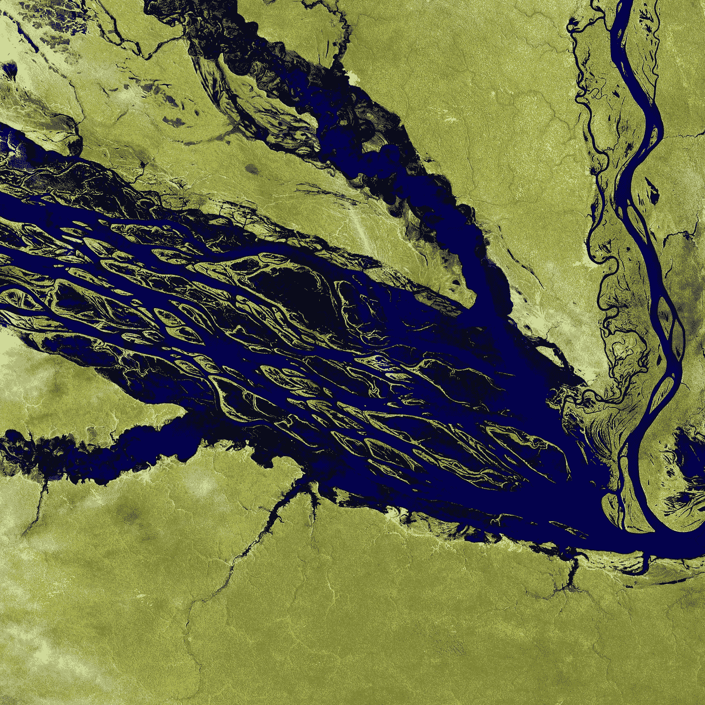

[美国地质勘探局](https://unsplash.com/@usgs?utm_source=unsplash&utm_medium=referral&utm_content=creditCopyText)在 [Unsplash](https://unsplash.com/s/photos/satellite-image?utm_source=unsplash&utm_medium=referral&utm_content=creditCopyText) 上拍摄的照片

*本文帮助读者更好地理解卫星数据以及使用 Python 探索和分析 Sundarbans 卫星数据的不同方法。*

# 目录

1.  **孙德尔本斯卫星图像**
2.  **数据分析**
3.  **植被和土壤指数**
4.  **水指数**
5.  **地质指标**
6.  **结论**
7.  **参考文献**

*让我们开始吧✨*

# **孙德尔本斯卫星图像**

孙德尔本斯是孟加拉湾恒河、布拉马普特拉河和梅克纳河汇合形成的三角洲中最大的红树林区之一。孙德尔本斯森林横跨印度和孟加拉国，面积约为 10，000 平方公里，其中 40%位于印度，是许多珍稀和全球濒危野生物种的家园。下面的谷歌地图显示了孙德尔本斯地区。

来源:谷歌地图

在本文中，我们将使用 2020 年 1 月 27 日使用 *Sentinel-2* 卫星获得的 *Sundarbans* 卫星数据的一小部分。saidSundarbans 数据的优化自然色图像如下所示:

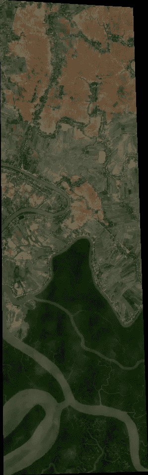

孙德尔本斯数据的优化自然彩色图像—作者提供的图像

卫星数据有 954 * 298 像素，12 个波段，光谱分辨率从 10 — 60 米不等。可以使用下面的链接下载数据。

[](https://github.com/syamkakarla98/Satellite_Imagery_Analysis/tree/main/Data/sundarbans_data) [## syamkakarla 98/卫星图像分析

### 实施不同的技术以从卫星数据中发现见解。…

github.com](https://github.com/syamkakarla98/Satellite_Imagery_Analysis/tree/main/Data/sundarbans_data) 

# **数据分析**

为了对 Sundarbans 数据执行不同的操作，我们将使用 EarthPy、RasterIO、Matplotlib、Plotly 等库进行数据可视化和分析。

*让我们从导入必要的包开始编码，*

## 读出数据

让我们使用 rasterio 读取 12 个波段，并使用 numpy.stack()方法将它们堆叠成一个 n 维数组。堆叠后的结果数据具有形状(12，954，298)。

## 可视化波段

正如我们所讨论的，数据包含 12 个波段。让我们用 EarhPy 包来可视化每个波段。`plot_bands()`方法采用带和图的堆栈以及自定义标题，这可以通过使用`title=`参数将每个图像的唯一标题作为标题列表传递来完成。

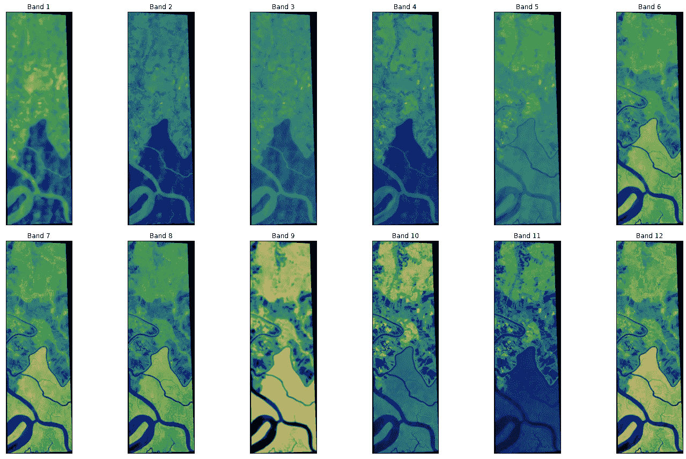

乐队的可视化-作者提供的图像

## RGB 合成图像

这些 Sundarbans 数据有多个波段，包含从可见光到红外的数据。所以对人类来说很难将数据可视化。通过创建 RGB 合成图像，可以更容易有效地理解数据。要绘制 RGB 合成图像，您将绘制红色、绿色和蓝色波段，分别为波段 4、3 和 2。由于 Python 使用从零开始的索引系统，所以需要从每个索引中减去值 1。因此，红色波段的指数为 3，绿色为 2，蓝色为 1。

如果像素亮度值偏向零值，我们创建的合成图像有时会很暗。这种类型的问题可以通过拉伸图像中的像素亮度值来解决，使用参数`stretch=True`将这些值扩展到潜在值的整个 0-255 范围，以增加图像的视觉对比度。此外，`str_clip`参数允许您指定想要截取多少数据尾部。数字越大，数据将被拉伸或变亮的越多。

让我们看看绘制 RGB 合成图像以及应用拉伸的代码。

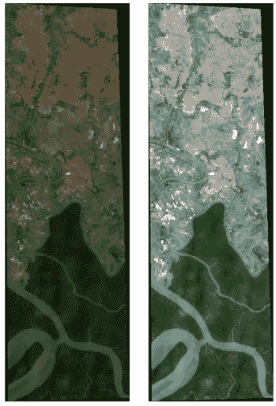

孙德尔本斯数据的 RGB 合成图像-作者提供的图像

上图显示了应用拉伸前后 Sundarbans 数据的 RGB 合成图像。

## 直方图

可视化高光谱图像数据集的波段有助于我们理解波段的像素/值的分布。来自`earhtpy.plot`的`hist`方法通过为我们之前创建的数据集/堆栈的条带绘制直方图来完成工作。我们还可以修改各个直方图的*列大小*，标题*，颜色*。让我们看看绘制直方图的代码。

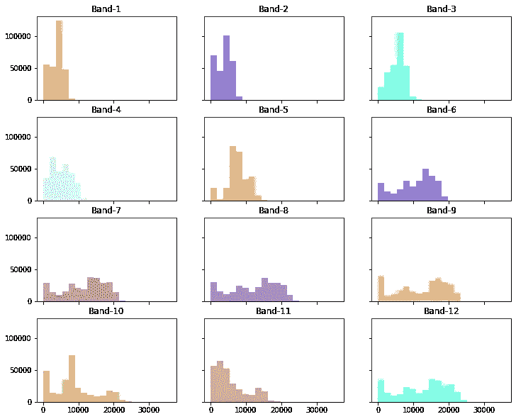

波段直方图-按作者分类的图像

# 植被和土壤指数

归一化卫星指数是根据多光谱卫星图像计算的图像。这些图像强调了存在的特定现象，同时减轻了降低图像效果的其他因素。例如，植被指数将健康植被显示为指数图像中的亮色，而不健康植被的值较低，贫瘠地形为暗色。由于地形变化(丘陵和山谷)的阴影会影响图像的强度，因此创建索引时会强调对象的颜色，而不是对象的强度或亮度。

## **归一化差异植被指数(NDVI)**

为了确定一块土地上的绿色密度，研究人员必须观察植物反射的可见光(VIS)和近红外(NIR)阳光的不同颜色(波长)。归一化差异植被指数(NDVI)通过测量植被强烈反射的近红外和植被吸收的红光之间的差异来量化植被。NDVI 的范围总是从-1 到+1。

```
NDVI = ((NIR - Red)/(NIR + Red))
```

例如，当你有负值时，很可能是水。另一方面，如果 NDVI 值接近+1，则很有可能是浓密的绿叶。但是当 NDVI 接近零度时，就没有绿叶，甚至可能成为城市化地区。

让我们看看在 Sundarbans 卫星数据上实现 NDVI 的代码。

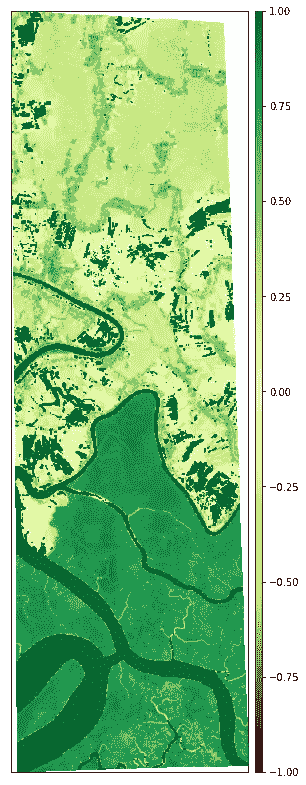

孙德尔本斯的 NDVI 数据—图片由作者提供

## 土壤调整植被指数(SAVI)

土壤调整植被指数(SAVI)是一种植被指数，它试图使用土壤亮度校正因子来最小化土壤亮度的影响。这通常用于植被覆盖率低的干旱地区。

```
SAVI = ((NIR - Red) / (NIR + Red + L)) x (1 + L)
```

L 值根据绿色植被覆盖的数量而变化。一般在没有绿色植被覆盖的地区，L = 1；在中度绿色植被覆盖区，L = 0.5 在植被覆盖非常高的地区，L=0(相当于 NDVI 方法)。该指数输出介于-1.0 和 1.0 之间的值。让我们看看 SAVI 的实现代码。

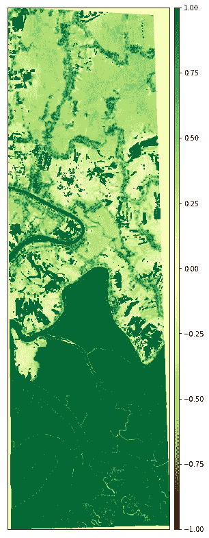

孙德尔本斯的 SAVI 数据—图片由作者提供

## 可见大气阻力指数(VARI)

可见大气阻力指数(VARI)旨在强调光谱可见部分的植被，同时减轻光照差异和大气影响。非常适合 RGB 或彩色图像；它利用了所有三种颜色波段。

```
VARI = (Green - Red)/ (Green + Red - Blue)
```

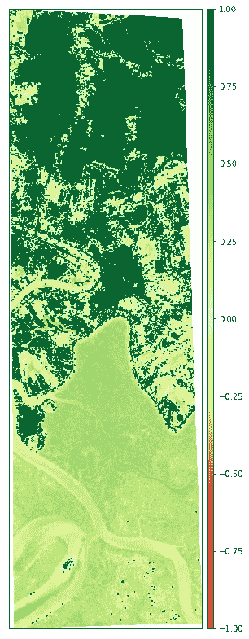

孙德尔本斯的 VARI 数据—图片由作者提供

# 水指数

地表水变化是环境、气候和人类活动的一个非常重要的指标。sentinel-2、Landsat 等遥感器在过去四十年里一直在提供数据，这对于提取森林和水等土地覆盖类型很有用。研究人员提出了许多地表水提取技术，其中基于指数的方法因其简单和成本效益高而受到欢迎。

## 修正的归一化差异水指数

修正的归一化差异水体指数(MNDWI)使用绿色和 SWIR 波段来增强开放水体的特征。它还减少了在其他指数中经常与开放水域相关的建成区特征。

```
MNDWI = (Green - SWIR) / (Green + SWIR)
```

下面的代码用于实现 MNDWI，输出如下所示。

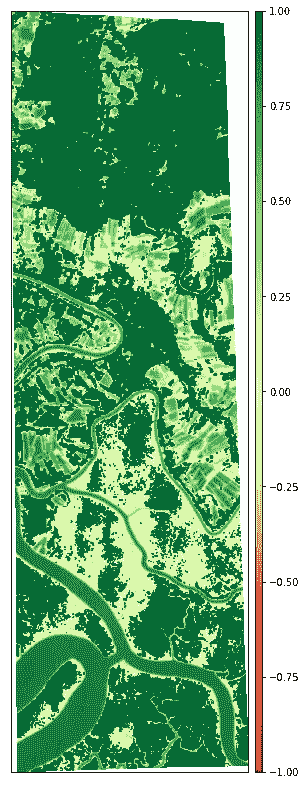

孙德尔本斯数据的 MNDWI 图片由作者提供

## 归一化差异湿度指数(NDMI)

归一化差异湿度指数(NDMI)对植被中的湿度水平很敏感。它被用来监测干旱以及火灾多发地区的燃料水平。它使用近红外和 SWIR 波段来创建一个比率，旨在减轻照明和大气的影响。

```
NDMI = (NIR - SWIR1)/(NIR + SWIR1)
```

让我们看看实现和输出:

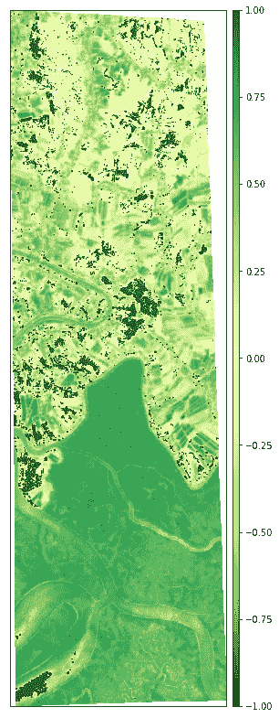

孙德尔本斯的 NDMI 数据—图片由作者提供

# 地质指数

事实证明，卫星图像和航空摄影是支持矿产勘探项目的重要工具。它们可以以多种方式使用。首先，它们为地质学家和野外工作人员提供了轨迹、道路、栅栏和居住区的位置。

## 粘土矿物

粘土比率是 SWIR1 和 SWIR2 带的比率。这一比率利用了粘土、明矾石等含水矿物吸收光谱中 2.0-2.3 微米部分的辐射这一事实。由于该指数是一个比率，因此可以减轻由于地形造成的光照变化。

```
Clay Minerals Ratio = SWIR1 / SWIR2
```


孙德尔本斯数据的 CMR 由作者提供的图像

## 含铁矿物

含铁矿物比例突出了含铁材料。它使用 SWIR 波段和近红外波段之间的比率。

```
Ferrous Minerals Ratio = SWIR / NIR
```

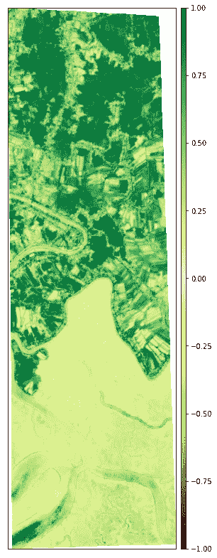

孙德尔本斯的 FMR 数据—图片由作者提供

# 结论

本文介绍了使用 python 分析孙德尔本斯*卫星数据*的不同方法，如数据可视化和归一化植被、水和地质指数。

> 文章中使用的卫星数据和详细代码可以通过下面的 GitHub 链接获得。

*快乐学习！*

[](https://github.com/syamkakarla98/Satellite_Imagery_Analysis) [## syamkakarla 98/卫星图像分析

### 使用 Python 实现不同的方法来从卫星影像中寻找见解

github.com](https://github.com/syamkakarla98/Satellite_Imagery_Analysis) 

# 更多来自作者

[](/hyperspectral-image-analysis-getting-started-74758c12f2e9) [## 超光谱图像分析—入门

### 使用 Python 进行高光谱图像分析的演练。

towardsdatascience.com](/hyperspectral-image-analysis-getting-started-74758c12f2e9) [](/land-cover-classification-of-hyperspectral-imagery-using-deep-neural-networks-2e36d629a40e) [## 利用深度神经网络对高光谱图像进行土地覆盖分类

### 使用深度学习(DL)对使用 Python 的高光谱影像进行土地覆盖分类。

towardsdatascience.com](/land-cover-classification-of-hyperspectral-imagery-using-deep-neural-networks-2e36d629a40e) [](/land-cover-classification-of-satellite-imagery-using-convolutional-neural-networks-91b5bb7fe808) [## 利用卷积神经网络对卫星图像进行土地覆盖分类

### 使用流行的深度学习架构之一(即卷积架构)对卫星影像进行土地覆盖分类

towardsdatascience.com](/land-cover-classification-of-satellite-imagery-using-convolutional-neural-networks-91b5bb7fe808) [](/exploratory-data-analysis-eda-on-satellite-imagery-using-earthpy-c0e186fe4293) [## 使用 EarthPy 对卫星图像进行探索性数据分析

### 在本文中，我们将使用 EarthPy 来处理卫星图像，并进行探索性数据分析(EDA)…

towardsdatascience.com](/exploratory-data-analysis-eda-on-satellite-imagery-using-earthpy-c0e186fe4293) [](/autoencoders-for-land-cover-classification-of-hyperspectral-images-part-1-c3c847ebc69b) [## 高光谱图像土地覆盖分类自动编码器第一部分

### 使用 Python 使用自动编码器对高光谱图像进行土地覆盖分类的演练。

towardsdatascience.com](/autoencoders-for-land-cover-classification-of-hyperspectral-images-part-1-c3c847ebc69b) 

# 参考

 [## EarthPy:用于地球数据的 Python 包——EarthPy 0 . 9 . 2 文档

### EarthPy 是一个 python 包，它使使用开源软件绘制和处理空间栅格和矢量数据变得更加容易…

earthpy.readthedocs.io](https://earthpy.readthedocs.io/en/latest/) [](https://www.usgs.gov/centers/eros/science/usgs-eros-archive-sentinel-2?qt-science_center_objects=0#qt-science_center_objects) [## 美国地质勘探局 EROS 档案-哨兵-2

### 回到产品概述，Sentinel 卫星群旨在提供陆地遥感数据…

www.usgs.gov](https://www.usgs.gov/centers/eros/science/usgs-eros-archive-sentinel-2?qt-science_center_objects=0#qt-science_center_objects) [](https://www.sentinel-hub.com/) [## 哨兵枢纽

### Sentinel Hub -用于卫星图像的云 API

www.sentinel-hub.com](https://www.sentinel-hub.com/)