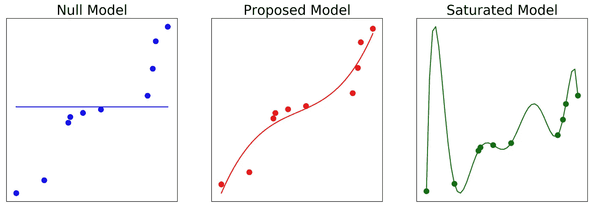
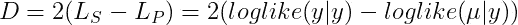
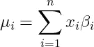
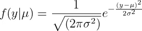
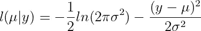
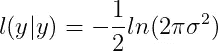
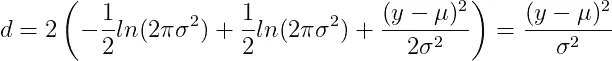
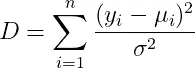

# 饱和模型、偏差和平方和的求导

> 原文：<https://towardsdatascience.com/saturated-models-deviance-and-the-derivation-of-sum-of-squares-ee6fa040f52?source=collection_archive---------8----------------------->

## 利用饱和模型和偏差探讨平方和误差的来源


罗伯特·斯汤普在 [Unsplash](https://unsplash.com?utm_source=medium&utm_medium=referral) 上拍摄的照片

在我之前的[帖子](/poisson-regression-and-generalised-linear-models-606fe5f7c1fd)中，我已经讨论过**广义线性模型(GLMs)** 。这些是线性回归模型的概括，其中**目标的变量分布是非正态**。使用确定问题的**损失函数**的**最大似然估计**求解 GLMs。这就是分别用于线性和逻辑回归的**平方和**和**对数损失**的来源。然后，我们使用这些损失函数来拟合数据的模型。然而，我们如何确定我们的拟合模型捕捉到的数据有多好？这就是离经叛道的原因。

# 什么是空模型、建议模型和饱和模型？

在我们讨论偏差之前，我们首先需要了解什么是饱和模型、建议模型和无效模型。

饱和模型是指**参数/系数的数量等于**数据点的数量。这就像一个**‘连接点’**模型，其中直线或曲线通过每个点。这被认为是**完美模型**，因为它考虑了数据中的所有方差，并具有**最大可实现可能性**。

零模型与**相反，只有一个参数，即截距**。这实质上是所有数据点的**平均值**。对于一个**双变量模型**，这是一条水平线，每一点都有**相同的预测**。

提议的模型被认为是**最佳拟合**，并且在零模型和饱和模型之间有**个参数。这是我们适合数据科学和机器学习问题的模型。**

下面的脚本是 Python 中的一段代码，它从随机生成的数据集中绘制了一个空的、建议的和饱和的模型。这段代码利用了**‘NP . poly fit’**方法，允许我们绘制**不同的指定次数多项式**。

```
# import packages
import numpy as np
import matplotlib.pyplot as plt# generate data and sort it
x = np.random.randn(10)
y = np.random.randn(10)
x.sort()
y.sort()# calculate the null, proposed and saturated models
null_coeff = np.polyfit(x, y, 0)
null_model = np.poly1d(null_coeff)
null_x = np.linspace(x[0], x[-1])
null_y = null_model(null_x)saturated_coeff = np.polyfit(x, y, len(x))
saturated_model = np.poly1d(saturated_coeff)
saturated_x = np.linspace(x[0], x[-1])
saturated_y = saturated_model(saturated_x)proposed_coeff = np.polyfit(x, y, 3)
proposed_model = np.poly1d(proposed_coeff)
proposed_x = np.linspace(x[0], x[-1])
proposed_y = proposed_model(proposed_x)# plot the models
fig, (ax1, ax2, ax3) = plt.subplots(1, 3, figsize=(22,7))ax1.plot(null_x, null_y, color="blue")
ax1.scatter(x,y,s=70, color="blue")
ax1.set_title('Null Model', fontsize=22)
ax1.axes.xaxis.set_visible(False)
ax1.axes.yaxis.set_visible(False)ax2.plot(proposed_x, proposed_y, color="red")
ax2.scatter(x,y,s=70, color="red")
ax2.set_title('Proposed Model', fontsize=22)
ax2.axes.xaxis.set_visible(False)
ax2.axes.yaxis.set_visible(False)ax3.plot(saturated_x, saturated_y, color="green")
ax3.scatter(x,y,s=70, color="green")
ax3.set_title('Saturated Model', fontsize=22)
ax3.axes.xaxis.set_visible(False)
ax3.axes.yaxis.set_visible(False)
```

此代码的输出产生以下图形:



从左到右显示零模型、建议模型和饱和模型的图。作者制作的图像。

我们观察到零模型不擅长对数据进行分类，然而另一方面，饱和模型过度分类。在数据科学术语中，这是**过拟合**，并且模型具有**高方差**。然而，提出的模型最好地概括了数据。

> 完整的代码可以在我的 GitHub [这里](https://github.com/egorhowell/Medium-Articles/blob/main/Statistics/saturated_models.py)找到。

# 异常

偏差是统计模型的**拟合优度**度量，尤其用于 GLMs。它被定义为饱和模型和建议模型之间的**差异**，并且可以被认为是**我们建议的模型说明了**数据中的多少变化。因此，**偏差越低，模型越好**。

数学上，总偏差， ***D*** ，定义为:



作者的总偏差公式

其中 ***L_s*** 和 ***L_p*** 分别为饱和模型和建议模型。 ***μ*** 值是输入值的**矩阵点积**、 ***x*** 及其系数 ***β*** 的预测值:



作者的线性模型预测

这些系数负责拟合最佳模型，可以通过分析或迭代方法**梯度下降**找到**。感兴趣的读者可以在我之前的[文章](https://levelup.gitconnected.com/why-gradient-descent-is-so-common-in-data-science-def3e6515c5c)中更好地理解如何拟合这些系数。**

# 线性回归偏差

我们现在将推导线性回归的偏差，显示**误差平方和(SSE)** 的来源。在线性回归中，目标变量有一个**正态分布**，因此**概率密度函数**为单一预测，**μ**，而 ***y*** *，*为:



正态分布的概率密度函数，作者

上述函数的**对数似然**为:



按作者列出的正态分布的对数似然性

这是我们**提出的模型的对数似然**。需要重申的是，这只是针对单一的预测和观察。这被定义为**单元偏差**，而**总偏差**是所有单元偏差的总和。

通过设置 ***μ=y*** ，我们得到最大可达对数似然，这就是饱和模型:



饱和模型可能性，作者

因此，单位偏差， ***d*** ，是:



按作者列出的正态分布的单位偏差

总偏差是:



按作者列出的正态分布的总偏差

这就是**总平方和误差！**

因此，我们可以看到，偏差是线性回归的(比例)平方和误差的通用公式。我们可以对其他概率分布进行类似的推导，如**泊松、伽马和二项式** l 分布，使用它们的 pdf 来计算它们的偏差。例如，如果你的目标是二项分布，偏差就是对数损失公式！

# 总结想法

在本文中，我们已经了解了饱和模型以及它们如何与称为偏差的拟合优度度量相联系。该值描述了建议的模型考虑了多少数据变化。如果饱和的和建议的模型符合正态分布，偏差等于我们在这里推导出的普遍存在的平方和。

我希望你喜欢这篇文章，并学到一些新的东西！请随意阅读我的其他帖子，进一步探索 GLMs！

# 和我联系！

*   要在媒体上阅读无限的故事，请务必在这里注册！ 💜
*   [](/subscribe/@egorhowell)😀
*   [*LinkedIn*](https://www.linkedin.com/in/egor-howell-092a721b3/)*👔*
*   *[*推特*](https://twitter.com/EgorHowell) 🖊*
*   *[*github*](https://github.com/egorhowell)*🖥**
*   **[](https://www.kaggle.com/egorphysics)**🏅****

> ***(所有表情符号都是由 [OpenMoji](https://openmoji.org/) 设计的——开源的表情符号和图标项目。执照: [CC BY-SA 4.0](https://creativecommons.org/licenses/by-sa/4.0/#)***