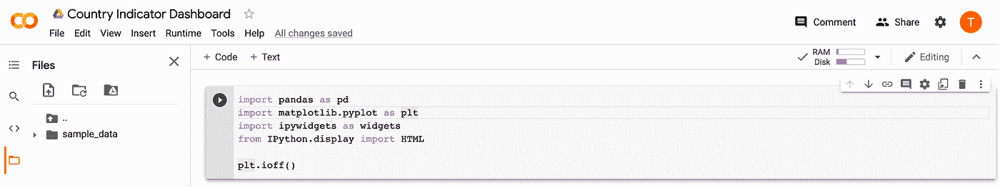
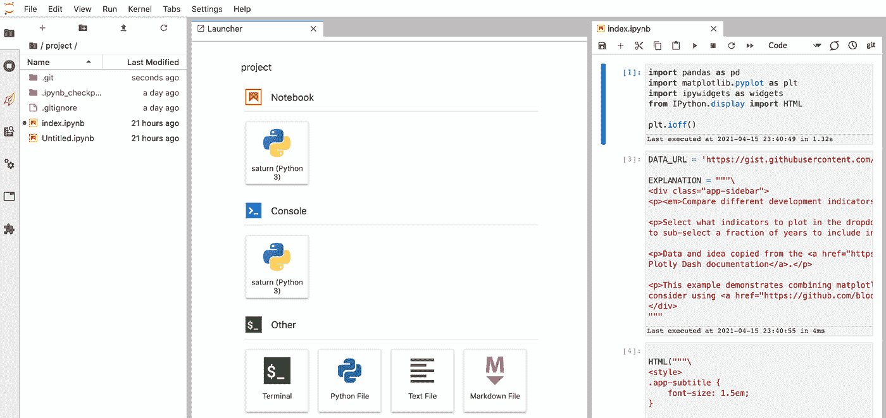
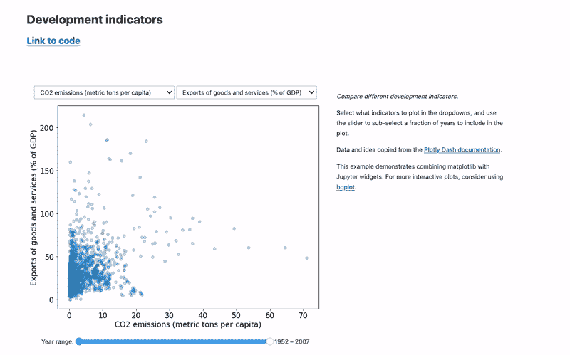
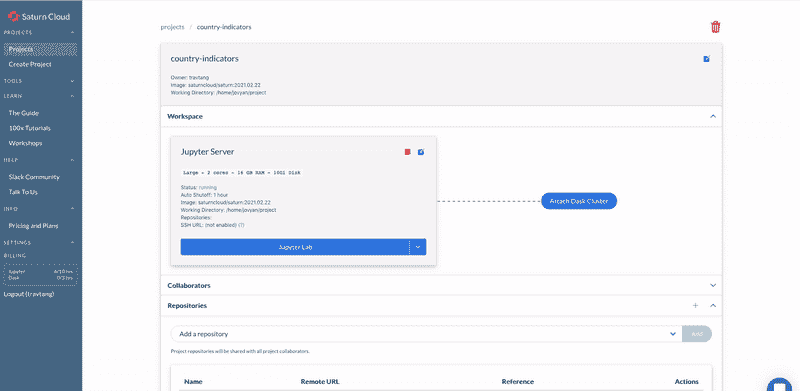
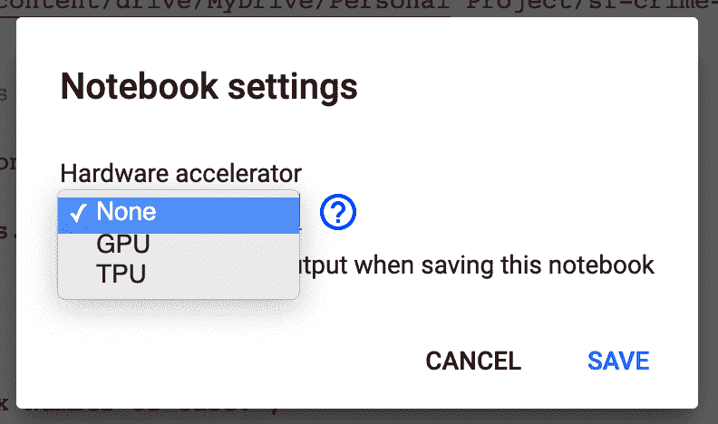
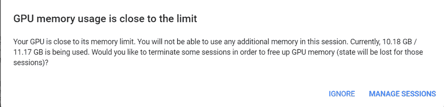
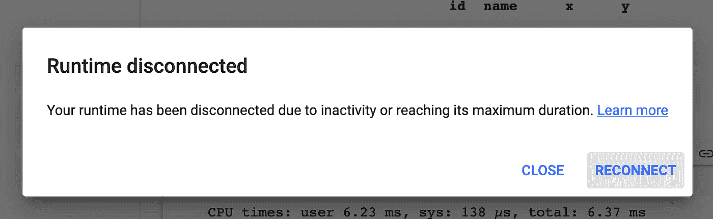
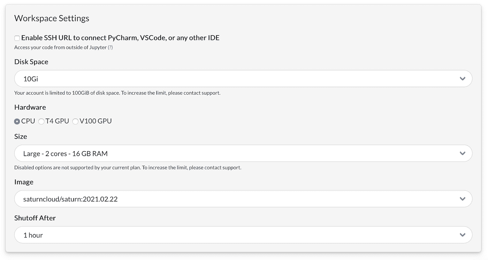

# 土星云 vs 谷歌 Colab 的数据科学和机器学习

> 原文：<https://towardsdatascience.com/saturn-cloud-vs-google-colab-for-data-science-and-machine-learning-ea3a02165c5?source=collection_archive---------10----------------------->

## 哪种工具更适合可扩展数据科学？


没有 GPU、并行编程和 DevOps 团队的端到端数据科学管道的图示。在 [Unsplash](https://unsplash.com?utm_source=medium&utm_medium=referral) 上由 [amirali mirhashemian](https://unsplash.com/@amir_v_ali?utm_source=medium&utm_medium=referral) 拍摄的照片

向任何数据科学家询问他们在工作中最常用的工具。很有可能，你会听到很多关于 Jupyter notebook 或者 Google Colab 的消息。这并不奇怪，因为数据科学家经常需要一个交互式环境来编码-以立即看到我们数据争论的结果，从可视化中提取见解，并密切监控机器学习模型的性能。就我个人而言，我希望我的代码执行得非常快，如果不是立即执行的话。这通常在 GPU 和并行编程的帮助下完成。

在之后，一个机器学习模型被开发并在本地环境中测试，它必须上线并被部署。不幸的是，部署过程非常复杂。这项工作涵盖了从创建服务器到建立安全协议的所有领域。完成这些工作通常需要一名专门的 DevOps 工程师，他是云服务、操作系统和网络方面的专家。

现在，数据科学家如何大幅加快我们的数据科学发展进程？像我们这样的数据科学家如何绕过 DevOps 工程师的需求，部署我们的模型？

这就是土星云能为数据从业者做的事情。 ***土星用分布式系统和 GPU 帮助团队训练和部署模型。***

好奇？在这篇博文中，我将展示 Saturn Cloud 与 Google Colab 的相似之处(但也有很大不同)，以及如何使用 Saturn Cloud 来优化您的数据科学工作流。

以下是土星云和 Colab Pro 的六大区别。

1.  定价
2.  编码界面的外观
3.  易于部署和共享仪表板
4.  运行时的可定制性
5.  并行计算的代码效率
6.  支持水平

# 定价

土星云和谷歌 Colab 都提供免费和付费服务。下表比较了这两种服务。

谷歌 Colab 和土星云价格对照表。来源于 [a Colab 笔记本](https://colab.research.google.com/drive/1_x67fw9y5aBW72a8aGePFLlkPvKLpnBl)和 [Stackoverflow](https://stackoverflow.com/questions/47805170/whats-the-hardware-spec-for-google-colaboratory) 。

对于许多初学者来说，Google Colab 免费提供的服务已经足够了。那些想要比谷歌免费 Colab 更多资源的人可以选择 9.99 美元的低价 Colab Pro。然而，那些寻求更大灵活性和易于部署的人会发现土星云是 Google Colab 的一个有吸引力的替代方案。

请注意，虽然本文中讨论的所有功能都适用于自由层 Saturn Cloud，但 Saturn Cloud 的全部功能在 Pro 版本中是不可用的。

# 编码界面的外观

Google Colab 的界面类似于 Jupyter 笔记本，只是它包含一些独特的功能。这些功能包括显示文件夹目录的左窗格和右上角提醒您资源使用情况的两个栏。



谷歌 Colab 屏幕。作者截图。

另一方面，土星云编码环境和 JupyterLab 的完全一样。事实上，土星是建立在木星实验室上的。JupyterLab 为数据科学家提供了在 Jupyter 笔记本中编码、访问 shell 终端和在 GUI 环境中移动文件的界面。

如果你喜欢在 Jupyter 笔记本上运行你的代码，你也可以在 Saturn Cloud 上运行。



木星实验室的屏幕，位于[土星云](https://www.saturncloud.io/s/freehosted/?utm_source=saturn%20and%20google%20colab%20blog&utm_medium=saturn%20cloud)上。

# 易于部署和共享交互式控制面板

许多 python 包允许我们构建用户可以与之交互的交互式仪表盘。这些软件包包括 Plotly Dash、Voila 和 Bokeh。这种交互式仪表盘可以在 Google Colab 和 Saturn Cloud 上构建。在这个例子中，我将使用 Google Colab 和 Saturn Cloud 从[的 Voila Gallery](https://voila-gallery.org/) 复制一个交互式仪表盘。



瞧，交互式仪表板。作者截屏。由[画廊制作的仪表板。](https://github.com/voila-gallery/voila-gallery-country-indicators)

为了与访问者共享仪表板，用户需要将[仪表板](https://colab.research.google.com/drive/1kaHS6Zdj48I8wsLZw5X2oJJMimVZqJS8?usp=sharing#scrollTo=lJ8mwO2Dmc_h)部署到服务器，以便用户可以与可视化交互。易于部署是谷歌 Colab 和土星云的关键区别。

在 Google Colab 上，用户可能需要依赖第三方解决方案 [Heroku](/creating-interactive-jupyter-notebooks-and-deployment-on-heroku-using-voila-aa1c115981ca) 或 [Ngrok](/quickly-share-ml-webapps-from-google-colab-using-ngrok-for-free-ae899ca2661a) 进行部署，这有些繁琐。另一方面，在 Saturn Cloud 上部署仪表板相对简单，只需要五次点击，因为 Saturn Cloud 已经处理了与部署相关的繁重工作。



在土星上部署仪表板只需几步之遥。作者截屏。

简而言之，虽然可以在 Google Colab 和 Saturn Cloud 上部署交互式可视化，但后者可以为您节省宝贵的时间。

# 运行时的可定制性


在设置运行时被宠坏了…照片由[叶戈尔·迈兹尼克](https://unsplash.com/@vonshnauzer?utm_source=medium&utm_medium=referral)在 [Unsplash](https://unsplash.com?utm_source=medium&utm_medium=referral) 上拍摄

Google Colab 最吸引人的额外津贴之一是它的免费运行时，包括 CPU、GPU、TPU 和大约 12GB 的内存(在撰写本文时)。像谷歌 Colab 这样的基于云的笔记本的出现，以及免费的资源，确实使深度学习民主化了。如今，任何拥有谷歌账户的人都可以获得一些 GPU 来训练他们的神经网络。



*你可以通过进入菜单>运行时>更改运行时，在 Google Colab 上选择 CPU、GPU 或 TPU 运行时。*

然而，为了让 Colab 对所有人免费，Colab 中可用的 GPU 类型会随着时间的推移而变化，并且没有办法选择一个人在任何给定时间可以连接的 GPU 类型，即使你是 Colab Pro 用户。

此外，如果你是一个广泛使用谷歌 Colab 的极客，你一定遇到过这些毁灭性的屏幕之一…



向你们死去的内核致以最深切的哀悼…作者截图。

1.  您的 Google Drive 空间不足，无法存储您的数据或模型
2.  你的 GPU 内存使用被切断
3.  您的会话因内存不足而崩溃
4.  您的会话在 1 小时不活动或运行笔记本 12 小时后超时

这些屏幕可能非常具有破坏性。如果 GPU 内存使用被切断，您的模型可能没有得到足够的训练。如果你在训练一个模型的时候运行时崩溃了，你基本上失去了所有的进展。当然，有一些技巧可以确保解决每种情况。然而，我们不能确定这样的黑客攻击会无限期地有效。一个人可以注册 [Colab Pro 来获得对这些资源的优先访问权](https://colab.research.google.com/signup#),但是他们不能得到保证。

这就是 Saturn Cloud 的硬件可定制性派上用场的地方。

在土星云上运行笔记本之前，必须创建一个工作空间。用户可以自由定制工作空间，包括所需的磁盘空间(从 10 GB 到 1000 GB)、硬件(CPU/GPU)、大小要求(从 2 核 4GB 到 64 核 512GB)以及关闭持续时间(从 1 小时到从不关闭)。因为您是这个工作区的老板，所以您不需要担心空间、GPU 访问、内存或运行时的不足。

额外的好处是能够用现有的 Docker 图像建立一个工作空间。这意味着工作空间将由 Docker 映像指定的某些包来设置，允许您复制其他人编写的代码。



*在土星云上设置可定制的工作空间*

# 并行计算的代码效率

并行计算是同时使用多个计算资源来解决一个计算问题。与顺序解决大问题的非并行(或串行)编程不同，并行编程[将一个问题分解成更小的部分](https://hpc.llnl.gov/training/tutorials/introduction-parallel-computing-tutorial)，同时解决这些小问题。

并行编程可以加速计算繁重的任务。例如，并行编程允许程序员加载和处理大型数据集(尤其是当它们太大而无法保存在内存中时)。它还允许超参数调整过程更快。

python 中有很多并行编程的包。其中最著名的是 Dask。它被设计为在单机设置和多机集群上工作良好，并且可以与 pandas、NumPy、scikit-learn 和其他 Python 库一起使用。想了解更多关于 Dask 的信息，你可以参考 Saturn Cloud 关于 Dask 的文档。


并行计算分解了一个大问题，因此可以由许多工作人员同时解决。照片由 [Salmen Bejaoui](https://unsplash.com/photos/pTWNamiyDkQ) 在 Unsplash 上拍摄

你可以在 Google Colab 和 Saturn Cloud 上使用 Dask。然而，一个人在 Saturn Cloud 上比在 Google Colab 上有更大的潜力来加速他们的代码。

这是因为并行化您的代码所能获得的加速量取决于工作空间的规格。直观地说，如果一个 CPU 有更多的核心，那么就有工人来处理这些小问题。这意味着并行编程有更大的加速潜力。

由于用户可以在 Saturn Cloud 中定制工作空间的规范，但不能在 Google Colab 上定制，因此 Saturn Cloud 的用户可以根据需要多少加速来决定运行时的内核数量，而 Google Colab 的用户则不能。

此外，还可以利用 Saturn Cloud 上的 Dask 集群来进一步提高 Dask 命令的速度。这增加了解决问题的工人数量。(免费土星云用户每个月有 3 个小时使用 3 个工作者的黄昏集群。)谷歌 Colab 上没有这个功能。

让我们用一个玩具例子来想象一下。我们首先创建一个 10，000 行的方阵，用随机数填充它，然后是它本身和它的转置的和，然后沿着其中一个轴寻找一个平均值。

下面是说明这一点的三个代码块。

1.  写在 **NumPy 数组**中的代码块在 *Google Colab 上免费*
2.  在 *Google Colab 免费*上的 **Dask 数组**中编写的代码块
3.  用 Dask 集群写在*土星云 **Dask 数组**中的代码块。*

当我们从 NumPy 阵列切换到 Dask 阵列时，速度提高了 56%,当我们从 Google Colab Free 切换到 Saturn Cloud 时，速度又提高了 97%。

## *代码块 1:* **NumPy 数组**上 *Google Colab 免费*

```
>>> import numpy as np >>> def test():>>>    x = np.random.random((10000, 10000))>>>    y = x + x.T>>>    z = y[::2, 5000:].mean(axis=1)>>>    return>>> %timeit test()1 loop, best of 5: 2.14 s per loop
```

## 代码块 2: **Dask 数组**上 *Google Colab 免费*

```
>>> import dask.array as da>>> def test():>>>    x = da.random.random((10000, 10000), chunks=(1000, 1000))>>>    y = x + x.T>>>    z = y[::2, 5000:].mean(axis=1)>>>    return z>>> %timeit test().persist()1 loop, best of 5: 866 ms per loop
```

## 代码块 3: **土星云上的 Dask 阵列**和土星云上的 Dask 集群

```
>>> from dask.distributed import Client>>> from dask_saturn import SaturnCluster>>> import dask.array as da >>> cluster = SaturnCluster(n_workers=3)>>> client = Client(cluster)>>> def test():>>>    x = da.random.random((10000, 10000), chunks=(1000, 1000))>>>    y = x + x.T>>>    z = y[::2, 5000:].mean(axis=1)>>>    return z >>> %timeit test().persist()26.7 ms ± 2.91 ms per loop (mean ± std. dev. of 7 runs, 10 loops each)
```

# 支持的程度

Google Colab 不提供个性化支持，所以解决问题的最佳方法是堆栈溢出。另一方面，土星云有一个松散的社区和一个支持团队，你可以为你的问题寻求帮助。

# **结论**

虽然 Google Colab 是一个令人惊叹的数据科学工具，但它在可定制性、资源可靠性、效率和易于部署方面存在局限性。对于正在起步的数据科学初学者来说，Google Colab 是您的最佳选择。对于正在寻找完整解决方案来高效部署数据科学解决方案的中高级数据科学从业者来说，值得考虑土星云。当然，您可能需要在 Saturn Cloud 上投入一点时间和金钱，但是采用它的效率收益可能会超过它的成本。

总之，Google Colab 非常适合个人小规模数据科学项目，而 Saturn Cloud 是可扩展数据科学的赢家。如果你想尝试一下，可以开始尝试土星云。