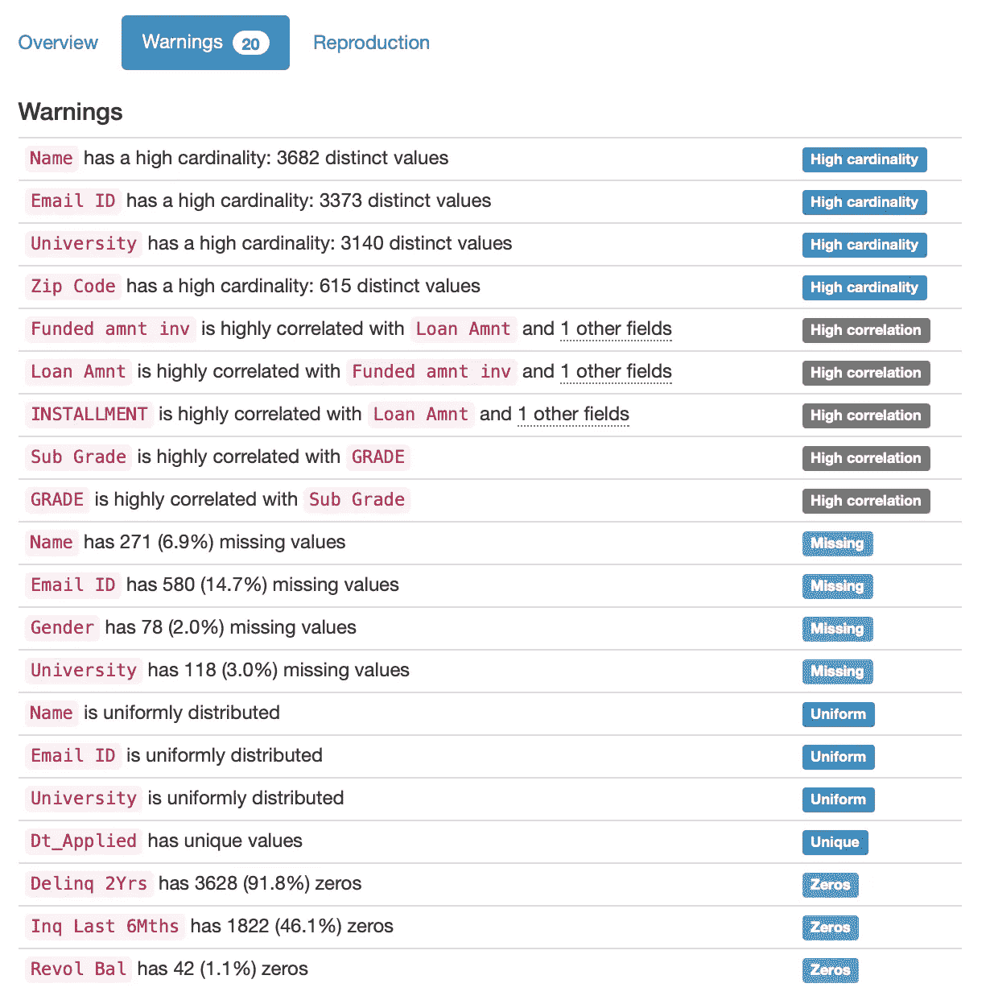

# 使用这个库，只需几行代码就可以完成一个完整的 EDA，节省大量时间

> 原文：<https://towardsdatascience.com/save-hours-of-work-doing-a-complete-eda-with-a-few-lines-of-code-45de2e60f257?source=collection_archive---------14----------------------->

## 大蟒

## 学习如何为你的下一个项目使用 QuickDA 并节省工作时间


照片由新数据服务。资料来源:联合国人类住区规划署

无论你是数据分析师还是数据科学家，你都听过专业人士花 80%的时间做数据清理，只有 20%的时间做建模。的确，数据清理和探索性数据分析需要多个步骤来执行，记住所有的代码都需要大量的实践。例如，一个简单的数据可视化需要至少三行代码才能最少地呈现。然而，如果我告诉你有一种方法可以大幅减少花在 EDA 上的时间呢？这时候 QuickDA 就可以派上用场了。


来源:[pypi.org](https://pypi.org/project/quickda/)

QuickDA 是一个易于使用、直观的低代码库，允许您用几行代码执行数据清理、数据探索和数据可视化。事实上，大多数时候我们将只使用一行代码。我创建了一个小项目来展示 QuickDa 有多强大。你可以在这里找到笔记本。

**入门**

安装 QuickDA 最简单的方法是在你的终端中键入`pip3 install quickda`,差不多就是这样。您可以通过将`git clone [https://github.com/sid-the-coder/QuickDA.git](https://github.com/sid-the-coder/QuickDA.git)`复制并粘贴到您的终端来使用`git close`。现在，让我们探索这个神奇的图书馆。

对于这个项目，我只会用我们的老朋友熊猫和 QuickDA。NumPy，Matplotlib，Seaborn 都没必要。对于 QuickDA，我将使用以下库:

```
**# Importing libraries**
import pandas as pd
from quickda.explore_data import *
from quickda.clean_data import *
from quickda.explore_numeric import *
from quickda.explore_categoric import *
from quickda.explore_numeric_categoric import *
from quickda.explore_time_series import *
```

我将使用`loans.csv`。你可以在我的 GitHub 里找到数据集。我无法找到原始来源，所以如果你找到了，请让我知道，这样我就可以添加学分。

```
**# Importing dataset**
df = pd.read_csv(‘loans.csv’)
```


作者图片

**汇总数据集**

现在我们将开始看到 QuickDA 的所有功能。首先，我们可以使用代码`explore(df)`汇总我们的数据集，并获得数据类型、计数、空值、唯一值的数量以及描述性统计数据，如最小值、最大值、平均值和中值。请注意，QuickDA 还可以汇总分类数据的统计信息。常规的`df.describe()`功能无法做到这一点。让我们来看看这个功能，因为它很强大。


作者图片

那很容易。在我看来，只有这个汇总表才值得一试图书馆。还有一个斜列。该列显示了特征偏斜度。我从未在我的数据分析中使用它，因为我通过数据可视化来检查它。不过，有也挺好的。正如我们所看到的，`explore(df)`可以返回很多重要的信息，让我们不用再键入诸如`df.dtypes`、`df.info`、`df.isnull.sum()`、`df.nunique()`、`df.skew()`、`df.describe()`之类的东西。最棒的是，一切都被组织在一个数据框中。厉害！

还不信服？别担心！QuickDA 能提供更多。

我们也可以更直观的得到数据汇总。添加参数`method = profile`，QuickDA 将生成一个 HTML 文件，该文件汇总了所有列，并为我们提供了对数据集的深入了解。您可以通过添加`report_name = 'Name of the Report'`为您的报告添加一个名称。我们来探讨一下这个函数。

```
**# Summarize dataset**
explore(df, method=’profile’, report_name=’Loan Dataset Report’)
```


作者图片

这是大量的信息。您可以通过点击`Toggle details`获得关于该功能的更多信息。它将打开关于数据集、公共值甚至要素可视化的描述性统计信息。在下面的例子中，我们可以看到一个直方图，但这将取决于你的数据类型。让我们继续使用这个神奇的函数，因为这里有很多值得探索的地方。您也可以使用顶部的导航栏来浏览表格。


作者图片

正如我提到的，您可以获得大量的描述性统计信息和更好的特性概述。它显示要素中包含不同值、缺失值和无穷大值的百分比。无穷大的值不适用于大多数建模算法。例如，分位数统计信息就在那里，包括范围。下表至少有十行代码。


作者图片

点击`Histogram`，您将看到该功能的可视化效果。它看起来足够好，可以在专业报告中呈现。


作者图片

另一件很酷的事情是你可以看到数据集警告。例如，它显示高基数、高相关性、缺失值、均匀分布值以及数据集中零的百分比。这将对你做出与项目相关的决定有很大帮助。太棒了，对吧？



作者图片

稍后我们将进一步探讨这些数据可视化，但我想说的是，您可以获得一个漂亮的关联可视化。你可以看到 xticks 被编辑过——非常好的处理。


作者图片

# **数据清理**

让我们稍微改变一下思路，检查一下 QuickDA 的数据清理功能。熊猫可以很快完成其中的一些功能。但是，我也想展示 QuickDA 的解决方案。

**标准化列名**

每个做过一些探索性数据分析的人都见过具有不同格式的列名的数据集。有时名字是大写的或带有空格。我们可以很容易地解决这个打字问题。这一行代码将小写列名，并在有空格时添加下划线(`_`)。代码如下所示:

```
**# Standardize column names**
df_name = clean(data, method='standardize')
```


作者图片

**删除列**

您也可以删除列。与普通的熊猫`.drop()`功能相比，我看不出有什么优势。但是，如果您想只使用 QuickDA 来标准化您的代码，您还有一个选择。

```
**# Drop columns**
df_name = clean(data, method='dropcols', columns=[column_names])
```

**删除重复值**

该数据集没有重复的值。因此，当应用这一行代码时，我们不会看到任何差异。

```
**# Removing duplicates**
df_name = clean(data, method='duplicates')
```


作者图片

**重命名值**

我们也可以很容易地用 QuickDA 替换列中的值。熊猫确实有同样好用的`.replace()`功能。不过 QuickDA 也很好用。在这种情况下，我将把值`Source Verified`替换为`Verified`。

```
clean(**data**, **method**="replaceval", 
 columns=[], to_replace="value to be replaced", value="new value")
```


作者图片

**填充缺失值**

缺少值？没问题，QuickDA 也能够通过插值来处理。插值是对值序列中两个已知值之间的值的估计。为此，您可以使用以下代码:

```
df_name = clean(data, method='fillmissing')
```

**移除异常值**

我们什么时候应该剔除异常值是有争议的。有时数据是不正确的，有时离群值对于理解所有场景是重要的。然而，如果您认为异常值不重要，可以用下面的代码删除它们:

```
df_name = clean(data, method='outliers', columns=[column_names])
```


作者图片

您可以选择要删除异常值的列。如果不选择列，QuickDA 将删除所有列中的异常值。

# 待续

我们刚刚看到了许多激动人心的信息，还有更多信息要向您展示。然而，这个博客变得有点太长了。出于这个原因，我将写第二部分，在那里我将向您展示更多令人兴奋的东西，我们可以用 QuickDA 来做。例如，如何用它创建数据可视化。敬请期待，过几天我会发表。

更新:正如我承诺的，我已经写了第二篇关于数据可视化的博客。你可以在这里找到: [*如何用一行代码用 Python 创建数据可视化*](/how-to-create-data-visualizations-in-python-with-one-line-of-code-8cda1044fe69)

# 最后的想法

QuickDA 是我见过的最不可思议的 Python 库之一。通常，当我尝试新的库时，会有起伏。然而，我只对 QuickDA 有过正面的体验。就是管用，百分百值得一试。我强烈建议您用自己的数据集尝试一下，感受一下它的神奇之处。我向你保证，你会节省时间。你可以在这个博客和这个笔记本中找到更多的代码。

您的反馈对我很重要。让我知道进展如何。我可以等着看你将如何使用这个神奇的图书馆。编码快乐！