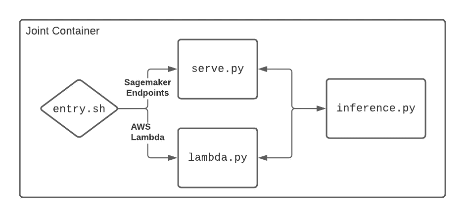

# 省钱并防止偏斜:Sagemaker 和 Lambda 的一个容器

> 原文：<https://towardsdatascience.com/save-money-and-prevent-skew-one-container-for-sagemaker-and-lambda-75d1bc6f4925?source=collection_archive---------22----------------------->

## 关于为这两种服务构建容器的教程


照片由[费边布兰克](https://unsplash.com/@blankerwahnsinn?utm_source=medium&utm_medium=referral)在 [Unsplash](https://unsplash.com?utm_source=medium&utm_medium=referral) 上拍摄

> 答这篇文章写完后，AWS 发布了 [Sagemaker 无服务器推断](https://aws.amazon.com/about-aws/whats-new/2021/12/amazon-sagemaker-serverless-inference/)，你可以直接用它来代替。

P 产品生命周期通常需要*不频繁的*机器学习推理。例如，测试版可能只会收到少量的流量。在这些场景中，托管模型推理可能是昂贵的:即使没有推理请求正在被处理，模型推理服务器也总是开启的。

解决利用不足的一个好办法是*无服务器*产品，如 [AWS Lambda](https://aws.amazon.com/lambda/) 。这些允许您按需运行代码，但只为您使用的 CPU 时间付费。对于不频繁的推理来说，这是一个很有吸引力的环境，但是通常需要不同的软件栈和打包限制。因此，当需要扩展到无服务器范围之外时(即，当一个功能进入 GA 或我们需要 GPU 进行大批量处理时)，工程师需要为实时端点重写推理代码。

重写推理代码耗费了工程师的时间，并且引入了环境偏斜的风险。与[培训/服务偏斜](https://developers.google.com/machine-learning/guides/rules-of-ml)一样，环境偏斜是由于软件依赖性或输入数据处理方式的差异而导致的模型性能变化。换句话说，重写推理代码可能会意外地导致模型性能下降。

在本教程中，我将展示如何为 AWS Lambda 和 Sagemaker 端点创建一个 docker 容器。使用这种方法，您可以在不经常访问的模型的无服务器上开始运行推理，然后在需要时转移到始终在线的 Sagemaker 端点。因此，您可以在最初保持低成本，并有效地扩展，而没有环境偏差或重写推理代码的风险。

github 上有完整的代码[。](https://github.com/lou-k/joint-sagemaker-lambda-container)

# 你容器里的叉子

Sagemaker 和 Lambda 都支持自带容器。Sagemaker [需要 HTTP 服务器](https://docs.aws.amazon.com/sagemaker/latest/dg/your-algorithms-inference-code.html#your-algorithms-inference-code-how-containe-serves-requests)，而 Lambda [使用运行时作为入口点](https://docs.aws.amazon.com/lambda/latest/dg/images-create.html)。这个项目背后的关键思想是根据容器运行的环境来派生容器逻辑，但是使用相同的推理代码:



作者图片

在`entry.sh`中分叉实际上相当容易:Sagemaker 在启动时向容器传递一个`serve`参数，而 Lambda 传递函数处理程序名。因此，我们的`entry.sh`脚本只需要检查命令行参数就可以知道它是在 Sagemaker 还是 Lambda 中运行:

```
#!/bin/bashif [ "${1:-}" = "serve" ] ; then
  # Start an http server for Sagemaker endpoints..
  exec /usr/local/bin/python serve.py
else
  # run the Lambda runtime environment
  exec /usr/local/bin/python -m awslambdaric ${1:-}
fi
```

(我省略了用于本地测试的 Lambda 仿真器，[，但它在 github repo 中](https://github.com/lou-k/joint-sagemaker-lambda-container/blob/main/src/entry.sh))

# 推理代码

这种方法的一个关键好处是*您可以在两种环境中使用相同的推理代码*。在这个例子中，我将使用来自 [gluoncv 模型动物园](https://cv.gluon.ai/model_zoo/classification.html)的模型对图像进行分类，但是基本概念应该可以扩展到您自己的模型。

使您的推理代码模块化是这里的关键:文件`serve.py`和`lambda.py`应该只有最少的逻辑来验证输入。为此，`inference.py`有两个主要功能:

*   `load_model`-将模型加载到内存中
*   `infer` —接受输入和模型，返回推理结果。

加载模型需要一些小心，因为 Sagemaker 可以部署来自模型注册中心的模型，而 Lambda 不能。当这种情况发生时，工件被安装到容器中的`/opt/ml/model`，我们将通过变量`model_path`来标识它:

```
def load_model(model_path = None):
  """
  Loads a model from model_path, if found, or a pretrained model
  specified in the MODEL_NAME environment variable.
  """ # Try to load from model_path if we are running on sagemaker.
  if model_path and os.path.exists(model_path):
    symbol_file = glob(join(model_path, '*symbol.json'))[0]
    params_file = glob(join(model_path, '*.params'))[0]
    return SymbolBlock.imports(symbol_file, 'data', params_file)
  else:
    # running in lambda, so load the network from the model zoo
    model_name = os.environ['MODEL_NAME']
    return gluoncv.model_zoo.get_model(model_name,
      pretrained=True, root='/tmp/')
```

在 Lambda 示例中，上面的代码让用户在`MODEL_NAME`环境变量中指定模型，并从模型动物园中加载模型。或者，您可以将模型打包在容器中，或者从 S3 装载。

`infer`函数是一个简单明了的例子，说明了如何使用 gluon API 进行[推理:](https://mxnet.apache.org/versions/1.8.0/api/python/docs/tutorials/deploy/inference/index.html)

```
def infer(uri, net):
  """
  Performs inference on the image pointed to in `uri.`
  """ # Download and decompress the image
  img = open_image(uri) # Preprocess the image
  transformed_img = imagenet.transform_eval(img) # Perform the inference
  pred = net(transformed_img)
  prob = mxnet.nd.softmax(pred)[0].asnumpy()
  ind = mxnet.nd.topk(pred, k=5 [0].astype('int').asnumpy().tolist() # accumulate the results
  if hasattr(net, 'classes'):
    results = [{
      'label': net.classes[i], 
      'prob': str(prob[i])
    } for i in ind]
  else:
    results = [{'label': i, 'prob': str(prob[i])} for i in ind] # Compose the results
  return {'uri': uri, 'results': results}
```

# Sagemaker 代码

当容器在 Sagemaker 端点中启动时，它启动一个在`serve.py`中指定的 HTTP 服务器。服务器在`POST /invocations`端点上处理推断请求。我在这个例子中使用了 [flask](https://flask.palletsprojects.com/en/2.0.x/) ，但是任何 HTTP 框架都应该可以工作:

```
# HTTP Server
app = Flask(__name__)# The neural network
net = None[@app](http://twitter.com/app).route("/ping", methods=["GET"])
def ping():
  return Response(response="\n", status=200)[@app](http://twitter.com/app).route("/invocations", methods=["POST"])
def predict():
  global net
  # do prediction
  try:
    lines = request.data.decode()
    data = json.loads(lines)
    results = inference.infer(data['uri'], net)
  except ValueError as e:
    error_message = f"Prediction failed with error '{e}'"
    return Response(response=error_message, status=400)
  output = json.dumps(results)
  return Response(response=output, status=200)
```

`invocations`端点简单地解码请求并将输入传递给上面指定的`inference.infer`函数。这使事情变得简单:*所有的逻辑都在推理文件*中指定。

网络本身应该在启动服务器之前加载 main 函数，这也为一些句柄命令行参数提供了可能性:

```
def parse_args(args=None):
  parser = argparse.ArgumentParser(
    description='Server for inference on an image.'
  )
  parser.add_argument(
    "--model-path", type=str, default='/opt/ml/model', 
    help="The model artifact to run inference on."
  )
  parser.add_argument(
    "--port", type=int, default=8080,
    help="Port to run the server on."
  )
  parser.add_argument(
    "--host", type=str, default="0.0.0.0",
    help="Host to run the server on."
  )
  return parser.parse_args(args)if __name__ == "__main__":
  # parse command line arguments
  args = parse_args()
  # load the model
  net = inference.load_model(args.model_path)
  # start the server
  app.run(host=args.host, port=args.port)
```

您会注意到`model_path`被设置为`/opt/ml/model`，这是 Sagemaker 从模型注册中心提供工件的默认位置。

# 拉姆达代码

Lambda 代码甚至更简单:您需要的只是一个处理请求的函数:

```
# Loads the model when the lambda starts up
net = inference.load_model()def handler(event, context):
  global net
  try:
    return inference.infer(event['uri'], net)
  except Exception as e:
    logging.error(f'Could not perform inference on {event}', e)
    return json.dumps({'error': 'Unable to perform inference!'})
```

第一次调用 Lambda 时加载模型，这会增加一些[冷启动延迟](https://aws.amazon.com/blogs/compute/operating-lambda-performance-optimization-part-1/)，但只要 Lambda 处于活动状态，它就会留在内存中。

# 保持精益

AWS Lambda 是减少不经常使用的模型的推理成本的一个很好的方法，但是如果由于功能发布或产品流行而导致调用次数增加，成本会更高。切换到始终在线的 Sagemaker 端点降低了成本，但是可能需要重写推理代码，这需要时间，并且可能引入环境偏差。这里描述的容器可以在两种环境中工作，这使得在两种环境之间切换变得容易和快速，并获得最大的收益。

完整的代码可以在 github 上找到。

我们使用我在这里描述的技术来节省 [Bazaarvoice](https://www.bazaarvoice.com/) 的推理成本。如果这种工作吸引了你，看看我们的[职位空缺。](https://jobs.lever.co/bazaarvoice)

如果你喜欢这个故事，请考虑支持我，请[给我买一杯咖啡](https://www.buymeacoffee.com/louk)或者通过[我的推荐](https://lou-kratz.medium.com/membership)注册媒体。