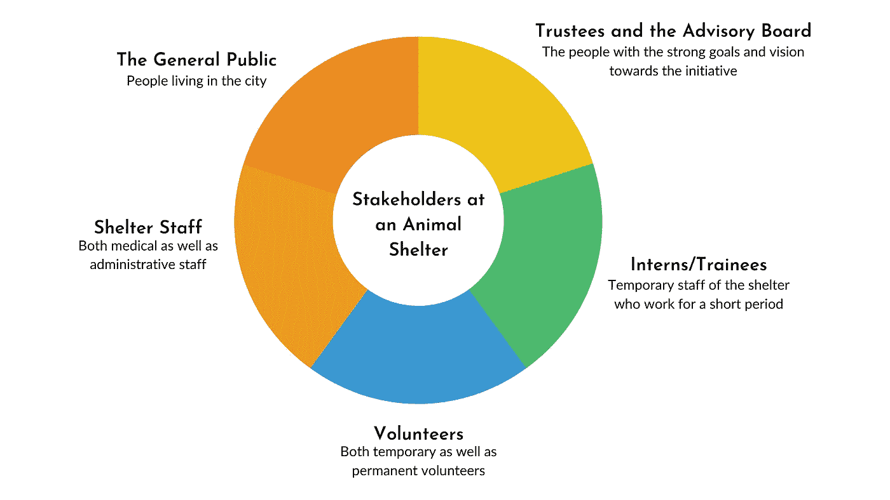
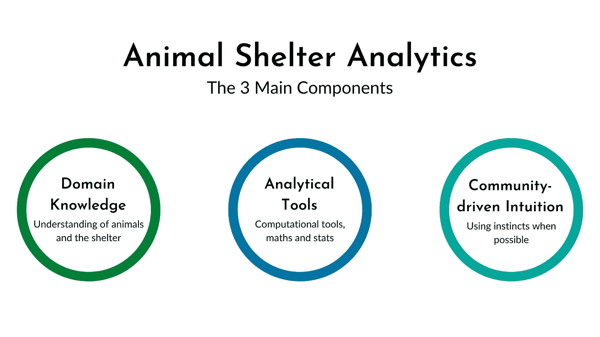

# 用数据拯救动物的生命

> 原文：<https://towardsdatascience.com/saving-animal-lives-with-data-d815c6e854eb?source=collection_archive---------18----------------------->

## [变更数据](https://towardsdatascience.com/tagged/data-for-change)

## 动物收容所分析介绍

由[路易斯·罗伯特](https://unsplash.com/@31_photography?utm_source=medium&utm_medium=referral)在 [Unsplash](https://unsplash.com?utm_source=medium&utm_medium=referral) 上拍摄的照片

据估计，目前世界上大约有 5000 家独立经营的动物收容所。我个人觉得可能会更多。这些收容所的运营效率很大程度上取决于它们满足其主要目标的能力，通常是优化选择指标。为了计算这些指标，需要**收集、维护和分析数据**。

但是，我们在动物收容所遇到过多少次数据的使用呢？我从来没有这样做过，直到我决定带着一份投机性的申请去当地的一家动物收容所，希望被聘为数据分析师实习生。我如何获得这个机会的细节已经在之前的一篇文章中详细讨论过了。

本文总结了不同的实践，这些实践可以付诸行动，以帮助庇护所在数据驱动的帮助下更好地发挥作用。或者我喜欢称之为**动物收容所分析**。

# 什么是动物收容所？

对动物收容所最常见的描述围绕着为动物提供一个栖身之所的想法，尤其是当它们被遗弃或受伤时。从更基本的意义上说，动物收容所为有需要的动物提供康复和住所。大多数情况下，经营这些机构的组织都是非盈利性的，它们的运作严重依赖于它们收到的捐款。

第一个动物收容所并不完全是人们所说的“动物友好型”。无家可归或“不受欢迎”的动物被收容所杀死，这是常态。然而，随着时间的推移，庇护系统开始看到一个向他们所保护的生物的利益的范式转变。这种变化甚至可以在所用术语的演变中看到。例如，“动物福利”被创造出来，从而反映了一种更人道的庇护方式。

看待庇护系统的另一种方式是将其视为“控制”流浪动物数量的一种手段。虽然有必要保护动物，但同样重要的是确保人类生活不受不受监督的动物种群的妨碍或威胁。这种观点的一些例子包括对流浪狗进行绝育以控制它们的数量。

通常，动物庇护所是指那些收容家畜或宠物如狗和猫的庇护所。然而，也有像我工作过的组织致力于保护城市野生动物。

> [城市野生动物指(通常)在城市化地区与人类共存的非驯化物种](http://urbanwildlifegroup.org/urban-wildlife-information)。例如，松鼠、蛇、风筝等。属于这一类。

# 数据在动物收容所扮演什么角色？

一个非常大的角色！数据可能是经营动物收容所最重要的部分。需要收集关于动物、手术成本、可用资金等的数据。正是这些数据可以用来[在收容所执行几项重要的操作，包括拯救更多的生命、优化运营成本以及将动物与潜在的捐赠者联系起来](https://cdn.ymaws.com/theaawa.org/resource/resmgr/conferences/2018_conferences/Shelter_Data_Scarlett.pdf)。

现在，让我们后退一步，确定为什么需要将数据驱动的实践整合到庇护所的运营中。首先，数据帮助**验证事实和数字的真实性**。这反过来给庇护所带来了透明度。鉴于大多数庇护所都是慈善信托机构或非盈利机构，这种透明感是所有需求中的重中之重。

数据至关重要的另一个原因是，良好的数据收集有助于对进展进行**精确评估。一个好的庇护所几乎总是有一个关于它想要达到的目标的强有力的计划。为了了解庇护所的成功程度，它需要能够*客观地量化*其贡献。**

第三个原因是数据为**提供了消息灵通的行动计划**。例如，考虑庇护所 X 在一周的时间内接收 20 台起重机进行处理的情况。如果没有关于这些动物的数据，庇护所唯一能做的就是尽力拯救这 20 只鹤。然而，如果收集了关于这些起重机的数据，并且如果注意到所有的起重机都是从同一个地方运来的，庇护所就可以派出一个小组来审查在给起重机带来麻烦的地方发生了什么。这是[解决问题的根本原因](https://www.tableau.com/learn/articles/root-cause-analysis)，比解决根本原因的个别结果更有效。

## 动物收容所数据收集的演变

在这个精彩的演讲中，玛蒂基金会的负责人克里斯汀·哈森和她的同事对收容所收集数据的软件进行了历史评估。

根据他们的观察，shelter 软件已经经历了 3 次浪潮才达到目前的水平。第一波的软件仅仅是用来执行记录动物数量的任务。基本上，它将动物视为“库存”，不支持收养。自然，我们可以想象这种软件运行的原始程度。

第二次浪潮比第一次浪潮要好，因为庇护所软件制造商现在开始认识到收养的重要性。软件变得更加以“拯救生命”的概念为中心。在此期间，收容所软件的另一个受欢迎的变化是，它变得更加用户友好，并提供了存储动物病史和行为模式的机会。

第三次浪潮，即当代，集中在社区。软件帮助跟踪数据，形成动物和人之间的桥梁。“避难所”现在有能力使用他们的数据来量化他们的影响和解决根本原因。

我对第三波略有不同。我相信第三次浪潮对于像印度这样的发展中国家的大多数动物收容所来说仍然是奢侈的。我工作的收容所有一个非常敬业、充满热情的团队收集所有动物的数据，但是他们使用电子表格和手动输入，从而避免使用任何类型的收容所软件。

第三次浪潮也可以被认为是以更严肃的态度将*指标*纳入庇护所运营的浪潮。度量是可以[量化流程状态](https://www.klipfolio.com/blog/kpi-metric-measure)的量度。

在题为[神奇的指标和令人眼花缭乱的数据](https://www.youtube.com/watch?v=IpKOHdr-9Pc)的演讲中，康奈尔大学收容所医学项目的创始人 Janet Scarlett 博士提供了一个关于指标如何用于改善动物收容所的条件、跟踪疫情和监控收容所动物健康的视角。

在另一个名为[更好地利用收容所数据](https://www.maddiesfund.org/making-better-use-of-shelter-data.htm?p=topic1004)的演讲中，Scarlett 博士强调了动物收容所的指标通常是未充分利用的资源，并介绍了使用平均停留时间(ALOS)来估计住房容量的想法。

动物收容所最常用的一些指标是

1.  **摄入量:**进入收容所的动物数量
2.  **结果:**有多少动物被收养、归还、安乐死、死亡、转移？
3.  **拯救率:**活着离开收容所的动物的百分比
4.  **实时发布率:**(总实时结果/总结果)
5.  **停留时间:**特定的动物在收容所停留了多长时间？

# 迈向动物收容所分析理论

现在你已经了解了动物收容所的领域，是时候向你介绍动物收容所分析的概念了。这不是一个普遍定义的学科，但是我相信根据我在庇护所的经验，这个名字是合适的。

## 一切数据驱动的事情都始于识别利益相关者

数据驱动实践的核心任务是确保相关的利益相关者对解决方案感到满意。为此，首先要确定利益相关者。在动物收容所，基本上有 5 种利益相关者，如下所述。

动物收容所的利益相关者(鸣谢:作者)

根据费尔南德斯等人的说法。为了在动物福利领域做出更好的决策并实现持久的改善，鼓励利益相关者之间的合作的需求日益增长。然而，要做到这一点，必须有清晰的、令人信服的叙述和观点，与上述五类利益相关者中的每一类都有共鸣。

原始数据通常由避难所工作人员在行政层面进行处理。虽然这是庇护所工作人员活动的一个重要部分，但如果他们能够将原始数据可视化，并以有意义的图表和图片的形式查看，也会有所帮助。

实习生/受训人员和志愿者将根据工作人员提供的见解，更好地了解对他们的期望以及他们需要采取的行动。

咨询委员会将能够通过观察可视化来评估避难所影响的深度，他们将能够在很短的时间内做到这一点。

最后，在 PFA 这样的动物收容所中，公众无疑是最重要的利益相关者。让社区了解庇护所的工作和努力是至关重要的，为此，该组织必须通过精心设计的叙述与更广泛的公众沟通。

数据驱动的决策之所以重要，一个关键原因是因为它是**的目标**。它为庇护所的活动创造了可量化的视图，因此像一个共同的点，供相关各方讨论。

## 定义动物收容所分析

用学术的方式下定义并不完全是我的优点之一。因此，我将利用一个图表来定义这个动物收容所分析的想法。这个图表非常简单明了。

动物收容所分析的 3 个主要组成部分(鸣谢:作者)

# 使用动物收容所分析

动物收容所收集数据，如动物信息、救援次数、救援地点等。这些数据集包含的模式可以让我们更深入地了解庇护所的运作。领域专家和数据团队可以坐在一起，讨论关键焦点，分析以获得见解，使用指标来量化庇护所的进展，甚至决定新的指标来定义庇护所的功效，并将这些纳入庇护所的实践中。

以下是我能想到的动物收容所分析有益的广泛使用案例:

**了解庇护所的运作**

细节，如多少救助，多少志愿者，不同种类的物种，收养和捐赠者的数据等。

**了解特定物种的脆弱性**

关于某一特定物种的救援和状况的细节

**救援热点地理测绘**

地理可视化的位置，从那里给定物种的大部分救援发生

**建立公共关系，提高社区参与度**

引导数据分析，以规划更好的推广计划，并将潜在的捐赠者与受伤的动物联系起来

# 动物收容所分析的当前挑战

了解了数据分析如何帮助避难所改善运营后，现在是时候讨论一些使这一想法不那么容易实施的关键挑战了。

*这里提到的所有挑战都是我在收容所实习时直接面对的。其中一些可能是其他庇护所共有的，而一些可能不是。*

## 挑战 1:数据质量不令人满意

没有坏数据，只有收集或维护得不令人满意的数据。这是我上班第一天学到的一课。该收容所有一些令人印象深刻的记录，记录了它在过去 6 年中救助的动物，然而，仔细观察后发现，它的维护方式存在一些问题。

首先，每年收集数据的方式不一致。每年，栏目都要重新命名或推出新栏目；但是这些列很少被填充，因此导致了丢失数据的问题。这些不一致反映了在收集动物记录时缺乏框架。

另一个突出的问题是数据输入不一致。庇护所数据中发现的不一致之处包括

1.  拼写错误:同一物种的名字每次都有不同的拼写
2.  大小写错误:随意使用大写和小写
3.  学名混淆:一些物种的学名并不是该物种的实际学名
4.  日期的不规则格式

如果组织必须做出数据驱动的决策，这些数据问题会导致数据的[质量低于应有的水平](https://www.forbes.com/sites/forbesagencycouncil/2019/10/01/the-age-of-analytics-and-the-importance-of-data-quality/?sh=6f178cb65c3c)。质量差的数据可能导致错误见解的上游传播，进而导致错误决策。没人想这样。

清理所有这些数据花了我几天时间。尤其是学名混淆的部分，因为这需要我谷歌每个物种的名字，并检查其记录的学名是否正确。我所遵循的数据清理过程是另一篇文章的主题！

## 挑战 2:缺乏庇护软件

我不认为自己是这方面的专家，但印度的大多数动物收容所还没有明确的收容所软件。电子表格是这些组织用来存储数据的。

现在，在我的职业生涯中，评论[电子表格与其他软件的争论](https://medium.com/@hypergiant/why-are-you-still-using-excel-fef6c3821a7b)还为时过早。但是，我从实习中学到的一件事是，使用电子表格存储数据比使用专门构建的软件存储数据需要更仔细的考虑。

为数据收集而构建的软件可以强制执行内置的特定标准，从而帮助[从源头解决数据质量差的问题](https://hbr.org/2020/02/to-improve-data-quality-start-at-the-source)。虽然像 [MS-Excel 这样的电子表格确实允许你使用约束条件](https://bettersolutions.com/excel/data-analysis/solver-add-in-constraints.htm#:~:text=Creating%20constraints%20lets%20you%20restrict,the%20Add%20Constraint%20dialog%20box.)来确保输入数据时的质量水平，但所涉及的复杂程度低于定制软件。

## 挑战 3:采用数据驱动文化的惰性

再说一次，我不是专家。但是，我坚信动物收容所没有采用数据驱动文化的一个原因是因为这样做太不容易了。从我在收容所的经验来看，他们做的工作是惊人的，而且非常耗时。由于这是一个非营利组织，他们几乎总是在资源方面受到挤压，但每天都设法挽救如此多的生命。

有这么多事情正在进行，整合新的优先级总是一个挑战。而且，总有一个*的问题“这值得我们花时间吗？”*。回答这个问题总是有点困难，因为任何答案都无法说服利益相关者，除非他们愿意在游戏中加入一些内容。

# 如何解决这些挑战？

识别挑战是一项相对容易的任务。真正的价值在于产生解决方案的能力。在庇护所面临上述三大挑战的背景下，我在最终报告中向利益相关者提出了一些建议，我将在此讨论其中几项。

## 解决方案 1:创建数据录入规则手册

这个想法是在输入数据时有一套固定的、特定于组织的指导原则。这将确保数据的统一结构，从而简化以后的分析过程。

## 解决方案 2:倡导数据驱动的文化

如挑战 3 所述，这并不容易。然而，如果收容所能做到这一点，更多的生命将被拯救。动物收容所发展这种数据驱动文化的几种方式是

1.  提高志愿者和员工的数据素养。如果他们知道数据的重要性，他们在处理数据时肯定会更加小心。
2.  包括在庇护所进行技术实习，熟悉计算和分析的学生可以提供服务，帮助庇护所的运营。
3.  联系那些愿意帮助建立数据库或为庇护所开发 [CRM 软件的公司，作为其 CSR 活动的一部分。](https://www.youtube.com/watch?v=eS-ORssgnwE)
4.  维护关于数据的相关文档并收集元数据，即关于数据的数据。
5.  确保庇护所的每个人都对数据驱动的流程负责。每个员工都必须认识到，任何在 T 时刻乱糟糟的数据，除非被打断，否则在 T+1 时刻只会变得更糟！

# 结论

动物收容所的数据有很大的潜力，可以积极地平衡人与动物之间的互动。一些避难所已经意识到了这一点，而更多的避难所还没有挖掘出隐藏在电子表格中的大量数据。

如果要帮助更多的动物，现在是所有动物收容所采用数据驱动的做法的时候了。拥有清晰的数据驱动实践也有助于收容所衡量其作为一个组织的进展。正如彼得·德鲁克(Peter Drucker)曾经说过的一句名言*“被衡量的，被管理的”*。

这篇文章最初发表在我的个人博客上。

如果你对这篇文章的内容有任何疑问，请随时联系我。你可以在 [Linkedin](https://www.linkedin.com/in/ramshankar-yadhunath/) 和 [Twitter](https://twitter.com/thedatacrack) 上找到我。