# 使用数据科学节省资金

> 原文：<https://towardsdatascience.com/saving-money-using-data-science-f7f6d229dd90?source=collection_archive---------44----------------------->

## 为什么班上的那个学生问你的数学老师“我什么时候会用到这些东西？”可能破产了

在之前的一篇文章中，我讨论了如何使用 STL 算法将任何时间序列分解成季节、趋势和噪声部分。我用亚马逊的股票价格向你展示了一个例子。在这篇文章中，我将向你展示如何用同样的技巧在租房时省钱。我将使用公寓列表提供的 2017 年至 2021 年间[单卧室公寓的月平均租金。如果你想看示例代码，请看](https://www.apartmentlist.com/research/category/data-rent-estimates)[我之前的文章](https://the-elvis.medium.com/seasonal-trend-decomposition-759ab01b8fab)。

如果你没有读过我之前的文章，这里有一篇关于 STL 算法的简介:它将任何时间序列作为输入，并将该时间序列分解为季节、趋势和余数(即噪声)分量。例如，下面是马萨诸塞州波士顿一套一居室公寓的平均月租金(第一个图表)，它被分解为三个部分(第二个图表):

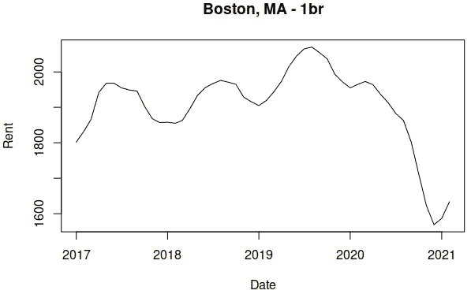

作者图片

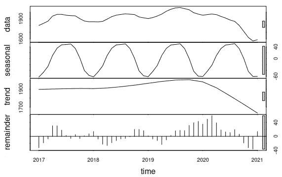

作者图片

如果我们只关注季节性因素，我们可以看到你应该在一年中的哪个月签订租约，以获得最便宜的月租金。在波士顿，最低到最高的季节性是-60 美元到+50 美元，这意味着在某些月份签署租约将使你的月租金平均减少 60 美元，而在其他月份将增加 50 美元。

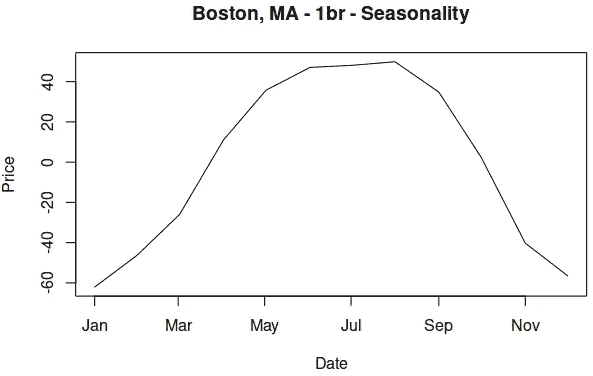

作者图片

对于波士顿来说，季节性在八月最高，一月最低。因此，你应该尝试在 12 月和 1 月之间签订年度租约(与季节性高峰相比，你每月将节省 110 美元)，避免在 5 月和 8 月之间签订(与季节性最低价格相比，你每月将多支付 110 美元)。因此，如果你住在波士顿，一些带有几行 R 代码的开源数据每年可以为你节省 1300 美元。并非所有城市都表现出与波士顿相同的季节性。例如，让我们看看佛罗里达州的迈阿密和德克萨斯州的奥斯汀。

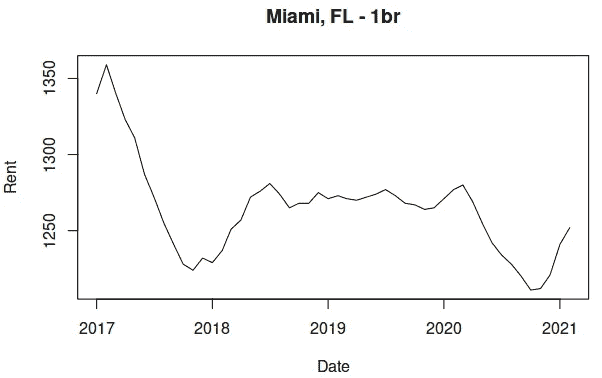

作者图片

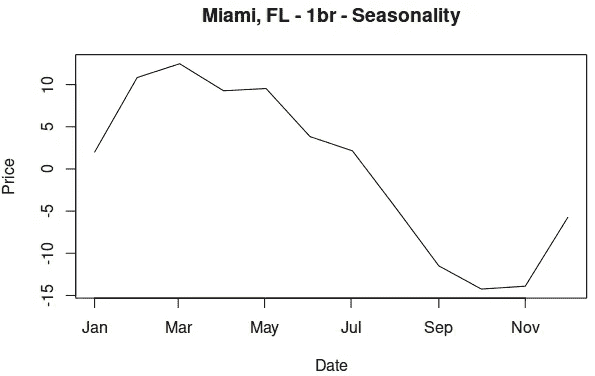

在佛罗里达州的迈阿密，我们看到季节性在三月份最大，大约每月+15 美元，在十月份最小，每月-15 美元；没有波士顿那么戏剧化。选择正确的月份在迈阿密签订租约，佛罗里达州每年将为您节省约 360 美元。德克萨斯州奥斯汀的季节性也有类似的范围:八月的最高值为每月 20 美元，二月的最低值为每月 15 美元。如果您在合适的时间签订租约，在德克萨斯州奥斯汀市(例如，每年 420 美元)比在佛罗里达州迈阿密市可以节省更多。

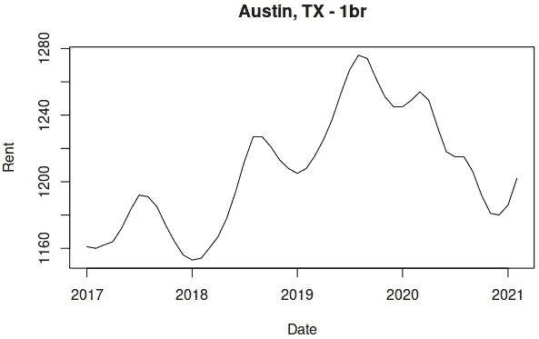

作者图片

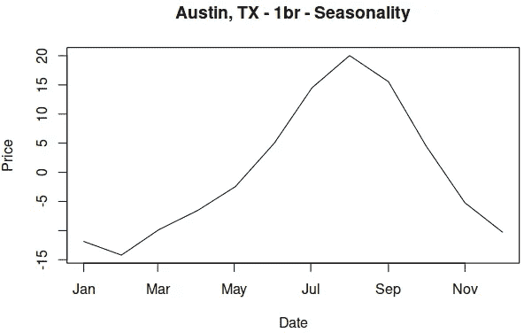

作者图片

公寓列表中的数据集包含 479 个城市的完整数据。一个有趣的问题是:“哪些城市表现出最大和最小季节性之间的最大差异？”按照从大到小的顺序排序，让我们看看所有差价大于 100 美元的城市:

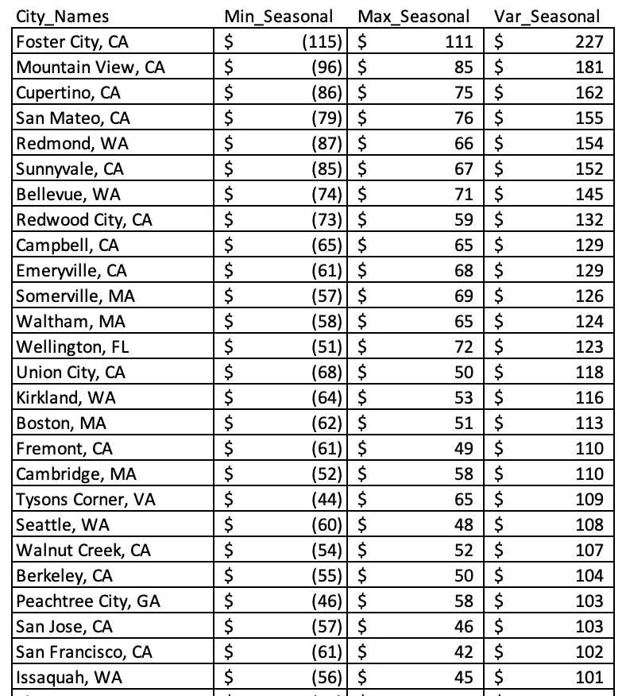

作者图片

全美有 26 个城市，在合适的月份签订公寓租约，每年至少能为你节省 1200 美元。结果似乎偏向于“科技城市”(如山景城、库比蒂诺、西雅图、雷德蒙)，如果您在正确的月份签署租约，加利福尼亚州福斯特市每年可节省 2700 美元。我们可以查看季节性图表，找出几个有代表性的城市的“神奇”月份。

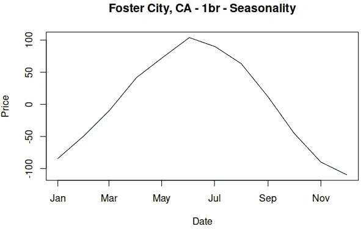

作者图片

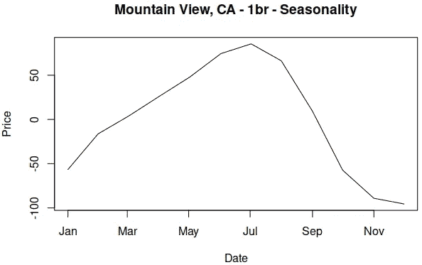

作者图片

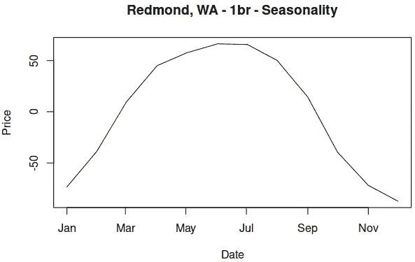

作者图片

在山景城、福斯特城和雷德蒙，在 6 月或 7 月签署公寓租约将比你等 6 个月后在 11 月或 12 月签署多花 100 到 225 美元。在上面列出的 26 个城市中，合理安排时间可以让你每年多赚 1200 到 2700 美元。如果你看到一个学生问“*我什么时候才能在现实生活中使用这些东西？*“一边抱怨他或她的数学课，一边给他们看这篇文章！

如果你想看看示例 R 代码，更好地理解 STL 算法，看看[我早先的文章](https://the-elvis.medium.com/seasonal-trend-decomposition-759ab01b8fab)。但是如果你想读一些不太专业的东西，我推荐我的文章[优先化分析工作的最佳实践](/how-to-prioritize-analytical-work-part-1-ae91a6e71303)。如果你今天对统计学更感兴趣，试试关于 A/B 测试的[这篇文章](/what-does-an-a-b-test-measure-adebf56ae68a)或者关于三(3)个最重要的统计测试的[这篇文章](/the-three-most-important-statistical-tests-in-business-analytics-fd958a8e2a90)。最后，如果你想在 1-2 分钟内快速阅读，请尝试[这篇文章](/better-communications-between-data-scientists-and-business-users-46f493ce24ba)中的八(8)个技巧来改善数据科学和业务用户之间的交流。