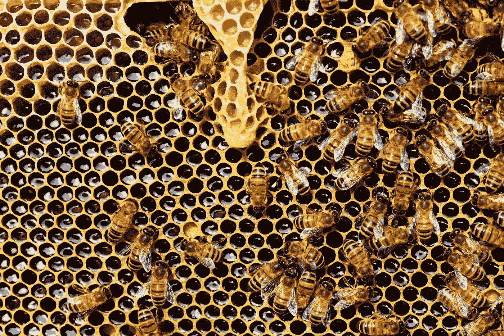

# 用人工智能拯救卑微的蜜蜂

> 原文：<https://towardsdatascience.com/saving-the-humble-honey-bee-with-ai-fdc951fd67cc?source=collection_archive---------27----------------------->

## 真实世界人工智能

## TinyML 帮助保护蜜蜂免受邪恶贪婪的捕食者的伤害

照片由来自 [Pexels](https://www.pexels.com/photo/honeycomb-close-up-detail-honey-bee-56876/?utm_content=attributionCopyText&utm_medium=referral&utm_source=pexels) 的 [Pixabay](https://www.pexels.com/@pixabay?utm_content=attributionCopyText&utm_medium=referral&utm_source=pexels) 拍摄

你昨天吃了什么？它包括杏仁、苹果、蓝莓、花椰菜或卷心菜吗？

对于我们这些有幸获得大量这些食物的人来说，我们不能再认为它们是理所当然的。

而且不是因为气候变化，土地短缺，或者破坏性的农业做法(虽然这些本身就是问题)，而是因为卑微的 ***蜜蜂*** 。

根据宾夕法尼亚大学的研究，蜜蜂帮助了超过三分之一的全球粮食生产，尤其是像蓝莓、杏仁和苹果这样的作物。

他们受到了威胁。

近年来，蜜蜂受到了一种肉眼几乎看不到的邪恶捕食者的攻击——瓦螨。

这种螨虫是一种致命的寄生虫,它已经给世界各地的蜂群造成了巨大的破坏，首先是削弱个体蜜蜂，然后是感染整个蜂巢。

然而，在澳大利亚，瓦螨还没有找到一个据点——澳大利亚是最后一个没有这种恶性螨的有人居住的大陆。

但是 Varroa 已经侵袭了澳大利亚的两个近邻— *新西兰和巴布亚新几内亚—* ,所以澳大利亚的养蜂人不顾一切的想要控制它。

幸运的是，[人工智能](https://highdemandskills.com/what-is-artificial-intelligence/) (AI)正在赶来救援。

而且不是随便什么 AI，而是[***tinyML***](https://highdemandskills.com/tinyml/)。

# TinyML 可以帮助解决巨大的问题

TinyML 是人工智能的一个新兴领域，它将机器学习和深度学习的巨大能力打包到一个*微小的形状因子*中。

这使得它成为资源受限应用的理想选择，在这些应用中，*尺寸、功耗和连接性*非常重要，而且有许多这样的应用。

TinyML 通过使用诸如*修剪*(删除不需要的网络节点)和*量化*(将浮点数转换为整数)等技术来缩小预先训练好的(大型)机器学习模型。

这些预训练的模型然后被用于 tinyML 部署中的*推理*(预测或分类)，这比训练需要更少的计算能力。

这些模型在*微控制器*上使用专门的编码平台实现，如 *Tensorflow Lite* 。

微控制器是紧凑的专用集成电路，是物联网革命的主力。

直到最近，由于资源限制，这些微控制器的功能范围有限。然而，多亏了 tinyML，这些'*微型机器*已经开始变得'*智能'*。

# 无 Varroa 蜜蜂的最后边疆

在澳大利亚，为了帮助抵御瓦螨，个体养蜂人一直在密切监视他们的蜂箱。

此外，在澳大利亚各地的港口和其他入境点设置了特别指定的蜂箱，并由检疫检查员例行检查。

到目前为止，这种方法一直很有效。

但 Varroa 在澳大利亚站稳脚跟可能只是时间问题，而且已经出现了几次差点违约的情况。

例如，2018 年，一艘美国集装箱船抵达澳大利亚，船上有[受 Varroa 感染的蜜蜂。幸运的是，澳大利亚当局在那种情况下设法识别并遏制了威胁。](https://www.abc.net.au/news/2019-09-18/the-beekeepers-ready-to-fight-varroa-mite-in-australia/11505370)

虽然监测过程迄今为止一直有效，但这是"*精心手工*"，**的亚当·麦克纳马拉称[Bega Cheese](https://www.begacheese.com.au/)**，一家大型澳大利亚乳制品生产商[最近进入蜂蜜业务](https://www.begacheese.com.au/product/b-honey/)。

更重要的是，即使是短时间的未被发现的 Varroa 暴露也会是一个问题。维多利亚养蜂人协会的阿里斯·彼得拉托斯建议说，“如果它已经存在了一个月、一周或两周，那可能已经太晚了”。

因此，澳大利亚农业渴望找到更好的监测 Varroa 的解决方案，他们求助于 T2 的尖端技术。

# tinyML 是如何帮助蜜蜂的

Bega 与创新的澳大利亚科技公司[**【xai lient】**](https://www.xailient.com/)和 [**Vimana Tech**](https://www.vimanatech.com.au/) 合作，启动了 [**紫色蜂巢项目**](https://purplehiveproject.com.au/) 以帮助*改善澳大利亚的瓦螨监测*。

Purple Hive 的目标是在澳大利亚建立一个能够自动检测瓦螨的蜂巢网络。这将使 Varroa 监控*变得更加容易、更具可扩展性和成本效益*。

但是自动检测 Varroa 螨虫是一项艰巨的任务——螨虫非常小，几十只蜜蜂可以一次进出一个蜂巢。“*做起来挺难的，就像大海捞针”*，反映了 [Shivy Yohanandan](https://medium.com/u/41cae9fb98df?source=post_page-----fdc951fd67cc--------------------------------) ， [Xailient](https://medium.com/u/59b89032c6d5?source=post_page-----fdc951fd67cc--------------------------------) 的联合创始人。

许多蜂房也位于偏远地区，电力或通信有限。任何检测设备都需要在*严格的资源限制*内工作，并达到*高度的可靠性*。

但是 Xailient 专门研究极其高效的计算机视觉算法，使得有效的、资源受限的解决方案成为可能。

利用他们创新的人工智能能力，Xailient 和 Vimana Tech 开发了一种 tinyML 实现，可以满足自动检测瓦螨的所有挑战。

它是这样工作的:

*   一个特殊的 3D 打印蜂箱—*紫色蜂箱—* 装有**摄像头和人工智能技术**
*   蜂巢的入口有 360 度的摄像机，可以捕捉每只进入的蜜蜂的图像
*   然后，人工智能算法帮助**识别**是否有任何进入的蜜蜂**携带瓦螨**
*   如果检测到瓦螨，**实时警报**就会发出，同时还有被感染蜜蜂的图像

作为 tinyML 解决方案，紫色蜂巢中使用的人工智能算法和相关硬件*高效、低功耗，并且具有有限的连接要求——*非常适合部署在广泛的偏远地区。

此外，紫色蜂箱入口设备，实际上包含螨虫检测技术的单元，是*太阳能供电的，可以安装到现有的蜂箱上——*这使其*便携，易于在现有的蜂箱网络中推广*。

# 给蜜蜂一个战斗的机会

澳大利亚很幸运地避免了瓦螨对其蜜蜂造成的破坏，但这种运气可能不会持续太久。

通过转向创新的技术解决方案，像紫色蜂巢这样的项目将为蜜蜂提供一个战斗的机会，以保持领先于邪恶的 Varroa 捕食者。

Purple Hive 的核心 tinyML 显示了资源受限的实现有多么有用——在一个充满资源饥渴技术的世界里，有无数种情况下*高效、集中和低资源的解决方案*正是所需要的。

这是 tinyML 的承诺。

# 概括起来

*   蜜蜂在世界粮食生产中扮演着重要的角色，像蓝莓、杏仁和苹果这样的农作物尤其依赖蜜蜂
*   然而，蜜蜂一直受到一种邪恶的捕食者的攻击，这种捕食者是瓦螨，它能在几周内毁灭蜂群
*   澳大利亚是最后一个没有瓦螨的有人居住的大陆，人们对通过有组织的监控努力保持这种状态很感兴趣
*   但是监测瓦螨是一个**劳动密集型和困难的过程**，所以*更有效的方法*正在被寻求
*   使用*尖端技术和 tinyML 解决方案*，澳大利亚公司 *Bega* 、 *Xailient* 和 *Vimana Tech* 在**自动监控瓦螨**方面处于领先地位，使其成为一个*更容易、更具可扩展性和成本效益的过程*
*   Xailient 利用其**专业的计算机视觉算法和 tinyML 专业知识**在资源紧张的情况下开发了有效的 Varroa 检测实施方案