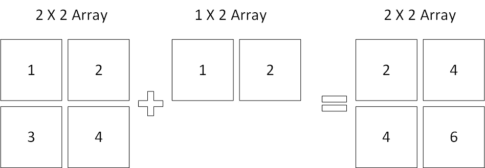
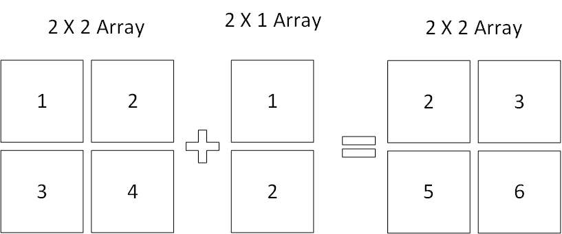
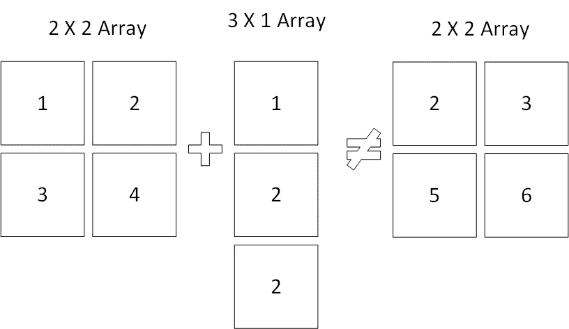

# 告别循环，迎接优化

> 原文：<https://towardsdatascience.com/say-goodbye-to-loops-and-hello-to-optimization-aaace896e80b?source=collection_archive---------24----------------------->

## 使用 NumPy 优化 Python 代码


[𝓴𝓘𝓡𝓚 𝕝𝔸𝕀](https://unsplash.com/@laimannung?utm_source=medium&utm_medium=referral) 在 [Unsplash](https://unsplash.com?utm_source=medium&utm_medium=referral) 上拍照

虽然 Python 仍然易于使用，学习起来很快，并提供了大量几乎可以做任何事情的外部库，但它有一个致命的弱点:它很慢。

当然，在人眼看来，它的迟钝似乎可以忽略不计。通常 Python 只落后于其他编程语言几毫秒；然而，当迭代数百万甚至数十亿个数据点时，它会迅速累加。

NumPy 提供了独特的解决方案。在允许用户仍然编写 Python 的同时，它将 Python 转换成专门为数值分析优化的写得很好的 C 代码。

使用 NumPy 数组可以将脚本的性能提高一到两个数量级，并且只需要很少的学习时间。

# 向量运算

传统的循环方法不是对数组中的每个元素执行一个函数，而是对数组中的所有元素同时应用一个函数。

```
import random# create a list of random integers
data = [random.randint(0, 100) for i in range(1000000)]
```

为了演示矢量运算的效用，创建了一个示例数据集。上面的代码生成 1，000，000 个介于 0 和 100 之间的随机整数的列表。

为了举例，将测量对列表中的每个元素取余弦的性能。

```
# import math for cosine function
import math# create a new list for the data
new_data = []# loop through the data, take cosine and add it to the new list
for i in data:
    new_data.append(math.cos(i))
```

上面的代码使用了一个典型的循环来遍历列表并取每个值的余弦值。这是通常想到的传统迭代方法。不幸的是，这用了大约 0.31 秒，相当慢。

```
# import math for cosine function
import math# create a new list for the data
new_data = [math.cos(x) for x in data]
```

除了循环，还可以使用列表理解，这将时间减少到 0.24 秒。虽然比传统的循环有所改进，但仍然有些迟缓。

```
# transform the data into a NumPy array
data = numpy.array(data)# apply the vector operation
new_data = numpy.cos(data)
```

最后，NumPy 用于相同的操作。第一行将列表转换成数组，第二行应用向量运算。

注意，不是使用标准库中数学模块的余弦函数，而是必须使用 NumPy 的余弦函数。

除了生成更干净易读的代码，整个过程只需要 0.03 秒左右。这大约比使用传统循环快 10 倍，比理解列表快 90%。

# 通过数据过滤

NumPy 擅长的另一个常见任务是数据过滤。使用与以前相同的数据，将对超过 50 的所有值进行筛选。

```
# Using a traditional loop
new_data = []
for i in data:
    if i > 50:
        new_data.append(i)# Using a list comprehension
new_data = [i for i in data if i > 50]
```

和以前一样，普通 Python 可以使用传统的循环或列表理解来过滤列表。前者需要 0.23 秒，后者需要 0.11 秒。

```
# Convert data into a NumPy array
data = numpy.array(data)# Create a filter
data_filter = data > 50# Filter for values greater than 50
new_data = data[data_filter]
```

然而，NumPy 没有使用循环，而是提供了一种直观的替代方法。将列表转换成数组后，下一行创建一个过滤器。如果迭代，过滤器将输出符合条件的 True 和 False 值。

换句话说，如果数据中的第一个值大于 50，则筛选器中的第一个值将为真，反之亦然。

一旦创建了过滤器，就可以使用熟悉的拼接符号将其应用于数据，创建一个值大于 50 的新数组。整个过程只需要 0.02 秒，无论是循环还是列表理解都是一个巨大的进步。

# 对广播的解释

广播关注大小不等的数组上的算术运算。要工作，数组的尾轴必须相等，即使维数不相等。下图给出了一个直观的例子。



有效广播的直观示例

在这种情况下，广播是兼容的，因为在水平轴上有一个相等的数字。上述示例采用 1 X 2 数组，并将其添加到 2 X 2 数组中的每一行。



有效广播的另一个直观例子

可选地，垂直轴可以是兼容的。同样的原理适用于 2×1 阵列应用于 2×2 阵列的每一列。



无效广播

如果两个轴都不相等，如上例所示，则可能无法应用广播。相反，Python 会返回一个值错误。

# 广播代码示例

在将广播应用于更高维度的数据之前，下面的示例使用了与前面的演示中使用的 1，000，000 个 0 到 100 之间的整数相同的列表。

```
# Very simple broadcasting
new_data = numpy.array(data) * 2
```

像以前一样，不使用循环或列表理解，而是简单地将列表转换为 NumPy 数组并应用运算(在本例中乘以 2)提供了一种简洁有效的数据转换方法。

从广播的角度来看，一个 1 X 1，000，000 的数组乘以一个 1 X 1 的数组(也就是所谓的一个数字)。

然而，当应用于更复杂的事物时，广播要有趣得多。假设数据是一个 2 X 1，000，000 的数组:

```
# Create a 2 X 1,000,000 dataset
data = [
    [random.randint(0, 100) for i in range(1000000)],
    [random.randint(0, 100) for i in range(1000000)]
]
```

举例来说，第一组 1，000，000 个数据点中的所有数据都将加 1，第二组中的所有数据都将加 2。

```
new_data_1 = []
new_data_2 = []# Using loops to inefficiently broadcast
for i in range(len(data)):
    for j in data[i]:
        new_data_1.append(data[i][j] + 1)

    for k in data[i]:
        new_data_2.append(data[i][k] + 2)

new_data = [new_data_1, new_data_2]
```

在一个相当不公平的比较中，一组嵌套循环可以用来完成目标，但结果是草率的，需要大量的开销。如果使用另一组尺寸，也需要做很多调整。

然而除此之外，它还需要 0.83 秒的运行时间。

```
# Using list comprehensions to broadcast
new_data = [
    [x + 1 for x in data[0]],
    [x + 2 for x in data[1]]
]
```

列表理解提供了一个有吸引力的选择。上面的代码更短，更容易阅读，运行只需要 0.17 秒；然而，试图将这种方法用于更复杂的数据(如 100 X 100 的数组)将很难复制。

```
# Convert data into a numpy array
data = numpy.array(data)# Create a small array to broadcast
operator = numpy.array([
    [1],
    [2]
])# Use NumPy broadcasting
new_data = data + operator
```

最后，使用 NumPy 进行广播的例子提供了一种更直观的方法。将数据转换为数组后，将创建一个 2 X 1 数组来修改数据集。为此，在最后一行中使用了一个简单的加法运算符。

虽然这种方法比使用 list comprehensions 要多一些行，但是它更灵活，可读性更好，最重要的是，运行起来只需要 0.04 秒。

# 结论

Python 提供了很多实用工具，但是速度传统上不是它的优势之一。然而，NumPy 库通过直观的语法提供了很大的性能提升。

简单地放弃循环和列表理解，转而支持 NumPy 操作，可以在不增加不必要的复杂性的情况下大幅提高代码速度。理解它的用途是任何大型数据项目的必要条件，实际上也是数据科学的要求。