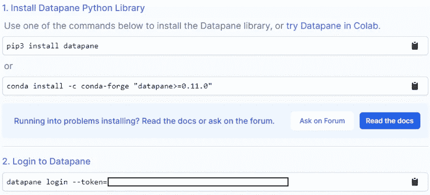
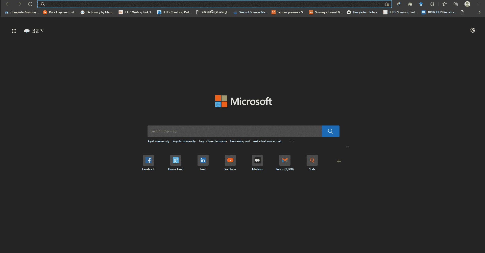
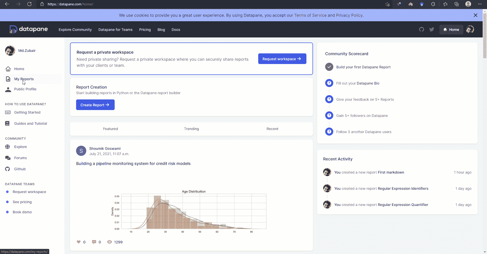
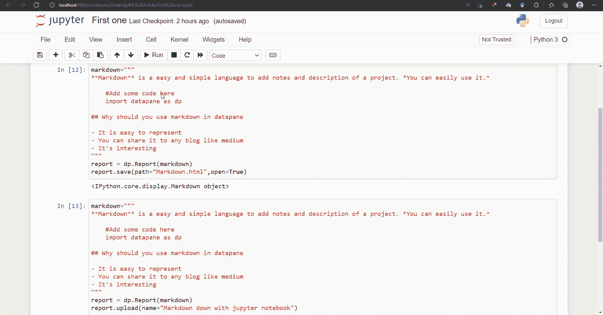
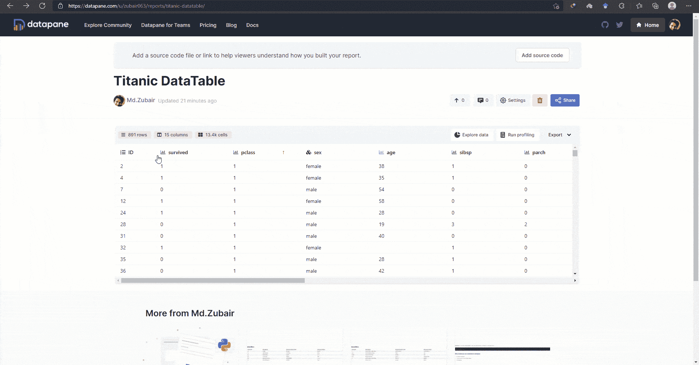

# 告别截图，使用 Datapane 进行数据科学报告

> 原文：<https://towardsdatascience.com/say-goodbye-to-screenshot-and-use-datapane-for-data-science-report-e698bbd29f72?source=collection_archive---------22----------------------->

## 7 分钟阅读完整的 Datapane 教程


[DDP](https://unsplash.com/@moino007?utm_source=medium&utm_medium=referral) 在 [Unsplash](https://unsplash.com?utm_source=medium&utm_medium=referral) 上拍照

## 动机

我经常喜欢在博客上写数据科学相关的文章。更准确地说，我是在**介质**和 **Quora 上写的。有时，我用 python 创建一些交互式数据可视化，或者用 jupyter notebook 的 markdown 选项创建一些美学表现。但是当我想把它发布在 medium 这样的博客上时，我必然会使用截图或 gif 来分享交互式可视化或表示。几天前，我一直在寻找分享这些互动情节和降价展示的方法。在搜索了很多之后，我发现了一些给出了一些方向的文章。不幸的是，没有完整的指导方针让我可以轻松地使用该技术来共享交互式可视化和表示。经过一点研究， **Datapane** 似乎是完成这项工作最有用的工具。现在，是时候分享我的发现，让你的数据科学相关博文更具互动性和美感。**

***简单又好玩..让我们开始吧……***

## **数据面板概述**

Datapane 是为以编程方式分析数据和创建报告的人准备的。到目前为止，Datapane 支持以下库、语言和文件格式来生成交互式报告。

*   [*熊猫数据帧*](https://pandas.pydata.org/)
*   *Plotly 来自 Python 可视化库，如*[*Bokeh*](https://bokeh.org/)*[*Altair*](https://altair-viz.github.io/)*[*Plotly*](https://plotly.com/python/)*和***
*   **降价和文本**
*   **一般文件，如图片、pdf、JSON 数据等。**

*Datapane 报告非常灵活，还可以包含页面、选项卡、下拉列表等等。*

*创建后，报告可以上传到 web，在云中动态生成，或者嵌入到您自己的应用程序中，在那里可以浏览数据，并可以交互地使用可视化。*

## ***开始使用数据面板***

*在使用 Datapane 之前，您应该知道 Datapane 是一个开源的 Python 库，它使得用 Python 构建交互式报告变得很容易。Datapane Community 是一个免费的在线发布 Python 报告和协作的服务。*

*现在，只要按照步骤*

1.  ***在你的电脑上安装数据面板库***

*在您的`cmd` 或`anaconda command`提示符下运行命令*

```
*pip3 install datapane
or 
conda install -c conda-forge "datapane>=0.11.0"*
```

*如果你是 mac 或 linux 用户，你可以遵循这里提供的指南[*。*](https://docs.datapane.com/tut-getting-started)*

****2。登录到数据面板****

**首先，你必须在 [Datapane 网站](https://datapane.com/home/)注册。登录后，他们会为您提供一个令牌。使用令牌，您可以轻松地从本地 pc 登录到 Datapane。令牌可以从 [*链接*中找到。](https://datapane.com/getting-started/)如果您点击该链接，您将进入一个页面，在那里您可以找到如下令牌。**

****

**作者照片**

**这是整个过程的 gif 图**

****

**作者 gif**

****3。在 Datapane 文本编辑器或 jupyter 笔记本中呈现 markdown 文本，并将其共享给 medium****

**您可以使用 Datapane 文本编辑器和 python 来创建可共享的降价。下面的 gif 展示了用 Datapane 文本编辑器创建 markdown 文本的全过程，并分享给 medium。**

****

**作者 gif**

**让我们用 python 做同样的事情。为此，我编写了以下代码。**

**该代码将在您的本地目录中保存一个 html 版本的降价文本。如果你想把它上传到 Datapane 网站，只需把最后一行代码从`report.save(path=”Markdown.html”,open=True)`改成`report.upload(name=”Markdown down with jupyter notebook”)`。它将保存一个输出到数据面板报告。完整的指南如下所示。共享过程与 Datapane 文本编辑器 gif 中显示的相同。**

****

**作者 gif**

**你会得到如下文本。**

****4。用 python 渲染 HTML 代码并创建交互式表格****

**Datapane 也有助于用 python 呈现 html 代码。我按照下面的代码创建了一个交互式表格。**

**代码将把表格上传到 Datapane 报告中。如果你想把它保存到你的本地目录，只需要在代码的最后一行使用`.save(path=’report.html’, open=True)`就可以了。介质中的共享过程与 gif 的`markdon` 部分所示相同。**

**输出—**

****5。带数据面板的可交互数据表****

**Datapane 的交互式数据表是一个非常棒的工具，可以用交互的方式来表示你的数据集。**

**我已经编写了一段代码，使用 seaborn 库构建一个内置的数据框架，并使用 datapane 将其导出为数据表。它生成以下输出。**

**我觉得不可思议。 ***你可以在内置 EDA 中搜索、过滤、排序、探索等等。它涵盖了一个数据集的全部报告。***gif 演示了数据表的特性。**

****

**作者 gif**

****6。互动情节和可视化****

**没有其他类似的工具来分享这种类型的交互式绘图和可视化。目前 Datapane 支持`**Altair, Matplotlib / Seaborn, Bokeh, Plotly ,Folium**` 库进行可视化。`dp.Plot`块从一个受支持的 Python 可视化库中取出一个绘图对象，并将其呈现在您的报告中。我以`**Plotly**` 为例展示了一个演示。**

**数据面板输出**

****7。带降价的组合图****

**这更有趣，因为它看起来像是用任何文本编辑工具创建一个交互式报告。降价文本很容易与互动情节相结合。一个例子和代码。**

**数据面板中的输出**

****8。写公式分享****

**公式块允许您轻松地将 [*LaTeX*](https://en.wikipedia.org/wiki/LaTeX) 格式的公式添加到您的报告中，并带有可选的标题。关于*乳胶*配方的简单介绍可以在[这里](https://en.wikibooks.org/wiki/LaTeX/Mathematics)找到。**

```
**import datapane as dpdp.Report(
  dp.Formula(r"\frac{1}{\sqrt{x^2 + 1}}", caption="Formula")
).upload(name="First formula")**
```

**输出**

**在引擎盖下，Datapane 使用 MathJAX 在浏览器中呈现方程，而不是一个完整的 TeX 引擎。这意味着您的一些 TeX 输入可能无法在 Datapane 系统上正确呈现——阅读 [MathJAX 文档](http://docs.mathjax.org/en/latest/input/tex/differences.html)了解更多信息。**

****9。在媒体或其他博客上集成代码****

**代码块允许您将语法突出显示的源代码嵌入到报表中。这个块目前支持 Python 和 JavaScript。比 **github gist 更赚钱。****

**数据面板中的可共享代码**

****10。将网格布局添加到您的报告中****

**如果您将一个块列表(比如`Plot`和`Table`)传递给一个报告，那么默认情况下，它们会被放置在一列中，每个块一行。如果您想定制行和列，Datapane 提供了一个`Group`组件，它接受一个块列表和一些列和/或行，并将它们放在一个网格中。**

**如果我们以前面教程中的例子为例，但是想要并排放置绘图和数据集，我们可以使用 specify this using `Group`并指定列数。**

**数据面板共享报告**

****11。向您的报告添加多页内容****

**Datapane 上的报告可以有多个页面，在报告的顶部以选项卡的形式呈现给用户。这些可以像 Excel 文档中的工作表一样使用。**

**要添加页面，使用报表顶层的`dp.Page`块，并用`title`参数给它一个标题。下面给出一个例子。**

**数据面板多页报告**

****12。多个选项卡并选择报告****

**当我们需要报告的背景时，这是很有用的。**

**Datapane 在`dp.Select`块上提供了两个选择选项:下拉菜单和选项卡。如果选项少于五个，则默认为制表符，否则将使用下拉菜单。要覆盖默认值，请将参数`type = dp.Select.DROPDOWN`或`type=dp.Select.TABS`传递给`dp.Select`块。**

**数据面板报告**

**此外，如果你想你可以添加文件和图像，python 对象，嵌入到你的报告。更多详情请点击 [*链接*](https://docs.datapane.com/reports/blocks/files-and-images) *。***

**我个人认为，如果你能用审美的方式来表现数据，那么数据就是美。数据可视化的最佳方式是交互式可视化。交互式和美观的数据可视化可以提供对数据的有意义的洞察。Datapane 让这个过程变得非常简单。在了解 Datapane 库之前，对我来说，在任何博客上分享数据科学报告是一个大问题，不管我是使用截图还是创建 git 来分享它。**

**希望这篇文章能对你分享数据科学报告有所帮助。**

*****我还挑了一篇有趣的文章供你进一步阅读……*****

**[](/spread-of-covid-19-with-interactive-data-visualization-521ac471226e) [## 通过交互式数据可视化传播新冠肺炎

### 一个完整的指南条形图比赛和互动 Choropleth 地图新冠肺炎疫情与 Python。

towardsdatascience.com](/spread-of-covid-19-with-interactive-data-visualization-521ac471226e) [](/manipulate-pdf-files-extract-information-with-pypdf2-and-regular-expression-39ff697db0ca) [## 操作 PDF 文件，用 PyPDF2 和正则表达式提取信息

### 使用 PyPDF2 和正则表达式简化 PDF 操作任务

towardsdatascience.com](/manipulate-pdf-files-extract-information-with-pypdf2-and-regular-expression-39ff697db0ca) [](/tips-and-tricks-to-work-with-text-files-in-python-89f14a755315) [## 使用 Python 处理文本文件的技巧和诀窍

### 使用文本文件并熟悉 Python 中令人惊叹的技术

towardsdatascience.com](/tips-and-tricks-to-work-with-text-files-in-python-89f14a755315) 

# 祖贝尔·侯赛因

*   *如果你喜欢这篇文章，请关注我的* [***中的***](https://mzh706.medium.com/) *了解更多。*
*   *连接我上*[***LinkedIn***](https://www.linkedin.com/in/zubair063/)*进行协作。***