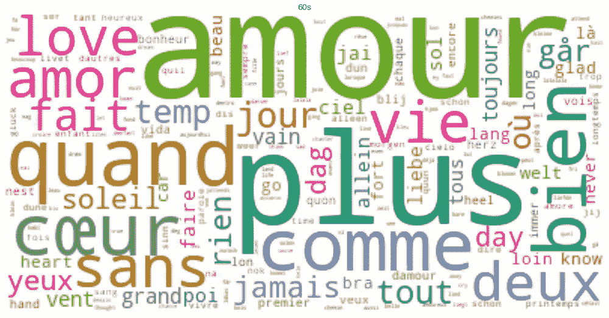
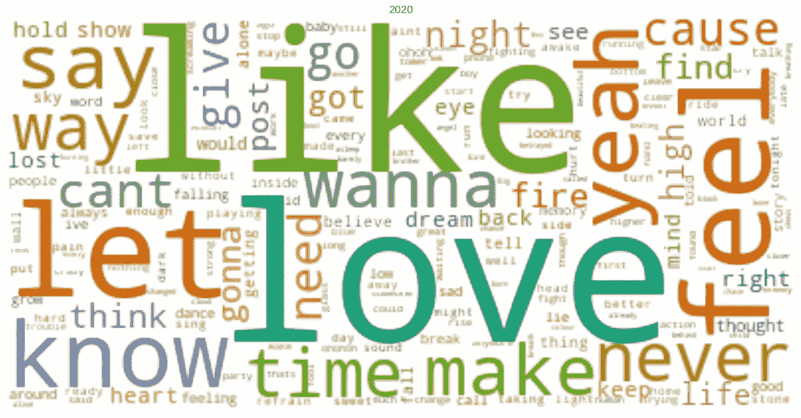

# 说美妙的事情:欧洲电视网歌词的情感分析

> 原文：<https://towardsdatascience.com/say-wonderful-things-a-sentiment-analysis-of-eurovision-lyrics-700d9bde1e9d?source=collection_archive---------47----------------------->

## [实践教程](https://towardsdatascience.com/tagged/hands-on-tutorials)

## 几十年来，欧洲电视网一直在娱乐观众。这篇文章问，关于这场比赛，欧洲电视网的歌词告诉了我们什么？


由 [BRUNO EMMANUELLE](https://unsplash.com/@brunocervera?utm_source=medium&utm_medium=referral) 在 [Unsplash](https://unsplash.com?utm_source=medium&utm_medium=referral) 上拍摄

在过去的 65 年里，欧洲电视网的歌唱比赛娱乐了来自欧洲和更远地方的观众。这场比赛已经发展到与 50 年代和 60 年代的比赛完全不同的地步。这些早期的比赛是二战后通过跨境广播团结各国的一种方式。虽然它看起来确实不同，但在欧洲电视网歌曲的歌词中，什么发生了变化，什么保持不变？

作为一个欧洲电视网的超级粉丝，我对 Kaggle 的[“欧洲电视网歌词”数据集产生了兴趣。](https://www.kaggle.com/minitree/eurovision-song-lyrics)该数据集包括从 1956 年开始到 2019 年上次比赛期间欧洲电视网歌曲大赛中所有歌曲的排名和歌词。我从克里斯托贝尔·维斯对金属乐队歌词的分析中获得了方法和代码的灵感。在他的博客中，他分析了金属乐队每十年的歌词。这个博客计划实现同样的目标。虽然有 1564 首歌用多种语言演唱使得这种分析有点困难。

在这篇文章中，我会找到欧洲电视网歌词中常用的词。情感分析然后被应用到欧洲电视网的歌曲中。这将显示几十年来歌曲的积极或消极趋势。最后，我使用 Genius API 从被取消的 2020 年比赛中抓取歌曲。通过将这些方法应用于 2020 年版，我检验了这场竞赛是否会以同样的趋势继续下去。

## 必需的库

*   **熊猫**和 **Numpy** 进行数据分析
*   **Matplotlib** 和 **Wordcloud** 制作漂亮的剧情
*   **NLTK** 为停用词
*   **Scipy** 、 **Sklearn** 和 **StatsModels** 获取有用的统计函数
*   用于情感分析的**文本块**
*   **LyricsGenius** 使用 Genius API 抓取歌词
*   脚本 **helpers.py** ，最初由[克里斯托贝尔·韦亚斯](/how-to-analyze-emotions-and-words-of-the-lyrics-from-your-favorite-music-artist-bbca10411283)创建，经过修改以帮助这个特殊的数据集

一个笔记本的代码可以在这个链接中找到[，所需的文件](https://colab.research.google.com/drive/1EPblF4GMse6MrSTOjny2p_cYt39tw_0B?usp=sharing)[不包括来自 kaggle](https://www.kaggle.com/minitree/eurovision-song-lyrics) 的 Eurovision 歌词数据集，可以在我的 [github 中找到。](https://github.com/AlanFWise/EurovisionSA)

# 词频分析

我们首先通过词频分析调查欧洲电视网的热门话题。这里感兴趣的两个函数是 Sklearn 的 CountVectorizer，它计算单词的频率，以及用于绘制单词云的 WordCloud。

第一个预处理步骤是为每首歌曲定义一个唯一单词列表。这意味着本节的分析侧重于歌曲中使用最多的词，而不是总体上使用最多的词。如果我们选择后者，我敢肯定“la”或“oooh”会是最受欢迎的，但这些抒情的选择并不有趣。

另一个重要的预处理步骤是定义停用词。这些词很常见，但没有太多意义。因此，我想把它们从我们的分析中剔除。一些停用词的例子是英语中的“the”，德语中的“der”或瑞典语中的“en”。多年来，比赛中使用了 50 多种语言。这可能是一个问题，因为我们将不得不定义数百个单词来阻止分析。幸运的是，NLTK 包允许我们从竞赛中最流行的语言中定义停用词。它们保存在名为“语言”的列表中。

```
languages = ['english', 'german', 'spanish', 'french', 'dutch', 'italian', 'danish', 'swedish', 'finnish', 'slovene', 'greek', 'turkish', 'arabic', 'romanian', 'hungarian', 'russian']
```

敏锐的眼睛可以看出这个列表中的语言不超过 50 种。不幸的是，NLTK 不支持很多 Eurovision 语言。然而，列表中的这些语言包括最流行的。我们会发现，我们的分析并没有因为没有省略挪威语、马耳他语、冰岛语等语言的停用词而受到影响，或者在比利时 2003 年加入的情况下，一种虚构的语言。通过将这些停用词输入 Sklearn 的 CountVectorizer 算法，我们可以找到最流行的词是什么。


每十年欧洲电视网歌词中最流行的词

很明显，从 80 年代到 90 年代，流行语言发生了转变。这很好解释。从 1966 年到 1972 年，然后从 1978 年到 1998 年，各国都被要求用本国语言演唱。更多的参与国将法语作为国家语言，而不是英语。90 年代是一个奇怪的年代，因为这条规则在 1998 年之前一直存在，然而英语“love”却是最流行的。这可能是摩纳哥和卢森堡分别从 1979 年和 1993 年缺席比赛的原因。

“爱”作为一个主题在欧洲电视网的流行是很难改变的。前三十年被法国的“爱情”所主宰。这在 20 世纪 80 年代被“vie”取代。这种用法的一个著名例子是 1986 年比利时唯一一次凭借桑德拉·金的《我的生活》赢得竞赛。在过去的三十年里，“爱”再次位居榜首。尽管欧洲电视网已经发展了，歌唱爱情仍然很受欢迎。“爱”的流行是 2016 年比赛中 interval act 的主题之一，他们剖析了如何写出完美的欧洲电视歌曲。

如果你看过那个视频，你现在应该是欧洲电视网歌曲创作的专家了。

该视频以 2016 年主持人和 2015 年获奖者芒斯·塞默洛问“有公式吗”开始。虽然这种间隔行为集中在欧洲电视网之夜的风格选择，歌词也非常重要。那么哪些选择曾经流行过，现在流行什么呢？为此，为每十年的歌词绘制了一个词云。



50 年代和 60 年代的词汇云


70 年代和 80 年代的词汇云


90、00、10 年代的词云。

恋爱的话题很占优势。这得益于几十年来对“心脏”或“心脏”的反复提及。同样被反复提及的还有“生活”或“vie”，80 年代最流行词汇的获得者。提到“时间”或“温度”是很常见的。这伴随着对“日”和“年”的提及。一些次要但常见的话题包括“世界”、“地球”、“梦”、“夏天”和“太阳”。

在前四个单词云中，内容主要是法语和一点英语。从 90 年代开始，英国人的偏好就很明显了。为了找出任何非英语单词，你必须非常仔细地查看这些单词云。首选语言的变化，从法语到英语，似乎是几十年来欧洲电视网抒情选择的唯一重大变化。尽管这些年来歌曲和表演有所变化，但歌词内容非常相似。

# 情感分析

随着“爱”、“梦想”和“生活”的过度提及，人们会认为欧洲电视网歌曲的情绪是积极的。本节使用 TextBlob 软件包来分析欧洲电视网的歌词在情感上是积极的还是消极的。情绪由介于-1 和 1 之间的单个评级来表示。如果歌词评分低于-0.05，那么我们认为它总体上是负面的，如果评分高于 0.05，那么我们认为它总体上是正面的，如果它在这些值之间，那么它是中性的。

TextBlob 仅适用于英语，因此在应用情感分析之前必须翻译歌词。这可以通过 TextBlob 实现，我在分析 2020 年竞赛时使用了这一功能，但过度使用这一功能会导致翻译暂停，并停止当天的翻译。因此，大规模翻译变得棘手。幸运的是，翻译的歌词已经在“欧洲电视网歌词”数据集中给出。

哪些歌曲是最积极或最不积极的？将歌词及其翻译插入到 TextBlob 对象中，最积极的是 1963 年来自英国的条目，评分高达 0.81。听听罗尼·卡罗尔的歌曲“说美妙的事情”，我们很容易明白为什么这首歌会名列前茅。这是对 TextBlob 情感分析的一个极好的健全性检查，因为这是一首非常积极的歌曲。那年罗尼以 28 分名列第四。就我个人而言，这是我第一次看到这首歌，它太感人了，我以它命名了这篇博文。

最负面的来自 2009 年以色列的加入，情绪得分为-0.7。这是 Noa & Mira Awad 的歌《一定还有别的路》。重要的一点是，这首歌是用三种语言演唱的，英语、希伯来语和阿拉伯语。在分析中，希伯来语和阿拉伯语没有翻译。这首歌作为最负面的地方带有一个警告，如果这些部分被翻译，它可能会改变位置。然而，值得思考的是为什么这首歌会成为最负面的候选歌曲？首先，犹太人-以色列人和阿拉伯人-以色列人的组合必然会引发争议，而[也确实引发了争议。写这首歌是为了强调希望和对共同人性的理解。然而，如果不唱出为什么需要这种希望，就很难唱出这种希望——这导致了一个非常负面的分数。这首歌在决赛中以 53 分的成绩排在第 16 位。](https://www.haaretz.com/1.5062983)

总的来说，Eurovison 的歌曲大多是积极的，平均情绪得分为 0.16，这并不奇怪。


(左)欧洲电视网歌词整体情绪。(右)每十年歌词情绪的密度估计。

有趣的是，当我们关注每十年的情绪时。这由上面的右图表示。查看每个十年的峰值，我们可以看到这些峰值的模式正在向负方向移动。也就是说，平均而言，随着时间的推移，欧洲歌曲的歌词变得越来越消极。下一个问题是，这有意义吗？为此，我们研究了 95%的置信区间。


每十年情感的置信区间

查看这些置信区间，我们可以看到在 70 年代和 80 年代之间有一个变化。由于 80 年代的置信区间与 70 年代的略有重叠，这里没有足够大的变化。虽然 50 年代和 60 年代与 80 年代之间的差别很大。后三十年明显比前三十年更加消极。平均而言，从一开始到现在，欧洲电视网歌词的情绪下降了大约 0.1。这种情绪上的变化非常缓慢，平均而言，歌曲仍然是积极向上的。

# 欧洲电视 2020 怎么样？

2020 年是欧洲电视网有史以来第一次被取消。这将是一场激动人心的比赛，在欧洲电视网的历史上，冰岛第一次成为夺冠热门。关于我们错过的大赛版本，2020 年欧洲电视网歌曲的歌词能告诉我们什么？为此，我使用 lyricsgenius 包和 genius API 从 Genius 网站上抓取歌词。然后，我使用 TextBlob 将尽可能多的歌词翻译成英语，用于情感分析。

我按照同样的方法进行词频分析，得出字数。这使得“喜欢”成为最常用的词。常用于比喻。例如，德国的条目“暴力的事情”由本·多利奇在他使用的隐喻“像多米诺骨牌一样击倒我”。



大赛 2020 版的歌词 Wordcloud。

“爱”仍然具有强大的影响力，在 2020 年的 41 首歌曲中有 19 首使用了它。历史上常见的主题，包括“世界”和“时间”，也在出现。总的来说，歌词的内容看起来像是这个版本的欧洲电视会跟随以前的欧洲电视歌曲比赛的趋势。

通过调查欧洲电视网歌词的情感，可以看出这些情感的平均值为 0.13，置信区间为[0.075，0.187]。这意味着这些歌词的情绪是积极的，可以与现代版的欧洲歌曲相媲美。


2020 年欧洲电视网最积极的歌曲是伊登·艾儒略的《费克尔·毕丽》，最消极的是桑德罗的《奔跑》。两者都不极端，不足以将前冠军从最积极/最消极的头衔中剔除。

对于欧洲电视网来说，2020 年的比赛似乎一切如常。尽管这个结论有点无聊，但遗憾的是，我们没能在欧洲电视网的舞台上听到这些歌曲的黄金时期。

# 结论

欧洲电视网改变了他们的外表，但他们歌曲的抒情内容基本保持不变。在过去 70 年中的 6 年里，欧洲电视网歌曲中最流行的词不是“爱”，就是它的法语变体“amour”。有证据表明，歌曲已经变得越来越消极，但这种变化也非常缓慢，平均而言，它们仍然是积极的。就我个人而言，我认为我们被剥夺了 2020 年的比赛，根据我的分析，这将是欧洲电视网正常的比赛。现在，2021 年正在成为一场激动人心的比赛，来自 2020 年比赛的一些艺术家将回到 2021 年。欧洲电视网是一座数据金矿，我只触及了表面(没有双关语的意思)。我希望用一些统计学和数据科学的更重手的工具，来更深入地洞察这场惊人的竞争。