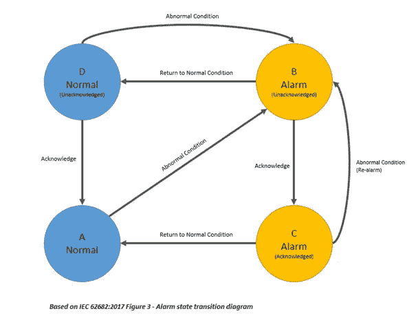
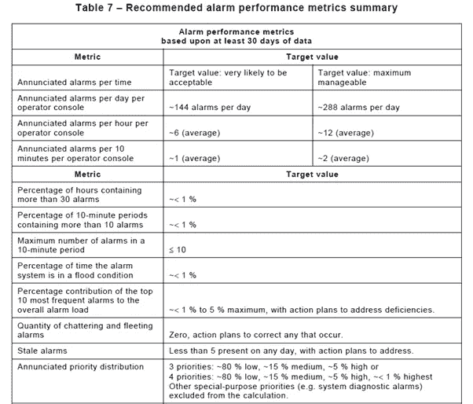
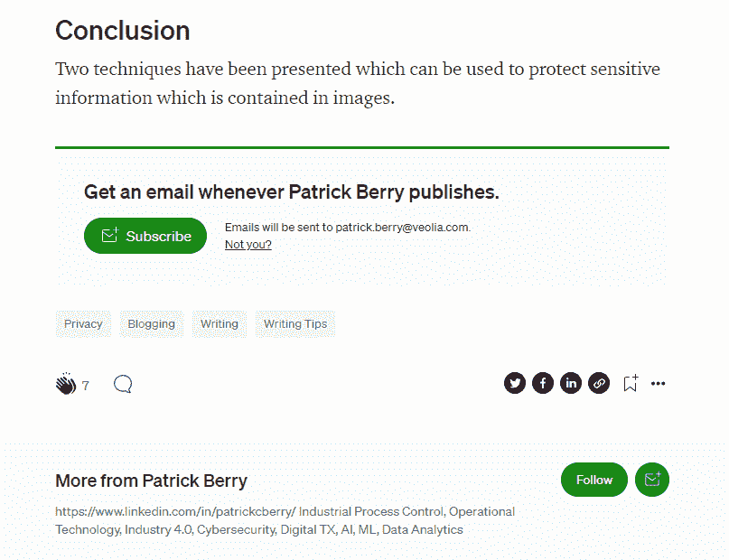

# SCADA 报警标准和指标

> 原文：<https://towardsdatascience.com/scada-alarm-standards-metrics-56512db128b0?source=collection_archive---------30----------------------->

## 工业自动化的开源工具

这篇简短的文章是我们使用开源数据科学工具分析 SCADA 系统产生的警报和事件日志的系列文章的继续。

这是本系列的第二篇文章，上一篇文章是，[用 ELK](/processing-scada-alarm-data-offline-with-elk-7ab9b475ffb9) 离线处理 SCADA 报警数据。

在前一篇文章中，介绍了 SCADA 系统及其在工业过程监控中的应用。讨论了警报和事件系统，并介绍了良好警报系统管理实践的要求。

在本文中，我们将简要介绍与报警系统管理和报警生命周期相关的标准。这将为后续文章中更详细的警报事件分析打下基础。

# 警报管理标准

报警系统管理有一个全球标准，即 IEC ( [国际电工委员会](https://en.wikipedia.org/wiki/International_Electrotechnical_Commission))标准 IEC 62682 流程工业报警系统管理[1]。

IEC 标准建立在 ISA[2]和 EEMUA[3]早期工作的基础上，并与之保持一致。

该标准包括报警系统整个生命周期的管理指南；设计、实施、操作、维护、监控和评估以及变更管理。

这里我们将只关注性能指标和监控。

# 生命周期

下图展示了一个简化的报警生命周期，它与 IEC 标准中的报警生命周期一致。

对于每个报警点，被监控的物理过程包含正常和异常两种状态。

每个报警点报警包含两个动态属性(因此有四种状态，如下所示)。报警属性包括报警状态(正常|报警)和确认(已确认|未确认)。

图片由作者根据 IEC 62682 图 3 绘制

# 承认

我们所说的确认警报是什么意思？

对于那些不熟悉工业控制系统报警子系统操作的人来说，更详细地描述报警生命周期是值得的。

通常通过将测量的过程变量与固定限值进行比较来产生警报，如果过程值超出允许范围，则产生警报(上述状态 B)。

未确认的报警通常包含在报警显示中，未确认的状态通常由动画和/或颜色表示。未确认的警报通常也会触发声音警报。

SCADA 系统将为操作员提供一些选择和确认警报的机制。完成后，任何声音警报都将静音，警报显示的颜色和/或动画也会发生一些变化。

当过程条件恢复正常时，警报显示将改变，或者警报将从当前警报列表中删除。

# 韵律学

IEC 标准在第 16.5 节中提供了报警系统性能指标的建议，这些建议总结在标准的表 7 中，复制如下。

这些指标基于单个操作员可以管理的工作量。

乍一看，指标似乎非常低，因为系统平均每 10 分钟不应超过一个警报。这些值来自对操作员理解警报、确定过程状态、制定和实施纠正措施以及监控纠正措施有效性的能力的研究。

来源:IEC 62682

## 洪水警报

报警泛滥是指报警率可能超过操作员管理报警的能力的一段时间(即 10 分钟内超过 10 个报警)。

当 10 分钟内的报警数量超过 10 个时，报警泛滥开始，当 10 分钟内的报警数量低于 5 个时，报警泛滥结束。

我们可以收集的与警报洪水相关的一些指标包括:

*   洪水事件的数量
*   洪水的持续时间
*   洪水中的警报数量

## 震颤警报

震颤警报以高频率触发、清除和重新触发。一个常用的定义是每秒触发 2 次以上的警报。

## 短暂的警报

短暂的警报是在操作员有机会采取行动之前就消失的警报。标准中没有提供定义，所以我们在最初的分析中将使用 1 秒。

## 陈旧的警报

陈旧报警是指触发并长时间保持报警状态的报警，标准定义为> 24 小时。

# 结论

在本文中，我们回顾了国际标准中规定的过程自动化报警系统的性能指标。

在以后的文章中，我们将探讨，

*   处理 SCADA 报警记录
*   使用 ELK 在线处理 SCADA 报警记录
*   先进的 SCADA 警报分析技术(序列挖掘和时间序列分析)

# 参考

1.  IEC， *IEC 62682 流程工业报警系统管理*。瑞士日内瓦国际电工委员会。2014 年:国际电工委员会。24–26.
2.  ISA， *ANSI/ISA‐18.2‐2009:流程工业报警系统的管理*。2009 年:国际自动化学会。
3.  EEMUA， *EEMUA-191:报警系统——设计、管理和采购指南*。2013 年:英国伦敦工程设备和材料用户协会。

# 进一步阅读

感谢阅读，希望你喜欢这篇文章。

为了进一步探索，

*   [订阅电子邮件通知](https://patrickberry.medium.com/subscribe)
*   点击文章顶部的“关注”按钮
*   对于工业 4.0 的所有内容，请查看我的[工业数字化转型&工业 4.0](https://medium.com/industrial-digital-transformation-industry-4-0) 出版物
*   欢迎在 [LinkedIn](https://www.linkedin.com/in/patrickcberry/) 上加入我的社交网络(记得提到你已经读过这篇文章)

为了支持媒体作者，考虑一下[订阅](https://patrickberry.medium.com/membership)。

记得点击订阅和关注按钮，

作者图片