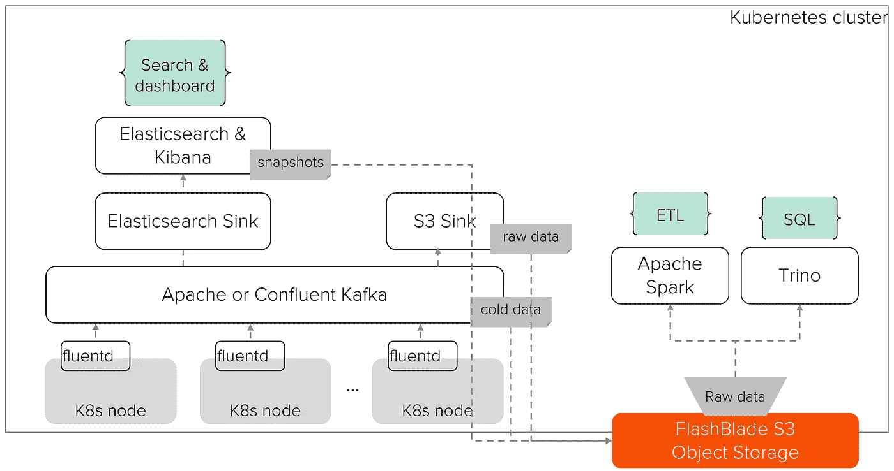
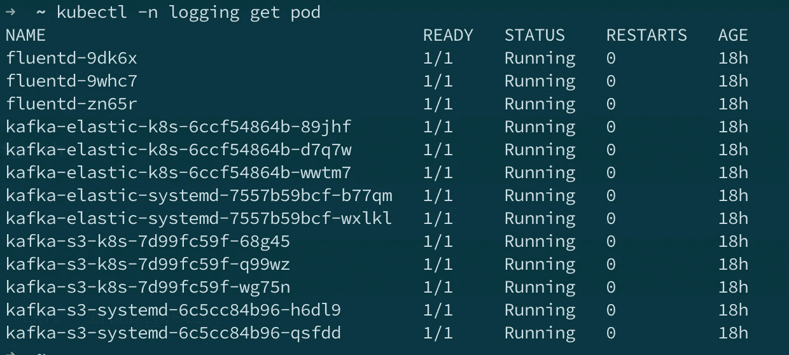
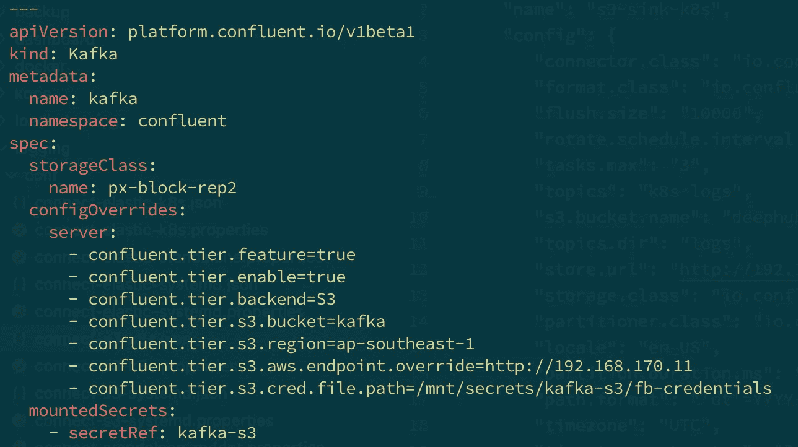
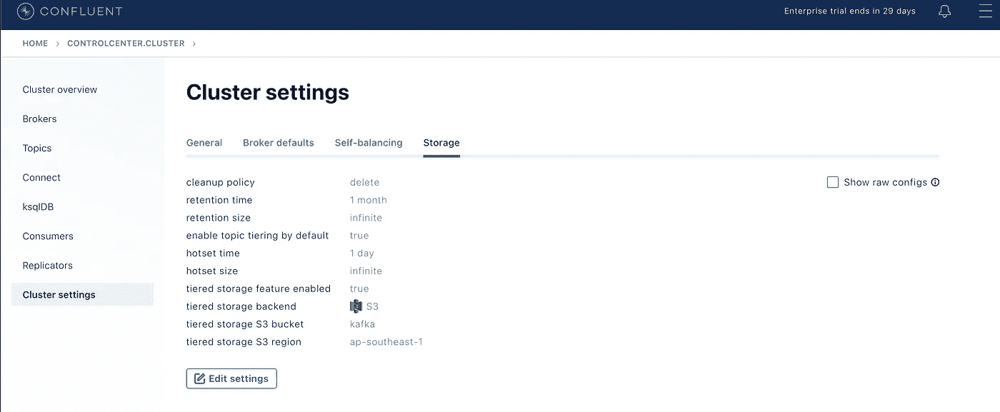
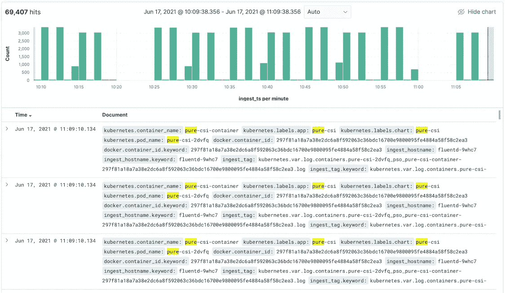
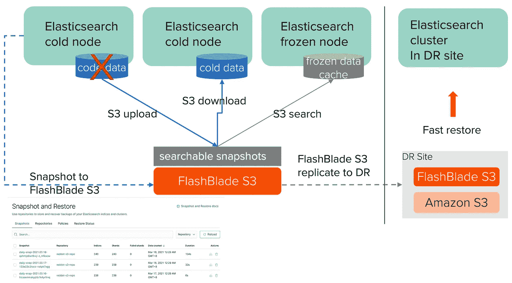
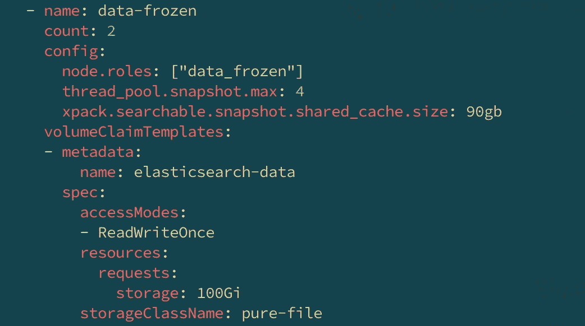
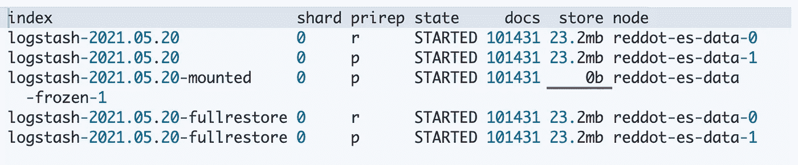
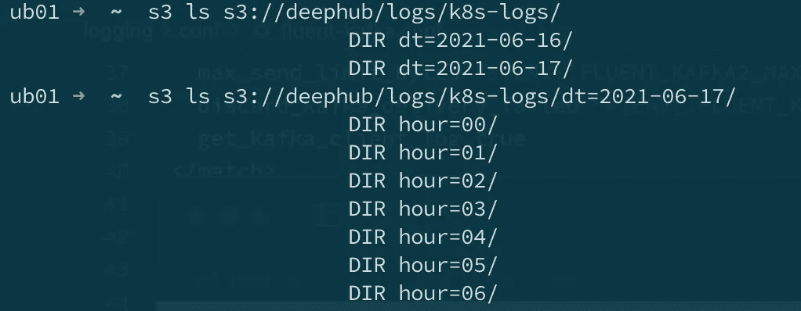
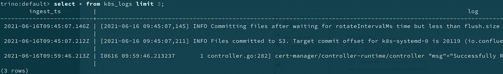

# 可扩展且可靠的 Kubernetes 日志记录

> 原文：<https://towardsdatascience.com/scalable-and-reliable-kubernetes-logging-d47a27b8b04d?source=collection_archive---------22----------------------->

## [理解大数据](https://towardsdatascience.com/tagged/making-sense-of-big-data)

## 使用可伸缩工具和快速对象存储为大型 Kubernetes 集群构建可伸缩的可靠日志记录解决方案。

为 Kubernetes 构建一个基本的日志解决方案可能就像运行几个命令一样简单。然而，为了支持大规模的 Kubernetes 集群，日志解决方案本身需要具有可伸缩性和可靠性。

在我之前的[博客](/kubernetes-monitoring-and-logging-an-apache-spark-example-62e3c8b1224b)中，我描述了我的 Kubernetes 监控和日志记录解决方案的概况。当时，我使用了一个日志记录的基本设置:Fluentd 在 Kubernetes 节点上收集的日志被直接发送到 Elasticsearch 和 Kibana 集群进行搜索和可视化，Fluentd 和 Elasticsearch 都在 Kubernetes 集群上运行。这是一个适用于小型集群的简单设置。一旦我们迁移到大型生产集群，它将面临以下挑战:1) Fluentd 可能会丢失日志(数据丢失！)如果 Elasticsearch 停机或无法跟上对传入日志的索引。2)日志输入和输出紧密耦合，因此难以管理。3)日志仅存储在 Elasticsearch 中，因此很难扩展到其他工具，例如用于一般日志处理和分析的 Apache Spark。

在这篇博客中，我将描述我是如何通过使用 Fluentd、Kafka、Elasticsearch、Spark 和 Trino 等可扩展工具构建一个可扩展且可靠的 Kubernetes 日志解决方案来应对这些挑战的。我还将强调像 FlashBlade S3 这样的快速对象存储在此解决方案中的作用。最终的架构如下图所示。



可伸缩的 Kubernetes 日志记录

# Apache Kafka 作为管道缓冲器和代理

我们首先需要解耦日志输入(Fluentd)和输出(Elasticsearch)。这增加了日志管道的灵活性和可伸缩性。阿帕奇卡夫卡是最受欢迎的解决方案。该设置需要运行 Kafka 集群。请参考[我的博客这里](https://medium.com/swlh/apache-kafka-with-kubernetes-provision-and-performance-81c61d26211c)关于如何在 Kubernetes 上建立一个开源的 Kafka 集群。另一个选择是用[汇合的卡夫卡来代替 Kubernetes](https://docs.confluent.io/operator/current/overview.html) 。融合 Kafka 的一个很好的特性是它对分层存储的支持，这允许 Kafka 将冷数据卸载到远程对象存储，如 FlashBlade S3。稍后将详细介绍。现在，让我们把重点放在 Fluentd 和 Kafka 的整合上。

最简单的入门方法是使用来自[Fluentd Kubernetes Daemonset repo](https://github.com/fluent/fluentd-kubernetes-daemonset)的 Kafka2 插件，其中包括预构建的 Docker 图像和 Kubernetes 规范示例。Fluentd-Kafka2 Docker 镜像使用环境变量支持[基本配置](https://github.com/fluent/fluentd-kubernetes-daemonset/blob/master/docker-image/v1.12/debian-kafka2/conf/fluent.conf)。例如，Kafka 经纪人和主题可以在 Kubernetes 规范文件中设置如下:

```
containers:
- name: fluentd
  image: fluent/fluentd-kubernetes-daemonset:v1.12-debian-kafka2-1
  env:
    - name:  FLUENT_KAFKA2_BROKERS
      value: "kafka-headless.kafka:29092"
    - name:  FLUENT_KAFKA2_DEFAULT_TOPIC
      value: "k8s-logs"
```

因为我需要对 Kafka 生产者确认、时间戳格式和日志源分离进行更多的控制，所以我使用 Kubernetes ConfigMap 扩展了配置文件。之后，日志会根据它们的来源被发送到多个 Kafka 主题中。Fluentd 还附加了其他元数据，如摄取时间戳和源标签。当我们用 Elasticsearch 和 Apache Spark 处理日志时，这些将会很有帮助。

## 将日志从 Kafka 发送到多个输出

为了将日志从 Kafka 发送到其最终输出，在本例中是 Elasticsearch 和 S3 对象存储，我使用了[Kafka Connect](https://www.googleadservices.com/pagead/aclk?sa=L&ai=DChcSEwiA1PSfrp7xAhXHIysKHbNxAAUYABAAGgJzZg&ae=2&ohost=www.google.com&cid=CAESQeD2EZ7-HkNPdNAe9ONXD005um2FY0cMrE0POJSTPOqrP4NFcLKHaX9f_HjSQRrNrbs4bcPw_UAMQU_Bz-nGKSvt&sig=AOD64_3YzYgWYFFUxMyDyswEqzEx3X1_dA&q&adurl&ved=2ahUKEwiB9Oqfrp7xAhWjgUsFHQpDCpwQ0Qx6BAgEEAE&dct=1)elastic search sink 和 S3 sink。Kafka Connect 是一个工具，用于在 Apache Kafka 和其他数据系统之间可扩展和可靠地传输数据。每个连接器都以分布式模式作为自己的 Kafka 消费群运行，这意味着内置了可伸缩性和可靠性。因为日志的输入和输出被 Kafka 解耦了，所以扩展系统并不容易。例如，生态系统中有超过 100 个连接器将数据从 Kafka 传输到不同的输出。

通过将 connector pods 作为 Kubernetes 部署来运行，我们可以轻松地扩展日志记录管道，以适应 Kubernetes 集群的增长。下面是在 Kubernetes 集群中运行的 Fluentd 和 Kafka Connect 的示例。



Fluentd 和 Kafka 连接运行在 Kubernetes

## 融合卡夫卡与 S3 的分层存储

如果使用融合的 Kafka，其分层存储功能，尤其是与 FlashBlade S3 一起，使 Kafka 在 Kubernetes 环境中更加可扩展、可靠和易于操作。基本思想是将冷数据从 Kafka 代理卸载到远程对象存储，这样 Kafka 只需要在代理中管理最少的本地数据(热数据)。这使得 Kafka broker pods 非常轻便，因此更易于扩展和操作。特别是，数据重新平衡可以快几倍。这也降低了存储成本，因为 Kafka 无需在 S3 维护多个数据副本。

以下是使用 Kubernetes 的[汇合](https://docs.confluent.io/operator/current/overview.html)操作符为汇合 Kafka 分层存储设置 FlashBlade S3 的示例:



融合式 Kafka 分层存储，采用 FlashBlade S3 配置

部署后，我们可以确认 FlashBlade S3 已在融合用户界面上配置为分层存储后端。



融合式卡夫卡分层存储，带闪光灯 S3

Kafka 客户端仍然通过 Kafka 访问所有数据。如果一个请求命中冷数据，Kafka 将从远程对象存储器下载它，缓存它并提供给客户机。FlashBlade S3 是受支持的分层存储目标。与亚马逊 S3 和其他对象存储不同，FlashBlade S3 的设计速度非常快，因此即使数据是远程存储的，提供冷数据的速度也可以接近热数据。

# 使用 Elasticsearch、Spark 和 Trino 进行日志分析

大型 Kubernetes 集群每小时或更快地生成数百万个日志条目。分析这些日志本身就是一个大数据问题。Elasticsearch、Apache Spark 和 Trino 是一些最流行的日志分析可扩展工具。

我使用 Elasticsearch 进行流日志分析、搜索和仪表板。使用 Kubernetes 上的[弹性云](https://www.elastic.co/elastic-cloud-kubernetes)，在 Kubernetes 上部署弹性搜索就像几个命令一样简单。



在 Elasticsearch 中搜索 Kubernetes 日志

## 使用 S3 搜索可搜索的快照

与融合的 Kafka 一样，Elasticsearch 也支持将冷数据和冻结数据卸载到远程对象存储。最初，S3 的快照仅支持备份目的，随着最新的 7.13 版本，[快照变得可搜索](https://www.elastic.co/guide/en/elasticsearch/reference/current/searchable-snapshots.html)！



使用 FlashBlade S3 搜索可搜索的快照

通过在本地保留最少的数据，可搜索的快照使弹性搜索更容易操作和扩展，降低存储成本，同时使用 FlashBlade S3 提高冷数据和冻结数据的搜索速度。

可搜索快照最重要的配置是在 Elasticsearch 冻结节点中设置共享缓存存储和大小。在下面的示例中，我将 100GB 闪存阵列支持的持久卷中的 90GB 设置为缓存。



然后，我们可以创建一个可搜索的快照，并将其存储在 FlashBlade S3 存储库中。

```
POST /_snapshot/reddot-s3-repo/demo/_mount?storage=shared_cache
{
  "index": "logstash-2021.05.20",
  "renamed_index": "logstash-2021.05.20-mounted"
}
```

搜索可搜索的快照索引与搜索任何其他索引相同。如果数据在本地不可用，Elasticsearch 将从 S3 下载索引，在本地缓存并从那里提供服务器以备将来请求。

正如您在下面看到的，我已经创建了三个索引:原始的，一个从常规快照完全恢复，另一个从可搜索的快照恢复。可搜索快照的索引使用磁盘上的零字节，表明数据是由 S3 存储库提供的。

```
GET /_cat/shards/logstash-2021.05.20*/?v&h=index,shard,prirep,state,docs,store,node
```



使用磁盘上的零字节对可搜索快照进行索引

## ETL 和 SQL 分析

虽然 Elasticsearch 非常擅长流日志分析，但它并不能满足所有的日志分析需求。例如，我们使用 Apache Spark 和 Trino 进行 ETL 和 SQL 分析。为此，我们首先需要将原始日志存储在 S3。如上所述，我们使用 Kafka Connect S3 接收器将原始 json 格式的日志发送到 S3。我们还按照来源和摄取时间对数据进行分离/分区，以便于处理。日志存储在 S3，如下所示。



存储在 S3 flash blade 的 Kubernetes 日志

一旦日志被存储在 S3 桶中，我就可以使用 Spark 来研究 JupyterLab 笔记本中的数据。


在 JupyterLab 中用 Spark 记录 ETL

我还可以使用 Trino 直接对 json 数据运行 SQL 查询。

```
CREATE TABLE IF NOT EXISTS k8s_logs(
    ingest_ts varchar, 
    log varchar,
    kubernetes ROW(
      container_image_id varchar,
      container_name varchar,
      ...
    ),
    dt varchar,
    hour varchar
)
WITH (
    format='json',
    partitioned_by = ARRAY['dt', 'hour'],
    external_location='s3a://deephub/logs/k8s-logs'
 );
```



使用 Trino 的 SQL 分析

因为所有的工具，包括 JupyterLab、Spark 和 Trino，都运行在 Kubernetes 集群中，所以我可以立即开始这些分析，并轻松扩展。我之前的博客[这里](/apache-spark-with-kubernetes-and-fast-s3-access-27e64eb14e0f)和[这里](https://medium.com/swlh/presto-with-kubernetes-and-s3-deployment-4e262849244a)描述了如何与 Kubernetes 和 S3 一起运行 Spark 和 Trino(前 PrestoSQL)。

# 摘要

在这篇博客中，我描述了如何扩展我的日志解决方案来收集、存储和处理 Kubernetes 集群中生成的大量日志。虽然它是为 Kubernetes 日志记录而构建的，但该解决方案非常灵活，也适用于其他大数据用例。

为了使解决方案具有可伸缩性和可靠性，我们使用的核心工具需要具有可伸缩性和可靠性。云原生趋势(公共云或本地 Kubernetes)鼓励 Kafka 和 Elasticsearch 等传统大数据系统从本地数据复制转向远程对象存储。正因为如此，像 FlashBlade S3 这样的快速对象存储在解决方案中起着重要作用。

扩展日志解决方案变得更加容易。