# 使用 Spark 的可扩展机器学习

> 原文：<https://towardsdatascience.com/scalable-machine-learning-with-spark-807825699476?source=collection_archive---------12----------------------->

## *分布式算法、Map-Reduce 范式、在单机上使用 Spark MLlib 的可扩展 ML、带有 Docker 的 AWS EMR 集群& Nvidia RAPIDS。*

自 21 世纪初以来，由于谷歌、网飞、Youtube、亚马逊、脸书等互联网巨头的出现，收集的数据量大幅增加。临近 **2010** ，当**手机**大受欢迎时，另一个“数据浪潮”已经到来。到 2020 年，我们预计当**物联网设备**变得无孔不入时，数据将会再次呈指数级增长。在这种背景下，构建可扩展的系统成为机器学习解决方案的必要条件。


Spark 中的机器学习:从零到英雄版

任何解决方案都主要取决于这两种类型的任务:

**a)计算量大:**在 2000 年之前，被称为“超级计算机”的并行处理箱在计算量大的任务中很流行。在 2005 年之前，像 **MPI 和 PVM 这样的并行处理库在计算繁重任务**中很流行，TensorFlow 就是基于这种并行处理库设计的。

**b)数据量大:**基于关系代数的数据库是在 20 世纪 70 年代设计的，当时硬盘存储非常昂贵。因此，该设计的**目的是通过将较大的表格分成较小的表格，并使用关系(**规范化)将它们链接起来，从而减少数据冗余**。**

因此，传统的数据库如 mySQL、PostgreSQL、Oracle 等。不是为扩展而设计的，尤其是在上面提到的数据爆炸的环境中。因此，NoSQL 数据库是为满足不同情况而设计的:

1.  用于存储文本文档
2.  **Redis，Memcache:** 用于快速键值查找的分布式哈希表
3.  **弹性搜索:**搜索文本文档
4.  **HBase 和 Cassandra:** 柱状商店
5.  **Neo4j 和 Grakn:** 图形数据库。

然而，大型数据集上的机器学习和深度学习解决方案是**计算密集型和数据密集型**。因此，为了制造可扩展的 AI/ML 解决方案，解决方案必须同时满足这两种需求。

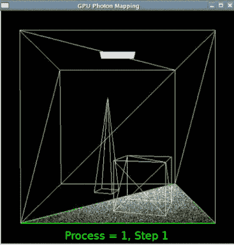

图一。作者使用 MPI 并行实现光子映射

2004 年， *Jeff Dean 等人*发表了开创性的 MapReduce 论文来处理数据繁重的任务[2]。2006 年， **Hadoop 实现了 MapReduce** 并设计了一个名为 **HDFS** 的分布式文件系统，将单个大文件拆分存储在多台电脑的磁盘中。这个想法是将巨大的数据库分散在多个主板的硬盘上，每个主板都有独立的 CPU、RAM、硬盘等，通过一个快速局域网互连。

然而， **Hadoop 将所有中间数据存储到磁盘**，因为它是在 2000 年代设计的，当时硬盘价格暴跌，而 RAM 价格仍然很高。在 2010 年，当 RAM 价格下降时， **Spark** 诞生了一个大的设计变化**将所有中间数据存储到 RAM，而不是磁盘。**

火花对双方都有好处，

**i)数据密集型任务:**因为它使用 HDFS &

**ii)计算繁重的任务:**因为它使用 RAM 而不是磁盘来存储中间输出。**例如:**迭代求解

由于 Spark 可以利用 RAM，它**成为机器学习**中迭代任务的有效解决方案，如随机梯度下降( **SGD** )。所以是这个原因， **Spark MLlib** 变得如此受机器学习欢迎，与 Hadoop 的 Mahout 形成对比。

此外，要使用 TF 进行分布式深度学习，您可以使用，

1.  多个 GPU 在**同一个盒子上** *(或)*
2.  **不同机箱**上的多个 GPU(GPU 集群)

虽然今天的超级计算机使用 **GPU 集群来执行计算密集型任务**，但您可以在这样的集群中安装 Spark，使其适用于分布式深度学习**等任务，这些任务都是计算和数据密集型的**。

# Hadoop 和 Spark 简介

Hadoop 中主要有两个组件，

1.  **Hadoop 分布式文件系统(HDFS):** 一个容错的分布式文件系统，Hadoop 和 Spark 都使用。HDFS 支持将一个大文件分割成“n”个块，保存在“n”个节点中。当访问文件时，必须通过 LAN 跨节点访问不同的数据块。
2.  **Map-Reduce:** 给定一个跨大量数据、分布在多个节点上的任务，必须进行大量的数据传输，并且需要分布处理。让我们详细研究一下这个问题。

# **地图简化范例**

考虑在 900 GB 的大型分布式文件中查找词频的任务。HDFS 将支持将大文件拆分为 3 个区块，分别位于 P1、P2 和 P3，每个区块 300 GB，并在 3 个节点中各保留一个。

任何 Hadoop 代码都会有 **3 个阶段:**

1.  **Map** : Mapper 函数会通过数据，存储在各个节点的磁盘中，并递增输出字典中的字数。它将在每个分布式机器上独立执行**。**

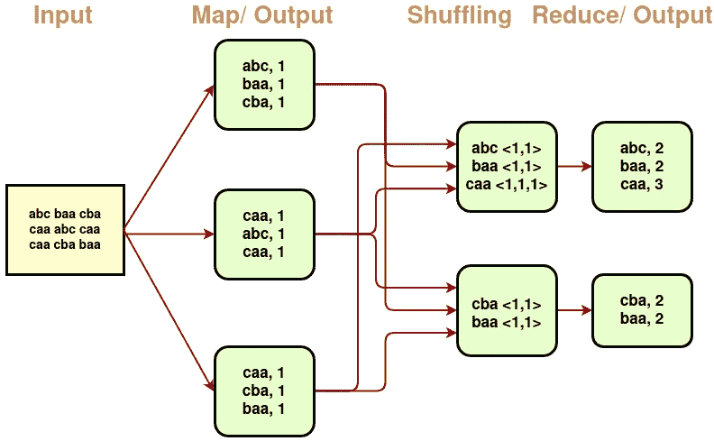

图二。字数统计图-简化工作流程(图片由作者提供)

**2。Shuffle:** Hadoop 自动在局域网内移动数据，这样相同的键就被组合在一个盒子里。

**3。Reduce:** 一个函数，它将使用字典并将相同关键字的值相加(以计算总数)。

要在 Hadoop 中实现一个函数，只需要编写 Map & Reduce 函数。请注意，Hadoop 中的每个 Map-Reduce 操作之间都有**磁盘 I/O。然而，几乎所有的 ML 算法都是迭代工作的。SGD[下面的等式]中的每个迭代步骤对应于一个 Map-Reduce 操作。*在每个迭代步骤之后，中间权重将被写入磁盘*，占总收敛时间的 90%。**

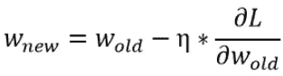

**等式**:ML&DL 迭代中的权重更新公式

作为解决方案， **Spark** 诞生于 2013 年即**将磁盘 I/O 操作替换为内存操作。**借助**Mesos——分布式系统内核**——**Spark 缓存每次迭代后的中间数据集。因为每次迭代的输出都存储在 RDD 中，所以只需要一次磁盘读写操作就可以完成 SGD 的所有迭代。**

**Spark 建立在**弹性分布式数据集(RDD)之上，**存储在主内存中的容错不可变分布式数据集集合。在 RDD **之上，DataFrame API** 被设计为抽象掉它的复杂性，并简化在 Spark 上进行机器学习。**

**RDDs 支持**两种类型的操作:****

1.  *****转换:*** 从现有数据集创建新的数据集
    **映射:**通过*函数*
    **reduce by key:**使用*函数*
    **过滤器:**仅选择那些使用*函数的元素***
2.  *****动作:*** 对数据集运行计算后返回值
    **减少:**使用某个*函数*
    **收集:**返回输出数据集的所有元素
    **SaveAsTextFile:**将数据集的元素作为文本文件写入。**

***Spark 中的所有转换都是惰性的，*也就是说，它们只在“动作”需要结果时才被计算。在下面的代码中，由于懒惰，没有立即计算*行长度*。只有当“reduce”运行时，Spark 才会将计算分解为在不同机器上运行的任务，以计算总长度。**

```
lines = sc.textFile("data.txt")
lineLengths = lines.map(lambda s: len(s))
totalLength = lineLengths.reduce(lambda a, b: a + b)
```

**下面是一个简单的数据转换示例，用于计算存储在 3 个分区的**分布式 RDD 中的键的出现次数:****

**计算字母“a”和“b”的出现次数**

# **作为 Map 简化逻辑回归**

**SGD 迭代中最昂贵的操作是跨越所有数据点的梯度操作*[公式。*【以上】。如果数据集很大，比如说“n”亿个数据点，那么我们可以将梯度计算分布在“k”个不同的盒子中。**

*   ****贴图阶段:**每个盒子将计算 *n* /k 个亿点的梯度**
*   ****简化阶段:**使用相同的键对每个框中的部分总和求和**
*   **所有点的损失梯度= ∑部分和**
*   **因此，很容易计算 w_new 并存储在每个节点的存储器中**

**这就是你如何分发任何基于优化的 ML 算法。然而，对于分布式 LR 实现，请参见 Hadoop 与 Spark 的性能比较。**

**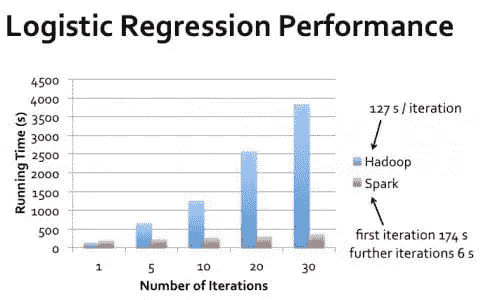**

**图三。运行时间对比:Hadoop vs Spark [3]**

**由于 Spark RDDs 允许在内存中执行多种映射操作，因此不需要将临时数据集写入磁盘，因此速度提高了 100 倍。注意，**第一次**迭代花费的时间几乎相同，因为 Hadoop 和 Spark 都必须从磁盘读取。但是**在后续的迭代中，Spark 的内存读取只需要 6 秒，而 Hadoop 的磁盘读取需要 127 秒**。**

**此外，一个 ML 科学家不需要编码映射和简化函数。大多数 ML 算法包含在 **Spark MLlib** 中，所有数据预处理都是使用 **Spark SQL** 完成的。**

# **火花安装和设置**

**您可以在其中任何一个中设置 Spark，**

1.  **您的本地机顶盒(或)**
2.  **使用 AWS EMR 或 Azure Databricks 的托管集群**

**下面我们将看到两种方式。首先，在完成 Spark 本地系统设置之后，我们将在您的个人机器上运行一些普通的并行任务。然后我们会拿一个更复杂的 ML 项目，在 Spark Docker、AWS EMR & Spark Rapids 中运行。**

## **Spark:本地系统设置**

1.  ***docker pull jupyter/pyspark-notebook***
2.  **docker run-it-p 8888:8888 jupyter/pyspark-notebook**
3.  **单击带有 Auth-Token 的链接或转到 [http://localhost:8888/](http://localhost:8888/) 并复制粘贴令牌**
4.  **现在，您可以在 Jupyter 或终端中执行 Spark 代码。要在 docker 中执行，只需运行***spark-submit pi-code . py*****

## **任务 1:估计圆周率(π)的值**

**取一个单位圆，考虑一个外接该圆的正方形。**

*   **单位正方形的面积= 1**
*   **因为是单位圆，所以圆的面积= π**
*   **四分之一圆弧的面积= π/4**
*   **因此，π = 4 *四分之一圆弧的面积**

**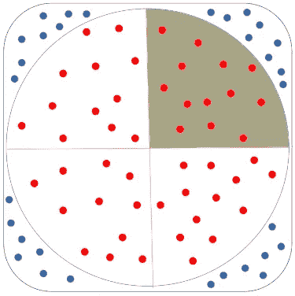**

**图 4。圆的面积=红色点数/总点数。(图片由作者提供)**

**四分之一圆弧的面积可以通过下式计算:**

1.  ****数值方法:**使用积分**
2.  ****蒙特卡罗方法**:使用随机抽样寻找答案**

**在蒙特卡罗方法中，**

*   **取(x，y)点的*均匀分布*从 0 到 1(即正方形内)**
*   **四分之一区域的面积= **%圆内的点，**即𝑥+𝑦<1
    eg:在 1000 个随机点中，如果“k”个点在圆内，那么阴影区域的面积= k/1000**

**这些操作**是可并行化的**,因为为了检查一个点是否落在圆内，节点之间没有依赖性。在 pyspark 代码下面，一旦在 spark 本地设置上运行，*将输出更接近π=3.14 的值，因为我们增加了随机点数* (NUM_SAMPLES)**

*   **随机函数将生成一个 0 到 1 之间的数字。**
*   **“inside”函数运行一百万次，只有当随机点在圆内时才返回“True”。**
*   **sc.parallelize()将创建一个分解为 k=10 个实例的 RDD。**
*   **过滤器将应用传递的函数。**

## **任务 2:计算字数**

**要在大型分布式文件中查找词频，只需将下面代码中的本地文件路径替换为 HDFS 文件路径。**

**map 函数将创建一个列表列表& flatMap 将列表合并成一个列表。**

## **任务 3:数据预处理**

**大多数数据预处理可以通过 DataFrame API 使用 Spark SQL 来完成。在 Spark 数据帧上执行的 Spark SQL 查询将在 Spark 中执行之前转换为 Map 和 Reduce ops。**

# **Spark MLLib 和 ML 管道简介**

**Spark MLLib 是一个受 sklearn 启发的库，它包含了**流行 ML 算法**的**分布式**实现。与 sklearn 的主要区别是使用 sc.parallelize()函数将数据拆分到多个框中。**

**将磁盘上的原始数据转换成最终模型所需的所有步骤称为 ML 管道。Pipeline()依次包含*输入和输出级。*例如，*记号赋予器* → *计数矢量化器* → *逻辑回归*流水线序列可以编码为:**

**因此，训练数据首先被馈入 tokenizer，然后馈入 CV，然后馈入 LR。若要测试模型，请调用 model.transform()。您还可以进行**分布式超参数调整，**即在具有不同超参数的多个机器上运行相同的架构。然而，将一个大模型分布存储和训练在不同盒子中的 GPU 的 VRAM 中是稍微复杂的。**

# **Spark 中的 ML 算法:自定义实现**

**只有当一个算法可以被分成独立的子任务时，它才可以被并行化。具体来说，**双字节排序**可以并行，因为操作序列**与数据无关，**与合并排序无关。类似地，一些 ML 算法是平凡的可并行化的，而另一些则不是。**

****a)琐碎并行:**以**KNN**(k-最近邻)为例。**

*   **将数据集 D 分成“n”个盒子。**例如** : 40K 分 4 盒**
*   **从每个框中的每个 10K 点中找出前 k 个最近的点**
*   **将所有 4k 个点转移到 1 个盒子中，并找到前 k 个最近的点。**

****b)非平凡的平行:**以 GBDT 为例。在 **GBDT** 中的每一棵决策树都是基于先前决策树的剩余部分构建的。因此，训练 **GBDT 本质上是一个顺序操作，而不是并行的。****

**然而，我们可以并行构建每个决策树，因为用于左右子树的数据集是独立的。因此，xgboost 在树级并行化，即左右子树在 2 个节点上独立训练。**

# **基于随机森林的时间序列预测**

**让我们在独立、Spark 本地&集群模式下解决一个 ML 问题**。****

****问题陈述:**从 1990 ~ 2020 年代记录一个地点的每日*气温、风、降雨和湿度*。鉴于这些特征，**建立时间序列模型预测 2021 年的湿度。**为了验证模型，使用 2020Q4 湿度值进行比较，使用公制。**

**下面实验的**完整源代码**可以在 [**这里**](https://github.com/AdroitAnandAI/Scalable-ML-with-Spark) **找到。****

**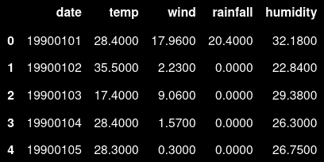**

***图五。输入数据集特征***

**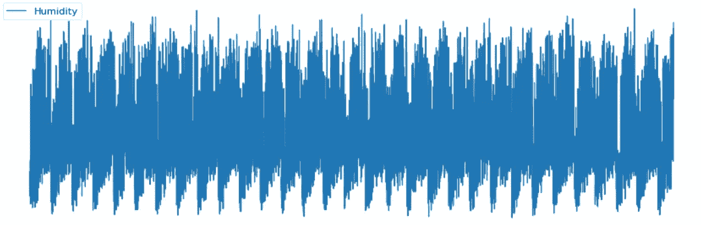**

***图六。*湿度值的时间序列性质清晰可见**

**首先，转换数据以获得对预测湿度有用的新特征。**

**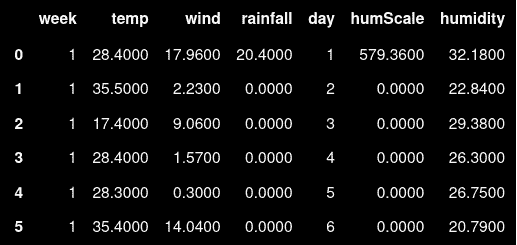**

**图 7。新功能:日、周和规模=温度*降雨量**

## **A.独立实现**

**现在我们可以用上述特征训练 sklearn 的随机森林回归器。**

**预测湿度值和实际湿度值过于接近(如下图所示)**

****

**图 8。2020Q4 湿度:蓝红线表示实际和预测湿度(独立)**

## **B.Spark 本地实施**

**首先，你需要做上面提到的 **Spark 本地系统设置**步骤。然后，你可以用 PySpark 的 RandomForestRegressor 做上面同样的事情。**

**要在 Spark MLlib 中为机器学习模型提供功能，您需要使用 Spark ML 库中的 VectorAssembler 模块将多个列合并为一个向量列。**

**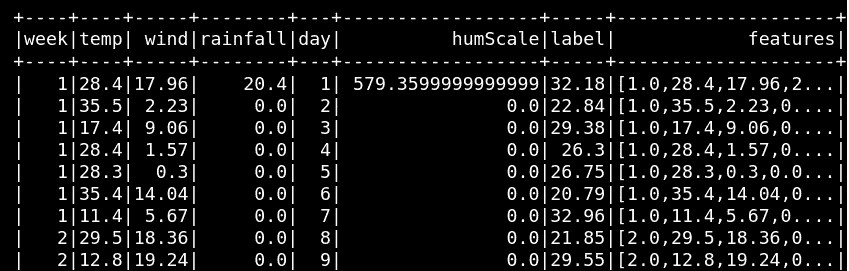**

**图九。使用 VectorAssembler 组合特征**

**然后，您可以运行类似于独立解决方案的训练和测试模块。**

**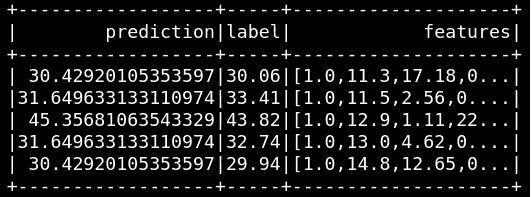**

**图 10。预测回归值(湿度)**

**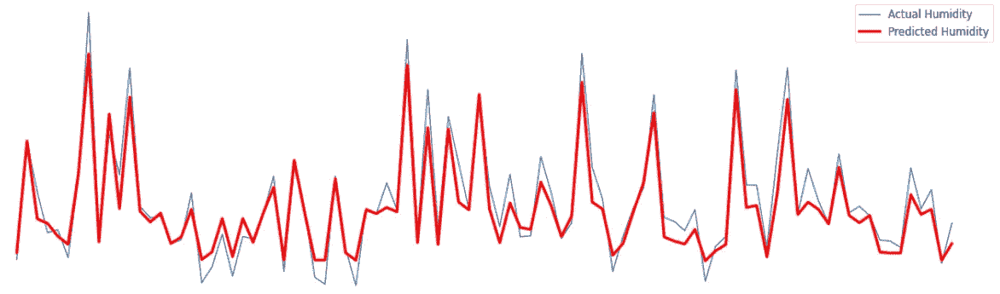**

**图 11。2020Q4 湿度:实际和预测(局部火花)**

**PySpark 中的分布式随机森林回归器实现似乎也遵循这一趋势，尽管均方误差值稍高一些。即便如此，在 64G RAM 的四核系统上，spark 本地实现的运行时间还是快了*3 倍。***

**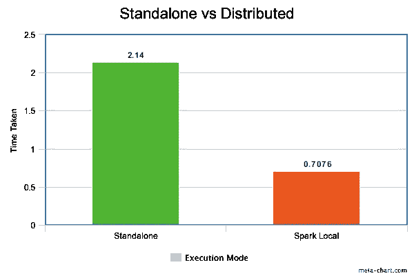**

**图 12。独立:2.14 秒。Spark Local: 0.71 秒用于随机森林回归训练**

## **C.火花簇:AWS 弹性贴图 Reduce + Docker**

**为了获得计算和数据规模的双重优势，上述解决方案需要跨多个机器部署。然而，使用本地机器用 Spark 设置集群是很耗时的。**

**相反，您可以使用 Amazon EMR 创建一个集群，负载运行在 Amazon EC2 实例上。亚马逊 EMR 是一个托管集群平台，简化了运行大数据框架，如 Apache Hadoop 和 Spark。**

**从 Amazon EMR 6.0.0 开始，您可以使用 *Docker 容器来处理库依赖关系*，而不是将其安装在每个 EC2 集群实例上。但是您需要在 AWS EMR 中的“集群创建”期间配置 Docker 注册表并定义附加参数。**

1.  ****创建一个 docker 图像(或修改一个 Docker 图像)****

**创建一个目录和一个 requirements.txt 文件。requirements.txt 文件应该包含 Spark 应用程序所需的所有依赖项。**

```
mkdir pyspark
vi pyspark/requirements.txt
vi pyspark/Dockerfile**Sample requirements.txt:**

python-dateutil==2.8.1
scikit-image==0.18.1
statsmodels==0.12.2
scikit-learn==0.23.2
```

**在目录中创建一个 Dockerfile 文件，包含以下内容。安装了特定的 numpy 版本，以从 EMR 笔记本确认 docker 执行。**

```
**FROM amazoncorretto:8**RUN yum -y update
RUN yum -y install yum-utils
RUN yum -y groupinstall developmentRUN yum list python3*
RUN yum -y install python3 python3-dev python3-pip python3-virtualenv python-devRUN python -V
RUN python3 -VENV PYSPARK_DRIVER_PYTHON python3
ENV PYSPARK_PYTHON python3RUN pip3 install --upgrade pip
RUN pip3 install 'numpy==1.17.5'RUN python3 -c "import numpy as np"**WORKDIR /app****COPY requirements.txt requirements.txt**
**RUN pip3 install -r requirements.txt**
```

**使用以下命令构建 docker 映像。**

****2。创建 ECR 存储库。**标记并将本地构建的图像上传至 ECR。**

```
**sudo docker build** -t local/pyspark-example pyspark/
**aws ecr create-repository** --repository-name emr-docker-examples**sudo docker tag** local/pyspark-example 123456789123.dkr.ecr.us-east-1.amazonaws.com/emr-docker-examples:pyspark-example**sudo aws ecr get-login** --region us-east-1 --no-include-email | **sudo docker login** -u AWS -p <password> https://123456789123.dkr.ecr.us-east-1.amazonaws.com**sudo docker push** 123456789123.dkr.ecr.us-east-1.amazonaws.com/emr-docker-examples:pyspark-example
```

**也可以上传到 Docker Hub，给*' Docker . io/account/Docker-name:tag '*代替上面的 AWS ECR 图像 URI。**

****3。在 EMR 中创建带火花的集群****

**打开亚马逊电子病历控制台*(参考* [*此处*](https://docs.aws.amazon.com/emr/latest/ReleaseGuide/emr-spark-launch.html) *)***

**点击“进入高级选项”而不是“快速选项”来启用，**

*   ****Jupyter 企业网关:**代表远程笔记本帮助启动内核的网络服务器。**
*   **[**JupyterHub**](https://jupyterhub.readthedocs.io/en/latest/) :托管 Jupyter 笔记本服务器的多个实例。**
*   ****Apache Livy:** 支持通过 REST 接口与 Spark 集群交互的服务。**

**根据所需的并行度，选择每种节点类型的**的节点数量****

*   ****主节点:**通过协调其他节点之间的数据和任务分配来管理集群**
*   ****核心节点:**在 HDFS 运行任务和存储数据(多节点至少一个)**
*   ****任务节点:**只运行任务&不在 HDFS 存储数据(可选)**

**因此，核心节点增加了数据和计算并行性，而任务节点仅增加了计算并行性。**

**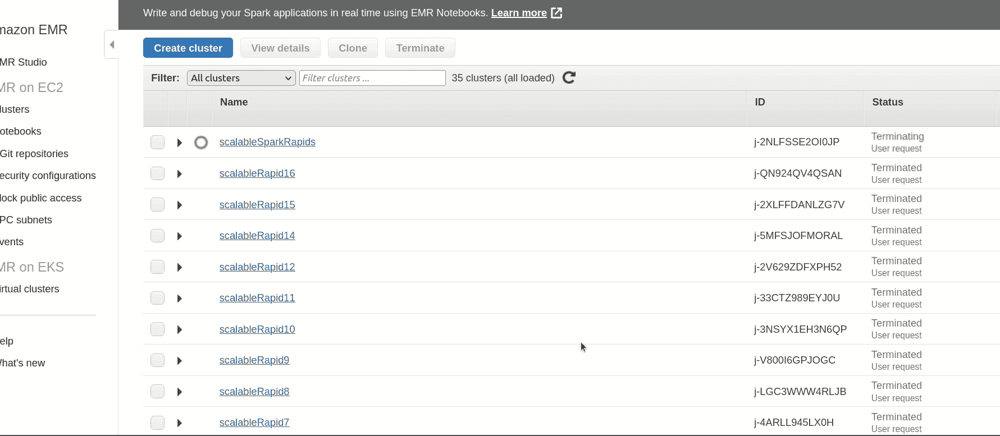**

**图 13。如何使用 AWS EMR 创建 Spark 集群**

****4。进入“软件设置”下的*配置*****

**为了避免 userid 错误，请在下面的 JSON 中设置“livy.impersonation”**

```
[
  {
    "Classification": "container-executor",
    "Configurations": [
        {
            "Classification": "**docker**",
            "Properties": {
                "docker.trusted.registries": "local,centos,**123456789123.dkr.ecr.us-east-1.amazonaws.com"**,
                "docker.privileged-containers.registries": "local,centos,**123456789123.dkr.ecr.us-east-1.amazonaws.com**"
            }
        },
    ]
  },
  {
      "Classification":**"livy-conf"**,
      "Properties":{
         **"livy.impersonation.enabled": "true"**,
         "livy.spark.master":"yarn",
         "livy.spark.deploy-mode":"cluster",
         "livy.server.session.timeout":"16h"
      }
   },
   {
    "Classification": "core-site",
    "Properties": {
      "hadoop.proxyuser.livy.groups": "*",
      "hadoop.proxyuser.livy.hosts": "*"
    }
   },
   {
      "Classification":"hive-site",
      "Properties":{
         "hive.execution.mode":"container"
      }
   },
   {
      "Classification":**"spark-defaults"**,
      "Properties":{
         "spark.executorEnv.YARN_CONTAINER_RUNTIME_TYPE":"**docker**",
         "spark.yarn.am.waitTime":"300s",
         "spark.yarn.appMasterEnv.YARN_CONTAINER_RUNTIME_TYPE":"**docker**",
         "spark.executorEnv.YARN_CONTAINER_RUNTIME_DOCKER_CLIENT_CONFIG":**"hdfs:///user/hadoop/config.json"**,
         "spark.executorEnv.YARN_CONTAINER_RUNTIME_DOCKER_IMAGE":**"123456789123.dkr.ecr.us-east-1.amazonaws.com/scalableml:s3spark"**,"spark.executor.instances":"2",
         "spark.yarn.appMasterEnv.YARN_CONTAINER_RUNTIME_DOCKER_CLIENT_CONFIG":**"hdfs:///user/hadoop/config.json"**,
         "spark.yarn.appMasterEnv.YARN_CONTAINER_RUNTIME_DOCKER_IMAGE":**"123456789123.dkr.ecr.us-east-1.amazonaws.com/scalableml:s3spark"**
      }
   }
]
```

****5。从纱线启用 ECR 访问****

**为了使 YARN 能够从 ECR 访问图像，我们设置了容器环境变量 YARN _ CONTAINER _ RUNTIME _ DOCKER _ CLIENT _ CONFIG。**

**但是，我们需要生成 config.json 并放入 HDFS，以便它可以被集群上运行的作业使用。为此，登录到一个核心节点并执行以下命令。**

```
**ssh -i permission.pem** [**hadoop@**ec2-1-23-45-678.compute-1.amazonaws.com](mailto:hadoop@ec2-3-83-46-34.compute-1.amazonaws.com)**aws ecr get-login-password** --region us-east-1 | sudo docker login --username AWS --password-stdin 123456789123.dkr.ecr.us-east-1.amazonaws.com**mkdir -p ~/.docker**
**sudo cp** /root/.docker/config.json ~/.docker/config.json
**sudo chmod** 644 ~/.docker/config.json**hadoop fs -put** ~/.docker/config.json /user/hadoop/
```

**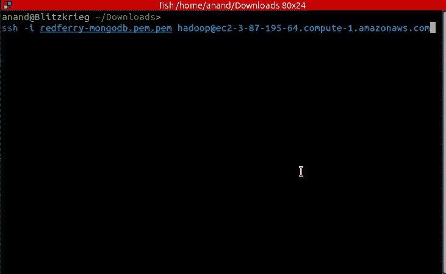**

**图 14。让 ECR 接触纱线**

****6。EMR 笔记本和配置****

**您可以创建 jupyter 笔记本，并连接到运行 Hadoop、Spark 和 Livy 的 Amazon EMR 集群。EMR 笔记本独立于集群保存在 AWS S3 中。**

*   **点击亚马逊电子病历控制台上的“笔记本”和“创建笔记本”**
*   **选择运行笔记本的群集**
*   **在 Jupyter 笔记本中，**给出下面的配置作为第一个单元格。****

```
**%%configure -f**
{"conf": 
 { 
     "spark.pyspark.virtualenv.enabled": "false",
     "spark.yarn.appMasterEnv.YARN_CONTAINER_RUNTIME_TYPE":"**docker**",
     "spark.executorEnv.YARN_CONTAINER_RUNTIME_DOCKER_CLIENT_CONFIG":"**hdfs:///user/hadoop/config.json**",
     "spark.executorEnv.YARN_CONTAINER_RUNTIME_DOCKER_IMAGE":"**123456789123.dkr.ecr.us-east-1.amazonaws.com/scalableml:s3spark**",
     "spark.executor.instances":"2",
     "spark.yarn.appMasterEnv.YARN_CONTAINER_RUNTIME_DOCKER_CLIENT_CONFIG":"**hdfs:///user/hadoop/config.json**",
     "spark.yarn.appMasterEnv.YARN_CONTAINER_RUNTIME_DOCKER_IMAGE":"**123456789123.dkr.ecr.us-east-1.amazonaws.com/scalableml:s3spark**"
 }
}
```

*   **因此，您可以在 EMR 笔记本中使用*笔记本范围的 docker* 来解决依赖性。现在您可以在后续单元格中执行 PySpark 代码。**

```
from pyspark.sql import SparkSession
spark = SparkSession.builder.appName("docker-numpy").getOrCreate()
sc = spark.sparkContext

import numpy as np
**print(np.__version__)**
```

**理想情况下，如果上面的代码在构建的 docker 中运行，您应该看到 1.17.5 的 numpy 版本。如果没有，您需要找到 S3 集群日志路径。**

*   **您可以使用上面的 Spark 独立代码，只是输入数据应该从 S3 读取，如下所示，并转换为 RDD。**

**如下图所示，随着 EMR 集群中节点数量的增加，RandomForest 训练工作负载所用的时间稳步减少。**节点间通信的基本开销将保持不变，即使是小数据集。** *因此，当训练数据集变大时，图形会下降得更陡。***

**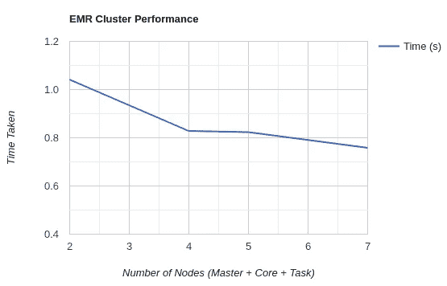**

**图 15。不同集群规模的 EMR 集群性能**

**或者，在*通过 SSH 连接到* ***主节点*** *之后，您可以使用 **spark-submit** 命令在集群中执行 PySpark 代码。***

*   **设置*DOCKER _ IMAGE _ NAME&DOCKER _ CLIENT _ CONFIG*env 变量**
*   **执行。带有 **spark 的 py 文件-提交** &部署模式为“集群”**
*   **您可以从 S3 读取输入并写出输出，如下所示。**

**但是，通过运行在 Spark 集群上的 Notebook 提交 Spark 作业更方便，同时 docker 可以解析所有集群节点中的依赖关系。**

## **D.GPU 集群:AWS EMR + Spark RAPIDs**

**您可以使用“Nvidia Spark-RAPIDS plugin for Spark”来加速使用连接到 EC2 节点的 GPU 的 ML 管道。核心和任务实例组必须使用 EC2 [GPU 实例类型](https://docs.aws.amazon.com/emr/latest/ManagementGuide/emr-supported-instance-types.html)，而主节点可以是非 ARM 非 GPU。**

**Spark RAPID 将加速数据处理和模型训练**，而无需任何代码更改**。要创建 GPU 加速集群，您可以遵循 C 节中的步骤，但要做以下更改:**

1.  **在这里 使用**步骤 5** [**给出的 JSON，而不是 C 节中的 config**](https://docs.aws.amazon.com/emr/latest/ReleaseGuide/emr-spark-rapids.html)**
2.  **保存**自举**脚本给 [**此处**](https://docs.aws.amazon.com/emr/latest/ReleaseGuide/emr-spark-rapids.html) 在 S3 为*my-bootsap-action . sh***
3.  **将步骤 2 中的 S3 文件路径作为引导脚本(在 GPU 上使用 YARN)**
4.  **到主节点的 SSH 并安装依赖项。要执行时序项目，请执行下面的命令。**

```
pip3 install sklearn statsmodels seaborn matplotlib pandas boto3
```

**不需要更改代码。下面是 Spark-RAPIDS 集群上的随机森林回归训练的时间比较，该集群由 1 个 m 5.2 x 大型主节点和 2 个 g4dn . 4x 大型核心节点组成，具有其他执行模式。**

**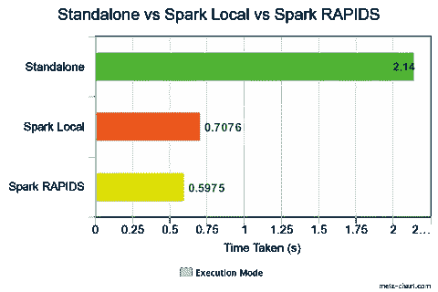**

**图 16。时间比较:独立 vs Spark 本地 vs RAPIDS**

**然而，在上面的例子中，由于数据集很小，所以速度提高不多。让我们对前面的“字母表计数”代码做一个修改，以比较 Spark Local 和 Spark RAPIDS 之间的时间统计。下面的代码**生成 100M 个随机**字符串和计数元组，以馈入分布式计数操作。**

**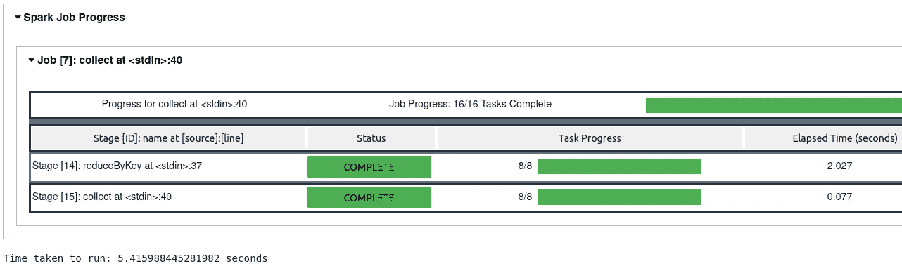**

**图 17。AWS EMR 笔记本中的 Spark 作业进度报告**

**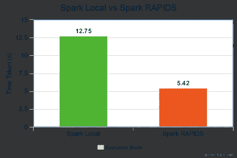**

**图 18。时间比较:火花本地 vs 火花急流**

# **结束语**

**为博客的长度道歉。如果您已经读到这里，您应该考虑用一些分布式编码来弄脏您的手。本文为您提供了 Spark 的历史和逻辑背景，以及在 Local、AWS EMR 和 Spark Rapids 上的多个示例实现。如果它激励你进一步探索，那么它就达到了它的目的。**

**以上实验的**完整源代码**可以在 [**这里**](https://github.com/AdroitAnandAI/Scalable-ML-with-Spark) **找到。****

*****如有任何疑问或建议，可在此*** 联系我[](https://www.linkedin.com/in/ananduthaman/)**

# ***参考***

***[1][www.appliedaicourse.com](http://www.appliedaicourse.com)***

***[2]迪安、杰弗里和桑杰·格玛瓦特。*“MapReduce:大型集群上的简化数据处理。”* *美国计算机学会通讯* 51.1 (2008)***

***[3]巴加瓦蒂、阿伦库马尔&察切娃、安吉丽娜。(2017).*分布式环境中基于规则的系统:调查。* 10.11159/cca17.107***

***[4] **PySpark 文档:**[https://spark.apache.org/docs/latest/api/python/index.html](https://spark.apache.org/docs/latest/api/python/index.html)***

***[5] **火花 MLLib:**[https://spark.apache.org/docs/1.2.1/mllib-guide.html](https://spark.apache.org/docs/1.2.1/mllib-guide.html)***

***[6]**Spark SQL:**[https://Spark . Apache . org/docs/2 . 2 . 0/SQL-programming-guide . html # SQL](https://spark.apache.org/docs/2.2.0/sql-programming-guide.html#sql)***

***【7】**AWS EMR:**[https://docs . AWS . Amazon . com/EMR/latest/release guide/EMR-spark-docker . html](https://docs.aws.amazon.com/emr/latest/ReleaseGuide/emr-spark-docker.html)***

***[8]**AWS EMR with Docker:**[https://AWS . Amazon . com/blogs/big-data/simplify-your-spark-dependency-management-with-Docker-in-EMR-6-0-0/](https://aws.amazon.com/blogs/big-data/simplify-your-spark-dependency-management-with-docker-in-emr-6-0-0/)***

***[9] **GPU 集群(Spark-Rapids):**[https://docs . AWS . Amazon . com/EMR/latest/release guide/EMR-Spark-Rapids . html](https://docs.aws.amazon.com/emr/latest/ReleaseGuide/emr-spark-rapids.html)***