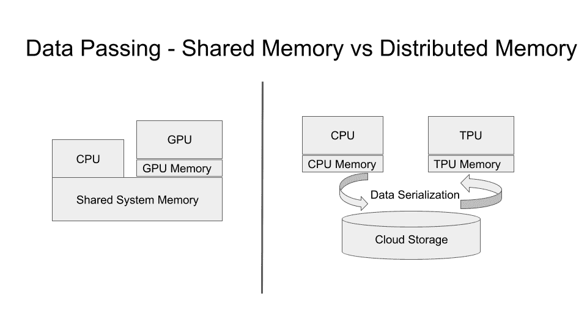
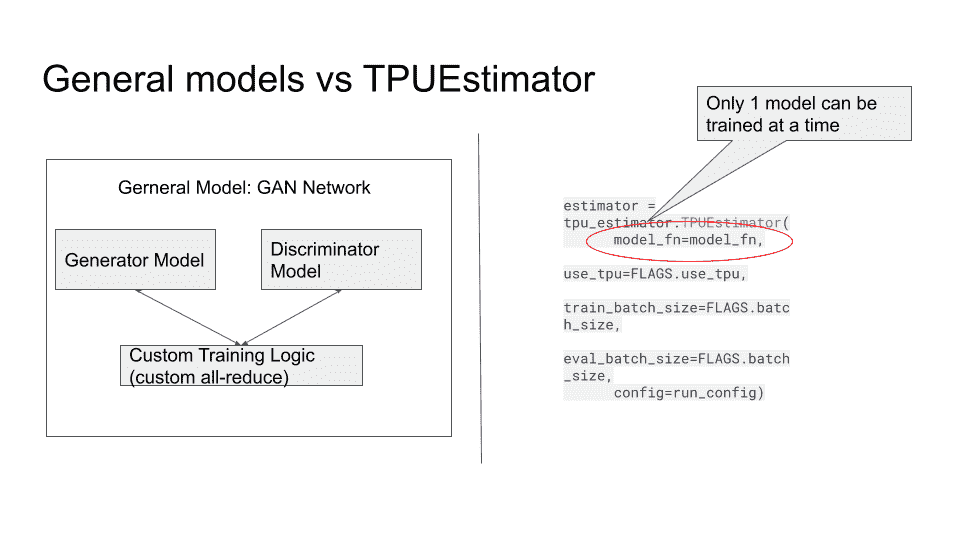
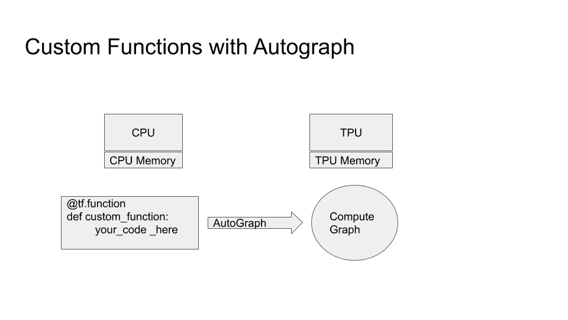
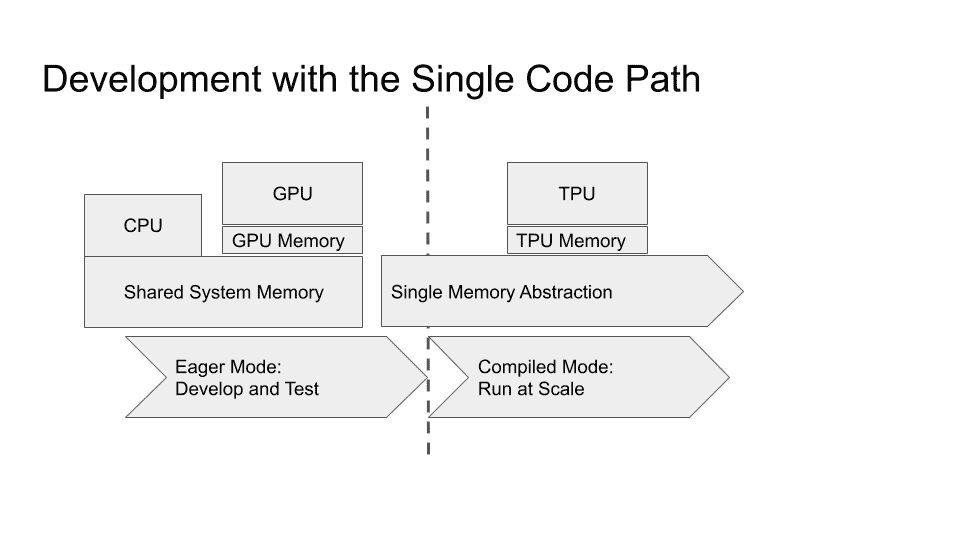

# 使用 Tensorflow 2 的可扩展机器学习。X

> 原文：<https://towardsdatascience.com/scalable-machine-learning-with-tensorflow-2-x-a9aab8a2139d?source=collection_archive---------46----------------------->

## [理解大数据](https://towardsdatascience.com/tagged/making-sense-of-big-data)

## 使用 Tensorflow 2 在一台或多台机器上进行大规模 ML 训练，无需更改代码。x 特征

由 [Charles Deluvio](https://unsplash.com/@charlesdeluvio?utm_source=medium&utm_medium=referral) 在 [Unsplash](https://unsplash.com?utm_source=medium&utm_medium=referral) 上拍摄的照片

> 关于机器学习的一个惊人事实是，如果给予足够的计算能力，即使最简单的模型也可以产生良好的结果。这一方面迅速普及了机器学习工作负载的分布式计算的采用，并且出现了许多分布式计算框架来满足这种需求。这些新生的 ML 框架必须解决分布式计算中的一个基本困难:从共享内存模型(SMM)到分布式内存模型(DMM)的飞跃。这一飞跃是一件大事，并且导致了许多分布式框架的失败。本文将重点介绍 Tensorflow 平台采用的分布式计算方法，尤其是 2.X 版的增强功能。这种新方法在很大程度上成功地弥合了共享内存模型和分布式内存模型之间的差距。此外，这一新模型为异构硬件加速器(如图形处理单元(GPU)和张量处理单元(TPU))引入了统一的方法。本文将以分布式生成对抗网络(GAN)的开发为例，讨论这些最新进展。

# 介绍

本文的重点是在开发机器学习模型时，提出从共享内存模型到分布式内存模型的无缝过渡。但是，让我们首先讨论一下为什么这种转变如此重要，为什么首先应该进行这种转变。我们大多数人只熟悉共享内存模型。这是一种你只需要处理一台机器的模型，你可以在计算线程之间自由传递变量，因为这台机器中的所有内核都可以访问同一个内存，因此得名“共享内存”。现在，考虑分布式内存模型(DMM)。在分布式范例中，你必须意识到计算线程存在于不同的机器中，你经常需要知道它们的网络地址，你还必须知道如何在它们之间移动数据。您必须考虑数据序列化、机器本机数字格式等等。因此，DDM 显然更复杂，人们可能会提出这样的问题:既然如此困难，为什么还要去那里？

这个问题的简单答案是，尽管共享内存模型对开发人员来说容易得多，但它也有局限性。您拥有单机抽象的优势，但也受限于单台机器的内核数量和内存量。如果您的模型变得比单机中当前可用的 RAM 内存更大，该怎么办？如果您的模型在计算上受到限制，需要数百或数千个内核，该怎么办？这是你进入可扩展机器学习领域的时候，这是你需要忍受分布式内存模型的复杂性以便获得无限可扩展性的好处的时候。

# 两个加速器的故事

在机器学习领域，当开发硬件加速器时，分布式和共享内存模型之间的差异变得非常明显，如 NVIDIA 的图形处理单元(GPU)和谷歌张量处理单元(TPUs)。最近推出的高端 GPU 允许在单个机器的抽象中获得大量内存和计算能力，并受益于共享内存模型。但是如果您的模型需要 50G 以上的加速器内存和数百个加速器核心，那么您将不得不处理分布式内存模型。另一方面，Google Cloud TPUs 是为分布式内存模型设计的。例如，TPU 加速器有自己的 IP 地址和通信协议(gRPC)。幸运的是，开发人员不需要处理通信层，因为它由加速线性代数(XLA)层负责，并由 Tensorflow API 向开发人员公开。PyTorch 也有 XLA 支持，但本文将只关注 Tensorflow 接口。但是分布式计算的本质确实让习惯于共享内存模型的开发人员感到惊讶。例如，在 TPU 架构中，你通常不会使用共享内存中的变量来来回回地传递数据，相反，你必须以一种称为 [TFRecord](https://www.tensorflow.org/tutorials/load_data/tfrecord) 的格式来序列化成批记录中的训练数据。这种差异让许多不熟悉数据序列化的开发人员望而却步。然而，采用 TFRecord 数据序列化带来了很多好处，因为它基于简单而有效的[“proto buf”架构](https://developers.google.com/protocol-buffers/)，该架构已在谷歌大规模使用多年。在任何情况下，使用 GPU 或 TPU 集群的大规模部署都需要数据序列化步骤，因此在采用分布式计算架构时，这实际上是一种“必要的邪恶”。下图显示了使用 GPU 或 TPU 加速器时共享和分布式架构的基本差异。

作者图片

除了数据序列化步骤，在采用分布式计算进行机器学习时，还有其他独特的方面需要注意。Tensorflow API 在某种程度上成功地隐藏了模型训练期间发生的进程间通信的复杂性。但是，在 Tensorflow 版本 1 中。x 访问 TPU 加速器只能通过 TPUEstimator 接口，这严重限制了可以为 TPU 开发的机器学习应用的类型。TF 1 版本中的 TPU 接口。x 基本上期望被精确地传递一个模型(网络),然后被编译成 TPU 格式，并被运送到 TPU 进行训练。如下图所示:

作者图片

这种架构非常棒，因为它大大减少了与 CPU 的通信，从而提高了性能。但是在版本 1 中。x 这个特性仅限于一个模型，因此很难开发多模型的 ML 应用程序，如强化学习、生成性对抗网络(GANs)和许多其他应用程序。例如，GAN 的实现需要一种巧妙的方法来将发生器和鉴别器模型打包到卷积网络中，就像在 [TF-GAN，](https://github.com/tensorflow/gan)中所做的那样，但是这样的框架使得开发人员很难获得他们自己的定制。在 TF-GAN 中，发生器和鉴别器网络被打包成一个 CNN，然后可以用 TPUEstimator 将其训练成一个模型。TF-GAN 将实现细节隐藏在一个名为 GANEstimator 的接口后面。通过这种方式，TF-GAN 设法在 TF 1.X 版本的 TPU 上运行。然而，开发人员经常需要改变网络逻辑以适应他们的应用。例如，GAN 建模的最新进展利用了定制的“编码器”组件，它实际上是沿着鉴别器和发生器模型训练的第三个模型。在优化用于生成图像空间的“潜在空间”方面也有很多研究。这种定制在 TF-GAN 中是不可能的。好在 Tensorflow 2。x 引入了[定制训练循环](https://www.tensorflow.org/guide/keras/writing_a_training_loop_from_scratch)特性，使得使用梯度带结构同步训练任意数量的模型成为可能..

张量流 2。x 版本还引入了使用@tf.function 装饰器定义[的编译函数的概念。当 XLA 编译层遇到这样的函数时，它将利用惊人的“自动签名”功能来自动导出计算图形，然后可以编译该图形并将其发送到 TPU 进行执行。该功能如下所示:](https://www.tensorflow.org/guide/function)

作者图片

自定义函数的引入极大地增强了 TPU 的灵活性，使它们在灵活性和易开发性方面类似于 GPU。Tensorflow 2 中还有其他几个新功能。这实际上使得开发可以在 GPU 或 TPU 上透明运行的 ML 模型成为可能，而无需任何重大修改。这些特性中最重要的是 [tf.strategy()概念](https://www.tensorflow.org/guide/distributed_training)。tf.strategy 对象用于定义实际的分布式计算范例。tf.strategy 使得并行运行定制函数成为可能，这使得开发人员可以相当容易地实现分布式模型训练技术，例如模型并行和数据并行。在 Tensorflow 2 中。x 还有对 tf.data 对象的[扩展，使得指定数据如何在几个内核之间分配变得容易。有了这些介绍，开发人员现在可以指定如何在几个内核之间分配计算和数据。也许最重要的一点是，tf.strategy 和 tf.data 对象对 GPU 和 TPU 的作用是相同的，这使得模型的开发使用了“单一代码路径”，这一点在下一节中讨论时非常重要。](https://www.tensorflow.org/guide/data)

# 勤奋的海狸

Tensorflow 2 中的另一个重大增强。x 的一个优点是它隐含地假定了执行的“急切模式”。这意味着现在你可以在一个交互式的环境中单步调试你的模型，比如一个 Jupyter 笔记本，你的代码将会像预期的那样一步一步地执行。渴望模式是共享内存模型中您期望的行为方式，因此将渴望模式作为默认模式极大地有助于易用性。开发人员通常依赖于渴望模式，以便在执行过程中观察他们的代码和变量，例如在调试模型时。然而，当编译器遇到标记为 [@tf.function](https://www.tensorflow.org/guide/function) 的自定义函数时，它将恢复到延迟执行模式。原因是需要编译一个@tf.function 以便远程执行。延迟执行模型更难调试，因为您必须依赖跟踪而不是交互式执行。这就是“单一代码路径”策略可以发挥作用的地方。通过开发一个利用通用 GPU/TPU 代码路径的模型，使 Tensorflow 2 成为可能。x 开发人员现在可以使用共享内存模型中的 GPU 在急切模式下运行，然后只需切换 tf.strategy，相同的代码将使用 TPUs 在分布式模式下运行。这种实践产生了一种高效的模型开发方法，它利用了共享内存模型的开发便利性和分布式内存模型的可伸缩性。该方法如下:

1.  使用 tf.strategy 对象，使用通用 GPU/TPU 代码路径开发您的模型
2.  使用 GPU 路径在渴望模式下测试/调试您的模型
3.  只需切换 tf.strategy 对象，就可以在延迟执行模式下将您的模型部署到 TPU

使用这种方法还允许开发人员优化加速器资源的使用。在开发阶段不需要使用高功率 GPU，NVIDIA k80 等低端 GPU 应该足以满足基本模型开发和测试。一旦经过测试，就可以通过更改一行代码(tf.strategy 对象)将模型部署到 TPU。该方法如下所示:

作者图片

# 结论

在为 ML 模型选择共享内存模型还是分布式内存模型时，有一些重要的权衡需要考虑。虽然共享内存模型更容易开发，但分布式内存模型在性能和内存容量方面具有更好的可伸缩性。虽然传统上在分布式内存模型中编程比较困难，但是 Tensorflow 2。x 使得在分布式内存模型中训练 ML 模型变得更加容易，为分布式模型编程所需的额外努力得到了性能收益的丰厚回报。