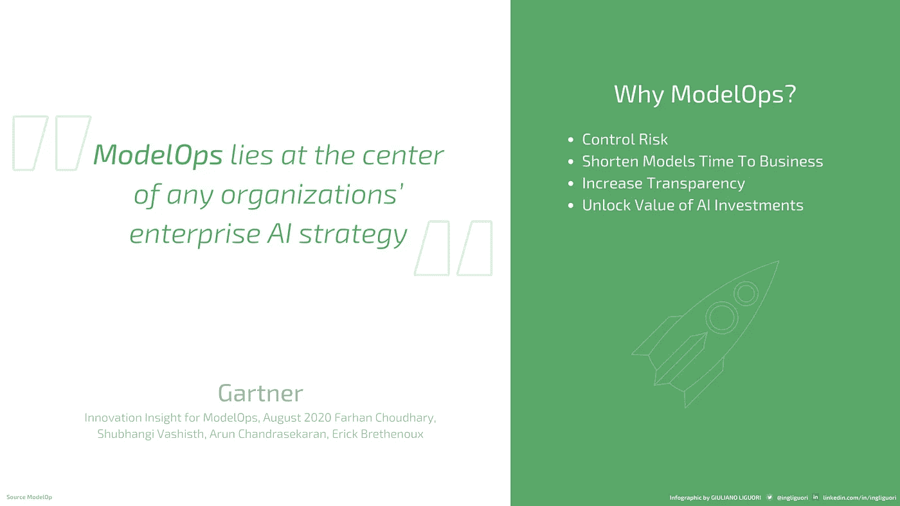
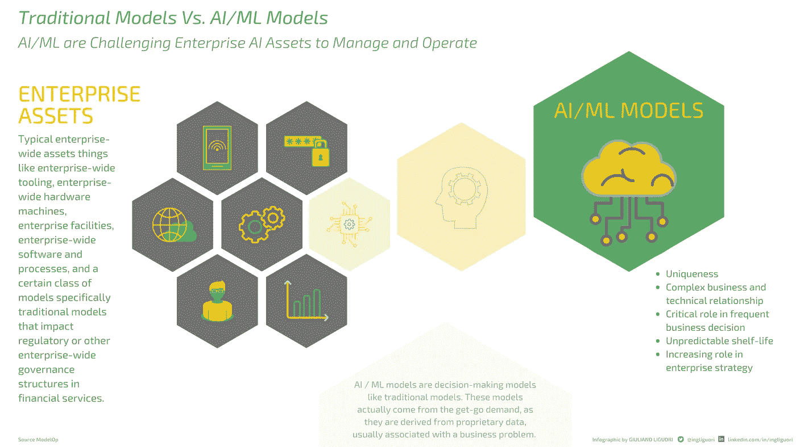
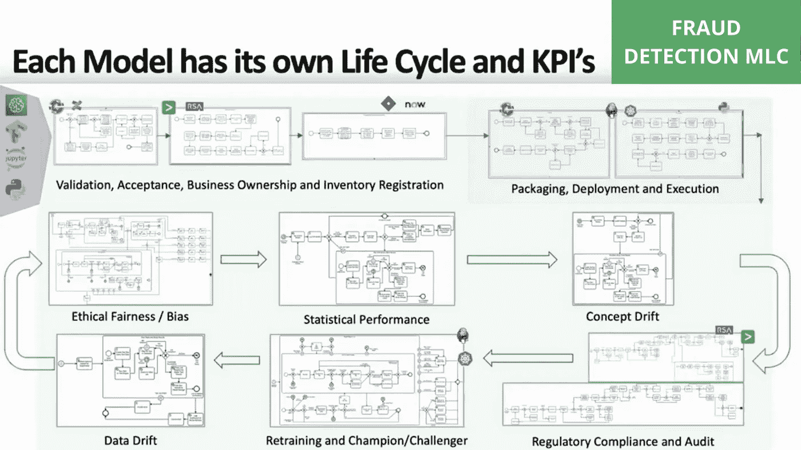
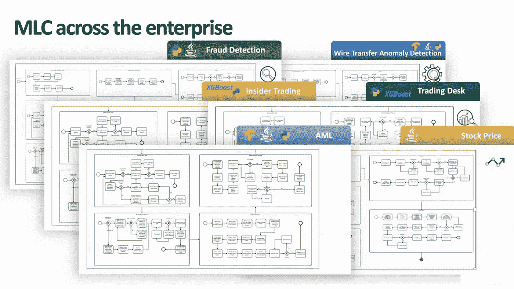
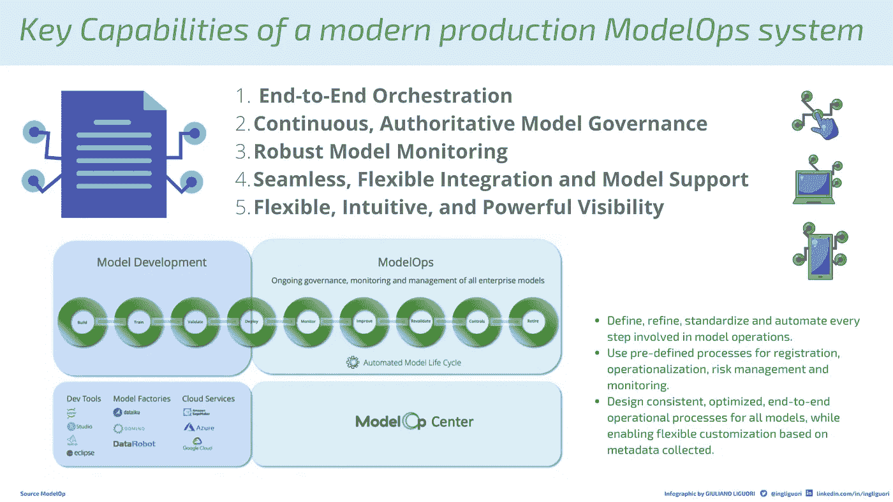
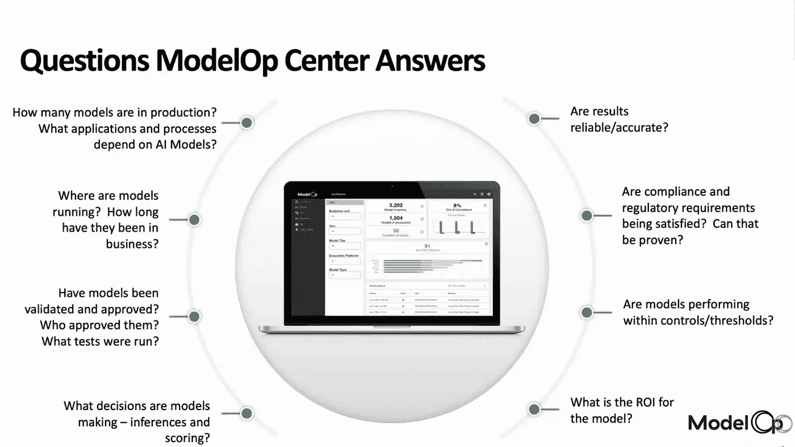

# 使用 ModelOps 扩展和管理人工智能计划

> 原文：<https://towardsdatascience.com/scale-and-govern-ai-initiatives-with-modelops-afdc33ce1171?source=collection_archive---------32----------------------->

卡尔·海尔达尔在 [Unsplash](https://unsplash.com?utm_source=medium&utm_medium=referral) 上拍摄的照片

## 行业笔记

# 什么是 ModelOps？

在生产中管理模型具有挑战性。为了优化人工智能的价值，人工智能模型必须提高商业应用程序的效率，或者在生产中运行时支持做出更好决策的努力。ModelOps 是在整个组织中扩展和管理企业人工智能计划并确保从这些企业人工智能计划中获得最大价值的关键能力。

本文将讨论支持这种模型操作能力的系统需求。我们将从真实案例中抽取例子，这些案例使用先进的生产企业系统来编排和自动化模型在其整个生命周期中的可操作性，以实现可伸缩的模型操作。

在这些简短的文字中，不可能涵盖与模型操作能力相关的所有挑战和细节。然而，在文章的最后，我们将尽力为您提供正确的参考资料，这些资料将有助于您加深和了解更多关于 ModelOps 的知识。

一些组织讨论了模型操作，他们是如何实现的，以及大企业应该采用什么样的模型操作。一个很好的例子来自 Gartner，在 2020 年 8 月发表的一篇论文中——[ModelOps 的创新见解](https://go.modelop.com/gartner_innovation_insights_for_modelops?utm_medium=web)——他们宣称“ModelOps 是任何组织的企业 AI 战略的核心”。

> 也请阅读【ModelOps 如何帮助你执行你的人工智能策略

还有许多来自 Gartner 和 Forester 的其他出版物，仅举几个例子，以及一个围绕 ModelOps 的不断增长的社区，可供那些希望了解更多信息的人使用。然而，本文的主要重点是强调开始您的 ModelOps 之旅的基础知识。

那么，让我们从关于 ModelOps 的主要问题开始，也就是为什么是 ModelOps？推动大型组织开始认真投资于模型操作能力的价值和难题是什么？

图 1 —为什么选择 ModelOps？—图片由[来源](https://www.youtube.com/watch?v=JygOfMjYxQA)提供，经作者许可编辑

我们在图 1 的右侧列出了一些，从我们的角度来看，我们认为它们可能按以下顺序排列:

*   **控制风险**:越来越多的业务计划和中央决策由人工智能算法和 ML 模型衍生的模型指导，这些模型正在真正影响现有的治理和风险结构。
*   **缩短模型投入业务的时间**:较新的建模技术逐渐过渡到现有的结构中，这促使大型组织了解并更好地利用 ModelOps 功能，另一方面，不断需要尽快将这些模型引入业务中。因此，在开发这些模型时需要花费时间和精力，这些模型有时具有众所周知的不可预测的保存期限，例如对特定商业制度的适用性。因此，将这些模型快速引入业务，最终会推动 ModelOps 的核心功能。
*   **增加透明度**:增加透明度和问责制，以便能够随时知道你的模型在哪里。
*   **释放人工智能投资的价值**:显然，所有这些不仅会释放企业人工智能计划的价值，而且随着时间的推移，此类计划的数量将不可避免地增加。

如果我们看看过去的 30 个月，我们会看到人工智能计划的巨大增长。在指数级变化速度的推动下，组织和创业公司正在努力采用 ModelOps，目标是捍卫和扩大他们的市场机会。

# 传统模型与人工智能/人工智能模型

在这种背景下，今天的大多数组织都在积极采用更加敏捷、高效的人工智能和机器学习应用交付，当然还有 IT 管理实践，以满足客户不断变化的期望。

如图 2 所示，在左侧，我们有典型的企业范围资产事物的(灰色六边形)表示，例如企业范围工具、企业范围硬件机器、企业设施、企业范围软件和过程，以及特定传统模型的类别类型，它们影响企业监管和治理结构。在金融服务中，这些通常是在模型风险管理系统或 MRM 中注册的模型。因此，在传统模型中，源自业务和领域专业知识的统计模型往往更多地在业务单位上下文中，而不是在企业上下文中，真正专注于推动特定业务单位的绩效。

图 2 —传统模型与人工智能/人工智能模型—图片来自[来源](https://www.youtube.com/watch?v=JygOfMjYxQA)，经作者许可编辑

传统模型和 AI/ML 模型有什么不同？AI / ML 模型和传统模型一样是决策模型。这些模型实际上来自于一开始的需求，因为它们来自于专有数据，通常与业务问题相关联。它们是非常复杂的模型

*   因为他们在 AI/ML 的环境中使用算法方法；
*   就与公司流程批准的治理结构的关系而言。

此外，除了完美地适应决策框架，它们还在技术层面上产生影响，它们往往涉及公司的技术结构。由于其技术复杂性，可能需要通过开发运维、企业安全、it 运营等流程，驻留在云服务上，或出于其他原因驻留在本地基础架构上。

> 另请阅读[安全可靠人工智能的模型操作](https://medium.com/codex/model-operations-for-secure-and-reliable-ai-2cf0ced9945b)

因此，在人工智能和机器学习的世界中，这些模型比传统模型更像是一种企业资产。正如我们所看到的，它们为业务部门提供支持，而且非常复杂，um 生命周期更快，保质期非常不可预测。由于这个原因，需要非常快速地刷新这些模型，记住它们也可能具有不同的刷新频率。

因此，所有这些导致企业 AI 和 ML 模型的管理面临独特的挑战，如果一家公司或组织希望将这些模型的治理、监控和协调内部化，他们必须考虑到这些代表了一种新的企业级资产，这将真正为他们提供一个前进的基础，并最终理解作为一种能力的模型操作的原因和方式。

所有这些模型都有自己的生命周期，并且暂时与各种现有的业务流程和公司级别的各种技术流程相关。

图 3 给出了生命周期的大致概念。在紫色区域，有模型工厂，从数据科学的角度来看，所有的东西都是为了创建模型而产生的。模型不是传统的软件，由于它们的独特性，它们与企业模式没有相同的关系，但是模型的生命周期确实适合企业范围的模式。

图 3——模型生命周期——图片由[来源](https://www.youtube.com/watch?v=JygOfMjYxQA)提供，经作者许可编辑

从这个例子中可以看出，打包部署和执行通常是由模型工厂自己提供的。也可以将它打包到 docker 容器中并发布，或者 ModelOps 平台可以自己提供该功能，因此在每个模型的基础上，都有生命周期中打包部署和执行部分的详细信息。

ModelOps 是关于理解模型的整个生命周期以及它们与业务和技术的集成，以便随着时间的推移在企业中交付价值。

在此图的绿色部分，我们可以看到一个典型的操作周期。这里提供了推理监控、概念漂移监控、统计性能或数据漂移等内容、模型的持续监控以及右下方法规遵从性审核中的治理结构。如果模型有任何变化，例如再培训或 Champion Challenger，这可能是非常复杂的自动再培训流程，这可能会启动新的监管或合规或问责流程。

> 也请阅读[不要让工具和管理方法扼杀你的人工智能创新](/dont-let-tooling-and-management-approaches-stifle-your-ai-innovation-5fcee5ec8b2f)

想象一下，一个企业有成百上千个模型，并且必须能够准确地知道每个模型在其生命周期中的位置，这是非常复杂的，并且成为扩展的真正挑战。如果做得不好，它会影响治理和提供问责制和可审计性的能力，例如基于每个模型的道德公平和偏见。

模型是资产，它们是复杂的资产，不像传统的资产，它们需要生命周期，这些生命周期也是复杂的，必须自动扩展，并且与现有的业务和技术流程有复杂的关系。

图 4 —整个企业的 MLC 图片由[来源](https://www.youtube.com/watch?v=JygOfMjYxQA)提供，经作者许可编辑

除此之外，现在重要的是要注意，由于它们的独特性，模型不像软件那样商品化。企业不知道他们是否可以拥有许多小数据模型或大数据模型，模型生命周期像任何企业架构考虑一样，倾向于将自己借给企业范围的模型。我们认为生命周期是一个企业范围内的问题，这设定了企业人工智能架构师的角色。在图 4 中，我们有一些生命周期的例子，如欺诈检测生命周期(我们之前已经深入讨论过)，其他用例是反洗钱和一些金融服务。然而，所有这些生命周期都需要管理和设计，它们是真正的架构资产。

> 也阅读[在你的人工智能策略中包含模型操作](/dont-let-tooling-and-management-approaches-stifle-your-ai-innovation-5fcee5ec8b2f)

# 人工智能编排平台

企业需要能够在这些资产的整个生命周期中持续管理、自动化和监控这些资产，而这正是 ModelOps Center 等现代生产 ModelOps 系统所做的。

这种系统为企业提供了一种集中、一致和有效地管理所有 AI/ML 模型的方法。该解决方案使团队能够优化整个模型运营生命周期，从初始部署到报废。

在这篇博客中，我们测试了 ModelOp Center 的特性。该平台使团队能够自动化和编排模型监控和治理。该解决方案提供了团队建立可靠、合规和可扩展的人工智能计划所需的所有关键功能。有了这些功能，团队可以最大化其模型的价值，提高运营和成本效率，并控制风险。

图 5 —现代生产模型操作系统的关键能力—图片由[来源](https://www.modelop.com/wp-content/uploads/2021/04/modelop-center-Scale-and-Govern-AI-Model-Operations.pdf)提供，经作者许可编辑

1.  该解决方案使团队能够:

*   *定义、细化、标准化和自动化模型运行中涉及的每一个步骤。*
*   *使用预定义的流程进行注册、运营、风险管理和监控。*
*   *为所有模型设计一致、优化的端到端运营流程，同时基于收集的元数据实现灵活定制*

2.团队可以建立对模型符合性的持续验证。因此，我们可以始终如一、权威地确保法规要求、业务政策和风险控制的持续执行。

3.监测涵盖一系列领域，包括数据漂移、概念漂移、伦理公平性、可解释性和群体评分、特征稳定性等。

4.预打包的集成包括:

*   人工智能模型工厂。
*   模型框架。
*   模型工作台。
*   共享 IT 系统。
*   基于云的 ML 服务。
*   BI 可视化工具

5.该解决方案允许以统一的方式跟踪和管理所有模型，并提供了简化跟踪、治理和报告工作的复杂可见性。

无论我们支持哪种类型的业务，通过采用正确的现代生产模型操作系统，我们将能够在企业层面提供自动化和治理，并确保企业层面的所有问题都可以轻松地在每个企业人工智能计划中得到解决。企业人工智能正在成为大型组织中大多数决策的一种战略方向。

ModelOp Center 是一个系统示例，该系统支持管理 AI 和 ML 模型的基本挑战，并能够大规模自动化非常复杂的生命周期，包括业务和技术挑战，并为组织提供了解所有模型位置的能力。

> 另请阅读[数据科学如何推动数字化转型](https://medium.com/codex/how-data-science-is-driving-digital-transformation-now-59f9ea1c3793)

图 ModelOp 中心的问题解答—图片由[来源](https://www.youtube.com/watch?v=JygOfMjYxQA)提供，经作者许可编辑

# 成功模型操作的 4 个步骤

几十年来，组织一直使用模型来帮助商业决策。然而，人工智能和机器学习模型给模型操作化(后期开发)带来了新的风险。许多模型操作流程是手动的，或者使用本地开发的解决方案进行管理，这些解决方案需要随着新技术、工具和治理要求的引入而不断更新。

因此，开发的模型中有一半以上没有得到部署，而那些模型需要几个月的时间来运行，这往往导致次优的结果以及延迟或降低的价值。

这里有 4 个步骤，任何组织都可以成功地操作 AI/ML 或任何其他类型的模型。

***1。*** ***定义端到端的模型运行过程(简称模型生命周期)***

*   *准备模型用于生产的第一步是建立端到端的模型操作流程，称为模型生命周期(MLC)。*
*   *企业 AI 架构师通常负责设计模型生命周期。*

**②*。*** ***调配车型***

*   *部署是将模型集成到现有生产环境中，以根据数据做出实际业务决策的方法。*
*   通常，数据科学家负责部署模型。

***3。*** ***监控生产中的车型***

*   *当一个模型首次在生产系统中实现用于实际业务用途时，监控就开始了，并持续到该模型退役为止，有时甚至超过作为历史档案的时间。*
*   *模型操作员通常负责监控生产中模型的健康状况。*

***4。*** ***统辖模型操作***

*   模型是一种智力资本，应该作为企业资产来管理。应该使用使审计和报告尽可能高效的工具和技术对它们进行清点和评估。

# 摘要

自动化和编排模型生命周期的所有方面确保了可靠的模型操作和大规模治理。企业中的每个模型都可以采用多种多样的生产路径，具有不同的监控模式和各种持续改进或淘汰的需求。

公司需要开始将 ModelOps 视为一种基本能力，这种能力可以真正实现业务追求的卓越水平，并确保投资具有有保证的即时 ROI。这件事不能再拖延了。

**关注我的每日技术和创新更新**

【https://bit.ly/m/ingliguori 

# 参考

*   [*ModelOps:治理和扩展 AI 计划*](https://www.youtube.com/watch?v=JygOfMjYxQA)
*   [*ModelOp 中心缩放并治理 AI 模型操作*](https://www.modelop.com/wp-content/uploads/2021/04/modelop-center-Scale-and-Govern-AI-Model-Operations.pdf)
*   [*成功模型操作的 4 个步骤*](https://www.modelop.com/wp-content/uploads/2021/03/modelop_ebook_4-Steps-1.pdf)
*   [*Gartner《ModelOps 创新洞察》报告*](https://go.modelop.com/gartner_innovation_insights_for_modelops?utm_medium=web)
*   [*实施人工智能*](https://www.forbes.com/sites/cognitiveworld/2020/01/26/operationalizing-ai/?sh=47998c633dfc)