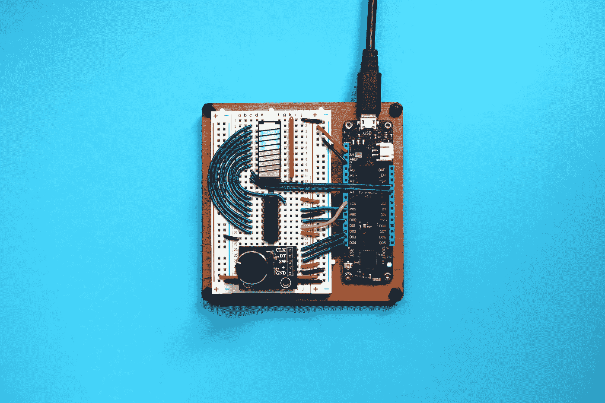
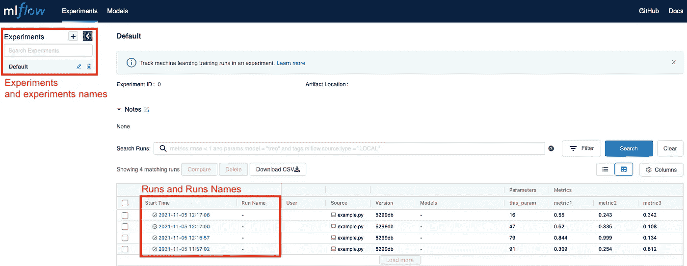
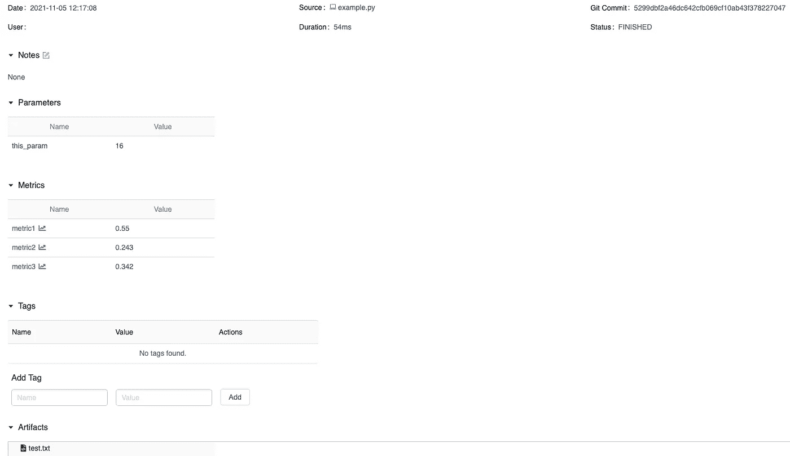
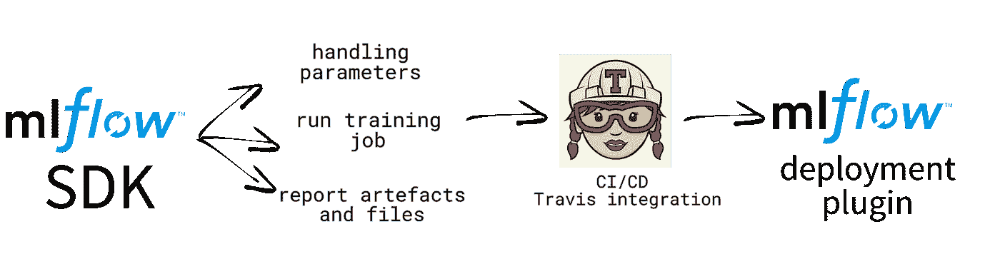

# 使用 MLflow 扩展您的模型开发

> 原文：<https://towardsdatascience.com/scale-up-your-models-development-with-mlflow-4b78a5f22cb7?source=collection_archive---------27----------------------->

在本文中，让我们看看您的数据科学团队如何👩‍💻👨‍💻可以通过 MLflow SDK 体验🧪的新模式。如果你对 MLflow 感兴趣，并且想更进一步，请跟我来，✋



图片由 [Jorge Ramirez](https://unsplash.com/@jorgedevs) 在 [Unsplash](https://unsplash.com/photos/nr3AmB4_B8g) 上拍摄。用 MLflow 整理你的数据线！

[](https://medium.com/@stefanobosisio1/membership) [## 通过我的推荐链接加入 Medium-Stefano Bosisio

### 作为一个媒体会员，你的会员费的一部分会给你阅读的作家，你可以完全接触到每一个故事…

medium.com](https://medium.com/@stefanobosisio1/membership) 

## 目录

— [什么是 MLflow？](#3572)
— [十秒钟介绍 MLflow 环境](#9e26)
— [帮助您的团队:迈向 MLflow SDK](#d1ba)
— [实现 MLflow 跟踪 SDK 类](#8f2f)
—[对象构造器](#5984)
—[读取输入参数](#cc98)—
—[设置器和获取器](#a808)
—[训练模型例程](#6cac) 

# 什么是 MLflow？

[MLflow](https://mlflow.org/) 是一个机器学习的开源平台，覆盖整个 ML 模型周期，从开发到生产再到报废。MLflow 直接来自 Databricks，它可以与任何库、语言和框架一起工作，并且可以在云上运行，它是跨团队协作的关键产品。

我们可以定义四种 MLflow 产品:

*   [ml 流量跟踪](https://mlflow.org/docs/latest/tracking.html):该组件涵盖模型实验阶段。数据科学家可以研究和开发不同的数据和模型参数，收集 MLflow 中的所有相关信息，并选择哪个模型可以进入生产阶段
*   [MLflow 项目](https://mlflow.org/docs/latest/projects.html):在大型协作中，数据、API、代码需要共享的情况经常发生。合作者经常会遇到安装问题、模型中的问题、代码分段错误和其他类似的“威胁生命”的障碍。允许使用一种通用的格式来打包数据代码，使它们更具可复制性，并在团队间共享而不会引发心脏病
*   [MLflow 模型](https://mlflow.org/docs/latest/models.html):一旦一个团队登陆生产地，下一步就是避免模型的混乱和混乱。模型允许以简单直观的方式在不同的环境中部署机器学习模型
*   [MLflow Model Registry](https://mlflow.org/docs/latest/model-registry.html) :以及如何避免生产中最后的混乱？注册中心是一个解决方案，它跟踪所有模型的状态，无论它们是在生产中、在试运行中还是最终退役。

我将写 3 篇关于物流的文章，涉及物流跟踪和物流模型。特别是，在这个故事中，我将向您展示如何通过思考一个 MLflow SDK 来帮助您的团队，以便数据科学家可以跳过编码 MLflow 中的一些繁琐部分。在第二个故事中，我们将扩展 SDK 来检索指标，并为数据科学家创建直观的 Plotly 图，以及一些示例。最后，我将向您展示如何创建一个 MLflow 插件，它可用于在 [GCP 人工智能平台](https://cloud.google.com/ai-platform/docs)中部署模型

# 十秒钟 MLflow 环境介绍

MLflow 开发人员已经整理了这份精彩而全面的指南，让每个人都可以安装 MLflow 并开始使用它:[https://mlflow.org/docs/latest/quickstart.html](https://mlflow.org/docs/latest/quickstart.html)

在这里，我将让您快速浏览一下，在本地机器上运行。安装 MLflow 后，我们可以编写一个类似这样的小代码:

图 MLflow 的简单介绍代码

通过运行`python name_of_your_file.py`执行这段代码，这将在 MLflow 中启动一个记录过程。这就是 MLflow 发挥作用的地方！在您的 CLI 中，只需键入`mlflow ui`即可启动 MLflow 图形界面。前往`http://localhost:5000`(或`http://127.0.0.1:5000)`，你将进入 MLflow 界面(图 2):



图 2: MLflow 用户界面。左边是实验列表，中间是基本信息、参数和指标。

如果你点击一个特定的运行，你会得到一个新的窗口，如图 3 所示。在这里你可以检索运行的参数(例如，这可能是层数，批量大小，初始学习率等)，运行的指标作为互动图(例如，准确性作为功能的步骤/时期)和所有保存的人工制品



图 3: MLflow 单次运行用户界面。在这个窗口中，您可以获得关于代码运行和检查工件的更多细节

# 帮助您的团队:迈向 MLflow SDK

到目前为止一切顺利，但现在是时候扩大规模，帮助您的数据科学团队将 MLflow 集成到他们已经存在的模型中了。构建在 MLflow 包之上的 MLflow SDK 将是一个完美的解决方案，不仅可以降低团队消化新技术的难度，还可以在一个简单的 Python 类中满足数据科学家的请求。
首先，我们需要了解我们的 MLflow 类应该做什么，以及我们想要走什么样的道路。图 4 显示了一个可能的路线图，从 MLflow SDK 的创建到 CI/CD 和通过 MLflow 插件的部署



图 4:路线图草图。MLflow SDK 应该照顾现有的数据科学家的模型，并保存人工制品。然后，MLflow 部署插件可以将最终结果推向生产

# 实现 MLflow 跟踪 SDK 类

因此，第一步是设计一个实现 MLflow 的类，它可以具有以下功能:

*   `read_params`此函数读取设置新 MLflow 实验所需的跟踪输入参数
*   `set_tracking_uri`和`get_tracking_uri`:这两个函数分别设置 mlflow 跟踪 uri ( `mlflow.set_tracking_uri`)并返回当前跟踪 uri
*   `set_experiment_id`和`get_experiment_id`:set 函数检查是否已经给出了一个`experiment_name`，否则创建一个新的。
*   `run_training`:这是捕获模型参数和指标的主要函数(主要通过使用 Python 模块`inspect`)。模型的参数和指标由`mlflow`通过`mlflow.package.autolog`功能自动检索。
*   `log_any_model_file`:有时 MLflow 自动登录功能无法将保存的模型文件上传到 MLflow-server。在这些情况下，该功能可以帮助数据科学家。事实上，一旦训练完成，调用这个函数，就可以找到工作运行目录中的所有`.joblib`、`.h5`、`.pkl`、`.model`文件，以及`png`格式的度量和`json`元数据文件，并正确地报告给 MLflow-server。

## 对象构造函数

现在让我们开始编写代码，设置一个类接口和协议以及它的构造函数。有一个云存储选项可能是有用的，所以你可以导入它(例如`from your_cloud_provider import storage_module`)并将工件直接保存在云上。

图 5:设置 MLflow SDK 接口和协议。SDK 将存在于这个主对象上

## 读取输入参数

接下来，我们可以开始考虑解析并读取参数。数据科学家可以使用 Python 字典中给定的指令和参数解析`yaml`或`json`或`txt`输入文件，这些文件可以由类直接读取:

图 6:读取参数功能。数据科学家可以将输入文件解析到字典中，字典提供诸如跟踪 uri(例如， [http://localhost:5000)、](http://localhost:5000),)以及存储位置、运行名称和标签等指令

在本例中，我添加了`self.caller`,稍后我们将看到这些信息是如何传递给 SDK 的，但是这个变量的目的是记录哪个脚本调用了 MLflow SDK，将 Python 脚本复制到工件中，并实现代码传承。代码沿袭在运行时很有用，因为可以发生许多修改，尽管数据科学家可以跟踪 Github 中的变化，但一些变化可能会丢失，导致令人困惑和神秘的结果。

## Setters 和 getters

接下来，我们需要注意设置器和获取器(图 7)。这些函数听起来可能没什么用，但在执行大量长代码时，它们非常重要，可以挽救你的生命！

图 7:主类的 Setters 和 getters。

在`set_experiment_id`上花几秒钟来创建一个新实验是值得的`experiment_name`和`tracking_storage`被传递给`mlflow.create_experiment(experiment_name, tracking_bucket)`，从那里`experiment_id`被取回。`experiment_id`和`run_name`都是**强制**在 MLflow 中开始新的运行，因此我们需要特别注意这些变量。

## 训练模型例程

现在，我们已经准备好进行日常训练了。通常，MLflow 通过上下文管理器来跟踪模型训练作业，上下文管理器是一种 Python 协议，通常会简化一些资源管理模式:

图 8:来自 MLflow 教程([https://www . ml flow . org/docs/latest/tutorials-and-examples/tutorials . html](https://www.mlflow.org/docs/latest/tutorials-and-examples/tutorial.html))的关于培训跟踪的示例

上下文管理器的问题是`with mlflow.start_run()`只有在训练 Python 代码中被直接调用时才能记录工件和训练会话。对于数据科学家来说，这可能是一项非常枯燥的重组任务，他们应该重新编写部分代码来适应这一功能。想要的解决方案应该是类似的:

```
from your_mlflow_sdk import experiment_tracking
...if tracking: # if you decide to track:
    experiment_tracking.start_trianing_job(input_parameters)
    history = model.fit(**fit_params)

    # report additional metrics (we'll see below) 
    experiment_tracking.end_training_job(input_parameters)
else:
    history = model.fit(**fit_params) # normal training
```

`run_training`函数应该可以处理这个问题，它可以监听用户正在做什么，而不会干扰已经编写好的代码:

图 9:主训练函数，可以被调用来记录所有的模型人工制品

该函数调用`mlflow.autlog()`函数，对监听`xgboost`、`sklearn`、`tensorflow`、`keras`和`lightgbm`模块提供了极好的支持，自动将所有模型参数报告给主界面。该函数的核心是`mlflow.start_run()`,它设置要记录的运行，正如我上面所说的，它将调用者 Python 脚本`self.caller`作为`mlflow.log_artifact(self.caller, artifact_path='code')`报告给 artefacts 文件夹`code`

## 将任何模型文件/工件记录到 MLflow 中

避免上下文管理器的一个问题是，并非所有生成的模型文件都会自动保存到 MLflow 服务器。例如，在我的例子中，许多模型文件保存在本地或云中，但是我希望它们也在 MLflow 服务器中报告。为了解决这个问题，图 10 中的`log_any_model_file`开始发挥作用。

该函数调用新运行的实验。它检查实验运行是否顺利。然后，它查看一个给定的存储位置，本地或云，以查看在那里保存和创建了哪些文件。接下来，扫描想要的格式列表，`local_file_to_upload`，运行一个 for 循环，用`client.log_artifact(run_id, file_to_upload, artifact_path='model')`将所有找到的文件记录到一个`model`文件夹中

图 10:将任何元数据和模型文件记录到 MLflow 服务器。有时不是所有的文件都由 MLflow 直接保存，尤其是在使用混合模型时。因此，该功能在云上或本地寻找额外的工件，并将它们上传到 MLflow 服务器

# 在一个模块中修补所有内容

现在，您已经创建了 MLflow SDK 的基础，我们可以继续实现一个培训模块，数据科学家可以将其用于他们的实验。模块名可以是实现功能`start_training_job`和`end_training_job`的`experiment_tracking_training.py`。

前一个函数设置 MLflow 跟踪作业。它通过带有`caller = traceback.extract_stack()[-2][0]`的`traceback`模块检索调用者 Python 脚本代码，这将在工件中报告。然后，它初始化实验参数，最后开始训练运行`runner.run_training()`

`end_training_job`可在模型拟合后调用，通过`log_any_model_file()`检索任何其他可能的未保存文件

图 11:使用 MLflow 开始和完成培训工作会话记录的模块。start_training_job 初始化实验跟踪协议，而 end_training_job 检查未保存到 MLflow 服务器的其他工件。

今天就到这里吧！我们经历了很多事情，如果你不熟悉 MLflow，你会一步一步地消化一切。请继续关注我们的下一个故事，它将展示如何向我们的实验报告额外的指标，并且我们将看到一些如何使用我们的 MLflow SDK 的示例:)

如果你有任何问题或好奇，请给我发电子邮件到 stefanobosisio1@gmail.com