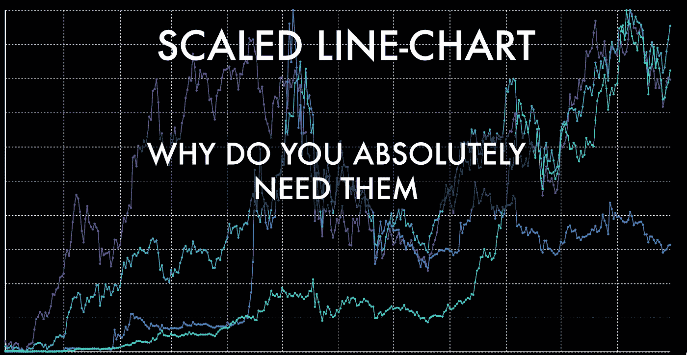
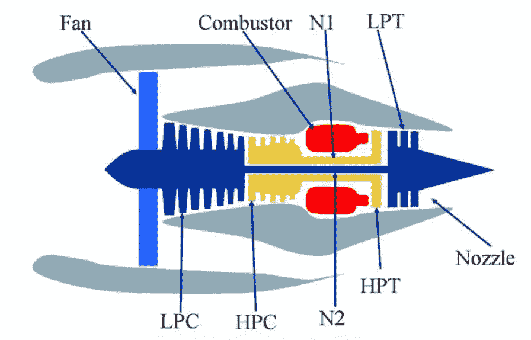
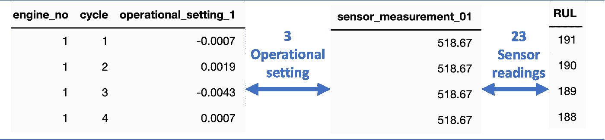
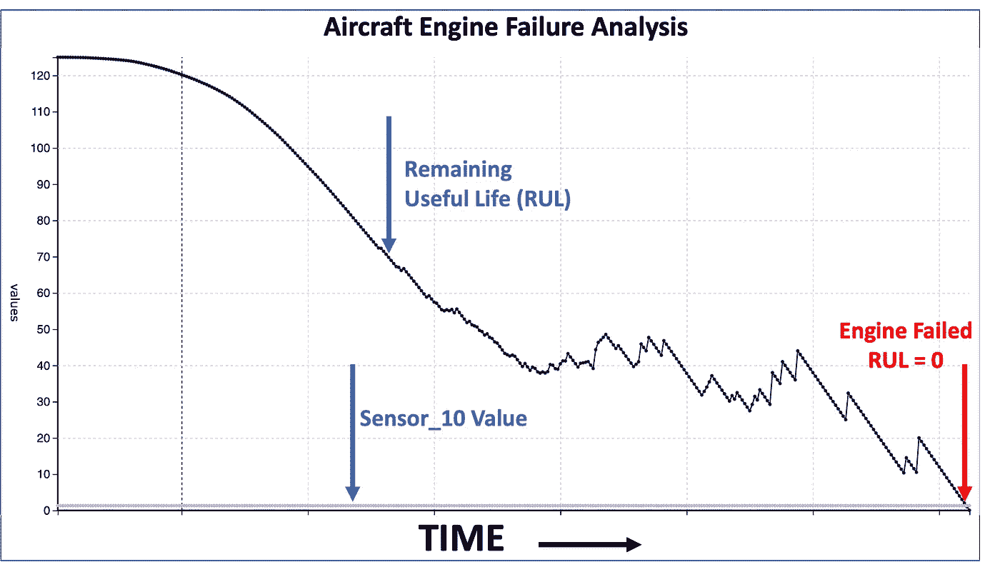
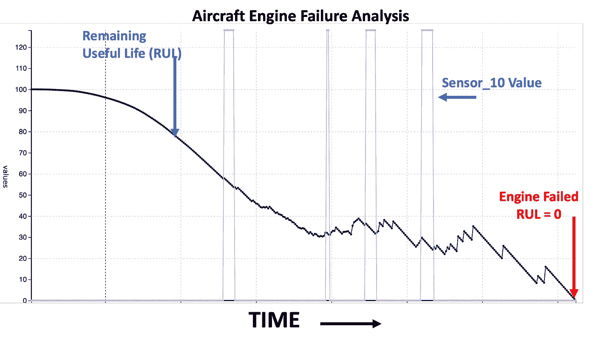
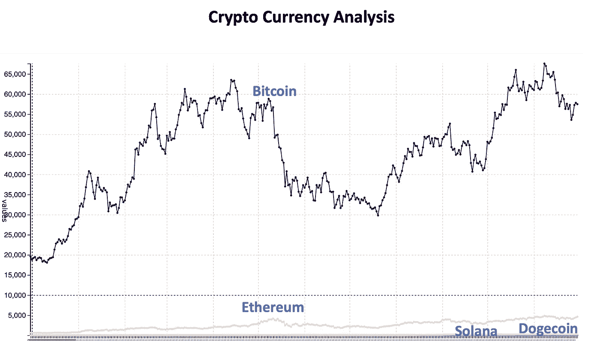
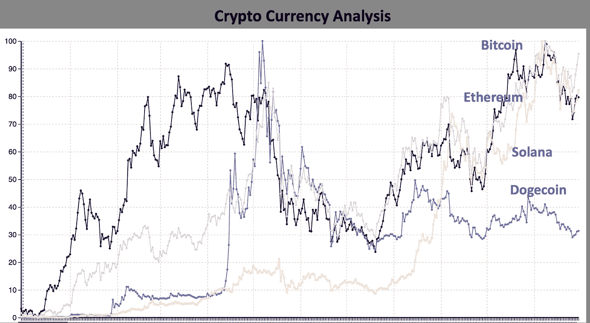

# 比例折线图——它们是什么，为什么你绝对需要它们

> 原文：<https://towardsdatascience.com/scaled-line-chart-what-are-they-and-why-do-you-absolutely-need-them-7c56dd09377c?source=collection_archive---------11----------------------->

## 结合两个简单事物的力量得到令人敬畏的东西

作者图片

有时候把两个看似简单的东西结合起来，会得到很牛逼的东西。在本文中，您将看到折线图和数字缩放器相结合的强大功能。仅仅为了词汇:

*   折线图对于分析一段时间内的价值非常有用。
*   缩放器是一种将值转换为不同比例的算法。例如，python MinMaxScaler(0，100)会将一个值转换为 0 到 100 之间的一个所谓的缩放值。

数字标尺和折线图通常彼此独立使用。然而，在许多情况下，将它们结合起来会很有用。

在本文中，我将通过两个用例向您展示结合使用标量和折线图的强大功能。

# 案例 1 —使用物联网数据的预测性维护

该用例用于飞机涡轮风扇发动机的预测性维护。这里展示了一幅绘画作品。

图片来源[https://ti.arc.nasa.gov/c/6/](https://ti.arc.nasa.gov/c/6/)

涡轮风扇发动机有多个发送数据的传感器，这些数据本质上是时间序列数据。这些数据用于跟踪和预测飞机涡轮风扇发动机的损坏。

引擎生成的数据(图片由作者提供)

数据是在发动机和运行周期的水平上。数据集由发动机和传感器测量的操作设置的多个多元时间序列组成。RUL 在发动机的每个工作循环后仍有使用寿命。

数据科学活动正在开发一个机器学习模型，以根据传感器数据预测 RUL。首先进行的活动之一是数据探索，以查看传感器数据和 RUL 之间是否有任何关系。例如，下面是传感器 10 和 RUL 的折线图。

飞机发动机故障分析(图片由作者提供)

RUL 值随时间降低，这在可视化中清楚地显示出来。sensor_10 值似乎是恒定的。看着这个图像，我们很容易得出结论，sensor_10 对确定 RUL 没有用。

> 如果我告诉你这是一个完全错误的结论呢！

现在让我们用 RUL 和传感器值在 0 和 100 之间绘制相同的可视化，如下所示。这意味着最小值显示为 0，最大值显示为 100。

用标度值进行飞机发动机故障分析(图片作者提供)

我们现在可以观察到 sensor_10 值不是恒定的。价值出现了峰值。这些尖峰信号可能是机器将要发生故障的一个信号。

这是和上一个完全不同的结论。这两种可视化非常不同的原因是，与 sensor_10 相比，RUL 值非常高。RUL 具有诸如 130、120 等的值。传感器 _10 值具有诸如 1.3、1.5 等的值。因此，与 RUL 值相比，传感器 _10 值非常小，传感器值的变化没有在第一个可视化中示出。

在第二个可视化中，对传感器值应用缩放是一个游戏改变者。这使我们清楚地看到传感器相对于 RUL 的变化。我们可以将尖峰信息转换为一个特征，而不是丢弃传感器值。“尖峰”特征在预测 RUL 时可能非常有用。

# 案例 2 —加密货币分析

加密货币分析是我们可以结合 scaler 和折线图的另一个领域。下面显示的是四种加密货币(比特币、以太坊、索拉纳和 Dogecoin)的非比例价格线图。

使用非比例折线图进行加密货币分析(图片由作者提供)

第一个观察是，我们可以理解比特币的模式，因为它清晰可见。但是，对于其他三种货币，我们无法对它们进行分析，因为它们在折线图上没有得到很好的表示。原因是比特币价格和其他加密货币价格之间的巨大差异。比特币价格是其他加密货币的 10 倍。

现在让我们在 0 到 100 之间划分价格。这是一个比例折线图。

加密货币分析与缩放折线图(图片由作者提供)

这张图表看起来更好，因为所有四种加密货币都得到了很好的体现。我们可以利用这种可视化来获得非常强大的洞察力。比如我们看到比特币、以太坊、索拉纳都有类似的趋势。Dogecoin 已经达到顶峰，然后价格开始下降。这种见解只有在缩放的折线图中才有可能实现。

# 结论

如果您尝试使用折线图比较多个值，请验证这些值是否有显著差异。

如果差异非常重要，那么就调整数值(比如说在 0 到 100 之间)，然后将它们绘制在折线图上。

刻度折线图使您能够以更好的方式可视化和解释非常小的值。

# 额外资源

# 网站(全球资讯网的主机站)

你可以访问我的网站，用零编码制作比例线图和其他分析。[https://experiencedatascience.com](https://experiencedatascience.com/)

请**订阅**每当我发布一个新的故事时，请及时通知我。

 [## 每当 Pranay Dave 发表文章时，您都会收到电子邮件。

### 每当 Pranay Dave 发表文章时，您都会收到电子邮件。通过注册，您将创建一个中型帐户，如果您还没有…

pranay-dave9.medium.com](https://pranay-dave9.medium.com/subscribe) 

你也可以通过我的推荐链接加入 Medium。

 [## 通过我的推荐链接加入 Medium—Pranay Dave

### 作为一个媒体会员，你的会员费的一部分会给你阅读的作家，你可以完全接触到每一个故事…

pranay-dave9.medium.com](https://pranay-dave9.medium.com/membership) 

**Youtube 频道**
这里是我的 Youtube 频道的链接
【https://www.youtube.com/c/DataScienceDemonstrated 