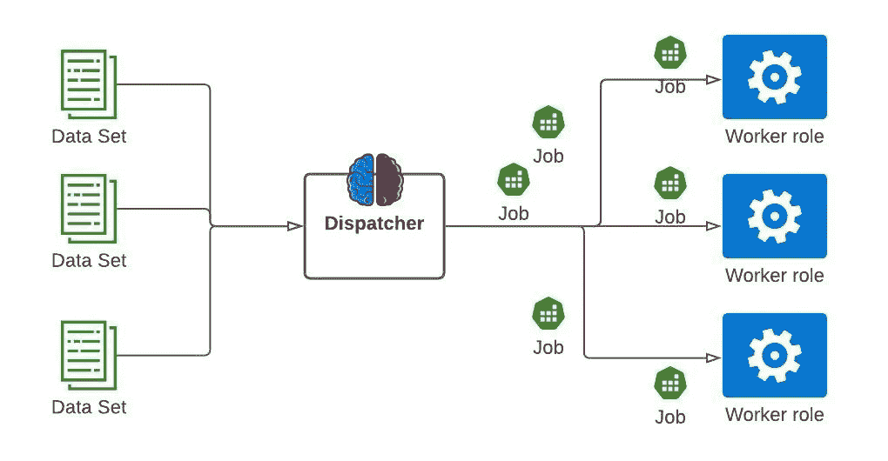
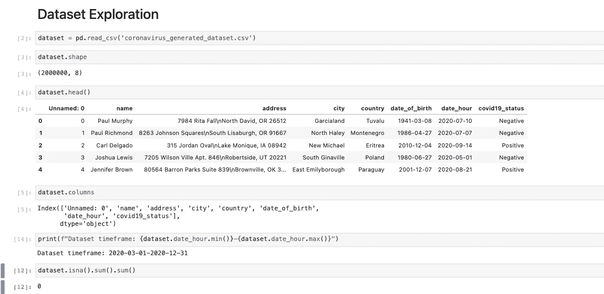
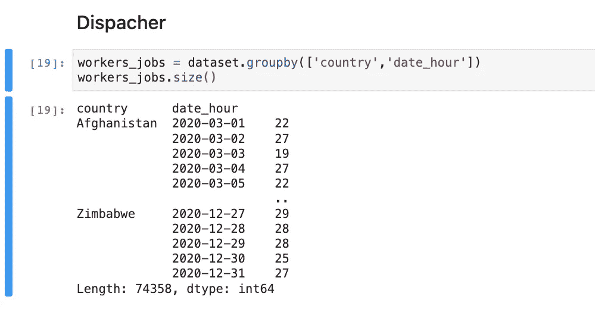
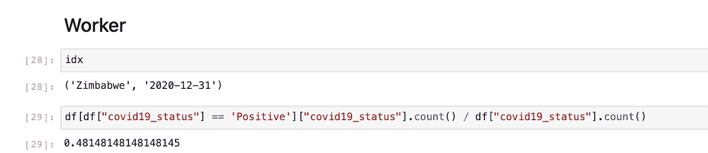
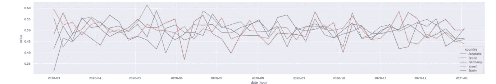
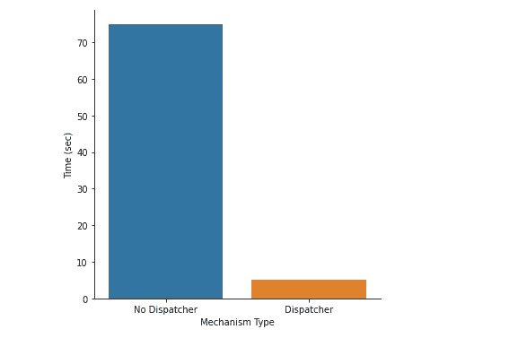

# 扩展数据驱动的微服务

> 原文：<https://towardsdatascience.com/scaling-data-driven-microservices-27be1f5df34a?source=collection_archive---------27----------------------->

## 扩展数据驱动的微服务需要基础设施的支持，但更重要的是，应该编写代码来支持可扩展性

**摘要**

如今，应用程序的流量负载可能会在短时间内急剧增加或减少，这意味着应用程序需要轻松地横向扩展和纵向缩减。要做到这一点，它们需要一个能够容纳资源扩展或减少资源的基础设施来支持，但更重要的是，应该编写代码来支持可伸缩性。

在我们的大数据时代，应用程序收集和处理海量数据。为了实现其目的，这些应用程序需要在合理的时间范围内处理数据，并且不消耗太多资源。

当开发处理大量数据的服务时，开发人员应该了解资源。pandas 和 NumPy 等库中对大型数据集的操作经常会在内存中复制数据，最终导致不必要的快速资源限制。以匹配学生表和考试列表为例。每个学生参加所有测试(所有测试由所有学生参加)。如果我们想在一个表格中表达这种关系，就需要一个由(学生数量)x(测试数量)行组成的表格。对于大型数据集，这可能远远超过内存限制。

更重要的是，缺乏资源意识可能会导致下面列出的许多问题，例如:

*   让主线程保持忙碌—密集的 CPU 工作负载可能会导致其他请求被阻塞。
*   OOM —在内存中处理大量数据可能会超过物理服务器的内存量。
*   CPU 负载——执行密集型计算会导致我们的应用程序延迟，从而影响我们的用户体验。

此外，简单地扩展资源(纵向扩展)或部署应用程序的更多实例(横向扩展)也无济于事。纵向扩展有服务器 CPU 和内存资源的限制，这使得它在大数据环境中受到限制。此外，当应用程序保存所有数据并试图同时处理这些数据时，横向扩展是不可能的。

那么，我们如何在数据驱动的应用程序中使用横向扩展呢？

**调度员模式**

有许多方法可以帮助我们的代码支持伸缩，其中之一是使用名为 **Dispatcher 的模式。**

dispatcher 模式将任务的执行与任务的指挥者分离开来。
堪比主从架构，向执行命令的从机发送命令的调度器。

调度员不仅仅是向工人发送命令。
它在发送命令给它的工人之前应用一些计算逻辑。这种逻辑的一个例子是将数据分类，例如按天分类。
使用该方法时，我们可以按需扩展应用。

使用 dispatcher 模式的好处:

*   高效的资源利用——在使用 dispatcher 模式时，可以根据系统负载决定何时扩展应用程序，并通过减少不必要的资源消耗来节省成本。
*   业务逻辑和数据预处理的分离——使用这种模式，可以分离关注点。每个组件都有更明确的用途；调度器要求从机执行原子操作，从机执行更简单的操作。
*   易于调试——使用这种方法时，可以检测数据中较小的原子部分的错误(哪一批有问题)。
*   缩短处理时间-部署的员工越多，数据处理速度就越快。

**调度员模式图|** 图片作者

有许多方法可以在您的应用程序中实现 dispatcher 模式，这里我们将使用 **Apache Kafka(事件流平台)**在微服务环境中实现它。

Apache Kafka 支持 PubSub 架构，这意味着有一个发布者将消息发布到一个队列(称为主题)，还有一些消费者，他们使用来自该主题的消息。(Apache Kafka 有更多的功能，但这超出了本文的范围)。

我们将使用 Apache Kafka 在 Dispatcher 和它的工作人员之间传递消息，并展示如何支持 scale。

**Dispatcher 模式使用示例**

在本例中，我们将对 COVID19 数据集执行操作，该数据集是使用 faker 库生成的 **fake** 。
数据集包含世界各地 COVID19 阳性和阴性病例的时间范围，并具有以下属性:患者姓名、城市、国家、出生日期以及 COVID19 测试的日期和结果。

这个想法是计算 COVID19 跨数据集时间范围的国家阳性率。

数据集的链接: [**数据集**](https://drive.google.com/file/d/1zeaBVyESJLeXXwWvQv781NzFurj3h70R/view?usp=sharing) **。**

数据集探索:

**数据集探索** |作者图片

根据下面的图片，数据集包含 2M 记录，每条记录为一名患者提供其 COVID19 测试结果。
数据集时间范围在 2020 年 3 月 1 日至 2021 年 1 月 1 日之间。

调度员

调度程序的任务是将数据分割成原子排列，并将数据分派给它的工作人员来操作。关键字:“country”和“date_hour”表示我们想要计算正比率的原子排列。正如我们所看到的，这里的 dispatcher 任务很小，dispatcher 只需将数据分组到 country 和 date_hour 键中，这不是一个密集的操作，dispatcher 任务并不总是很繁重。

**调度员** |图片作者

一旦实现了 dispatcher 任务，我们将使用 Kafka Broker 将所有的作业分派给工人，与 Kafka 一起工作的库很少，我更喜欢使用 Kafka-confluent，根据所附的基准测试([http://activision game science . github . io/2016/06/15/Kafka-Client-benchmark/](http://activisiongamescience.github.io/2016/06/15/Kafka-Client-Benchmarking/)，它更快，并且也有很好的文档。

工人的

发送后，卡夫卡的消费者(我们的工人)将一个接一个地消费味精，并开始工作。

工人的任务是每次取一份工作，其中每份工作都包含一个特定日期和国家的记录，并为它计算出 covid19 的阳性率。
员工可以运行多项工作(通过 1 个状态)，但可以同时运行每项工作，理解这一点很重要。

**工人的任务** |作者图片

我们可以看到，工人的任务很小，让我们能够轻松地诊断 bug。还有一个好处是，如果数据处理意外关闭，我们不必从头开始处理。

毕竟，工人完成了他们的工作，我们可以联系所有的结果，并绘制我们的见解。

**COVID19 阳性率交叉日期** |作者图片

在下图中，我们可以看到所有数据集国家的 COVID19 正利率交叉日期。

让我们用使用 dispatcher 模式运行这个任务和不使用 dispatcher 模式运行这个任务之间的比较柱状图来总结这个演示。

**时间对比(秒)** |图片作者

**总结**

本文强调了在开发下一个数据处理作业时，支持缩放的代码的重要性。不要把注意力放在我们的代码支持缩放上，或者不知道我们试图处理多少数据可能会导致多个问题。
在本文中，我们看到了一种编写支持缩放的代码的方法，并看到了如何使用 Apache Kafka 实现它的实际例子。

*希望你觉得有用(:*