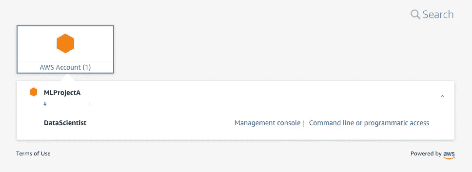

# 借助现代云运营扩展企业 ML 平台

> 原文：<https://towardsdatascience.com/scaling-enterprise-mlops-delivery-with-modern-cloud-operations-6888d7218be5?source=collection_archive---------24----------------------->

## AWS 上扩展 ML 环境供应的分步指南

与 Nivas Durairaj 的联合职位

古腾堡印刷机在当时是革命性的 T2。突然间，出版商可以每天印刷数千页书，而不是几页手写的。它使知识在欧洲迅速传播，开启了文艺复兴时代。

照片由[亨克·穆尔](https://unsplash.com/@henkmul?utm_source=unsplash&utm_medium=referral&utm_content=creditCopyText)在 [Unsplash](https://unsplash.com/?utm_source=unsplash&utm_medium=referral&utm_content=creditCopyText) 上拍摄

今天，大型企业需要向他们的业务交付数百个 ML 项目，同时以安全和受治理的方式进行。为了加快 ML 交付，他们需要在几分钟内为 ML 环境配备护栏。印刷机使 ML 团队能够快速进入工作环境，脚手架使他们的解决方案可操作化。

我最近[发表了一篇关于如何在 AWS 上这么做的指南](https://aws.amazon.com/blogs/mt/setting-up-machine-learning-environments-aws/)。在这里，我们将付诸实践。我将通过 3 个步骤来分享如何实现云运营的现代化，以扩展 ML 交付。

作者图片

# 演练概述

我们将分三步解决这个问题:

*   我们将首先用 [AWS 控制塔](https://aws.amazon.com/controltower/)和 [AWS 组织](https://aws.amazon.com/organizations/)设置我们的 ML 平台基础。我们将采用[多账户策略](https://docs.aws.amazon.com/whitepapers/latest/organizing-your-aws-environment/benefits-of-using-multiple-aws-accounts.html)，每个 ML 项目将在一个单独的账户中运作。
*   然后，我们将使用 [AWS 服务目录](https://aws.amazon.com/servicecatalog/?aws-service-catalog.sort-by=item.additionalFields.createdDate&aws-service-catalog.sort-order=desc)和 [Amazon SageMaker](https://aws.amazon.com/sagemaker/) 实现模板化 ML 环境的自助服务。它将允许 ML 团队在几分钟内自行调配其客户中批准的环境。
*   最后，我们将看到 ML 团队如何启动和访问他们治理的 ML 环境。

# 先决条件

要关注这篇文章，请确保您:

1.  访问[使用 AWS 控制塔管理多帐户 AWS 环境](https://www.youtube.com/watch?v=2t-VkWt0rKk),如果这对您来说听起来很新鲜的话。
2.  我们将应用[中提出的概念，在 AWS](https://aws.amazon.com/blogs/mt/setting-up-machine-learning-environments-aws/) 上建立安全的、治理良好的机器学习环境。在继续之前，请务必阅读这篇文章。
3.  对于自助服务，我们将重复使用与[相同的方法和服务目录组合，实现亚马逊 SageMaker Studio 资源的自助供应](/enabling-self-service-provisioning-of-amazon-sagemaker-studio-resources-7ac017925016)。确保你熟悉它。

# 步骤 1:使用现代云操作支持 ML 项目

首先，我们希望 ML 团队每次有新项目时都能访问一个安全且合规的 AWS 账户。这里，我们保持简单，为每个项目创建一个 AWS 帐户。

作者图片:我们将使用控制塔在工作负载 OU 下自动提供帐户。他们将自动继承我们在 OU 上应用的治理。

## *设置着陆区并创建工作负载 OU*

导航到 AWS 控制塔控制台设置你的着陆区。参见[AWS 控制塔入门](https://docs.aws.amazon.com/controltower/latest/userguide/getting-started-with-control-tower.html#step-two)了解如何启动控制塔的详细信息。

作者图片:我在 OU 配置页面中创建工作负载 OU

启动后，大约需要半个小时才能完成。

图片作者:您现在应该可以在控制塔中看到基础 ou(安全)和附加 OU(工作负载)

**注意-** 安全 OU[下的日志归档帐户](https://docs.aws.amazon.com/whitepapers/latest/organizing-your-aws-environment/security-ou.html#log-archive-account)可以作为从工作负载 OU 下的所有帐户收集的日志数据的合并点。您的安全、运营、审计和法规遵从性团队可以使用它来支持法规要求。

## 将控制塔护栏和 scp 应用于持续治理

您可以设置控制塔护栏，为您的整个 AWS 环境提供持续治理，并设置服务控制策略，以控制工作负载 ou 下所有帐户的最大可用权限。

为了便于说明，我们将使用与本博客中相同的 SCP [示例。它阻止 ML 团队在其帐户中启动 SageMaker 资源，除非指定了 VPC 子网:](https://aws.amazon.com/blogs/mt/setting-up-machine-learning-environments-aws/)

按作者分类的图片:导航到 AWS 组织并创建新的 SCP。我把我的叫做“sagemaker-enforce-vpc”。

## 使用帐户工厂创建项目帐户

您现在可以使用控制塔帐户工厂按需创建新帐户。

作者图片:在我的例子中，我在工作负载 OU 下创建了 MLProjectA 和 MLProjectB 帐户。

帐户工厂是一个服务目录产品，因此您可以通过 UI 创建帐户。当缩放时，你可以通过编程来创建。

## 管理用户验证和权限

接下来，您需要管理帐户中的用户身份验证和权限。在这里，我使用 AWS SSO 来管理这些，您可以按照此视频中的过程操作。请随意使用您选择的身份提供商:

作者图片:我创建了两个用户——Jon Doe(数据科学家组)和 Mike Smith(m engineers 组)。我还创建了自定义权限集，供用户在登录他们的帐户时使用。

SageMaker 提供了[特定于服务的资源、动作和条件上下文键](https://docs.aws.amazon.com/service-authorization/latest/reference/list_amazonsagemaker.html)，您可以将它们添加到权限集。另请参见本页的[管理对其他 AWS 服务的权限](https://docs.aws.amazon.com/service-authorization/latest/reference/reference_policies_actions-resources-contextkeys.html#actions_table)。

您可以为不同的 ML 项目角色创建权限集。这里有几个例子:

*   数据科学家他们可以尝试 ML 方法。
*   **ML 工程师**他们可以处理 CI/CD、模型监控和工件。
*   **ML 平台工程师(admin)** 管理员。
*   **审计和合规团队**他们拥有日志归档帐户的读取权限，可以在其中验证工作负载的合规性。

作者图片:作为管理员，我给了 Jon Doe 访问 MLProjectA 账户的权限。和 Jon 一样，我可以进入 SSO 登录页面，查看我可以访问哪些项目帐户。

现在，您的 ML 平台中应该有多账户基金了。当一个新的 ML 项目开始时，您可以使用 guardrails 创建一个新的 AWS 帐户，并向用户提供对它的访问。这个过程只需要几分钟。

# 步骤 2:自助式模板化 ML 环境

现在，您的 ML 团队可以在几分钟内访问客户，他们需要访问工作环境和脚手架来实施他们的解决方案。

我们将在控制塔管理客户中创建一个服务目录组合，并与 ML 项目客户共享。

作者的图片:我们在管理帐户中创建了一个治理产品的投资组合(左)，并与 ML 项目帐户共享它(右)

## *在管理帐户中创建服务目录组合*

为此，您可以重用来自[的方法，实现亚马逊 SageMaker Studio 资源的自助供应](/enabling-self-service-provisioning-of-amazon-sagemaker-studio-resources-7ac017925016)。它将允许您使用 [AWS 服务目录工厂](https://service-catalog-tools-workshop.com/tools.html)自动部署 SageMaker 产品。

作者图片:带有模板化 SageMaker 资源的服务目录组合

**注意**为了便于说明，我将服务目录工厂放在控制塔管理帐户中。在现实生活中，您的 ML 平台团队可能有专门的客户来构建、测试和部署产品和组合。

## 与 ML 项目客户分享投资组合

现在，我们将与工作负载 OU 下的所有客户共享服务目录产品组合。

作者图片

这一过程非常简单，您可以按照视频中的步骤进行操作:

图片作者:我与工作负载 OU 共享投资组合。

作为一个 ML 平台管理员，你可以登录到项目帐户，并接受投资组合。

作者图片:您需要输入管理帐户中的投资组合 ID。

然后，您可以向 ML 团队提供在其帐户中访问导入的投资组合的权限。

作者图片:在这里，我将对投资组合的访问权授予拥有数据科学家或 m 工程师角色的用户。

从现在开始，创建新的 ML 项目帐户应该不会超过几分钟。您对服务目录产品组合所做的更新将自动反映在项目帐户中，使您能够持续部署新产品。

# 步骤 3:在项目帐户中启动 ML 环境

现在是容易的部分！我们将使用我们的一个 SSO 用户，登录到 MLProjectA 帐户，并启动 SageMaker Studio。

图片作者:作为 Jon Doe，我登录到 MLProjectA 帐户，并转到服务目录控制台页面。

作者图片:使用服务目录，我启动了一个新的 SageMaker Studio 域(一次性的)，并为自己创建了一个用户配置文件。

**注意-** 为了便于说明，[示例工作室域](https://github.com/SofianHamiti/aws-service-catalog-sagemaker-studio/tree/master/domain)将寻找带有公共子网的默认 VPC。我用*AWS ec2 create-default-VPC*CLI 命令*得到一个。在现实世界中，你会希望 Studio 域在私有子网中运行。*

作者图片:我现在只需点击几下鼠标就能进入 SageMaker 工作室环境！🚀

# 结论

多账户策略和受管 ML 环境的自助供应允许企业扩展其 ML 交付。它允许 ML 团队在几分钟内开始在批准的环境中工作。

在这篇文章中，我分享了 ML 平台团队如何通过 AWS 控制塔、AWS 组织、AWS 服务目录和 Amazon SageMaker 快速提供安全、治理良好的 ML 环境。

为了更进一步，您可以访问 [AWS 管理和治理镜头](https://docs.aws.amazon.com/wellarchitected/latest/management-and-governance-lens/management-and-governance-lens.html)和[利用亚马逊 SageMaker Studio](/industrializing-an-ml-platform-with-amazon-sagemaker-studio-91b597802afe) 实现 ML 平台的工业化。