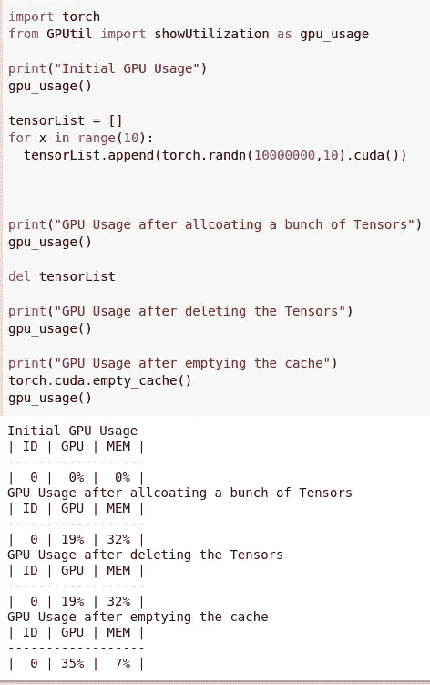
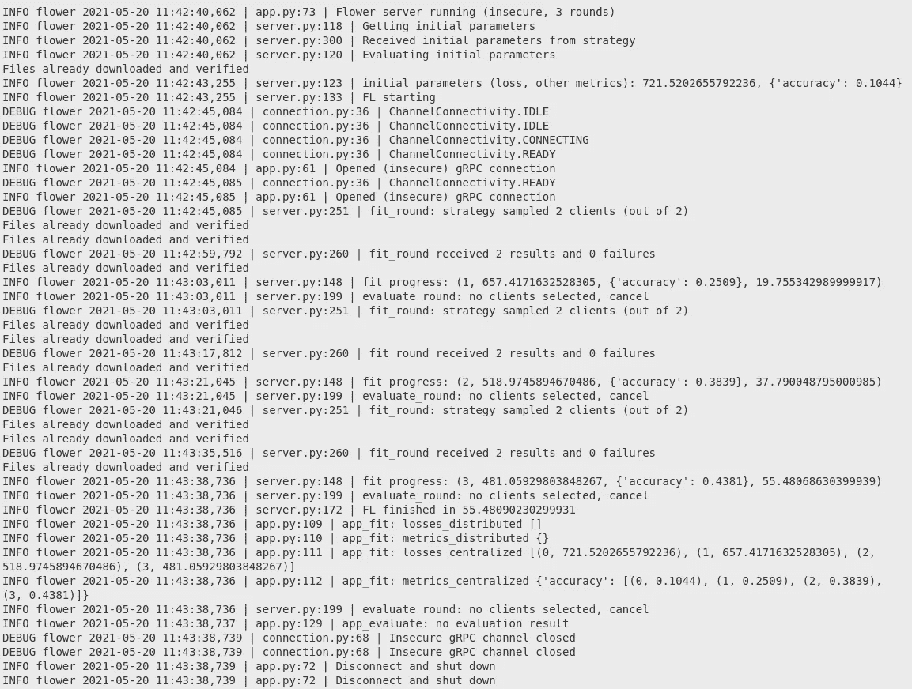
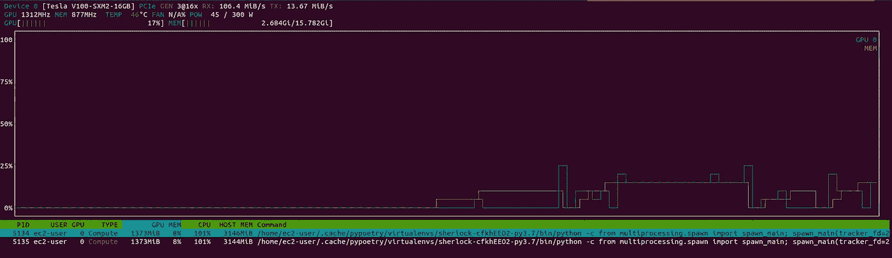

# 多重处理缩放花

> 原文：<https://towardsdatascience.com/scaling-flower-with-multiprocessing-a0bc7b7aace0?source=collection_archive---------17----------------------->

## [理解大数据](https://towardsdatascience.com/tagged/making-sense-of-big-data)

## 了解如何使用 Flower 框架和 PyTorch 的多处理在本地扩展您的联邦学习实验。


由[米切尔·林辛克](https://unsplash.com/@lensinkmitchel?utm_source=medium&utm_medium=referral)在 [Unsplash](https://unsplash.com?utm_source=medium&utm_medium=referral) 上拍摄的照片

# 联合学习简介:

随着技术的发展，最近的技术产生越来越多的数据，大量收集这些数据以训练准确的模型变得越来越容易获得。然而，这引起了隐私问题，为了确保对他们的保护，人们目前根据他们的居住地受到许多法律的保护(例如欧洲的 [GDPR](https://gdpr-info.eu/) )。当涉及个人数据时，不能盲目应用传统的机器学习方法，即在单个点积累数据来训练模型。

为了解决这个问题，谷歌在 2016 年发布了一种新的训练模型的范式，称为联邦学习，并将其应用于其谷歌键盘应用[ [1a](http://arxiv.org/abs/1610.05492) ] [ [1b](http://arxiv.org/abs/1602.05629) ]。它的引入是为了利用他们用来训练模型的公开可用数据集和用户将产生的私有数据之间的域差异问题。

正如联合学习手册[ [2](https://www.morganclaypool.com/doi/abs/10.2200/S00960ED2V01Y201910AIM043) ]中所指出的，为了让这种范式发挥作用，它需要遵守 4 个主要原则，即:

> *至少有两个实体想要训练一个模型，拥有自己的数据并准备使用。*
> 
> *在培训期间，数据不会离开其原始所有者。*
> 
> *模型可以通过受保护的方式从一个实体转移到另一个实体。*
> 
> *得到的模型性能是用单一实体拥有的所有数据训练的理想模型的良好近似。*

*最后一点也是在告诉我们，联合学习并不能一直适用。它最大的缺点是，至少在目前，联合学习对来自内部的攻击很敏感[ [3](http://arxiv.org/abs/1811.12470) ]，不能保证收敛[ [4](http://arxiv.org/abs/1810.07766) ]，并且需要足够多的客户端来实现它的结果[ [5](http://arxiv.org/abs/1902.01046) 。然而，当正确应用时，它可以产生通过常规手段无法获得的模型，如 Google 和他们的 Google Keyboard。*

*到目前为止，只有少数框架可以实现它，因为这是一个相当新的概念。TensorFlow 开发了自己的版本，名为 [TensorFlow Federated](https://www.tensorflow.org/federated) 。PyTorch 还没有自己的实现，但是它们确实存在兼容的框架，比如 OpenMined 开发的 [PySyft](https://github.com/OpenMined/PySyft) 和 [Flower](https://flower.dev/) ，这将是本文的重点。*

# ***为什么要用花:***

*Flower 是联邦学习的最新框架，创建于 2020 年。与 TensorFlow Federated 和 PySyft 链接到单个框架相反，Flower 可以通过设计与它们一起使用。它侧重于提供有效应用联合学习的工具，并允许您专注于培训本身。用 Flower 实现一个基本的联邦设置非常简单(20 行代码就足够了),将集中式代码改编成联邦代码所需的重写工作非常少。*

*此外，兼容设备的范围也非常广泛:从移动设备到 Raspberry Pi、服务器等等。其架构还允许多达 1000 个客户端的可扩展性，如他们的论文[ [6](http://arxiv.org/abs/2007.14390) ]所示。总的来说，这是一个非常好的实验框架。*

# ***GPU 问题:***

*如果您想在本地模拟一个联邦学习设置，只要 CPU 允许，扩展到尽可能多的客户机是非常容易的。对于基本款来说，CPU 绰绰有余，不需要在 GPU 上进行拓展训练。然而，当使用更大的模型或更大的数据集时，您可能希望转移到 GPU，以便大大提高训练速度。*

*这就是在扩展您的联邦设置时可能会遇到问题的地方。事实上，与其他一些框架不同，Flower 的目标是允许从研究/原型到生产的轻松部署，因此他们将客户视为独立的过程。此外，当访问 GPU 时，CUDA 会自动分配固定数量的内存，以便在请求更多内存之前有足够的空间来处理。*

*然而，这个内存根本不能被释放，至少在进程退出之前不能。这意味着，如果您正在启动 100 个客户端，并且每轮对其中的 10 个进行采样，并且正在使用 GPU，则每次客户端访问它时，都会有剩余的内存无法释放，并且随着新客户端被采样，剩余的内存会不断增加。从长远来看，你的 GPU 需要和客户端启动一样多的内存。*

*下面是一个简短的代码片段，它显示了这个问题，在 Google 联合实验室上运行:*

**

*监控内存显示，即使在清空 PyTorch 使用的内存后，还有 7%的剩余内存。图片作者。*

# ***如何解决问题:***

*你可能遇到过的这个问题很容易解决。由于在访问内存的进程被释放之前，内存是不会被释放的，所以我们只需要将需要访问 GPU 的那部分代码封装在一个子进程中，等待它被终止，直到我们可以继续执行我们的程序。多重处理是解决方案，我将向您展示如何使用 PyTorch 和 Flower 来实现。*

*由于这个例子是基于 Flower 文档中的[快速入门 Pytorch 教程](https://flower.dev/docs/quickstart_pytorch.html)，我强烈建议在继续之前查看一下，因为它展示了基础知识。*

# ***助手文件***

*首先，我们将为自己构建一个 *flower_helpers.py* 文件，我们将在其中放置一些函数和类，这些函数和类稍后会派上用场。从进口开始，我们有:*

*基本导入:用于 CIFAR10 工作的 torch 导入和一个 flower 策略导入，因为我们需要对用例的 FedAvg 策略稍作修改。然后，我们定义要在其上计算训练和测试步骤的设备:*

*接下来，我们需要定义如何加载数据:*

*一个简单的 CNN 模型来自“py torch:60 分钟闪电战”:*

*到目前为止，从最初的花卉教程没有什么变化，从现在开始事情会变得不同。因为我们不能将模型保存在客户端的内存中，所以我们需要定义一种方法来获取模型的权重，以便客户端可以跟踪它们。为此，我们从 flower 教程中移走了`get_parameters`和`set_parameters`函数，并将它们放在我们的助手文件中:*

*现在，我们可以定义每次客户想要训练其模型时将被调用的训练函数:*

*这个函数有三个参数，我们想要训练的本地历元的数量，全局模型的新参数和一个返回字典，该字典将作为我们的返回值向客户端返回更新的模型，本地数据集的大小和我们想要包括的其他度量，如损失或准确性。测试功能也是如此:*

*最后，我们需要定义我们的定制策略。这些在快速入门教程中没有提到，但是策略是决定服务器如何聚集新权重、如何评估客户端等的类。最基本的策略是 FedAvg(用于联合平均[ [1b](http://arxiv.org/abs/1602.05629) ]),我们将使用它来实现我们自己的策略。Flower 已经为您提供了一种方法，通过 FedAvg 策略的初始参数来定义您想要用来评估您的模型的客户数量，但是这只适用于每轮之间进行的评估。*

*事实上，在最后一轮之后，flower 服务器将执行最后一个评估步骤，对所有可用的客户端进行采样，以验证模型的性能。在真实情况下，这不会是一个问题，但在我们的情况下，这可能会适得其反，我们希望特别避免可能涉及 GPU 内存需求溢出的情况。*

*这就是为什么我们将在本教程中只在服务器端执行评估，并且我们将删除此功能。这是通过策略的`configure_evaluate` 方法完成的，我们需要覆盖它:*

# ***客户端文件***

*我们已经完成了助手文件，现在我们可以切换到客户端并创建 *client.py* 。从进口开始:*

*下一步是实现我们自己的客户端类，这样它就可以连接到 flower 服务器。我们需要从 NumpyClient flower 类派生并实现 4 个方法，即`get_parameters`、`set_parameters`、`fit`和`evaluate`。我们还将添加一个名为`parameters`的属性，在这里我们将跟踪模型的权重:*

*`get_parameters`和`set_parameters`很简单，它们只是一个 getter 和一个 setter:*

*然后`fit`方法是模型被训练的地方，它接收两个参数:来自全局模型的新参数和包含当前回合的配置的配置字典。在`fit`内部，我们将启动一个子进程，这样我们就可以使用 GPU 而不用担心内存延迟:*

*如您所见，该函数返回最新更新的参数、本地数据集的大小和一个字典(这里为空),其中可能包含不同的指标。最后我们有`evaluate`方法，类似于`fit`但用于评估。在我们的情况下，我们可以选择简单地实现最低要求，因为我们不会评估我们的客户。但是我将在这里给出完整的实现:*

*我们只需将所有这些打包在`main`中，设置`spawning`方式来创建新的子流程(不是 Python 下的默认方式)，并在本地端口 8080 上启动我们的客户端:*

# ***服务器文件***

*客户端完成后，我们现在可以向服务器前进，我们将简单地称之为 *server.py* ！在最初的教程中，启动服务器需要一行代码！但是在这里，我们将执行服务器端评估，并使用自定义策略，因此情况略有不同。从进口开始:*

*首先，我们需要定义在服务器端评估模型的方式，并将函数封装在`get_eval_fn`中，告诉服务器如何检索函数。该评估与我对客户端给出的评估几乎相同，您实际上可以合并其中的一部分:*

*然后我们可以启动`__main__`，加载参数并设置 spawn 方法:*

*然后我们得到一个新的网络，这样我们就可以初始化联邦循环的权重:*

*最后，定义策略并在端口 8080 上启动服务器:*

# ***Bash 文件***

*剩下唯一要做的就是启动我们的服务器和客户端！我们编写了一个很好的 bash 文件，所以我们只需运行它就可以开始实验了:*

# ***运行中***

*现在，只要在您的终端中运行`./run.sh`，一旦您将它转换成可执行文件(`chmod u+x run.sh)`，您应该会看到下面的输出:*

**

*运行脚本的终端输出。图片作者。*

*打开一个新终端并使用`nvtop`命令，我们可以实时监控我们的 GPU 使用情况:*

**

*使用 nvtop 时的 GPU 内存使用情况，蓝色表示 GPU 计算使用情况，黄色表示内存使用情况。图片作者。*

*我们可以看到，我们的客户端正在正确地生成子流程，并且每当它们完成训练时，内存都会被释放。*

*如果你得到一个由*“没有名为 backports.lzma 的模块”*引起的错误，你可以用`poetry add backports.lzma`命令添加这个包。*

*如果出于某种原因，您收到一个错误，告诉您客户端无法连接，请确定在客户端尝试连接之前，服务器有足够的时间进行设置。另一个原因可能是由于 [GRPC 和 Python](https://stackoverflow.com/questions/57599354/python-not-able-to-connect-to-grpc-channel-failed-to-connect-to-all-addresse) 的一个已知错误，您可以尝试在您的服务器和客户端文件中添加以下行:*

*所有的代码都可以在 [GitHub](https://github.com/matturche/flower_scaling_example) 上获得。现在，您可以启动 CPU 允许的任意数量的客户端，并根据需要管理 GPU 内存。本教程到此结束。希望对你有用，不要犹豫留下反馈！*

# ***更进一步***

*当然，这只是一个工作区的演示，还没有准备好进行真正的联邦实验，但是如果你需要更进一步，你可以尝试制作你自己的联邦数据集(现在我们为所有客户端加载相同的数据)或者使用像 [LEAF](https://leaf.cmu.edu/) 这样的基准。用 tqdm 包装培训和测试步骤，以获得更好的反馈，包括更详细的报告(精确度、召回率、F1 分数……)。添加一种通过加密或差分隐私保护模型的方法。诸如此类。你也可以查看更多的[花卉教程](https://flower.dev/docs/#user-guide)来更好地掌握框架的可能性。*

*最后，Flower 的团队在他们最近的[峰会](https://www.youtube.com/watch?v=MTUKPP4f-uI)上讨论了扩展问题，似乎虚拟客户端管理器的发布将允许解决这个问题，甚至通过允许每轮使用数千个客户端来进一步改进扩展，同时仍然考虑可用资源。*

# ***参考文献***

```
*[1a] J. Konečný, H. B. McMahan, F. X. Yu, P. Richtárik, A. T. Suresh, and D. Bacon, [Federated Learning: Strategies for Improving Communication Efficiency](http://arxiv.org/abs/1610.05492) (2017), arXiv:1610.05492 [cs][1b] H. B. McMahan, E. Moore, D. Ramage, S. Hampson, and B. A. y Arcas, [Communication-Efficient Learning of Deep Networks from Decentralized Data](http://arxiv.org/abs/1602.05629) (2017), arXiv:1602.05629 [cs][2] Q. Yang, Y. Liu, Y. Cheng, Y. Kang, T. Chen, and H. Yu, “[Federated Learning](https://www.morganclaypool.com/toc/aim/1/1) (2019), Synthesis Lectures on Artificial Intelligence and Machine Learning, vol. 13, no. 3, pp. 1–207[3] A. N. Bhagoji, S. Chakraborty, P. Mittal, and S. Calo, [Analyzing Federated Learning through an Adversarial Lens](http://arxiv.org/abs/1811.12470) (2019) arXiv:1811.12470 [cs, stat][4] C. Yu et al., [Distributed Learning over Unreliable Networks](http://arxiv.org/abs/1810.07766) (2019), arXiv:1810.07766 [cs][5] K. Bonawitz et al., [Towards Federated Learning at Scale: System Design](http://arxiv.org/abs/1902.01046) (2019), arXiv:1902.01046 [cs, stat][6] D. J. Beutel et al., [Flower: A Friendly Federated Learning Research Framework](http://arxiv.org/abs/2007.14390) (2021), arXiv:2007.14390 [cs, stat]*
```