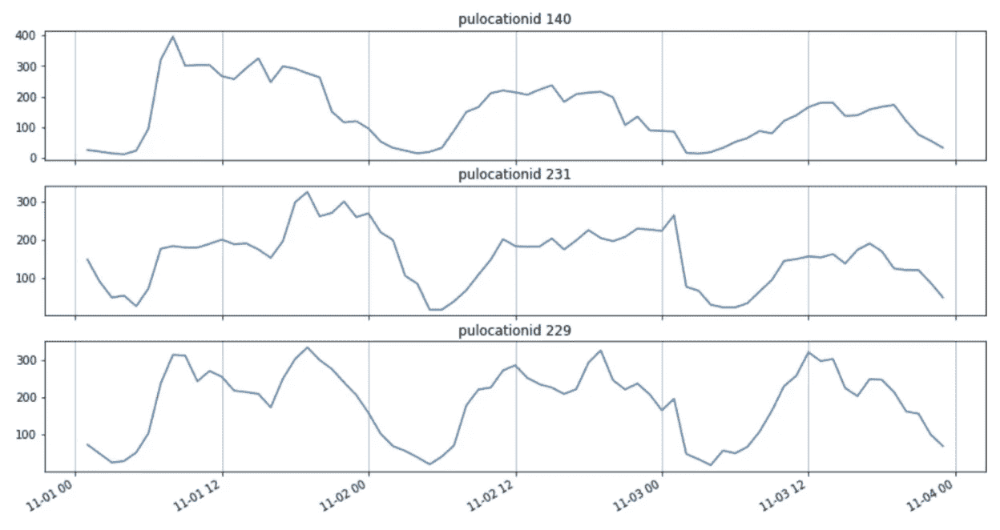
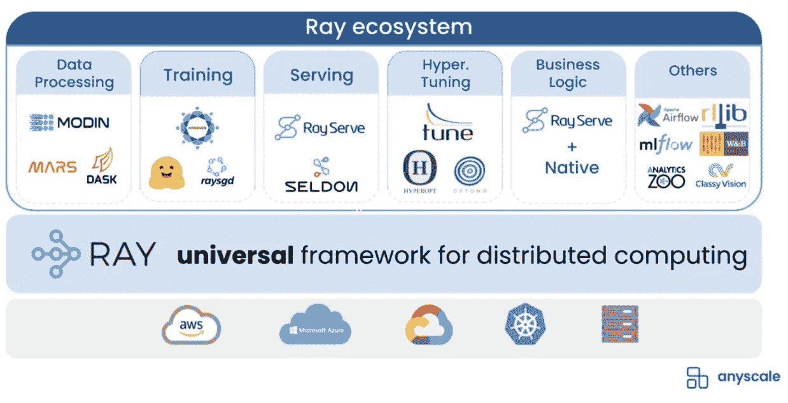
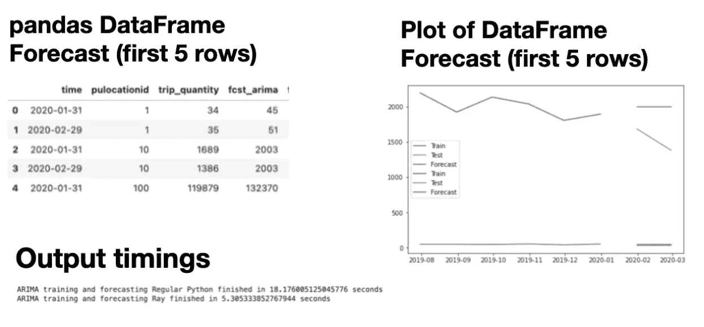
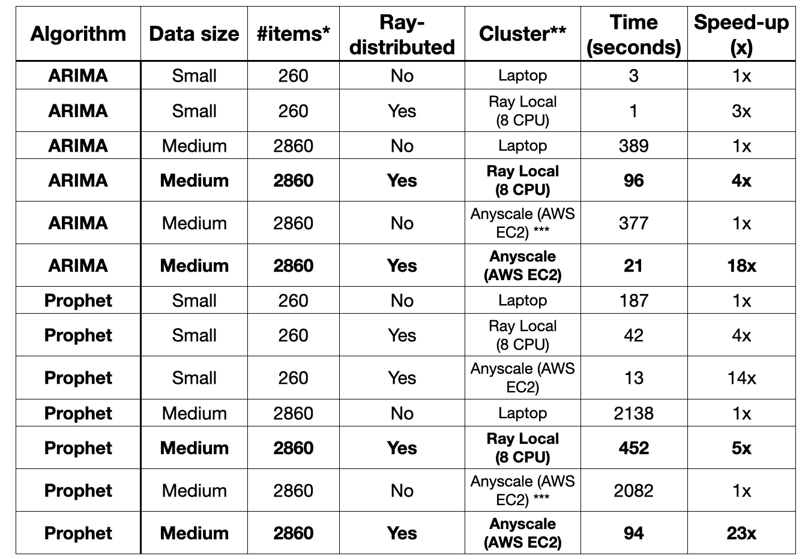

# 如何利用 Ray core 更快地训练时间序列预测？第 1 部分，共 3 部分。

> 原文：<https://towardsdatascience.com/scaling-time-series-forecasting-with-ray-arima-and-prophet-e6c856e605ee?source=collection_archive---------17----------------------->

## 利用 ARIMA 和 Prophet 进行时间序列预测



图片作者。显示纽约市黄色出租车的乘坐量。本博客使用了 6 个月的历史数据。

预测是经营每项业务的重要组成部分。你需要知道生产什么和生产多少，特别是如果交货时间很长，以便为你的客户提供库存。如果你订购太多，你会有过多的库存，这会增加成本。如果你订得太少，你可能会失去销售机会。

如果你是一名数据科学家，在一家快速发展的公司负责维护预测，那该怎么办？产品、用户功能和相关数据都在快速变化。这意味着数据漂移是已知的。也就是说，输入模型要素的基础统计分布正在快速变化。这意味着您需要重新训练您的模型，可能每周或更长时间。

对于数据科学家来说，训练新模型不仅仅是训练最终模型所需的时间。开发时间包括训练所有候选模型、迭代它们以及选择最佳模型所花费的时间。如果训练一个模型需要几个小时，你就不能及时完成工作。您需要能够更快地迭代模型训练/推理。一种更快迭代的方法是将 Python 代码转换成并行 Python。

**本博客将讨论以下主题:**

*   **什么是统计预测？**
*   什么是 Ray，它如何轻松地分发您的 Python 模型训练和推理？
*   **ARIMA 对雷**
*   **先知靠雷**
*   **什么是 Anyscale，它如何在云中的集群上运行你的光线分布代码**

# 什么是统计预测？

预测模型通常分为两类:1)局部统计模型，和 2)全局深度学习模型。

“本地模型”意味着每个时间序列一次一个地被独立训练。也就是说，如果您有 20K 个要生成需求预测的项目，则需要训练 20K 个统计模型。每个模型还可以有其他独立变量来帮助预测，如天气，但每个模型都不知道其他模型。

“全球模型”是指每个时间序列都是一个整体模型的输入，该模型作为一个全球系统同时从所有输入中学习。每个时间序列输入通常被认为是深度学习模型中的一个神经元。直观上，如果产品之间存在相互关系，这是有意义的，这有助于提高所有产品的整体预测准确性。

这个博客是关于用本地统计模型进行预测的。下一篇博客将会是关于全球深度学习模型的预测。

# 雷是什么？

[Ray 是由加州大学伯克利分校的 RISELab 开发的开源库](https://www.ray.io/)，加州大学伯克利分校也开发了 Spark。Ray 通过使 Python 代码并行和分布式，使其易于扩展。分布式 Python 代码可以在任何类型的集群上运行:a)您自己的笔记本电脑内核，b) AWS、GCP 或任何常见的云。

Ray 及其生态系统与 ML 库合作，如 [scikit-learn](https://www.anyscale.com/blog/how-to-speed-up-scikit-learn-model-training) 、 [XGBoost](https://www.anyscale.com/blog/distributed-xgboost-training-with-ray) 、 [LightGBM](https://www.anyscale.com/blog/introducing-distributed-lightgbm-training-with-ray) 、 [PyTorch](https://medium.com/pytorch/getting-started-with-ray-lightning-easy-multi-node-pytorch-lightning-training-e639031aff8b) 、 [TensorFlow](https://docs.ray.io/en/latest/using-ray-with-tensorflow.html) 。Ray 是数据处理库 [Modin](https://github.com/modin-project/modin) 背后的[最佳实践](https://www.datarevenue.com/en-blog/pandas-vs-dask-vs-vaex-vs-modin-vs-rapids-vs-ray)并行引擎，也与 [Dask](https://docs.ray.io/en/latest/data/dask-on-ray.html) 一起工作。



射线生态系统，来自斯托伊察在 2021 年射线峰会上的主题演讲。

今天，分发代码是困难的。通常它涉及到将现有的 Python 重写为多处理 Python 或者将其转换为 PySpark 或 SparkSQL。Ray 可以很容易地将您现有的按顺序运行的 Python 代码转换成分布式应用程序，只需对代码进行最少的更改。最终的光线分布代码可以在底层硬件上并行运行。参见这篇关于将 12 小时的图像处理时间减少到 4 分钟的博客。另请参见这个[视频演示](https://www.anyscale.com/events/2021/06/22/anyscale-demo-machine-learning-application-from-dev-to-prod)，它是一个推荐系统，使用 xgboost，在 Anyscale 上进行超参数调优。

# ARIMA 关于雷的例子

目前最常用的两种时间序列统计预测算法是 [ARIMA](https://en.wikipedia.org/wiki/Autoregressive_integrated_moving_average) 和[预言家](https://facebook.github.io/prophet/)。在高层次上，ARIMA 假设过去和未来之间的因果关系。也就是说，时间 t+1 的预测值与过去发生的事情有潜在的关系。你可以把 ARIMA 想象成建筑公式。一个 ARIMA 模型由坐标(p，d，q)组成: **p** 代表自回归项的数量，把这看作季节性。 **d** 表示使时间序列稳定所需的差异数(即具有恒定的均值、方差和自相关)。 **q** 代表移动平均部分或者过去有多少数据点将被指数平滑以预测未来。

ARIMA 模型最初是用 R 编程语言开发的，后来转换成了 Python。较新的 Python 库之一是 [pmdarima](https://pypi.org/project/pyramid-arima/) ，它实现了 Rob Hyndman 的 [auto.arima()](https://www.rdocumentation.org/packages/forecast/versions/8.10/topics/auto.arima) 。

下面所有的示例代码都使用 Python 3.8 和 Ray v1.8，可以在 github 上获得[。**要使用射线分发 ARIMA，请遵循以下步骤 1–5:**](https://github.com/christy/AnyscaleDemos/blob/main/forecasting_demos/nyctaxi_arima_simple_SMALL_data.ipynb)

**第一步。安装并导入射线和任意缩放。**

```
*# !pip install "ray[default]" # Run distributed code
# !pip install pmdarima # ARIMA library
# !pip install anyscale # Run Ray distributed code on any cloud***import** os  *# Python os functions*
**import** ray  *# Run distributed code*
**import** numpy **as** np  *# Numerical processing*
**import** pandas **as** pd  *# Dataframe (tabular data) processing*
**import** matplotlib.pyplot **as** plt
**import** pickle

*# Open-source ARIMA forecasting libraries*
**import** pmdarima **as** pm
**from** pmdarima.model_selection **import** train_test_split
```

**第二步。本地启动一个 ray 服务器**。这里的想法是你可以在本地测试你的分布式代码。快速迭代，把所有 bug 弄出来。在云上测试分布式代码的额外费用和时间之前。

```
1  # num_cpus, num_gpus are optional parameters
2  # by default Ray will detect and use all available 
3
4  ray.init()
```

**第三步。将原始 ARIMA 训练函数转换为射线函数。**假设这是最初的 ARIMA 列车功能。

```
1  **def** **train_model_ARIMA**(
2    theDF:pd.DataFrame, item_col:str,
3    item_value:str, target_col:str,
4    train_size:int=6,
5  ) -> list:
6
7    # split data into train/test
8    train, test = train_test_split(
9       theDF.loc[(theDF[item_col]==item_value), :],
10      train_size=train_size
11   )
12
13 # train and fit auto.arima model
14 model = pm.auto_arima(y=train[target_col])
15 **return** [train, test, model]
```

目前，ARIMA 需要一个额外的 pickle 步骤来确保 statsmodels 库对象被正确序列化([解释](https://alkaline-ml.com/pmdarima/1.0.0/serialization.html))。额外的酸洗/拆洗是为了便于携带。由于后台的代码将被分发，所以对象需要与 pickle 兼容。HIGHEST_PROTOCOL，因此它们可以在任何节点上的任何地方运行，并且可以再次被检索。Ray 可能会消除未来对泡菜解决方案的需求。

转换 ARIMA 训练函数的步骤:
a)添加光线装饰器，指定 3 个返回输出。增加一个额外的腌制步骤

**下面是 ARIMA 火车功能的射线版本。**函数名中多出来的`_remote`是文体的，为了明确哪个函数是并行的。**粗体部分是代码与原始 Python 不同的地方。**

```
1  #add the Ray decorator
2  **@ray.remote(num_returns=3)**
3  def train_model_ARIMA**_**remote(
4     theDF:pd.DataFrame, item_col:str,
5     item_value:str, target_col:str,
6     train_size:int=6,
7  ) -> list:
8
9     # split data into train/test
10    train, test = train_test_split(
11       theDF.loc[(theDF[item_col]==item_value), :],
12       train_size=train_size
13    )
14
15    # train and fit auto.arima model
16    model = pm.auto_arima(y=train[target_col])
17
18    # return [train, test, model] 
19    # here is the extra pickle step 
20    return [train, test, **pickle.dumps(model)**]
```

**第四步。将原始的 ARIMA 推理函数转换成射线函数。** 假设这是 ARIMA 推理的原始函数。

```
1  **def** **inference_model_ARIMA**(
2     model:"pmdarima.arima.arima.ARIMA",
3     test:pd.DataFrame,
4     item_col:str,
5     target_col:str,
6  ) -> pd.DataFrame:
7
8     # inference on test data
9     forecast = pd.DataFrame(
10        model.predict(
11            n_periods=test.shape[0], 
12            index=test.index,
13         )
14    )
15    **return** forecast
```

转换 ARIMA 推理函数的步骤:
a)添加光线装饰器。
这一次我们不需要额外的光线装饰选项，它默认返回 1 个对象。
b)将传递的模型对象的类型更改为仅字节
c)添加一个额外的取消拾取步骤

**下面是 ARIMA 推论的雷版本。**函数名中多出来的`_remote`是文体的，为了明确哪个函数是并行的。粗体部分是代码与原始 Python 不同的地方。

```
1  **@ray.remote**
2  def inference_model_ARIMA_remote(
3     model_pickle:**bytes**,
4     test:pd.DataFrame,
5     item_col:str,
6     target_col:str,
7  ) -> pd.DataFrame:
8
9     # Here is extra unpickle step
10    **model = pickle.loads(model_pickle)**
11 
12    # inference on test data
13    forecast = pd.DataFrame(
14        model.predict(
15            n_periods=test.shape[0], 
16            index=test.index,
17         )
18    )
19    return forecast
```

**第五步。现在调用分布式函数，而不是调用原来的训练和推理函数。**
假设 ARIMA 训练和推理函数最初就是这样被调用的。

```
1   model = []
2   train = []
3   test = []
4
5   # Train every model
6   train, test, model = **map**(
7   **list**,
8   **zip**(
9       *(
10          [
11              train_model_ARIMA(
12                  g_month.set_index("time"),
13                  item_col="pulocationid",
14                  item_value=v,
15                  target_col="trip_quantity",
16                  train_size=6,
17              )
18              **for p, v in enumerate**(item_list)
19          ]
20      )
21    ),
22  )
23
24  # Inference every model
25  forecast = [
26      inference_model_ARIMA(
27          model[p], test[p], item_col="pulocationid", 
28          target_col="trip_quantity"
29      )
30      **for p in range**(len(item_list))
31  ]
```

Ray 执行并行远程计算，直到您请求对象。Ray remote compute，或者说 [Python“期货”](https://docs.python.org/3/library/concurrent.futures.html)，并不像 spark 处理中那样“懒惰”。的。远程()调用是并行异步进行的。使用`ray.get()`在未来的某个时间检索值。在这一点上，所有的分布式代码执行被收集起来并返回给用户。在后台，光线对象引用被转换回 pandas 数据帧，或者用户请求的任何类型的对象。

转换 ARIMA 训练和推理调用函数的步骤:
a)用。remote()方法
b)使用 ray.get()获得预测

**下面是用 Python 调用 ARIMA** 训练和推理函数的 Ray 版本。因为我们在这里使用的是 Ray Core，所以我们需要手动执行额外的 ray.put(data)步骤。**粗体部分是代码与原始 Python 不同的地方。**

```
1   model = []
2   train = []
3   test = [] 
4  
5   # initialize data in ray object store on each compute node
6   **input_data_ref = ray.put(g_month.copy())**
7
8   # Train every model
9   train, test, model = map(
10  list,
11  zip(
12      *(
13          [   # call Ray functions using .remote() method
14              train_model_ARIMA_remote**.remote**(
15                  **input_data_ref**.set_index("time"),
16                  item_col="pulocationid",
17                  item_value=v,
18                  target_col="trip_quantity",
19                  train_size=6,
20              )
21              for p, v in enumerate(item_list)
22          ]
23      )
24    ),
25  )
26
27  # Inference every model
28  forecast_obj_refs = [ 
29      # call Ray functions using .remote() method
30      inference_model_ARIMA_remote**.remote**(
31          model[p], test[p], item_col="pulocationid", 
32          target_col="trip_quantity"
33      )
34      for p in range(len(item_list))
35  ]
36 
37  # ray.get() means block until all objectIDs are available 
38  **forecast = ray.get(forecast_obj_refs)**
```

就是这样！您刚刚使用 Ray 发布了 ARIMA 训练和推理！**所有项目的 ARIMA 预测现在将并行处理。**样本输出如下所示。



仅显示 2 个预测，而不是所有预测。在笔记本电脑上运行的屏幕截图。

# 光线上的先知示例

Prophet 是广义可加模型的一个特例。ARIMA 试图建立一个未来值的公式作为过去值的函数，而预言家试图发现“变化点”；你可以把 Prophet 想象成曲线拟合。

来自脸书的最新开源库 [Kats](https://github.com/facebookresearch/Kats) ，包括 [original Prophet](https://github.com/facebook/prophet/tree/main/python/prophet) 以及用于多元预测、深度学习预测和异常检测的更新库。对 githubs 的进一步检查表明，Kats 里面的先知比最初的先知维护得更晚。

下面所有的示例代码都使用 Python 3.8 和 Ray v1.8，可以在 github 上获得[。**要使用光线分发 Prophet，请遵循下面的步骤 1–5:**](https://github.com/christy/AnyscaleDemos/blob/main/forecasting_demos/nyctaxi_prophet_simple_SMALL_data.ipynb)

**第一步。安装并导入射线和任意缩放。**

```
*# !pip install "ray[default]" # Run distributed code
# !pip install kats # Prophet library
# !pip install anyscale # Run Ray distributed code on any cloud***import** os  *# Python os functions*
**import** ray  *# Run distributed code*
**import** numpy **as** np  *# Numerical processing*
**import** pandas **as** pd  *# Dataframe (tabular data) processing*
**import** matplotlib.pyplot **as** plt

*# Open-source Prophet forecasting libraries*
**import** kats
**from** kats.consts **import** TimeSeriesData
**from** kats.models.prophet **import** ProphetModel, ProphetParams
```

**第二步。在本地启动一个 ray 服务器，告诉它可以使用多少个处理器**。

```
1  # num_cpus, num_gpus are optional parameters
2  # by default Ray will detect and use all available 
3
4  ray.init()
```

**第三步。没事**！不需要改变原有的 Python train 和推理 Prophet 函数。

**第四步。给你现有的训练和推理函数**添加一个光线装饰器。装饰者可以通过复制/粘贴/修改 def 函数代码来手动添加，正如我们在上面的 ARIMA 例子中所展示的。装饰者可以通过声明的方式添加。当您不需要修改原始代码时，请这样做。

```
1  # Ray parallel function declaration, no change to original code
2  **train_model_PROPHET_remote =  
      ray.remote(train_model_PROPHET).options(num_returns=3)**
3  **inference_model_PROPHET_remote = 
      ray.remote(inference_model_PROPHET)**
```

**第五步。现在调用分布式函数，而不是调用原来的训练和推理函数。**
假设这就是最初先知训练和推理功能被调用的方式。

```
1   train = []
2   test = []
3   model = []
4   forecast = []
5
6   input_data_ref **=** ray**.**put(g_month**.**copy())
7
8   # Train every model
9   train, test, model = **map**(**list**, **zip**(*(
               [train_model_PROPHET(**input_data_ref**,
9                     item_col='pulocationid',
10                    item_value=v,
11                    target_col='trip_quantity',
12                    train_size=6) 
13               **for p,v in enumerate**(item_list)] )))
14
15  # Inference every model
16  forecast = [inference_model_PROPHET(model[p],
17                test[p],
18                item_col='pulocationid',
19                target_col='trip_quantity') 
20             **for p in range**(len(item_list))]
```

转换 Prophet 训练和推理调用函数的步骤:
a)用。remote()方法
b)使用 ray.get()获得预测。

**下面是 Python 中调用 Prophet** train 和推理函数的 Ray 版本。为了清楚起见，我重命名了 train，test 函数名，但这不是必需的。因为我们在这里使用的是 Ray Core，所以我们需要手动执行额外的 ray.put(data)步骤。粗体部分是代码与原始 Python 不同的地方。

```
1   train = []
2   test = []
3   model = []
4   forecast = [] 
5
6   # initialize data in ray object store on each compute node
7   **input_data_ref = ray.put(g_month.copy())** 8 
9   # Train every model
10  train, test, model = map(list, zip(*(
11               # call Ray functions using .remote() method
12               [train_model_PROPHET_remote**.remote**(
13 **input_data_ref**,
14                    item_col='pulocationid',
15                    item_value=v,
16                    target_col='trip_quantity',
17                    train_size=6) 
18               for p,v in enumerate(item_list)] )))
19
20  # Inference every model
21  **forecast_obj_refs** = 
22             # call Ray functions using .remote() method
23             [inference_model_PROPHET_remote**.remote**(model[p],
24                test[p],
25                item_col='pulocationid',
26                target_col='trip_quantity') 
27             for p in range(len(item_list))] 
28
29  # ray.get() means block until all objectIDs are available
30  forecast_PROPHET = **ray.get(forecast_obj_refs)**
```

就是这样！您刚刚使用 Ray 分发了先知训练和推理！

**这些小调整将 Prophet 在笔记本电脑上的运行时间减少了 4 倍。即 300%的提速。**有关更多运行时间，请参见本文末尾的表格。

*注意:我们观察到 Prophet 的速度有所提高，因为它的运行时间比 ARIMA 长。作为“统计模型”, ARIMA 和预言家都采用非常小的数据输入，因此我们可以期待通过分发代码得到相应大小的加速。*

# 什么是 Anyscale？

一旦在本地内核上使用 Ray 调试和测试了新发布的 Python 代码，就可以在云中运行相同的代码了。

[Anyscale](https://www.anyscale.com/) 简化了 Ray 应用的构建、运行和管理，在云中加速计算，跨集群并行运行分布式代码，使用内置的自动扩展规则，并兼容所有常用的云提供商(AWS、GCP 等)。Anyscale 适用于多云策略，因为它的使用不会产生供应商锁定。Anyscale 仅依赖于基本的计算实例，这使得它的运营成本低于许多作为服务出售的打包产品。

注意:目前 Anyscale 只能通过邀请私人测试版获得。[在这里报名](https://www.anyscale.com/signup)试试吧。

下面是开始使用 Anyscale 的 3 步快速指南。更多详情参见[【入门】](https://docs.anyscale.com/)。Anyscale 可以从 web UI 控制台(下面的截图)或。在幕后，Anyscale 使用了[开源的 Ray](https://docs.ray.io/en/latest/cluster/index.html) 。

**第一步。通过您的 Anyscale 帐户认证进入云**。您只需要这样做一次。

*   **打开**控制台**[https://console.anyscale.com/credentials](https://console.anyscale.com/credentials)**
*   ****复制**创建 json 文件命令**
*   **将**粘贴到您的本地终端。****

****第二步。从应用程序中运行 ray.init()** 。**

**注释掉之前的 ray init()，它在本地运行 ray 服务器。
`# NUM_CPU = 8
# ray.init( ignore_reinit_error=True , num_cpus = NUM_CPU)`**

****添加一个新的 ray.init()来连接集群**。**

**`my_env={"working_dir": ".", "pip": ["pmdarima", "kats"]}
ray.init("anyscale://my_cluster_name", runtime_env=my_env)`**

**您可以指定更多的 pip 安装，克隆一个 github repo，或者将整个代码目录复制到[集群或者运行时环境](https://docs.anyscale.com/user-guide/configure/dependency-management/anyscale-environments)。首先使用集群配置，然后运行时配置(如果指定)将覆盖集群配置。配置的结果是在云集群的每个节点上自动安装额外的库、代码和数据。**

**上面，我使用了一个默认的集群配置(它指定了自动伸缩策略)，并且我把额外的`pip install`放在运行时配置中。url 字符串`"anyscale://my_cluster_name"`中的`my_cluster_name`将成为您的新集群名。**

****第三步。像平常一样运行 python 代码(或笔记本)。**它会自动并行运行，分布在云中的各个集群上！**

**当您的应用程序运行时，您可以在`Clusters`下的 [Anyscale 控制台](https://console.anyscale.com/)中监控您的集群使用情况。**

****下表总结了所有运行时间。注意，未并行化的 Python 代码不会加速，即使在典型的云中运行也是如此。****

****

*** #items 表示行项目的数量或要预测的不同时间序列的数量。笔记本电脑是 macbook pro (13 英寸，M1，2020 年)。AWS 上的 Anyscale 设置为:头节点类型 m5.2xlarge，工作节点 m5.4xlarge 和 g4dn.4xlarge，自动缩放打开，最大 10。***在云中运行的常规 Python(非光线分布代码)只在 1 个 CPU(头节点)上运行。**

# **结论**

**这篇文章介绍了数据科学家如何轻松地对他们的 ARIMA 和先知模型进行训练和推理。**使用 Ray，不必重写底层的现有代码库。****

**Ray 分布式 Python 代码是:**

1.  **由本地 [**Ray**](https://www.ray.io/) 服务器跨本地笔记本电脑内核并行分发和执行。**
2.  **由 [**Anyscale**](https://www.anyscale.com/) 集群管理，在云中并行分发和执行。**

**这展示了一些非常强大的东西。世界上有很多 ML Python 代码。**要在云上纵向扩展，仅仅在云上运行代码是不够的。请参见上面的运行时表。**该代码必须重新编写成分布式 Python 代码；否则，它将只在一个节点上运行。**

**一些读者可能想知道，这些用于轻松分发时间序列预测 Python 代码的模式是否也可以用于分发任何大型数据输入和任何 AI/ML 算法？**我觉得答案是肯定的！****

**[在这个更快预测的博客系列中，第 2 部分](/how-to-train-time-series-forecasting-faster-using-ray-part-2-of-2-aacba89ca49a)将讨论大型深度学习模型的并行化。**

# **资源**

1.  **雷 doc 页数:[https://docs.ray.io/en/latest/using-ray.html](https://docs.ray.io/en/latest/using-ray.html)**
2.  **Anyscale 文档页数:[https://docs.anyscale.com/get-started](https://docs.anyscale.com/get-started)**
3.  **统计时间序列预测方法背景介绍:【https://otexts.com/fpp3/ **
4.  **背景介绍在令人尴尬的平行模式中，这里使用了排比:[https://en.wikipedia.org/wiki/Embarrassingly_parallel](https://en.wikipedia.org/wiki/Embarrassingly_parallel)**

***原载于*[*https://www.anyscale.com*](https://www.anyscale.com/blog/scaling-time-series-forecasting-on-ray-arima-and-prophet-on-ray)*。***

**请随意使用我的截图和代码，但请做一个好公民，如果你想在自己的工作中使用它们，请记得注明出处。**

**如果你对我的文章或人工智能或人工智能有任何反馈、评论或有趣的见解要分享，请随时在我的 LinkedIn 上联系我。**