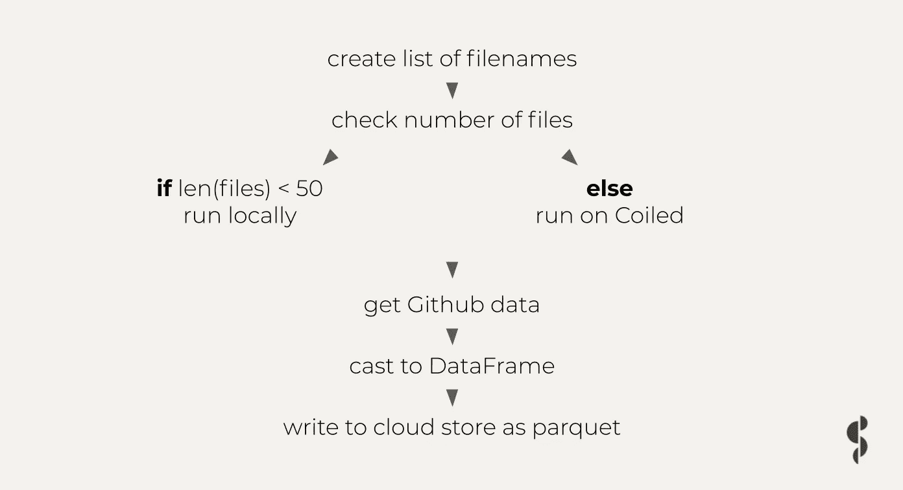

# 借助 Dask，以闪电般的速度运行繁重的级长工作流

> 原文：<https://towardsdatascience.com/scaling-your-prefect-workflow-to-the-cloud-2dec4e0b213b?source=collection_archive---------24----------------------->

## 借助 Dask 和 Coiled 实现云原生工作流自动化


图片由比利·胡恩通过[unsplash.com](http://www.unsplash.com)拍摄

Prefect 是一个流行的用于自动化工作流程编排的开源 Python 库。当运行即时可用的 Prefect 时，工作流的*编排*在云中完成，而代码的实际*计算*在本地机器上完成。这意味着您的完美云工作流受到您的机器资源的限制。

这篇博文将向你展示:

1.  如何使用 DaskExecutor 在本地完美工作流中利用并行性
2.  何时以及如何将 DaskExecutor 连接到云计算集群，以超越本地机器的限制。
3.  如何使用 Prefect ResourceManager 构建一个工作流，仅在必要时将计算委托给云中的集群。

你也可以用这个完美的 Python 脚本直接进入代码。

# 通过并行计算加快处理速度

完美的工作流使用流程和任务构建数据管道，这些流程和任务由执行者编排。提督的默认执行器按顺序运行任务。这对于简单的工作流来说没什么问题，但这意味着您的计算可能会比需要的速度慢，因为它们没有充分利用可用资源。

作为一名数据科学家或工程师，您会希望通过切换到 [DaskExecutor](https://docs.prefect.io/orchestration/flow_config/executors.html#daskexecutor) 来优化性能。这将利用您的本地机器的多个核心，加速计算繁重的任务，如加入，洗牌和机器学习作业。

```
# create a temporary local Dask Executor 
executor = DaskExecutor()
```

当达到机器的内存极限时，可以将 DaskExecutor 连接到云计算资源，以便在多台机器上分配工作。一种方法是旋转一个盘绕的集群，并在那里运行您的完美流，方法是:

*   在远程集群上运行您的整个完美工作流，例如通过[使用盘绕集群作为您的 DaskExecutor](https://docs.coiled.io/user_guide/examples/prefect.html#running-all-prefect-tasks-on-coiled) ，
*   在远程集群上运行特定的完美任务，例如通过[在特定的计算密集型任务](https://docs.coiled.io/user_guide/examples/prefect.html#calling-coiled-from-a-prefect-task)中旋转盘绕的集群，
*   仅当数据集的大小超过某个阈值时，才在远程集群*上运行特定的提督任务，例如通过使用提督资源管理器对象内的盘绕集群*

上述成卷文件的链接包括前两种方法的例子；下一节将向您展示如何编写一个完美的脚本，当数据集的大小超过某个阈值时，将计算委托给一个盘绕的集群。

*免责声明:我在 Coiled 工作，是一名数据科学传播者。*[*Coiled*](http://coiled.io/)*由*[*Dask*](https://dask.org/)*的最初作者 Matthew Rocklin 创立，是一个面向分布式计算的开源 Python 库。*

# 使用 Dask 的自动化完美 ETL 管道

下面的代码示例将 Github 归档数据集从 JSON 转换为 Parquet，并将其写入云存储，每当数据集变得太大而无法在本地处理时，就利用 Coiled 的计算资源来这样做。这意味着您可以在云上转换整个 75GB 的数据集，而不必将其下载到您的机器上。你可以在这里找到完整的 Python 脚本。

ETL 工作流看起来会像这样:



作者图片

# 定义您的完美任务运行

让我们从定义我们想要运行的任务开始。如果你习惯于定义一个提督任务，可以随意向下滚动到下一部分，将你的提督工作流程连接到 Coiled。

让我们按照任务运行的顺序来定义任务。我们将从 Prefect 任务开始，该任务将创建我们想要从 Github 存档中获取的文件名列表。关于我们如何构建这些代码的更多背景信息，请看一下这个 Jupyter 笔记本。

```
@task 
def create_list(start_date, end_date, format="%d-%m-%Y"): 
    start = datetime.datetime.strptime(start_date, format) 
    end = datetime.datetime.strptime(end_date, format) 
    date_generated = [start + datetime.timedelta(days=x) for x in range(0, (end-start).days)] 
    prefix = "https://data.gharchive.org/" 
    filenames = []     for date in date_generated: 
        for hour in range(1,24): 
            filenames.append(prefix + date.strftime("%Y-%m-%d") + '-' + str(hour) + '.json.gz') 

    return filenames
```

接下来，让我们定义一个任务，这个任务将决定我们的流将旋转的集群的类型。我们将使用`len(filenames)`作为数据集大小的代理，您也可以考虑其他方法来估计内存中数据的大小。

```
@task 
def determine_cluster_type(filenames): 
    if len(filenames) > 100: 
        return "coiled" 
    return "local"
```

我们还需要一个任务来获取在`filenames`列表中指定的数据...

```
@task 
def get_github_data(filenames): 
    records = db.read_text(filenames).map(ujson.loads) 
    push_events = records.filter(lambda record: record["type"] == "PushEvent") return push_events
```

…一个将原始 JSON 数据转换成表格数据帧格式的`Task` ...

```
@task
def to_dataframe(push_events): 
  def process(record): 
    try: 
      for commit in record["payload"]["commits"]: 
        yield { 
          "user": record["actor"]["login"], 
          "repo": record["repo"]["name"], 
          "created_at": record["created_at"], 
          "message": commit["message"], 
          "author": commit["author"]["name"], }   
    except KeyError: 
      pass   processed = push_events.map(process) 
  df = processed.flatten().to_dataframe() 
  return df
```

…和一个`Task`将展平的数据帧作为拼花文件写入我们的 S3 存储桶。

```
@task
def to_parquet(df, path): 
  df.to_parquet(path, engine='fastparquet', compression='lz4' )
```

# 具有完美资源管理器的 Dask 集群设置

太棒了，我们已经定义了流程中的所有任务。下一步是定义我们的流可以使用的两种集群类型:`local` 用于当数据集小到足以在本地处理时，而`coiled` 则用于其他情况。

使用临时云计算资源时，您需要确保这些资源得到正确的实例化、使用和清理，以避免错误和不必要的成本。我们将通过定义所需的`__init__`、`setup`和`close`块，使用提督`[ResourceManager](https://docs.prefect.io/core/idioms/resource-manager.html)`对象来完成这项工作。确保在`__init__` 定义中包含任何想要传递给集群的关键字参数。这个块创建 Dask 集群，包括 Dask 调度程序，并将其连接到您的本地客户机。

```
# Define a ResourceManager object 
@resource_manager 
class DaskCluster:   def __init__(self, cluster_type="local", n_workers=None, software=None, account=None, name=None): 
    self.cluster_type = cluster_type 
    self.n_workers = n_workers 
    self.software = software 
    self.account = account 
    self.name = name   def setup(self):  
    if self.cluster_type == "local": 
      return Client(processes=False) 
    elif self.cluster_type == "coiled": 
      cluster = coiled.Cluster(
                  name = self.name, 
                  software = self.software, 
                  n_workers = self.n_workers, 
                  account = self.account) 
      return Client(cluster)   def cleanup(self, client): 
    client.close() 
    if self.cluster_type == "coiled": 
      client.cluster.close()
```

# 构建完美的 Dask 数据工程流程

现在您已经定义了您的`Tasks`和`ResourceManager`，下一步是告诉 Prefect 这些任务是如何相互关联的，以及您将需要它们如何运行。我们还将定义一些可以根据用户运行的流程进行调整的 `Parameters`。

```
# Build Prefect Flow 
with Flow(name="Github ETL Test") as flow: # define parameters 
  n_workers = Parameter("n_workers", default=4) 
  software = Parameter("software", default='coiled-examples/prefect') 
  account = Parameter("account", default=None) 
  name = Parameter("name", default='cluster-name') 
  start_date = Parameter("start_date", default="01-01-2015") 
  end_date = Parameter("end_date", default="31-12-2015") # build flow 
  filenames = create_list(start_date=start_date, end_date=end_date) 
  cluster_type = determine_cluster_type(filenames) # use ResourceManager object 
  with DaskCluster(
      cluster_type=cluster_type, 
      n_workers=n_workers, 
      software=software, 
      account=account, 
      name=name ) as client: 
    push_events = get_github_data(filenames) 
    df = to_dataframe(push_events) 
    to_parquet(df)
```

干得好！您现在已经准备好运行您的完美流程了。继续尝试使用各种参数值`end_date`来查看条件盘绕式集群起转的效果:将`end_date`设置为“06-01-2015”之后的任何值都会将您的计算委托给一个集群。

您还可以通过将可选的`Parameter`值传递给`flow.run()`来定制 Dask 集群，例如`n_workers`和集群`name`。如果您想调整 Dask 集群的其他特性，比如 Dask worker 和 Dask scheduler 内存或空闲超时，您必须在`DaskCluster`的`__init__`块中包含[相应的关键字参数](https://docs.coiled.io/user_guide/cluster_creation.html)。

```
# Run flow with parameters 
flow.run(
    parameters=dict(
        end_date="02-01-2015", 
        n_workers=15,  
        name="prefect-on-coiled"
    ) 
)
```

# 完美的 Dask 工作流程编排摘要

在本文中，我们讨论了何时以及如何使用 Dask 和 Coiled 在本地或云中的完美工作流中利用并行性。然后，我们构建了一个完美的数据工程工作流，每当数据集的大小超过某个阈值时，它就将计算委托给 Dask 集群。

<https://coiled.io/blog/common-dask-mistakes/>  

主要要点:

*   您可以使用基于云的集群，如 Coiled，将您的完美工作流扩展到大于内存的数据集
*   您可以编写自己的代码，以便 Dask 集群只在真正需要的时候才启动

在 LinkedIn 上关注我[获取更多类似内容！](https://www.linkedin.com/in/richard-pelgrim/)

*原载于 2021 年 9 月 22 日*[*https://coiled . io*](https://coiled.io/blog/big-data-workflow-automation-with-prefect-and-coiled/)*。*