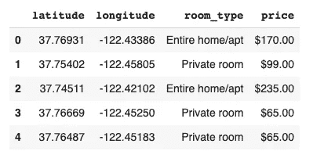

# 使用 Plotly 在地图上散布图

> 原文：<https://towardsdatascience.com/scatter-plots-on-maps-using-plotly-79f16aee17d0?source=collection_archive---------11----------------------->

## 了解如何用很少的代码创建交互式散点图来表示数据中的多个要素


由 [GeoJango Maps](https://unsplash.com/@geojango_maps?utm_source=medium&utm_medium=referral) 在 [Unsplash](https://unsplash.com?utm_source=medium&utm_medium=referral) 拍摄的照片

# Plotly 和 Mapbox 带来了什么

Plotly 是一个强大的可视化库，提供了令人惊叹的功能，如**交互式、动态、易于使用、**和**高度详细的**图。 **Plotly Express** 是 Plotly 库的内置部分，提供高级 API，只需很少的代码即可绘制各种图形。我们将结合使用 Plotly express 和 **Mapbox。** Mapbox 是一个位置数据平台，为地图、路由和导航提供各种 API。

# 想象旧金山周围的机场

在本文中，我们将使用 Kaggle 的 [*旧金山 Airbnb 房源数据集来直观地分析价格、住宿类型及其面积之间的关系。只要看一下地图，我们就可以看出地区如何影响价格。*](https://www.kaggle.com/jeploretizo/san-francisco-airbnb-listings)

这个数据有很多列，但是和这篇文章有关的是**纬度**、**经度**、**价格**和**房型。价格是每晚的价格，房间类型指示 Airbnb 是酒店、私人房间、共享房间还是整个房子。**

这是数据的样子



我们将在图中使用的列(图片由作者提供)

# 让我们开始吧！

1.  首先，我们需要一个地图框访问令牌。别担心，一定数量的通话是完全免费的，注册时不需要任何卡的详细信息。你可以在这里免费获得你的令牌[。**注册后，令牌将出现在您的帐户页面下。**](https://www.mapbox.com/)
2.  将价格转换为**浮动。**价格列当前包含带有 **'$ '符号和逗号的字符串。**例如**1200 美元。这里有一个将整个列转换成浮点值的超级快速的方法。这会骗人的**

```
import localelocale.setlocale(locale.LC_ALL, 'en_US.UTF8')data['price']=data['price'].apply(lambda x: locale.atof(x.strip("$")))
```

3.现在最精彩的部分来了，剧情。如果你在 Colab 上运行这段代码，我建议你不要安装 Plotly。否则你可以安装它。

`import plotly.express as px`

在这之后，我们只需要编写如下所示的代码。这里，我们首先传入我们的 Mapbox 访问令牌。然后，我们使用带有以下参数的函数 px.scatter_mapbox。

*   数据:这是指我们的数据框架
*   lat=" latitude ":这指向我们的数据框中的纬度列。
*   lon=" longitude ":它指向数据框中的经度列。
*   color="room_type ":这基本上是根据 room_type 列中的值给每个数据点着色。因为我们有四种不同的房间类型，所以我们有四种颜色。
*   size=" price ":这是有趣的部分，每个 Airbnb 都将由一个大小与其价格成比例的气泡来表示。较便宜的航空公司将由较小的气泡表示，而昂贵的航空公司将由较大的气泡表示。
*   其他参数只是一些实用工具，有助于使图形更容易查看。

旧金山的 Airbnbs，按房间类型和价格分类

4.随意使用绘图右上角的选项，例如缩放、选择特定区域或下载图像。你可以放大到特定的区域来查看地图的详细程度，也可以注意到当我们将**悬停在气泡上时，酒店的信息是如何显示的！单击图例中的任何房间类型都会从地图中移除该类型的所有房间！**

# 寻找趋势

我们看到一些趋势是有道理的。然而，在得出结论之前，请注意 Airbnb 的价格取决于各种便利设施和其他特征，如规模、服务、主机受欢迎程度等。但是，还是能看出一些大趋势。

1.  靠近**太平洋高地和俄罗斯山**的房子比旧金山其他地方的房价要高。
2.  缩小后，我们注意到房屋的密度并不均匀。地图右半部分的房间比左半部分多得多。
3.  我们看到大多数房间要么是功能齐全的公寓，要么是私人房间。
4.  卡尔街**附近有一套价格异常高的公寓，售价 **9999 美元**，不知道那是什么？**

# 结论

多亏了 Plotly Express 和 Mapbox，我们几乎不费吹灰之力就能绘制出如此强大、信息丰富的图表。这只是 Plotly 提供的一种地质公园。你可以在这里 **查看他们的其他地图地块** [**。**](https://plotly.com/python/maps/)

如果你喜欢这篇文章，这里有更多！

[](/regex-essential-for-nlp-ee0336ef988d) [## 正则表达式对 NLP 至关重要

### 理解各种正则表达式，并将其应用于自然语言中经常遇到的情况…

towardsdatascience.com](/regex-essential-for-nlp-ee0336ef988d) [](/powerful-text-augmentation-using-nlpaug-5851099b4e97) [## 使用 NLPAUG 的强大文本增强！

### 通过文本增强技术处理 NLP 分类问题中的类别不平衡

towardsdatascience.com](/powerful-text-augmentation-using-nlpaug-5851099b4e97) [](/representing-5-features-in-a-single-animated-plot-using-plotly-e4f6064c7f46) [## 使用 Plotly 在一个动画情节中表现 5 个特征

### 使用单个动画气泡图来分析数据和观察趋势。

towardsdatascience.com](/representing-5-features-in-a-single-animated-plot-using-plotly-e4f6064c7f46) [](/effortless-exploratory-data-analysis-eda-201c99324857) [## 轻松的探索性数据分析(EDA)

towardsdatascience.com](/effortless-exploratory-data-analysis-eda-201c99324857) 

查看我的 [**GitHub**](https://github.com/rajlm10) 其他一些项目。可以联系我 [***这里***](https://rajsangani.me/) ***。*** 感谢您的配合！