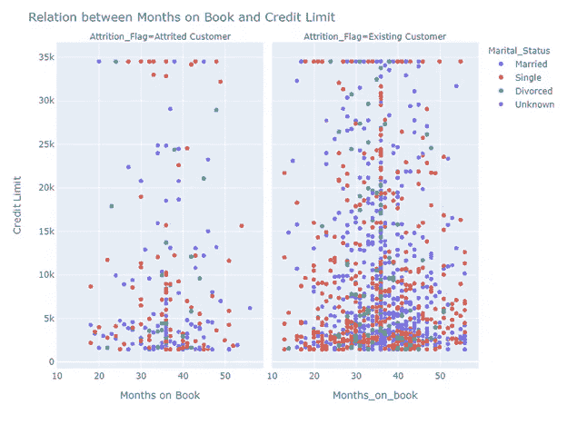

# 用 Plotly Express 散点图

> 原文：<https://towardsdatascience.com/scatter-plots-with-plotly-express-1b7f5579919b?source=collection_archive---------35----------------------->

## **趋势线&刻面**


照片来自 Unsplash 上的 Mel Poole

# **阴谋地**

你可以说这是一个数据科学的梦之队:哈佛大学的物理学博士，硅谷的能源分析师，脸书的成员，还有一个在硅谷的研究创业公司工作的人。Alex Johnson、Jack Parmer、Matthew Sundquist 和 Chris Parmer**一起在加拿大蒙特利尔创建了一家技术计算公司 Plotly** 。

Plotly 可视化工具是在 2013 年左右使用 Python 和 Django 框架构建的，前端使用 JavaScript 和可视化库 D3.js、HTML 和 CSS。所以，在其核心， **Plotly 实际上是一个 JavaScript 库。**请记住，D3.js 是一个 JavaScript 库，用于在 web 浏览器中生成动态的、**交互式数据可视化**。但是 Python 开发人员几乎不需要直接接触 JavaScript 库。他们可以使用 [plotly.py](https://plot.ly/python) ，这是一个交互式的、开源的、基于浏览器的 Python 图形库。

2019 年，该公司推出了新的高级 Python 可视化库 Plotly Express，实现了数量上的飞跃。 **Plotly Express 是 Plotly.py 的高级包装器，与 Plotly 生态系统的其余部分完全兼容**，简单、强大，有点类似 Seaborn。它是免费的，可以用于商业应用和产品。该库包括绘制**趋势线**和地图的功能，以及执行**刻面**和动画的功能。使用 Plotly Express，您可以在线制作交互式图形，也可以离线保存。

可以使用`*pip*`安装 plotly 的最新版本:

`$ pip install plotly==4.14.3`

或者`*conda:*`

`$ conda install -c plotly plotly=4.14.3`

# **散点图**

**散点图用于确定一对数值变量是否相关**。它们适用于两个数值变量的分布分析。它们不应该用来显示一段时间内的趋势。它们也不适合用于比较分析。此外，当消息的本质是显示数量时，它们是不合适的。

从表示由笛卡尔平面 x-y 中的点指示的两个数值变量的数据集开始，通过**揭示相关性的存在与否，从这些数据点生成的形状叙述信息。**这种相关性可以是正的或负的，并且通过表示大量数据点来获得。尽管每个点都指示精确的数值，但是可视化的目的是确定所表示的数值变量之间是否存在关系或相关性，而不是关注所指示的精确值。

**相关性**被定义为评估两个变量之间关系的一种度量(一种度量标准)。您可以计算(使用等式)取值在 1 到-1 之间的**相关系数** **(r)** :接近 0 的值表示没有相关性；接近 1 的值表示两个变量之间有很强的直接关系**；接近-1 的值表示它们之间有很强的**反比关系**；大于 0.7 或-0.7 的值分别表示强的正相关或负相关；低于 0.3 或-0.3 的值表示弱的或无效的直接或反向关系。**


图 1:具有不同相关系数的散点图。来源:维基百科[1]

在散点图中可以发现数据集的三个重要特征:1 .- **离群值**，一段与数据集中所有其他数据都非常不同并且似乎不符合相同模式的数据。这些异常值可能代表有价值的信息来分析。首先必须验证这些异常值的存在不是因为测量数据时的误差；2.- **间隙**，不包含数据的区间。数据之间差距的可视化证明了解释其存在的深入分析的合理性；3.- **聚类**，孤立的数据点组，也值得对其出现在图表中的原因进行特殊分析。当然，差距和聚类也可能代表数据收集方法中的错误。

一条回归线**被习惯性地添加到散点图中。也被称为**最佳拟合线**或**趋势线**，它以数学方式表达了两个数值变量之间的关系。趋势线意在**模拟数据**的趋势。这是一条最佳拟合线，近似于绘制点的方向。通常，回归线的目的是利用插值技术估计独立变量的一些未测量值，或者通过外推法将其用于预测目的。应特别注意**不要混淆相关性和因果关系**。**

# **用 Plotly Express 散点图**

首先，我们导入 Plotly Express 通常为`*px*`:

```
import plotly.express as px
```

在我们的第一个例子中，我们将确定使用 Numpy 函数`random.randint:`生成的两个数据集之间是否存在相关性

```
import plotly.express as px
import numpy as np## set the seed to a random number obtained from /dev/urandom
## or its Windows analog, 
## or if neither of those is available, it will use the clock.np.random.seed()rand_x = np.random.randint(1,100,50)
rand_y = np.random.randint(1,100,50)## trendline = 'ols' allow us to draw a trendline
fig = px.scatter(x = rand_x, y = rand_y, trendline = 'ols')fig.write_image(path + "figscat.png")
fig.show()
```


图 2:用 Plotly Express 制作的散点图。

很明显，没有关联。趋势线基于[普通最小二乘法(OLS)](https://en.wikipedia.org/wiki/Ordinary_least_squares) 。以前，您必须安装`*statsmodels*` 及其依赖项才能使用参数`trendline`。

```
It's a nice chart, but not enough for today's standards. We can improve it significantly using functions from the Plotly Express library.
```

我们建议使用类似以下的过程:

首先，选择一种有效的可视编码，将数据值映射到图形特征，并确定相应的参数。对于本文中的散点图，Plotly Express 函数为`px.scatter`，对应的参数为:*data frame*； *x 轴*的数值变量； *y 轴*的数值变量；`color`包括其他变量，尤其是分类变量；回归线的`*trendline*`方法；以及*悬停数据*和*悬停名称*。`hover_name`属性控制哪一列以粗体显示为工具提示标题，而`hover_data`参数接受要添加到悬停工具提示中的列名列表。

第二，分析你讲故事是否需要**刻面。**分面方法将图表分割成面板矩阵，每个面板基于分类变量显示数据集的不同子集。可以按列`facet_col = [‘col_name’]`，也可以按行。

三、用`update.layout`更新图表:设置标题；x 轴的名称和 y 轴的名称；用 `width`和`height.`设定图形尺寸

第四，用`add_annotation`添加注释。请记住，注释与图表中任意位置的文本相关。它们通常由文本、箭头或其他形状组成。

第五，分析是否需要**动画帧**。动画图是显示基础数据动态的好方法。动态系统是随着时间发展的系统。我们将不包括动画，因为我们的数据帧不包括时间维度。

最后，导出文件:你可以使用`fig.write_image(path + “fig_scat.png”)`将文件导出为静态格式，如 *PDF* 、 *SVG* 、 *PNG、*或类似格式，或者保存为 HTML 页面，用于缩放或查看工具提示`fig.write_html(path + ‘fig_scat.html’).`

# **趋势线和用 Plotly Express 刻面**

我们使用了从 Kaggle [2]下载的数据集。该数据集由 10，000 名银行客户组成，涉及他们的年龄、工资、婚姻状况、信用卡限额、信用卡类别、教育水平和其他特征。银行经理对客户离开他们的信用卡服务(流失客户)感到不安。所以，我们要确定一些数值变量和损耗条件之间是否有任何关系。

为了避免拥挤和重叠，我们通过`df = df.sample(frac = 0.15).`从这些客户中随机选择了 1500 个作为**被研究人群的样本**

首先，我们分析了客户年龄和银行规定的信贷限额之间是否有任何关系。因此，`Customer_Age`被选为 x 轴的数值变量，`Credit_Limit`被选为 y 轴的数值变量。我们纳入了`color = ‘Gender’`来验证银行管理指令中是否存在性别偏见。我们将图表保存为 PNG 静态格式。如果你想使用下面的代码，不要忘记`import pandas as pd.`

```
df = pd.read_csv(path + 'CreditCardCustomersCols.csv', 
        index_col =  False, header = 0,sep = ';', engine='python')## get a random selection of 1500 rows, a fifteen-percent of the    ## dataframedf = df.sample(frac = 0.15)fig = px.scatter(df, x="Customer_Age", y="Credit_Limit", 
        color =   'Gender',   trendline = ‘ols’)fig.update_layout(title =
       'Relation between Customer Age and Credit Limit',
        xaxis_title = 'Customer Age', yaxis_title = 'Credit Limit',
        width = 1600, height = 1400)fig.write_image(path + "figscat1.png")fig.show()
```


图 3:银行客户样本的散点图和趋势线。用 Plotly Express 制作的图表

Plotly Express 允许您使用 `results = px.get_trendline_results(fig)`检索模型参数。您可以在`.summary()`中选择完整的统计汇总，或`.params`中选择直线方程，或`.rsquared`中选择拟合的统计测量。

```
# retrieve the model parametersresults = px.get_trendline_results(fig)
results = results.iloc[0]["px_fit_results"].summary()coef1 = results.iloc[0]["px_fit_results"].params
coef2 = results.iloc[1]["px_fit_results"].paramsrsq1 = px.get_trendline_results(fig).px_fit_results.iloc[0].rsquared
rsq2 = px.get_trendline_results(fig).px_fit_results.iloc[1].rsquaredprint(results)
print(coef1, coef2)
print(rsq1, rsq2)
```

图 4 显示了分类变量`facet_col = ‘Attrition_Flag’`上的相同数字变量。该变量只取以下两个值:[现有客户，流失客户]。相似的弱相关性和性别偏见显示在两个面板中。


图 4:与图 3 相同的数据，但是在分类变量 attachment _ Flag 上分面。用 Plotly Express 制作的图表

在下面的两个图中，我们更改了其中一个数字变量(上的*个月，而不是*客户年龄*)，替换了与颜色参数关联的分类变量(*婚姻状况*)，并添加了一个注释( *35K 集群*)。第二张图是第一张图的多面版本(`facet_col = ‘Attrition_Flag’)`)，也是基于与客户流失情况相关的分类变量。这两个数字都导出为 HTML 文件，工具提示中包含变量*教育水平*。*

```
fig2 = px.scatter(df, x="Months_on_book", y="Credit_Limit", 
          color = 'Marital_Status',hover_data = ['Education_Level'])fig2.update_layout(title = 
     'Relation between Months on Book and Credit Limit',
      xaxis_title = 'Months on Book' , 
      yaxis_title = 'Credit Limit', width = 800, height = 600)fig2.add_annotation( # add a text callout with arrow
      text="35K Cluster", x= 35, y=35000, 
      arrowhead=1,showarrow=True)fig2.write_html(path + 'figscat2.html')fig2.show() 
```


图 5:银行客户样本的散点图。用 Plotly Express 制作的图表。



图 6:与图 5 相同的数据，但是在分类变量 attachment _ Flag 上分面。用 Plotly Express 制作的图表

数字变量之间没有相关性。此外，变量和磨损情况或婚姻状况之间没有关系。我们决定不画趋势线，因为屏幕上超过两条回归线可能会让观众迷惑。

**总结一下:**

当希望显示两个数值变量之间的关系或相关性时，可以使用散点图；

Plotly Express 是构建和定制包含趋势线和分面的图表的绝佳选择。

如果你发现了这篇感兴趣的文章，请阅读我之前的(https://medium.com/@dar.wtz):

分歧棒线，为什么&如何，用分歧讲故事

</diverging-bars-why-how-3e3ecc066dce>  

斜率图表，为什么和如何，用斜率讲故事

</slope-charts-why-how-11c2a0bc28be>  

*参考文献*

【1】:[https://en.wikipedia.org/wiki/Correlation_and_dependence](https://en.wikipedia.org/wiki/Correlation_and_dependence)

https://www.kaggle.com/sakshigoyal7/credit-card-customers