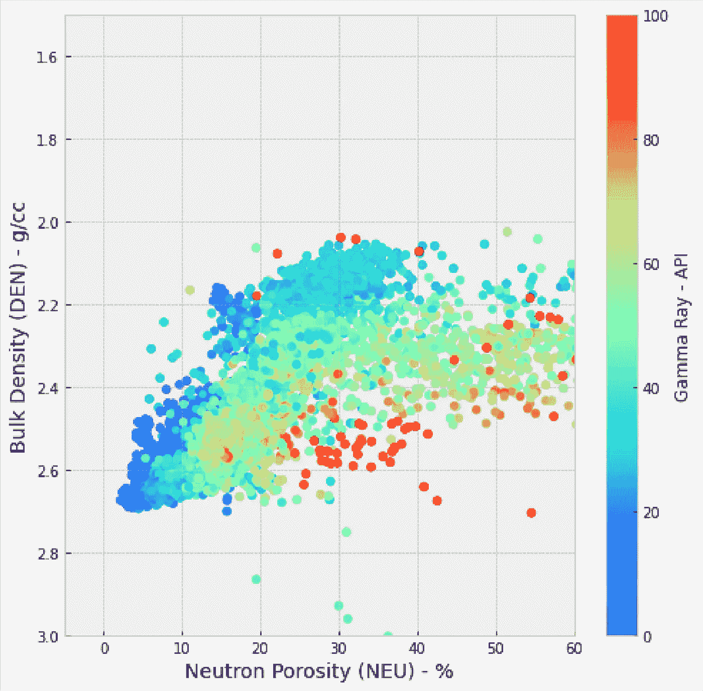
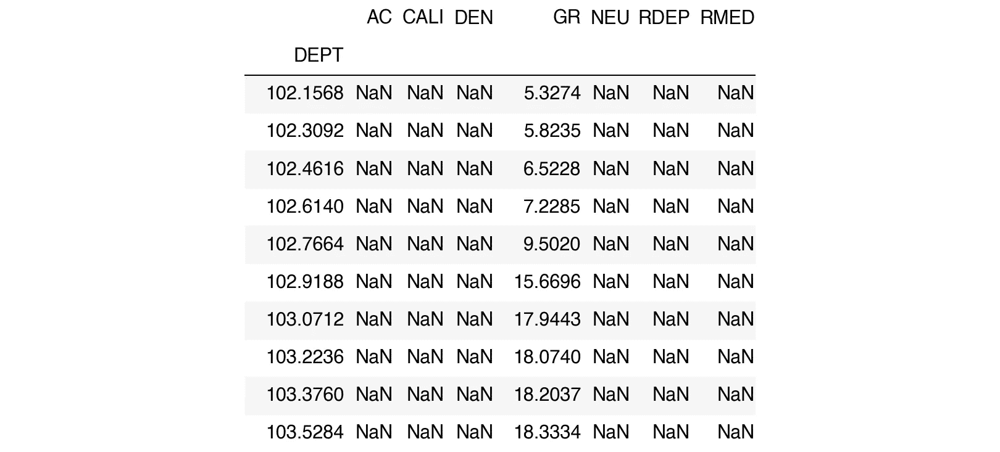
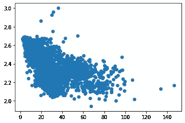
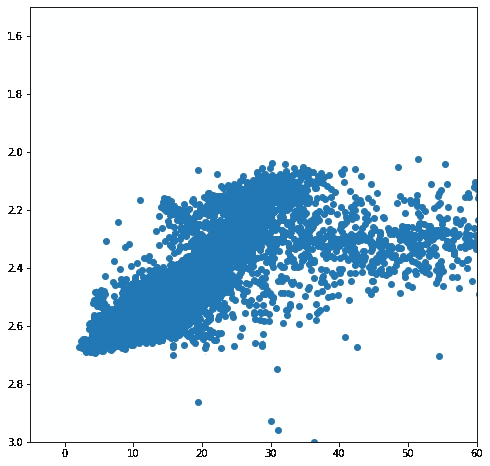
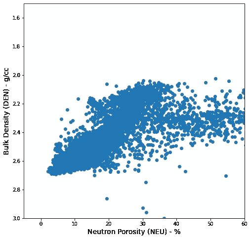
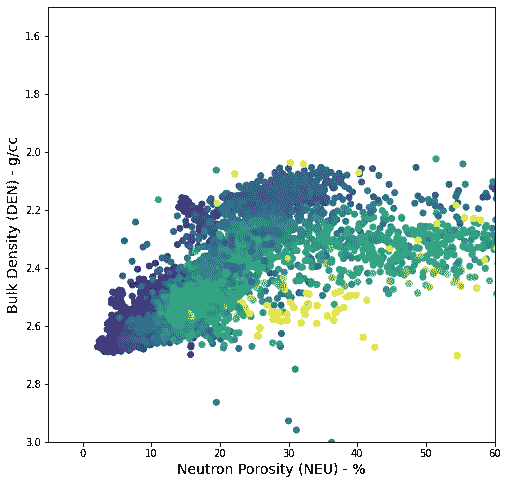
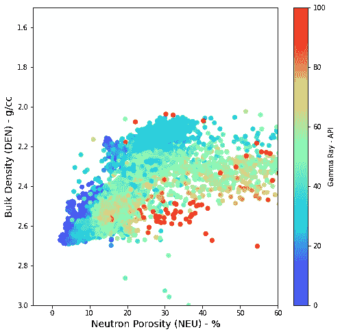
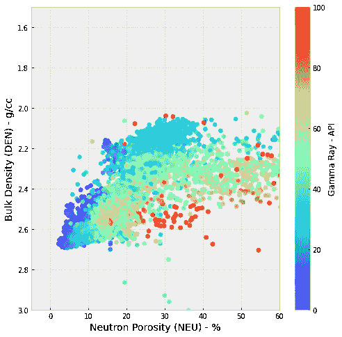
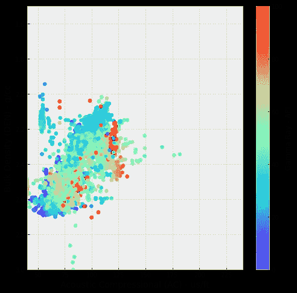

# 使用 Python 中的 matplotlib 创建测井数据散点图(交会图)

> 原文：<https://towardsdatascience.com/scatterplot-creation-and-visualisation-with-matplotlib-in-python-7bca2a4fa7cf?source=collection_archive---------17----------------------->

## 使用散点图来显示变量之间的关系



用 python 中的 matplotlib 创建的中子密度散点图/交会图。图片由作者提供。

## 介绍

散点图是一种常用的数据可视化工具。它们允许我们识别和确定两个变量之间是否存在关系(相关性)以及这种关系的强度。

在岩石物理学散点图中，通常称为交会图。它们通常用作解释工作流程的一部分，可用于

*   用于粘土或页岩体积计算的粘土和页岩终点识别
*   离群点检测
*   岩性识别
*   碳氢化合物识别
*   岩石分类
*   回归分析
*   更多

在这个简短的教程中，我们将看到如何显示一个 Volve 数据网络的直方图。

本教程的笔记本可以在[这里](https://github.com/andymcdgeo/Andys_YouTube_Notebooks/blob/main/03%20-%20Log%20Data%20Visualisation%20-%20Scatterplots-Crossplots.ipynb)找到。

本教程的相关视频可以在我的新 YouTube 频道上找到:

## 导入库和加载 LAS 数据

任何 python 项目或笔记本的第一步通常是导入所需的库。在这种情况下，我们将使用`lasio`加载我们的 las 文件，`pandas`存储我们的测井数据，以及`matplotlib`显示我们的数据。

```
import pandas as pd
import matplotlib.pyplot as plt
import lasio
```

我们在这个简短教程中使用的数据来自公开发布的 Equinor Volve 数据集。详情可在[这里](https://www.equinor.com/en/what-we-do/digitalisation-in-our-dna/volve-field-data-village-download.html)找到

为了读取数据，我们将使用 lasio 库，这是我们在之前的笔记本和[视频](https://youtu.be/8U4gxMJybJs)中探索过的。

```
las = lasio.read("Data/15-9-19_SR_COMP.LAS")
```

下一步是将 las 文件转换成 pandas 数据帧。这可以通过调用 lasio 库中的`.df()`方法快速实现。

为了确认我们有正确的数据，我们可以调用`.describe()`方法，该方法将为我们提供关于其中包含的数据的信息。

```
df = las.df()
df.describe()
```


我们可以看到，这个文件中有七条测井曲线。

*   AC 代表声波压缩慢度
*   井径仪校准
*   容积密度的 DEN
*   伽马射线的 GR
*   中子孔隙度的 NEU
*   RDEP 深电阻
*   中等电阻率 RMED

我们还可以通过调用`df.head(10)`来查看数据帧的前 10 行。这将返回数据帧的前 10 行。在我们的示例中，我们可以看到只有一列 GR 包含有值的值。所有其他的都包含 NaN 或者不是数字。这在测井数据集中很常见，尤其是在不需要某些测量的井的顶部。

```
df.head(10)
```



## 创建交会图/散点图

现在我们已经加载了数据，我们可以开始创建我们的第一个日志数据散点图/交会图。特别是，我们将使用密度和中子孔隙度测量。当执行岩石物理工作流程时，这两个测量值通常一起绘制。从这些数据中，我们可以识别出许多与记录的井段有关的不同信息，包括油气存在、岩性和不良数据等。

为了创建散点图，我们可以调用下面的代码。

```
# Set up the scatter plot
plt.scatter(x='NEU', y='DEN', data=df)

plt.show()
```



简单的中子密度散点图，无标签和不正确的比例

从上面可以看出，我们现在有一个非常简单但信息量不大的散点图/交会图。首先，数据的值和显示方式与我们预期的不同。对于密度中子交会图，我们预计 y 轴上的体积密度(DEN)会反转，从 3.0 到 2.0 克/立方厘米，我们通常预计 x 轴上的中子孔隙度(NEU)不会超过 60%。

我们需要通过使用`xlim`和`ylim`在我们的图上反映这些比例范围。

此外，为了使我们的图易于阅读和查看，我们可以使用`plt.rcParams`设置散点图的默认图大小。

```
plt.rcParams['figure.figsize'] = (8, 8)# Set up the scatter plot
plt.scatter(x='NEU', y='DEN', data=df)

# Change the X and Y ranges
plt.xlim(-5, 60)

# For the y axis, we need to flip by passing in the scale values in reverse order
plt.ylim(3.0, 1.5)

plt.show()
```



Matplotlib 散点图显示中子密度测井数据，刻度正确。

## 向轴添加标签

上面的散点图对其他人没有太大用处，因为轴上没有标签或单位。读者不会知道每个轴代表什么。因此，我们需要告诉读者的阴谋是什么阴谋反对什么。

我们可以使用`plt.xlabel`和`plt.ylabel`来添加这些。

```
# Set up the scatter plot
plt.scatter(x='NEU', y='DEN', data=df)

# Change the X and Y ranges
plt.xlim(-5, 60)

# For the y axis, we need to flip by passing in the scale values in reverse order
plt.ylim(3.0, 1.5)

# Add in labels for the axes
plt.ylabel('Bulk Density (DEN) - g/cc', fontsize=14)
plt.xlabel('Neutron Porosity (NEU) - %', fontsize=14)

plt.show()
```



带轴标签的中子密度散点图。

太棒了。我们现在知道在我们的图上绘制了什么数据，以及它们是以什么单位绘制的。

## 向散点图添加颜色

我们可以通过使用颜色在散点图上添加第三个变量。这将使我们对数据有更多的了解。

对于该图，我们将添加`c`参数，并将数据帧中的伽马射线(GR)列传递给它。

为了控制显示的颜色范围，我们需要向`vmin`和`vmax`传递值。在本例中，我们将它们设置为 0 和 100。

```
# Set up the scatter plot
plt.scatter(x='NEU', y='DEN', data=df, c='GR', vmin=0, vmax=100)

# Change the X and Y ranges
plt.xlim(-5, 60)

# For the y axis, we need to flip by passing in the scale values in reverse order
plt.ylim(3.0, 1.5)

# Add in labels for the axes
plt.ylabel('Bulk Density (DEN) - g/cc', fontsize=14)
plt.xlabel('Neutron Porosity (NEU) - %', fontsize=14)

plt.show()
```



中子密度散点图/交会图，伽马射线作为颜色的第三个变量。

现在的情节是丰富多彩的，但我们不知道这些颜色意味着什么。紫色/蓝色代表第三个变量的高值还是低值？此外，情节的读者不会立即知道第三个变量是什么意思。为了解决这个问题，我们可以添加一个 colourbar。

## 更改色彩映射表和添加色条

有几种方法可以给我们的图添加彩条。因为我们只是使用了一个单独的数字`plt.scatter`，我们可以调用`plt.colorbar()`，然后传入我们想要在它旁边显示的标签。

要改变我们正在使用的彩色地图，我们可以使用`plt.scatter()`中的`cmap`参数将其设置为下面网页中的一个。对于这个例子，我们将使用彩虹色图。这将允许低伽马射线值以紫色/蓝色显示，高伽马射线值以红色显示。

[](https://matplotlib.org/stable/tutorials/colors/colormaps.html) [## 在 Matplotlib - Matplotlib 3.4.2 文档中选择色彩映射表

### Matplotlib 有许多内置的色彩映射表，可以通过。还有外部库，如[palettable]和…

matplotlib.org](https://matplotlib.org/stable/tutorials/colors/colormaps.html) 

```
# Set up the scatter plot
plt.scatter(x='NEU', y='DEN', data=df, c='GR', vmin=0, vmax=100, cmap='rainbow')

# Change the X and Y ranges
plt.xlim(-5, 60)

# For the y axis, we need to flip by passing in the scale values in reverse order
plt.ylim(3.0, 1.5)

# Add in labels for the axes
plt.ylabel('Bulk Density (DEN) - g/cc', fontsize=14)
plt.xlabel('Neutron Porosity (NEU) - %', fontsize=14)

# Make the colorbar show
plt.colorbar(label='Gamma Ray - API')

plt.show()
```



带有 matplotlib 颜色条的中子密度散点图/交会图，显示伽马射线值的变化。

现在，我们有了一个更好看的图。我们给我们的坐标轴贴上标签，给我们的色带标上图和标签。

接下来，我们将看到如何通过使用样式表来进一步设计它的样式。

## 添加网格线和绘图样式

样式表允许我们控制情节的外观和感觉。您可以在 matplotlib 网站上找到完整的示例列表，网址为:

 [## 样式表参考- Matplotlib 3.4.2 文档

### 编辑描述

matplotlib.org](https://matplotlib.org/stable/gallery/style_sheets/style_sheets_reference.html) 

要设置样式表，我们可以使用`plt.style.use('bmh')`。“bmh”是一种特殊的风格，可以在上面的参考链接中找到。

```
#Set the style sheet to bmh
plt.style.use('bmh')

# Set up the scatter plot
plt.scatter(x='NEU', y='DEN', data=df, c='GR', vmin=0, vmax=100, cmap='rainbow')

# Change the X and Y ranges
plt.xlim(-5, 60)

# For the y axis, we need to flip by passing in the scale values in reverse order
plt.ylim(3.0, 1.5)

# Add in labels for the axes
plt.ylabel('Bulk Density (DEN) - g/cc', fontsize=14)
plt.xlabel('Neutron Porosity (NEU) - %', fontsize=14)

plt.colorbar(label='Gamma Ray - API')

plt.show()
```



中子孔隙度与体积密度的最终散点图/交会图。

## 更改数据

如果我们想查看我们图上的其他曲线，我们可以交换`plt.scatter`行中的变量。在这个例子中，我们已经将 NEU 数据转换为 AC(声波压缩慢度)。一旦我们做到了这一点，我们可以快速更新规模和标签。

```
#Set the style sheet to bmh
plt.style.use('bmh')

# Set up the scatter plot
plt.scatter(x='AC', y='DEN', data=df, c='GR', vmin=0, vmax=100, cmap='rainbow')

# Change the X and Y ranges
plt.xlim(40, 240)

# For the y axis, we need to flip by passing in the scale values in reverse order
plt.ylim(3.0, 1.5)

# Add in labels for the axes
plt.ylabel('Bulk Density (DEN) - g/cc', fontsize=14)
plt.xlabel('Acoustic Compressional (AC) - us/ft', fontsize=14)

plt.colorbar(label='Gamma Ray - API')

plt.show()
```



这为我们提供了一个图表，其格式与密度-中子孔隙度散点图相同。为我们的数据维护标准绘图格式的过程可以将报告的外观和感觉结合在一起。此外，由于我们重用代码，我们可以创建一个函数，它将接受一些参数，并通过消除重复来节省我们的时间。

# 摘要

在这个简短的教程中，我们介绍了如何显示测井数据的散点图/交会图，如何通过添加标签和添加颜色条来提供额外信息。这给了我们一个一致的、视觉上吸引人的情节，我们可以以演示或技术报告的形式呈现给其他人。

*感谢阅读！*

如果您觉得这篇文章很有用，请随时查看我的其他文章，这些文章从不同方面介绍了 Python 和测井数据。你也可以在 [*GitHub*](https://github.com/andymcdgeo) *找到我在这篇文章和其他文章中使用的代码。*

*如果你想联系我，你可以在*[*LinkedIn*](https://www.linkedin.com/in/andymcdonaldgeo/)*或者我的* [*网站*](http://andymcdonald.scot/) *找到我。*

*有兴趣了解更多关于 python 和测井数据或岩石物理学的知识吗？跟我上* [*中*](https://medium.com/@andymcdonaldgeo) *。*