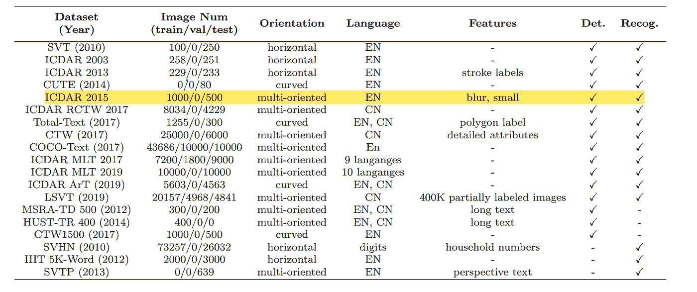
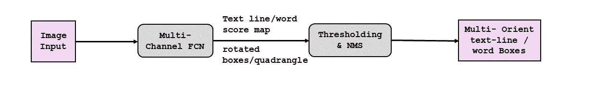
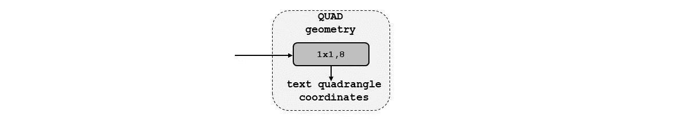
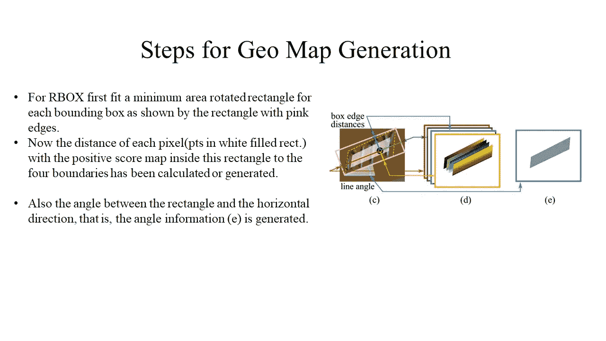

# 基于 EAST 和 Tesseract 的场景文本检测与识别

> 原文：<https://towardsdatascience.com/scene-text-detection-and-recognition-using-east-and-tesseract-6f07c249f5de?source=collection_archive---------7----------------------->

## [实践教程](https://towardsdatascience.com/tagged/hands-on-tutorials)

## 使用 EAST 和 Tesseract 算法检测和识别给定自然场景图像的文本。


图片由 Paritosh Mahto 提供

```
**This Article Includes:
1.Introduction
2.Real World Problem
    2.1 Description
    2.2 Problem Statement
    2.3 Bussiness Objectives and Constraints
3.Datasets Available for Text Detection And Recognition
    3.1 Dataset Overview & Description
4.Exploratory Data Analysis(EDA)
5.Methods of text detection before deep learning era
6.EAST (Efficient Accurate Scene Text Detector)
7.Model Implementation
8.Model Analysis & Model Quantization
9.Deployment
10.Future Work
11.Reference**
```

## 1.介绍

在这个数字化时代，从不同来源提取文本信息的需求在很大程度上已经上升。幸运的是，计算机视觉的最新进展使我们能够在减轻文本检测和其他文档分析和理解的负担方面取得长足进步。在计算机视觉中，将图像或扫描文档中的文本转换为机器可读格式的方法被称为**光学字符识别(OCR)** ，这种格式可以在以后编辑、搜索并用于进一步处理。

**OCR 的应用**

**答:信息检索和自动数据输入** - OCR 在许多公司和机构中扮演着非常重要的角色，这些公司和机构需要处理、分析和转换成千上万的文档来执行日常操作。

例如，在银行信息中，如账户详细信息，使用 OCR 可以很容易地从支票中提取金额。同样，在机场检查护照时，也可以使用 OCR 提取信息。其他例子是使用 OCR 从收据、发票、表格、报表、合同等中检索信息。

**b .车辆牌照识别** - OCR 也可用于识别车辆牌照，然后用于车辆跟踪、收费等。

**c .自动驾驶汽车**——OCR 也可以用来为自动驾驶汽车建立模型。它可以帮助识别交通标志。如果没有这一点，自动驾驶汽车将对行人和道路上的其他车辆构成风险。

在本文中，我们将讨论和实现 OCR 中使用的深度学习算法。


图片由 Paritosh Mahto 提供

> **数字化**-将文本、图片或声音转换成计算机可以处理的数字形式

## 2.现实世界的问题

## 2.1 描述

因为我们现在熟悉文本检测和识别的各种应用。本文将讨论从**自然场景**图像中检测和识别文本。

因此，在我们的例子中，我们使用任何自然图像或场景(不特别是文档、牌照或车号),对于给定的图像/场景，我们希望通过边界框定位图像中的字符/单词/句子。之后，我们要识别任何语言的本地化文本。一般工作流程图如下所示:


图片由 Paritosh Mahto 提供

> 上面使用的图像是为了显示整个任务。但是对于这个案例研究，我们将使用一个随机的自然场景作为输入图像。

## 2.2 问题陈述

对于给定的**自然场景/图像**,目标是通过绘制边界框来检测文本区域，之后，必须识别检测到的文本。

## 2.3 业务目标和限制。

*   自然场景图像中的文本可以是不同的语言、颜色、字体、大小、方向和形状。我们必须处理自然场景图像中的这些文本，这些自然场景图像表现出较高的多样性和可变性。
*   自然场景可能具有图案背景或形状与任何文本极其相似的物体，这在检测文本时会产生问题。
*   图像混乱(低质量/分辨率/多方向)
*   实时检测、识别和翻译图像中的文本需要低延迟。

## 3.可用于文本检测和识别的数据集

有许多公开可用的数据集可用于此任务，下面列出了不同数据集的发行年份、图像编号、文本方向、语言和重要特征。



*图像来源——纸张(场景文字检测与识别)*

由于非结构化的文本、不同的方向等，所有的数据集可能无法很好地用于所有的深度学习模型。对于这项任务，我选择 ICDAR 2015 数据，因为它很容易获得足够数量的非商业用途的图像，这些图像中的文本是英文的，因为我是初学者，我想专注于理解解决这项任务的算法的工作。此外，图像很小，在这个数据集中有多向模糊，因此我可以用检测部分做更多的实验。

## **3.1 数据集概述&描述**

**数据来源-** [下载-附带场景文字-健壮阅读比赛(uab.es)](https://rrc.cvc.uab.es/?ch=4&com=downloads)

ICDAR-2015 由国际会议文档分析与识别提供

名为“稳健阅读竞赛”的竞赛是名为“偶发场景文本-2015”的挑战之一，该数据集就是为该挑战提供的。

**描述:**

*   数据集在训练和测试集中可用，每个集合都有基本事实信息。它总共包含 1，500 幅图像，其中 1，000 幅用于训练，500 幅用于测试。它还包含 2，077 个裁剪文本实例，包括 200 多个不规则文本样本。
*   这些图像是从可佩戴的相机中获得的。

## 4.探索性数据分析

*   下载数据后，所有文件的结构如下-

```
**Data(main directory)
 |
 |
 |----- ICDAR2015
           |
           |
           |-----train (** containing all image files **)
           |
           |
           |------train_gt (** containing texts and coordinates **)
           |
           |
           |------test (** containing all image files **)
           |
           |
           |-----test (** containing texts and coordinates **)**
```

*   使用以下代码，可以观察到图像尺寸、通道数量等其他信息

对于训练图像

对于测试图像

*   我们还可以从条形图中得出结论，所有图像的高度和宽度都相同，即 720 和 1280。

对于训练图像


图片由 Paritosh Mahto 提供

对于测试图像


图片由 Paritosh Mahto 提供

*   **在地面真实信息的帮助下绘制原始图像和具有边界框的图像**
*   对于训练图像


图片来源 ICDAR2015


图片来源 ICDAR2015


图片来源 ICDAR2015

*   对于测试图像


图片来源 ICDAR2015


图片来源 ICDAR2015


图片来源 ICDAR2015

**从 EDA 得出的结论**

*   在 ICDAR-15 数据集中，所有图像都具有相似的大小(720x1280)和扩展名(。jpg)。
*   训练集有 1000 幅图像，而测试集中有 500 幅图像。
*   所有图像的高度和宽度是相同的，所以我们不需要平均高度和平均宽度。
*   在大多数图像中，所有文本都在小区域中，并且图像是模糊的。
*   所有文本均为英语，少数文本也不可用，并*替换为“###”。
*   大多数文本是单个单词，而不是单词和句子，而且单词是多向的。我们必须建立一个模型来预测这些模糊的文本。

## 5.深度学习时代之前的文本检测方法

正如问题陈述中提到的，我们必须首先定位图像中的文本，即首先检测文本，然后识别检测到的文本。现在对于检测，我们将尝试在深度学习时代之前用于文本检测的几种方法。

**MSER(最大稳定极值区域)**

**SWT(笔画宽度变换)**

两种方法的所有输出都不是很清楚，在第一种方法中，我们可以观察到图像中没有文本的区域仍然用方框标记。同样在第二种方法中，文本没有被正确地检测到。

还有很多其他深度学习算法用于文本检测和识别。在本文中，我们将讨论 **EAST 检测器**，并尝试借助一篇关于 [EAST](https://arxiv.org/pdf/1704.03155.pdf) 算法的研究论文来实现它。为了识别，我们将尝试预先训练的模型**宇宙魔方**。

## 6.EAST(高效精确的场景文本检测器)

这是一种快速准确的场景文本检测方法，包括两个阶段:

1.它使用完整的卷积网络(FCN)模型来直接生成基于像素的单词或文本行预测

2.生成文本预测(旋转矩形或四边形)后，输出被发送到非最大值抑制以产生最终结果。

管道如下所示:



图片由 Paritosh Mahto 提供

**网络架构-(带 PVANet)**

PVANet-它是用于对象检测的轻量级特征提取网络架构，在不损失准确性的情况下实现实时对象检测性能。

该模型分为三个部分:词干特征提取、特征合并分支和输出层。


图片由 Paritosh Mahto 提供

**一、特征提取器(PVANet)**


图片由 Paritosh Mahto 提供

该部分可以是任何卷积神经网络，其具有在 Imagenet 数据上预先训练的卷积层和汇集层交织，例如 PVANet、VGG16 和 RESNET50。从这个网络中，可以获得四级特征图 f1、f2、f3 和 f4。因为我们正在提取特征，所以它被称为特征提取器。

**二。特征合并分支**


图片由 Paritosh Mahto 提供

在这一部分中，从特征提取器获得的特征图首先被馈送到非 pooling 层以使其大小加倍，然后在每个合并状态中与当前特征图连接。接下来，使用 1×1 卷积，其中 conv 瓶颈减少了通道的数量，并且也减少了计算量，接着使用 3×3 卷积来融合信息，以产生每个合并级的最终输出，如图 2 所示。

g 和 h 的计算过程如下图所示


图片来源—研究论文 EAST

在哪里，

gi 是一个中间状态，是合并的基础

hi 是合并的特征地图

**三世。输出层**

来自合并状态的最终输出通过具有 1 个通道的 1X1 Conv 层，该层给出了范围从[0–1]的分数图。最终的输出也通过 RBOX 或 QUAD 几何体(关于这些的描述显示在下图中)给出了一个多通道几何体图。


图片来源—研究论文 EAST

关于分数图和几何图的细节将在实现时讨论。

## 7.履行

对于实现，我们将遵循上面显示的管道-

**步骤 1-数据准备&数据生成(数据流水线)**


图片由 Paritosh Mahto 提供

在这一步中，我们必须进行数据准备，还必须构建一个生成器函数，该函数将给出一个图像数组(模型的输入),其中包含分数图(输出)和地理图(输出),正如您在上图中看到的多通道 FCN 的输出以及训练掩码。

**评分图:**

它表示该位置的预测几何图的置信度得分/级别。它位于范围[0，1]内。我们通过一个例子来理解一下:

假设 0.80 是像素的得分图，这仅仅意味着对于该像素，我们有 80%的把握它将具有预测的几何图，或者我们可以说该像素有 80%的机会是预测的文本区域的一部分。

**地理地图:**

正如我们所知，随着得分图，我们还获得了一个多通道几何信息图作为输出。几何输出可以是 RBOX 或 QUAD。下表显示了通道数量以及 AABB、RBOX 和 QUAD 的功能。


图片来源—研究论文 EAST

**信箱:**


图片由 Paritosh Mahto 提供

从上图中我们可以观察到，对于 RBOX，几何体使用四通道轴对齐的边界框(AABB) R 和通道旋转角度θ。R 的公式为 g。四个通道表示 4 个距离，即从像素位置到矩形边界的距离，一个通道表示旋转角度，如下所示。


图像源-纸张(场景文本检测和识别)

**四元:**



图片由 Paritosh Mahto 提供

对于四边形，我们使用 8 个数字来表示从四个顶点到每个像素位置的坐标位移。每个偏移距离包含δXi |δyi 两个数字，几何输出包含 8 个通道。下面显示了一个示例


图片由 Paritosh Mahto 提供

在这个实现中，我们将只使用 RBOX。

对于生成器函数，我们必须遵循几个步骤


图片由 Paritosh Mahto 提供



图片由 Paritosh MAhto 提供

所有的密码都在这里-

<https://jovian.ai/paritosh/data-preparation-and-model-implt>  

这里显示了从生成器函数输出的带有分数图、几何图和训练掩码的原始图像

**第二步建模&损失函数**


图片由 Paritosh Mahto 提供

在这一步中，我们将尝试使用 Imagenet 数据上预先训练的 VGG16 模型和 ResNet50 模型作为特征提取器来构建检测器架构。

**模型-1(VGG16 作为特征提取器)**


图片由 Paritosh Mahto 提供

源代码-

模型架构-

**模型-2(ResNet50 作为特征提取器)**

模型架构-

## 损失函数

当我们处理图像数据时，IOU 得分是经常使用的损失之一。但是这里我们主要有两个输出:分数图和几何图，所以我们必须计算两者的损失。

总损失表示为:


图片来源—研究论文 EAST

Ls 和 Lg 代表得分图和几何形状，λg 衡量两个权重的重要性。在我们的实验中，我们设λg 为 1。

**为得分图损失**

在该论文中，用于得分图的损失是二进制交叉熵损失，其对正负类别都有权重，如图 2 所示。


图片来源—研究论文 EAST

但是，当使用实施骰子损失时

**几何图丢失**

对于 RBOX，损失的定义是


图片来源—研究论文 EAST

第一个损耗是盒子损耗，对于这个损耗，IOU 损耗被使用，因为它对于不同比例的物体是不变的。


图片来源—研究论文 EAST

对于旋转角度，损耗由下式给出


图片来源—研究论文 EAST

实现的代码如下所示:

**第三步模型训练**

两个模型都用 Adam 优化器训练了 30 个时期，其他参数如下所示

**型号 1**

```
**model_vgg.compile(optimizer=tf.keras.optimizers.Adam(learning_rate=0.001,amsgrad=True),loss= total_Loss())**
```

历元与损耗图:


图片由 Paritosh Mahto 提供

**型号 2**

```
**model.compile(optimizer=tf.keras.optimizers.Adam(learning_rate=0.001,amsgrad=True),loss=total_Loss())**
```

历元与损耗图:


图片由 Paritosh Mahto 提供

**第四步干涉管线**

在训练之后，首先将几何图转换回边界框。然后，我们应用基于得分图的阈值来去除一些低置信度框。使用**非最大抑制合并剩余的盒子。**

> 非最大抑制(NMS)是许多计算机视觉算法中使用的一种技术。这是一类从许多重叠的实体中选择一个实体(例如边界框)的算法。-来源[关于非最大抑制的思考(NMS)| subra ta Goswami | Medium](https://whatdhack.medium.com/reflections-on-non-maximum-suppression-nms-d2fce148ef0a)

这里我们将使用本地感知的 NMS。它将加权合并添加到标准 NMS 中。所谓加权合并，就是根据分数在输出框中合并高于某个阈值的 2 个 iou。下面讨论实施时遵循的步骤

1.  首先，对几何图形进行排序，从最顶端开始。
2.  2.拿这一行中的下一个盒子，找出与前一个盒子相同的借据
3.  3.如果 IOU > threshold，通过按分数取加权平均值来合并 2 个框，否则保持原样。
4.  4.重复步骤 2 到 3，直到所有的盒子都被迭代。
5.  5.最后在剩下的盒子上使用标准 NMS。

实现的代码-

**非最大抑制**

**检测模型的干扰管道**

每个模型的输出:

模型-1


图片来源 ICDAR2015


图片来源 ICDAR2015


图片来源 ICDAR2015

模型-2


图片来源 ICDAR2015


图片来源 ICDAR2015


图片来源 ICDAR2015

如果我们比较两个模型的损失，那么我们可以得出结论，模型 2 (resnet_east)表现良好。让我们分析一下 model_2 的性能。

## 8.模型分析和模型量化

正如我们已经看到的，模型 2 比模型 1 执行得更好，这里我们将对模型 2 的输出进行一些分析。首先，计算训练和测试目录中每个图像的损失，然后基于分布，通过查看每个训练和测试图像的损失的方框图，我们将选择两个阈值损失，最后，我们将数据分为三类，即最好、一般和最差。

训练集和测试集的密度图-


图片由 Paritosh Mahto 提供


图片由 Paritosh Mahto 提供

将图像数据分为 3 类(最好、一般和最差)

*   将数据分为 3 类

```
Best = if loss < np.percentile(final_train.loss, 33)----->Threshold-1
Average = if np.percentile(final_train.loss, 33)< loss < np.percentile(final_train.loss, 75)
Worst = if loss > np.percentile(final_train.loss, 75)--Threshold-2
```

每个类别的图片数量如下所示:

对于训练图像:


图片由 Paritosh Mahto 提供

对于测试图像:


图片由 Paritosh Mahto 提供

*   从第一个图 1 中，对于列车数据，我们可以观察到 33%的数据属于最佳类别，42%的数据属于一般类别，只有 25%的数据属于最差类别。
*   从第二个图 I 中，对于测试数据，我们可以观察到 2.6%的数据属于最佳类别，13.2%的数据属于一般类别，84.2%的数据属于最差类别。
*   从这些观察中，我们还可以得出结论，我们的模型对于测试图像(即新图像)可能表现不佳。

**模型量化**

深度学习的量化是通过低位宽数的神经网络来逼近使用浮点数的神经网络的过程。这极大地降低了使用神经网络的内存需求和计算成本。量化后，原始模型和量化模型的大小如下所示-

## 9.部署

模型量化后，使用 streamlit 和 Github 选择并部署了 float16 量化模型。使用 streamlit uploader 函数，我创建了一个. jpg 文件输入部分，您可以在其中给出原始图像数据，模型将给出图像，并在图像上显示检测到的文本。

网页链接-[https://share . streamlit . io/paritoshmahto 07/scene-text-detection-and-recognition-/main/app _ 2 . py](https://share.streamlit.io/paritoshmahto07/scene-text-detection-and-recognition-/main/app_2.py)

部署视频-

## 10.未来的工作

在这项任务中，我们的主要目标是了解任何检测模型的工作原理，并从头开始实现它。为了提高模型的性能，我们可以用大型数据集来训练我们的模型。我们还可以使用另一种识别模型来更好地识别文本。

**我的 LinkedIn 个人资料**

  

**我的 Github 个人资料**

<https://github.com/paritoshMahto07>  

## 11.参考

一.研究论文

    

二。博客

<https://www.programmersought.com/article/56252830437/>  <https://theailearner.com/2019/10/19/efficient-and-accurate-scene-text-detector-east/>  

三。Github 代码源代码

<https://github.com/kurapan/EAST>  <https://github.com/solaris33/EAST-tf2>  

四。模型量化

<https://www.tensorflow.org/lite/performance/post_training_quantization>  

动词 （verb 的缩写）师徒制

<https://www.appliedaicourse.com/>  

*感谢阅读，祝你有美好的一天！*🙂