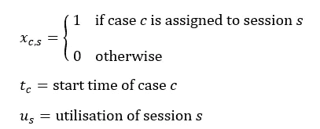
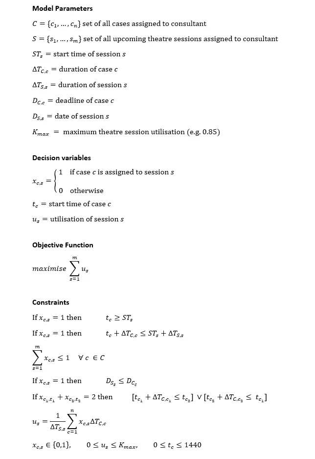
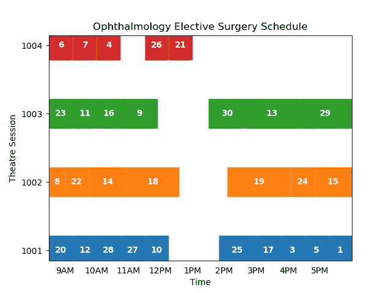

# 使用 Python 中的线性规划进行日程优化

> 原文：<https://towardsdatascience.com/schedule-optimisation-using-linear-programming-in-python-9b3e1bc241e1?source=collection_archive---------4----------------------->

## 医院手术室排班的优化模型

对于许多组织来说，日程安排是一项日常挑战。从生产线上的工作分配到医院手术病例的时间安排，如何有效管理有限资源的问题无时无刻不在出现。

虽然“信封背面”的规划可以带我们走这么远，但通常情况下，更高级的说明性分析工具(如线性规划)可以帮助决策者快速确定最佳选择。

这项技术并不新鲜——数学编程已经存在几十年了——但是最近几年它变得更容易使用了。线性求解器算法性能的改进使得更复杂的问题能够在合理的时间框架内得到解决；Pyomo 等开源库使得用熟悉的编码语言构建模型成为可能，数字化增加了高质量数据的可用性。

然而，尽管有这些进步，传统的优化方法经常被数据科学家和分析师忽视。

在这篇文章中，我希望展示线性编程的价值，并展示如何开始用 Python 构建模型。为此，我们将构建一个基本模型来优化医院的手术室安排。

我假设你熟悉 Python 和线性优化概念的基础知识。

源代码和数据可以在这里找到:[https://github.com/Lewisw3/theatre-scheduling](https://github.com/Lewisw3/theatre-scheduling)

## **医院为什么要排班？**

排班对于手术室的顺利运转至关重要。有效的时间安排对所有各方都有利:医务人员、医疗保健提供者，尤其是病人。但是手术计划仍然是医院面临的主要挑战。NHS Improvement 委托进行的一项最新研究报告称，随着手术清单和假期预订管理的改善，每年可以完成额外的 290，000 例手术[1]。

那是 Covid 之前。自那以后，疫情在择期护理方面产生了大量的积压，因此有效地管理手术室的时间表比平时更加重要。

这是一个复杂的挑战，解决方案不仅仅取决于分析。

在这篇文章中，我们将考虑一个简单的外科医生择期手术计划的例子。我们的目标是强调分析支持剧院规划的潜力——该模型是**而不是**旨在成为现实世界的决策支持工具！

有大量关于剧院时间表优化的文献。如果你感兴趣，我推荐 Guerriero 和 Guido [2]以及 Cardoen 等人[3]的综述论文。


皮隆·纪尧姆在 [Unsplash](https://unsplash.com?utm_source=medium&utm_medium=referral) 上拍摄的照片

## **问题陈述**

假设一家医院的手术室正在为一名眼科顾问医生计划选择性手术。医院有两份名单:

*   在截止日期前分配给顾问的操作清单(*案例*)
*   分配给顾问的手术室时间段(*手术室时段*)列表

剧院会议可以是半天(上午 8.30-下午 1 点)或全天(上午 8.30-下午 6 点)会议，顾问通常每周分配一次剧院会议。任务是将顾问即将进行的案例分配到他们的剧院会议中，这样我们可以最大限度地利用每个会议**。**

> 利用率被定义为手术室时间段被手术病例填满的百分比。

病例必须在目标截止日期前完成，并且至少 15%的剧场时段应空出来用于其他活动(如绝育、员工休息等)。)

## 公式化——从商业问题到数学模型

我们把这个问题公式化为一个灵活的车间调度问题，其中一个外科病例类似于一个*工作*，一个手术室类似于一台*机器*。我们首先定义决策变量、线性约束和线性目标函数。

## **1。导入数据**

在我们开始之前，让我们看看数据。我们有两个数据源: *cases.csv* 和 *sessions.csv* 。

*cases.csv* 包含所有即将进行的选择性手术列表:

案例数据(仅前 4 行)

*sessions.csv* 包含所有即将举行的剧院会议的列表 *:*

会话数据(仅前 4 行)

Github repo 上提供了完整的 CSV 文件。

我们首先使用集合(类似于数组)和参数(键值对)将相关数据导入 Pyomo ConcreteModel 对象。

病例和会话数据作为集合和参数从 CSV 导入到模型中。

我们使用许多辅助函数来初始化 Pyomo 集合和参数。为了简洁起见，这里省略了这些，但是可以在 Github repo 上找到。

我们还定义了一个名为 TASKS 的集合，它包含(CaseID，SessionID)的所有可能组合的列表。这代表了所有可用的潜在案例分配决策:

我们生成案例和会话的所有可能组合，并将它们存储在任务集中。

## 2.决策变量

主要决定是将案例分配给会话。这需要对上述任务中的每个病例-会话组合做出二元是/否决定。

我们还想计算每个案例的开始时间和每个会话的利用率。总而言之，我们有 3 个决策变量:



我们在 Pyomo 模型中定义这些决策变量如下:

我们使用 Var 函数定义了 3 个决策变量

## 3.目标函数

线性规划的一个优点是可以灵活地定义一个代表我们业务需求的目标函数。我们可以自由定义任何(线性)函数，在我们的例子中，我们的目标是最大化所有会话的利用率:

我们的 Pyomo 模型的单一线性目标函数最大化。

## 4.限制

接下来，我们添加约束。约束捕获了所有的规则(在这个例子中不太现实！)确保由模型返回的解决方案构成可行的剧院时间表。这里我们有 6 条规则:

1.  案例的开始时间必须在它被分配到的会话的开始时间之后
2.  案例必须在其分配的会话结束之前结束
3.  一个案例最多可以分配给**一个会话**
4.  案例不能在其截止日期后分配给会话
5.  两个案例不能重叠:一个案例的开始时间必须在另一个案例的结束时间之后
6.  一个时段的利用率等于外科病例所占用的时段的一部分

我们还限制了决策变量的范围。利用率必须介于 0 和 85%之间(因为 15%的会话必须保持空闲以用于其他活动)，并且案例的开始时间必须介于 0 和一天的分钟数(1440)之间。

## **4.1 向模型添加约束**

通过为每个约束编写单独的 Python 函数并使用 Pyomo 的*约束*方法，将上述约束添加到模型中:

模型约束-使用 Pyomo 的 GDP 扩展添加非线性析取。

为了将这些约束定义为线性方程，我们利用了两个值得注意的有用技术:[大 M 公式](https://en.wikipedia.org/wiki/Big_M_method)和[逻辑析取](https://en.wikipedia.org/wiki/Logical_disjunction)。

**大 M 公式**

大 M 方法是一种打开和关闭约束的技巧。例如，上面的约束 1 规定案例必须在会话开始时间之后开始。这只对案例分配到的会话有效。它不应该适用于所有其他的会议。我们确保这种不平等会发生:

```
case_start_time >= session_start_time - (1 - session_assigned)*M
```

其中 *M* 是一个足够大的常数，而 *session_assigned* 是一个二元变量。盯着这个足够长的时间后，它开始变得有意义。如果 *session_assigned* 等于 1，则必须保持该规则。然而，如果 *session_assigned* 为 0，则(假设 M 足够大)RHS 上的第二项变得比第一项大得多，因此整个 RHS 总是负的。因为我们的可变边界强制 *case_start_time ≥ 0* ，所以实际上没有额外的限制。

**析取编程**

第 5 个约束是一个逻辑析取:由 OR 关系链接的一组约束。析取关系表明，对于同一会话中的任何一对案例，要么案例 1 发生在案例 2 **之前，要么**案例 2 发生在案例 1 之前。

这种关系是非线性的，因此我们必须将其转换为线性约束，以便使用标准的线性解算器。为此，我们使用了 Pyomo 的广义析取编程(GDP)建模扩展(参见上面代码片段中的第 27 行)。它允许我们将析取定义为一个简单的 Python 函数，要将“析取”模型转换回标准的混合内部编程(MIP)模型，我们需要做的就是包含以下代码行:

```
pe.TransformationFactory("gdp.bigm").apply_to(model)
```

GDP 扩展可以通过增加大 M 约束和引入新的二进制变量来避免，但我们将保持析取，因为它是可行的和可读的。

最后，我们完成了！完整的线性规划模型是:



择期手术计划的柔性作业车间调度模型。

## 求解模型—生成剧院时间表

使用 Pyomo 这样的接口的一个优点是很容易尝试不同的线性解算器，而不用用另一种编码语言重写模型。

这里我们使用硬币或分支切割(CBC)——一个开源的混合整数程序求解器([https://github.com/coin-or/Cbc](https://github.com/coin-or/Cbc))。

下面的代码片段使用 Pyomo 的 SolverFactory 类求解模型。该类可以采用许多调整参数来控制所选求解器的操作，但为了简单起见，我们保留默认设置，除了 60 秒的时间限制。

使用 CBC 求解器求解 Pyomo MIP 模型

## 结果

下面是一个甘特图，显示了模型返回的解决方案。输入的案例和会话数据在处[可用](https://github.com/Lewisw3/theatre-scheduling/tree/master/data) [:](https://github.com/Lewisw3/theatre-scheduling/tree/master/data)



模型结果:手术病例(编号 1-30)被分配到四个手术室。每个剧场至少有 15%的时间用于其他活动。

上面的图表显示了一个可行的案例和会议时间表，在我们的限制下最大限度地利用所有会议。提供给模型的输入数据的需求(病例时间)多于容量(会话时间)，并且模型发现放弃病例#2(持续时间为 70 分钟的玻璃体切除术)是最大化所有会话的总利用率的最佳选择。

## 结论

线性规划是帮助组织快速做出明智决策的强大工具。对于数据科学家来说，这是一项有用的技能，有了 Pyomo 这样的开源库，用 Python 来构建模型就很容易了。

在这篇文章中，我们创建了一个简单的优化模型来有效地安排手术。尽管不是真实世界的解决方案，但它展示了线性规划等优化方法如何支持规划者最大限度地利用他们的可用资源。

该模型的潜在后续步骤包括:

*   调整求解器参数以提高性能并缩短求解时间
*   重构模型以简化问题并减少求解时间
*   调整目标函数以更好地表示性能目标
*   纳入额外的约束，以更好地代表现实世界的选择性剧院调度
*   使用更复杂的方法来预测案例时间

关于最后一点，线性规划等规范性分析技术正越来越多地与机器学习等预测性方法相结合。对于像这里介绍的调度应用程序，机器学习可以用来预测任务的持续时间，甚至哪些任务将会发生。一旦预测到需求，优化方法可以帮助规划。

感谢阅读！如果您有任何问题或意见，请随时联系我们。

## 参考

[1] NHS 改进(2019)。手术室:减少等候名单的机会。可在:[https://improvement . NHS . uk/resources/operating-theaters-opportunities-reduce-waiting-lists/](https://improvement.nhs.uk/resources/operating-theatres-opportunities-reduce-waiting-lists/)获取

[2]f . Guerriero，r . Guido，手术室管理中的运筹学:调查。*卫生保健管理科学* **14，**89–114(2011)。[https://doi.org/10.1007/s10729-010-9143-6](https://doi.org/10.1007/s10729-010-9143-6)

[3] Cardoen 等.手术室规划和调度:文献综述。*欧洲运筹学杂志***201(3)；***921–932(2010)。[https://doi.org/10.1016/j.ejor.2009.04.011](https://doi.org/10.1016/j.ejor.2009.04.011)*