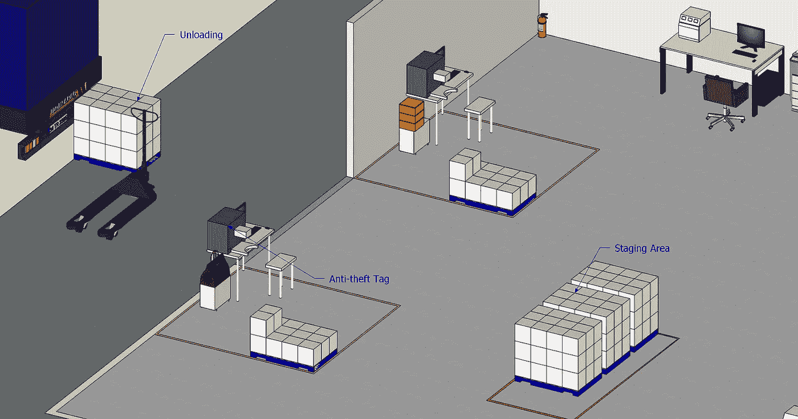
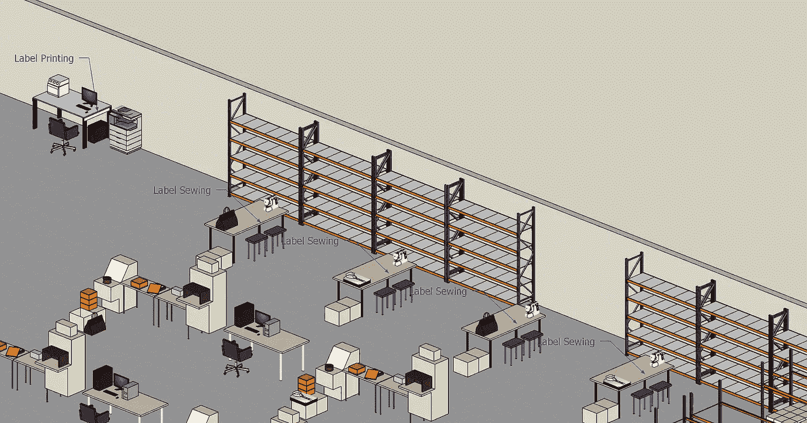
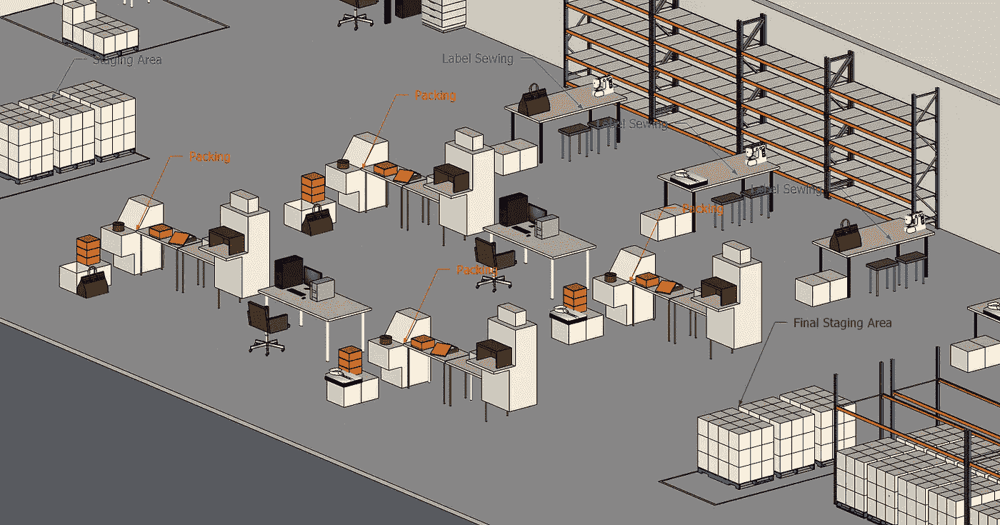
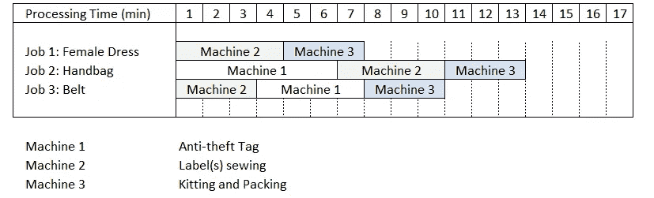
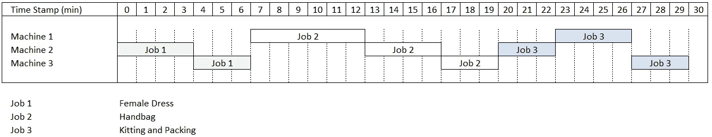
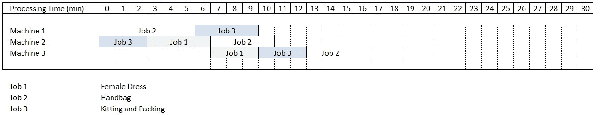
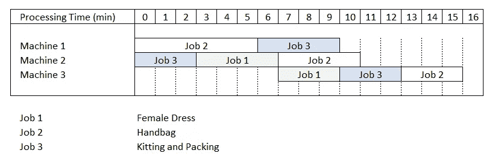
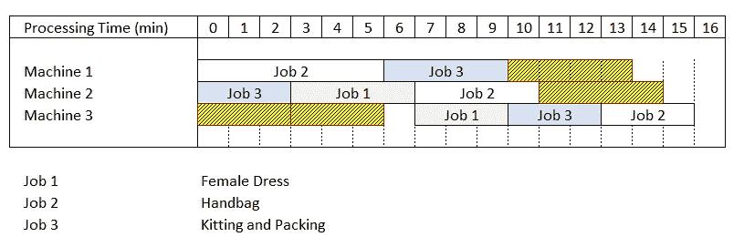

# 使用 Python 优化仓库增值服务

> 原文：<https://towardsdatascience.com/scheduling-of-luxury-goods-final-assembly-lines-with-python-e5c4b0590bfc?source=collection_archive---------11----------------------->

## 使用线性规划来提高您的豪华产品最终组装的生产能力


某奢侈品牌配送中心的 4 条增值服务生产线车间示例—(作者提供的 CAD 模型)

处理奢侈品、服装或高价值商品的**配送中心(DC)** 所面临的大部分挑战是在[入境过程中](https://www.youtube.com/watch?v=nz69i6l7SzI)。

我们以 DC 为例，该商场存放进口奢侈品包包、服装和鞋子，需要:

*   **机器 1——防盗标签:**放一个自动报警标签，保护你的商品在店内不被盗


防盗标签示例—(图片由作者提供)

*   **机器 2 —贴标签:**用当地语言打印标签，并进行标签缝制


标签示例—(图片由作者提供)

*   **机器 3 —打包&重新包装:**将您的货物转移到销售包装中，并添加**附赠(GWP)** 、个人备注或真品证书


带购物凭证的礼品包装示例—(作者 CAD 模型)

完成这三个步骤后，你的商品就可以[放在库存区](https://www.youtube.com/watch?v=nz69i6l7SzI)等待[提货](https://www.youtube.com/watch?v=6swvr-J_bJE&t=10s)运往最终目的地(商店)。

如果你每天处理的项目数量太低，这个过程很快就会成为一个主要的瓶颈。

💌新文章直接免费放入你的收件箱:[时事通讯](https://www.samirsaci.com/#/portal/signup)

如果你喜欢看，看看这篇文章的视频版本

# 一.问题陈述

## 1.方案

你是一家专注于时尚、香水和手表的标志性奢侈品公司的配送中心(DC)的入境经理。

您已经收到 600 套**成衣**，包括:

*   **1 件需要缝制标签和重新包装的女装**
*   需要缝标签、防盗标签和重新包装的手提包
*   **1 条需要防盗标签、缝制标签和重新包装的皮带**

因为它们是一起出售的，所以这些 SKU 需要同时准备好并一起包装，以便在完成以下步骤后尽快运送到商店:

*   [入境团队](https://www.youtube.com/watch?v=nz69i6l7SzI)正在从卡车上卸下托盘，并把它们放在**集结地**


步骤 1:将托盘卸载并转移到中转区—(作者的 CAD 模型)

*   **机器 1:防盗标签—** 一名操作员在每个袋子和皮带上贴上防盗标签



步骤 2: 2 个工作站，操作员在每个手提包和皮带上贴上防盗标签—(作者提供的 CAD 模型)

*   **机器 2——贴标签:**在专用区域打印后，标签被缝在皮带、手袋和服装上



步骤 3: 4 个工作站，操作员在其中执行标签缝纫—(作者的 CAD 模型)

*   **3 号机——配套&重新包装:**每件物品，你都需要加上真品证书，塑料保护，并进行精细包装



第 4 步:4 个工作站，操作员在其中执行重新包装—(作者的 CAD 模型)

在重新包装过程之后，货物被转移到最终中转区等待装运[(X-对接模式)](https://www.youtube.com/watch?v=CW0wJM-yJGc)。

**目标:**达到每小时组装台数的最大生产率(台/小时)

## 2.问题陈述:车间作业问题

**作业车间调度问题(JSSP)** 是一个 NP 难问题，由一组作业定义，每个作业必须由一组机器按照特定的顺序执行。



我们的例子是使用 3 台机器的 3 个作业—(图片由作者提供)

对于我们的每个作业，我们在上表中定义了机器的执行时间(min)和处理顺序。

例如，**作业 2(手袋)**从使用机器 1*【6 分钟】*放置**防盗标签开始，然后使用机器 2***【4 分钟】*缝制**标签，最后使用机器 3***【3 分钟】*完成**打包包装。**

机器一次只能执行一项工作，一旦启动，机器就不能被中断，直到完成指定的工作。

目标:最小化最大完工时间，即完成所有工作的总时间

**一、简单的解决方案:一次一个作业周期**



第一种天真的方法—(图片由作者提供)

**结果**

*   完成时间: **30 分钟**
*   产能: **2 台/小时**

**评论**

就生产率而言，这种简单的方法是最糟糕的。由于作业是按顺序处理的，机器经常处于闲置状态。

**问题:**如果我们并行执行作业，会有什么结果？

**二。最优解:使用 Google 或-Tools 的作业车间调度问题**


或者——Google AI 解决方案的工具部分——(来源:Google AI Logo，[链接](https://ai.google/))

OR-Tools 是 Google 的一个开源集合，提供了用于组合优化的工具。目标是从大量可能的解决方案中找到最佳解决方案。

我很喜欢这个库，我已经在几个例子中使用了它:

*   [Samir Saci](https://medium.com/u/bb0f26d52754?source=post_page-----e5c4b0590bfc--------------------------------) ，利用 Google AI 设计寻路算法提高仓库生产力，[链接](/optimizing-warehouse-operations-with-python-part-3-google-ai-for-sprp-308c258cb66f)
*   [Samir Saci](https://medium.com/u/bb0f26d52754?source=post_page-----e5c4b0590bfc--------------------------------) ，使用 Python 线性编程优化劳动力规划，[链接](/optimize-workforce-planning-using-linear-programming-with-python-47a0b5f89a6f)

让我们尝试使用这个库来找到最佳排序，以减少这个特定流程集的**最大完工时间**。

[](http://samirsaci.com) [## 萨米尔·萨奇

### 数据科学博客，专注于仓储，运输，数据可视化和机器人流程自动化…

samirsaci.com](http://samirsaci.com) 

# 二。优化您的日程安排

## 1.结果:优化解决方案与原始解决方案


第一种天真的方法—(图片由作者提供)



使用 Google 或工具优化解决方案—(图片由作者提供)

你可以看到上面的两幅图分别代表了初始解决方案(简单的解决方案:一次一个任务)和优化的解决方案(并行任务)。

**结果**

*   **总完工时间:** 16 分钟 **(-47%)**
*   **产能:** 3.75 台/小时 **(+85%)**
*   **每周期空闲时间:** 18 分钟 **(-71.4%)**

结果令人满意

我现在将解释如何达到这些结果。

## 2.构建优化模型

a .初始化你的模型

```
3 machines
Total Time using Naive Solution: 30 min
```

**b .初始化变量并创建序列**

**c .添加约束并设置求解器**

**d .求解器最优解**

```
**Output -**
Optimal Schedule Length: 16
Machine 1: job_2_1   job_3_2   
           [0,6]     [6,10]    
Machine 2: job_3_1   job_1_1   job_2_2   
           [0,3]     [3,7]     [7,11]    
Machine 3: job_1_2   job_3_3   job_2_3   
           [7,10]    [10,13]   [13,16]
```

基于此输出，我们可以绘制更新的时间表:



使用 Google 或工具优化解决方案—(图片由作者提供)

# 三。结论和后续步骤

*关注我的 medium，了解更多与供应链数据科学相关的见解。*

## 1.结论

通过实施智能调度解决方案，最大限度地利用我们的资源(机器)，我们的生产率提高了 48%。

该解决方案基于一个简单的场景，使用一条装配线(每种类型一台机器)。

**问题:**用几行代码会得到什么结果？

我让你测试它，并在评论区分享你的结果(或问题)。

## 2.后续步骤

我们能通过改变条件来提高生产率吗？



具有空闲序列的优化解决方案(黄色)——(图片由作者提供)

在上图中，我突出显示了我们在空闲时间可以增加的潜在额外工作:

*   **机器 1: 1 顺序**4 分钟，等于工作 3 的时间
*   **机器 2: 1 顺序**4 分钟，等于任务 1 和任务 2 的时间
*   **机器 3: 2 顺序**为 4 分钟，等于工作 1、2 和 3 的时间

**问题:**如果我们在**周期 n** 的这些空闲序列中启动**周期 n+1** 的作业，平均生产率会是多少？

## 超出

如果我们有标签缝纫工作站，对整体生产力会有什么影响？

[](/supply-chain-process-design-using-the-queueing-theory-2ad75e58d1f3) [## 基于排队论的供应链流程设计

### 用 Python 应用排队论的几个原则来设计一个电子商务的包裹打包过程…

towardsdatascience.com](/supply-chain-process-design-using-the-queueing-theory-2ad75e58d1f3) 

# 关于我

让我们在 [Linkedin](https://www.linkedin.com/in/samir-saci/) 和 [Twitter](https://twitter.com/Samir_Saci_) 上连线，我是一名供应链工程师，正在使用数据分析来改善物流运营和降低成本。

如果你对数据分析和供应链感兴趣，可以看看我的网站

[](https://samirsaci.com) [## Samir Saci |数据科学与生产力

### 专注于数据科学、个人生产力、自动化、运筹学和可持续发展的技术博客

samirsaci.com](https://samirsaci.com) 

# 参考

[1] Google AI，Google OR-Tools 库，[链接](https://developers.google.com/optimization)