# 学校教育:按数字

> 原文：<https://towardsdatascience.com/schooling-by-the-numbers-4e0131c3bffd?source=collection_archive---------6----------------------->

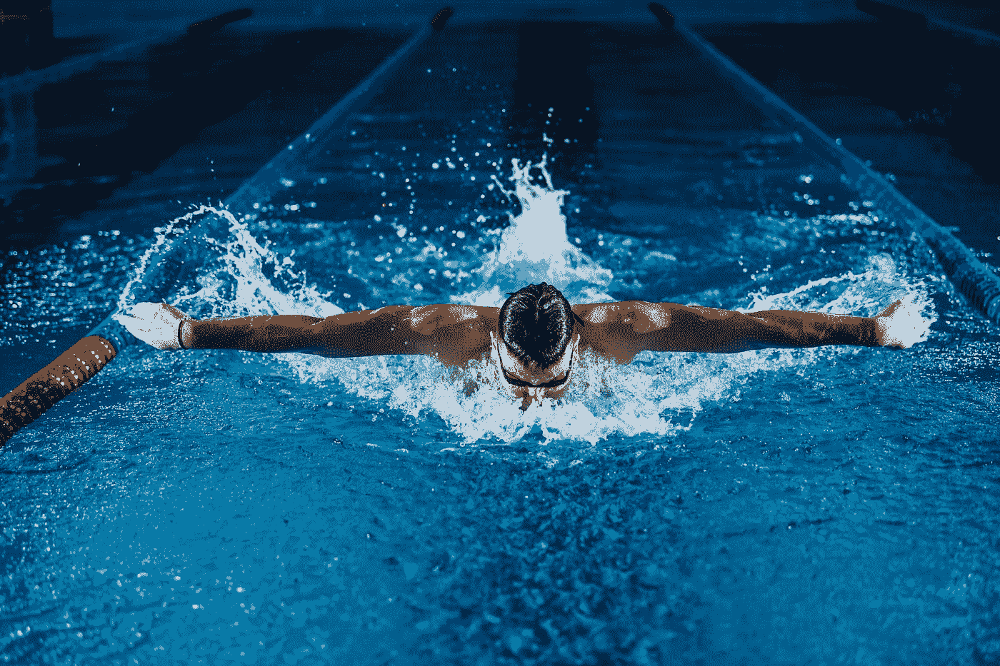

Gentrit Sylejmani 在 [Unsplash](https://unsplash.com?utm_source=medium&utm_medium=referral) 上拍摄的照片

约瑟夫的学业最近在东京奥运会上的表现引发了巨大的反响。在 2016 年里约奥运会上赢得 100 米蝶泳冠军后，人们似乎希望学校教育能够复制他在东京的成功。有许多讽刺的评论(大部分已被删除)和失望的表达。然而，看到许多支持的信息令人振奋。支持的网民通过理解保持高水平的表现是多么困难来关闭有毒的。但是“专家”评论员也加入进来，对学校教育作为世界级运动员的地位提出了质疑。最初对学校教育的期望公平吗？说学校教育不如其他世界级运动员稳定，公平吗？

这篇文章使用奥运会成绩和国际游泳联合会(FINA)运动员排名和计时数据来表明:

1.  对学校教育在背靠背的奥运会上赢得奖牌的期望是不现实的
2.  学校教育确实是世界一流的

**免责声明:**我不是运动员，我不知道参加奥运会是什么感觉。但是我确实知道一些关于如何处理数据和如何绘制图表的知识。事实证明，要想更清楚地了解学校教育的成就，你只需要知道这些就够了——这一点还没有出现在任何评论中。

# 连续几届奥运会登上领奖台

虽然我们可以很容易地找到关于连续两届奥运会上获得奖牌的运动员的报道，但我们没有看到大量运动员没有获得奖牌。因此，很难对我们自己的运动员的表现形成现实的期望，我们最终用我们的心，而不是我们的头脑来形成这些期望。为了让我们的预期建立在通常情况下，我们使用[这个奥运会奖牌获得者的数据集](https://www.kaggle.com/heesoo37/120-years-of-olympic-history-athletes-and-results)来调查运动员在背靠背的奥运会上赢得奖牌的普遍程度。在下文中，我们将这些称为**重复获胜**，将在随后的奥运会上在同一项目中赢得奖牌的奖牌获得者的百分比称为**重复获胜率**。

这些数据包含了从 1896 年到 2016 年运动员在奥运会上取得的成绩的基本信息。出于本帖的目的，我们将我们的分析限于 1956 年至 2016 年(数据集中的最新年份)的男性运动员在奥运会个人项目中的成绩。之所以选择 1956 年作为起始年，是因为这是有记录以来第一年举办蝴蝶赛事。

## 体育领域的多次胜利

首先，我们看看各种奥林匹克运动。第一个图显示了(1)获得重复胜利的奖牌获得者(绿色)和(2)没有获得重复胜利的奖牌获得者(紫色)的数量。第二个图显示了不同运动中的重复胜率。

我们在这里做了两点观察:

1.  卫冕冠军似乎胜算不大。
2.  不同的运动似乎有不同的重复胜率。

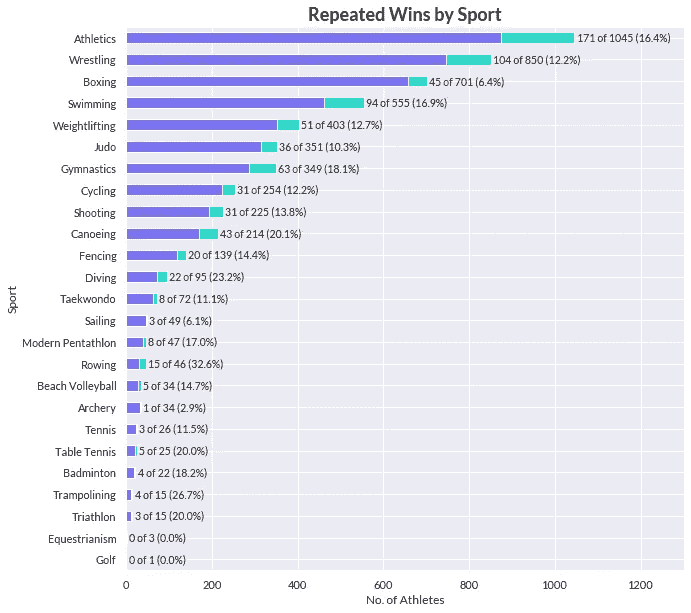

图片作者。

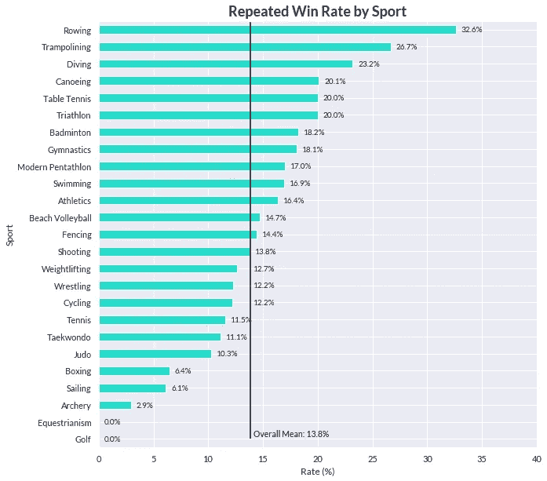

图片作者。

## 跨年龄的重复胜利

第二，我们跨越年龄来看。这两个图报告了与上面相同的统计数据。很明显:

1.  根据第一幅图中的数据判断，22 岁到 25 岁似乎是运动员的黄金时期
2.  男性运动员越年轻(至少在 17 岁之前)，重复获胜率越高。

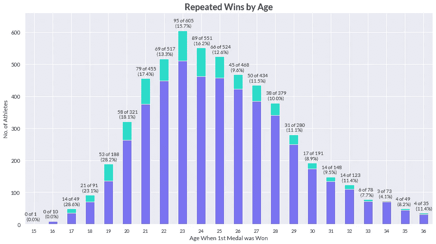

图片作者。

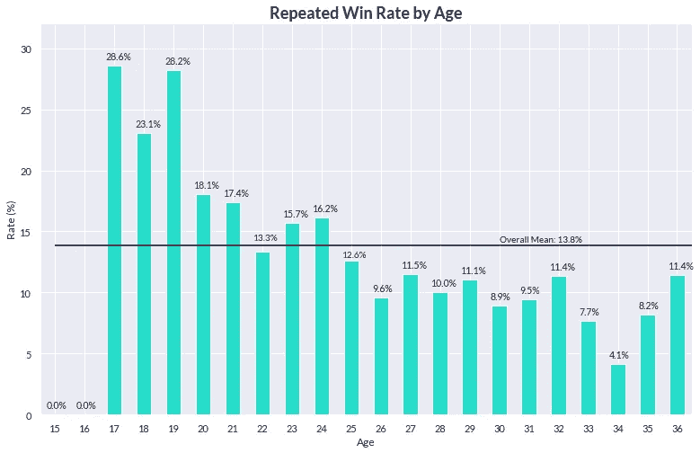

图片作者。

> ***旁注:*** *我运行了几个逻辑回归模型来评估运动和年龄对重复获胜概率的统计意义。模型拟合非常差，置信区间非常宽。使用这些模型进行推理没有多大价值。因此，我在这篇文章中省略了它们。*

## 游泳中的多次胜利

现在我们知道运动员的运动和年龄可能会影响重复获胜的机会，我们进一步分割数据，放大游泳。我们采用与上述相同的方法，绘制计数和比率图，以了解游泳项目和年龄之间的差异。

下面，我们看到不同事件的重复成功率有所不同。一方面，我们有 200 米蛙泳，获胜率相对较低，为 1/10；另一方面，我们有 100 米自由泳，获胜率相对较高，为 1/5。100 米蝶泳位于中间的某个位置 **15%**

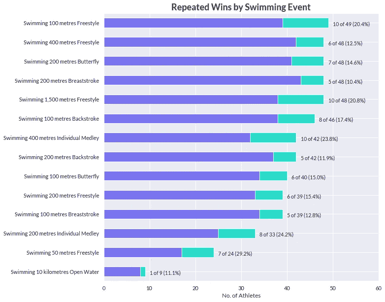

图片作者。

下图反映了上一小节的发现:不同年龄段的重复成功率不同。此外，查看总计数(堆叠的紫色和绿色柱的全长)，我们注意到游泳运动员达到最佳表现的年龄似乎是 21 岁。这适用于 100 米蝶泳，我们将在下一节重点介绍。

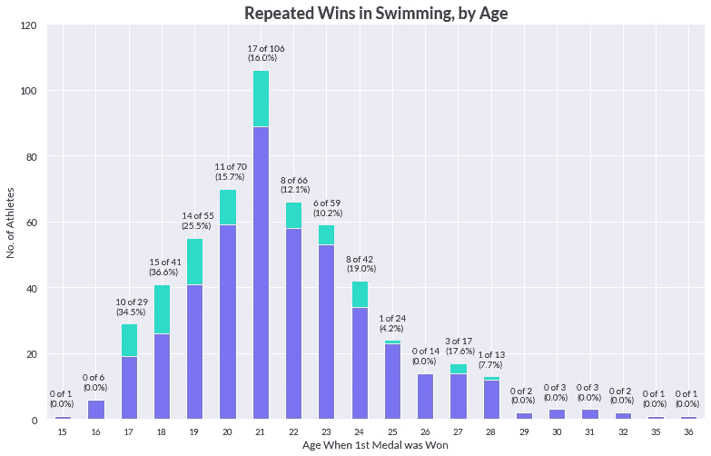

图片作者。

## 在 100 米蝶泳比赛中屡次获胜

接下来，我们再次放大，这次是 100 米蝶泳。我们发现，历史上没有一名男子游泳运动员在 21 岁时就在 100 米蝶泳比赛中获得奖牌，也没有一名男子游泳运动员在接下来的奥运会上获得奖牌。事实上，在所有年龄组中，只有六个人做到了这一点，而且只有四个名字:斯皮兹、内斯特、菲尔普斯和勒克洛斯。

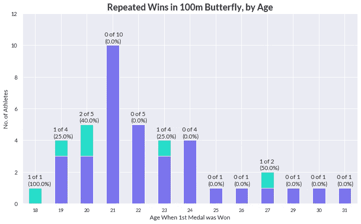

图片作者。

我们已经尽可能地缩小了数据范围，但仍然只能对 100 米蝶泳重复获胜的概率有一个大致的估计:(a)如果你把所有年龄组放在一起，大约 15%；(b)如果你不这样做，0%。这些数字不太可靠。这第一部分的关键是**重复获胜并非不可能，但实现它们的几率对运动员不利**。虽然数据可能无法给我们一个精确的估计，但它足以告诉我们，重复的胜利是例外而不是常态。

我们可以通过更频繁地查看更多的数据，在现实中建立我们的期望。四年时间足以培养新的世界冠军，因此我们应该看看运动员在两届奥运会之间的表现。用我们运动员在往届奥运会上的表现来形成对他们在本届奥运会上的预期，没有太大意义。

# 世界级的一致性

本节旨在解决学校教育是否是世界一流的问题。评论员将学校教育比作安东尼·nesty⁴，他在一届奥运会上赢得了金牌，并在下一届奥运会上又赢得了一枚金牌。他们暗示，学校教育的旅程出了问题，学校教育没有走上“人们对世界级运动员的期望轨迹”。⁵

如果评论员将轨迹称为**重复获胜**的模式，我们在前面已经看到，达到这一目标的游泳运动员少之又少。评论员很难找到另一个例子。事实上，在 100 米蝶泳的整个 60 年(15 届奥运会)历史中，唯一一个取得与内斯特相同成就的人是迈克尔·菲尔普斯，他是这项运动中的一个异类。他们还不如问，“为什么学校教育没有达到菲尔普斯的水平？他哪里出问题了？为什么我们的体制这么破，出不了菲尔普斯这样的游泳运动员？"

如果这些评论家指的是高水平的表现模式，他们可能完全错误地认为 Nesty 达到了世界级的一致性，而学校教育没有。我们来看数据。

国际游泳联合会(FINA)公布了游泳运动员的比赛时间和排名数据。本文的分析使用了 100 米蝶泳的⁶记录。从现在开始，“游泳运动员”将专指 100 米蝶泳运动员。

## 关于计时的说明

比较将基于比赛排名，而不是时间。这是因为游泳运动员的速度越来越快，因此，你出生的越晚，你的速度可能就越快。比较排名是一种更公平的一致性衡量方法，因为它受你出生的时代影响较小。

从 1941 年到 2010 年，我们根据出生年份将游泳运动员分为 14 个五年一组。然后比较了 100 米蝶泳计时的中位数。较暗的红线代表出生时间较长的游泳运动员群体的时间，而较深的蓝线代表出生时间相对较近的游泳运动员群体的时间。我们不仅看到出生较晚的游泳运动员速度越来越快的趋势；他们也一直在竞争，直到一个更大的年龄。因此，为了在游泳运动员之间进行公平的比较，我们应该按照年龄对他们的表现进行排序。

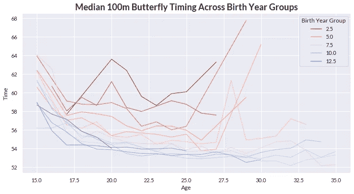

图片作者。

在第二张图中，我画出了每个年龄的选定游泳者的平均时间。这里有三个例子，游泳运动员今年的平均成绩更快，但仍然在同年的奥运会上失利。箭头从输家指向赢家。

1.  2004 年雅典，伊恩·克罗克(银牌)vs 菲尔普斯(金牌)
2.  2008 年北京，科罗蒂什金(无奖牌)对劳特斯坦(铜牌)
3.  2012 年伦敦，科托季什金(银牌)对菲尔普斯(金牌)

在一个比赛日赢得奖牌的快速计时不需要与一年中的稳定表现一致。与此同时，如果游泳运动员参加了足够多的比赛，全年比赛排名的一致性并不太取决于异常的表现或运气。为此，我们根据**的竞争排名**进行比较。

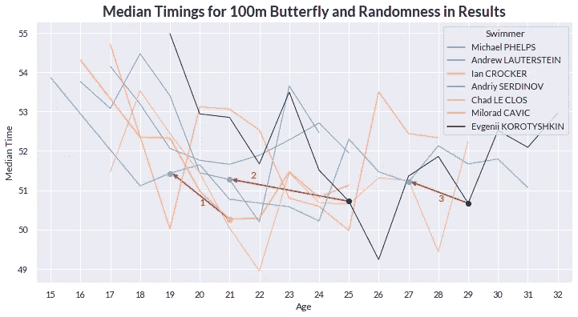

图片作者。

## 学校教育与家庭教育

我们比较了学校和 Nesty 在 100 米蝶泳比赛中的排名。学校教育在早期表现优于 Nesty，但下降得更快。他们两人都在 19 至 23 岁的黄金年龄在国际和地区比赛中占据主导地位。然而，他们参加的比赛数量有很大差异。

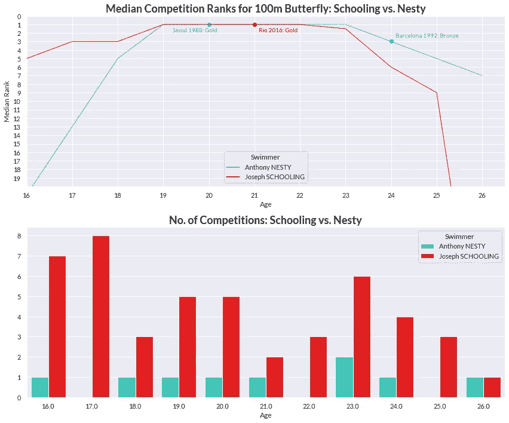

图片作者。

Nesty 保持不败，但从 18 岁到 24 岁只参加了 7 场比赛。学校教育在 **28** 竞争，并且几乎自始至终保持着 1 的中值排名。上学从未赢得过世界锦标赛，但他赢得了地区赛(亚洲和海洋运动会)和美国的许多比赛，对手是像菲尔普斯和罗切特这样的强手。我的一个朋友敏锐地观察到，在内斯特的时代，比赛本来可以少一些。虽然这是可以理解的，但事实仍然是，学校教育在比 Nesty 多得多(4 倍)的竞争中受到考验。此外，我不太确定 1987-1992 年是否有像菲尔普斯和罗切特这样的精英游泳运动员与内斯特竞争。毫无疑问，在学生时代，没有哪个竞争者能像菲尔普斯那样赢得如此多的奖牌。

Nesty 和学校教育的另一个区别是连续的奥林匹克运动会与他们的黄金年对齐。对 Nesty 来说，这几乎是完美的组合。1988 年，20 岁的他参加了汉城奥运会，1992 年，24 岁的他参加了巴塞罗那奥运会。另一方面，学校教育在 2016 年里约奥运会上以 21 岁的最佳表现赢得了历史最佳年龄的金牌，但由于新冠肺炎，他被迫在 26 岁卫冕冠军，比黄金年龄晚了整整两年。正如我们在整篇文章中看到的，年龄与奖牌胜率呈负相关。

即使我们不能接受这些质量上的差异，我们也不得不承认家庭和学校教育的轨迹看起来是相似的。他们两个:

*   从 16 岁到 19 岁排名上升，达到第 1 名
*   直到 23 岁左右一直保持第一名
*   从 24 岁开始排名下降

学校排名的大幅下降可以用一个异常值来解释:2020 年的东京。就在奥运会之前，学校教育在 6 月份达到了 26 岁。因此，他在东京的第 44 名是他 26 岁时唯一的比赛。我们应该对这个数据持保留态度。

总的来说，如果 Nesty 展示了世界级的一致性，那么学校教育肯定也是如此。

## 更公平的比较

但是，当然，将学校教育和其他游泳者进行比较是肤浅的。正确的分析应该将学校教育与更广泛的竞争对手进行比较，我们将会这样做。我已经把所有之前的 100 米蝶泳奥运奖牌获得者列入了候选名单**，他们至少有五项 FINA 游泳记录。下表提供了完整的列表。**

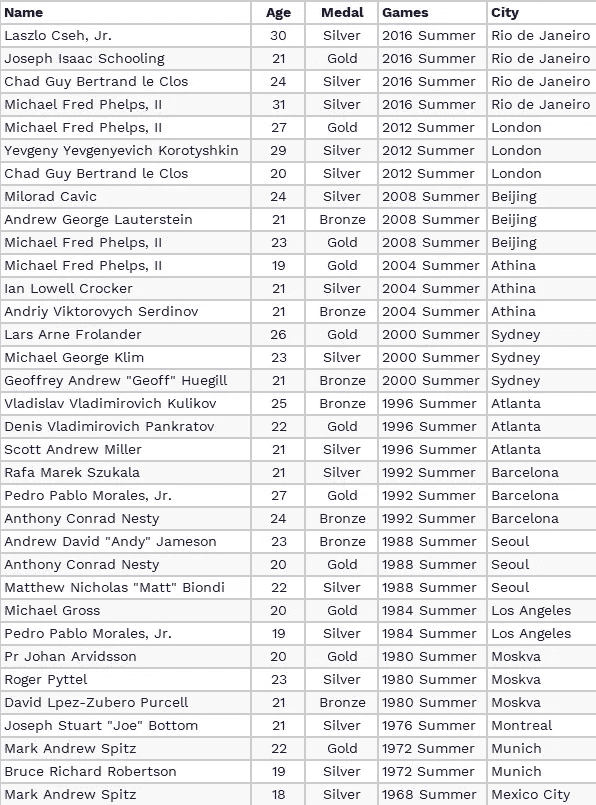

图片作者。

由于缺乏数据而被遗漏的游泳运动员有:

*   罗斯·威尔士
*   道格拉斯·拉塞尔
*   杰里·海登赖希
*   马特·沃格尔
*   加里·豪尔
*   格伦·布坎南

下图显示了以上名单中所有(独特的)26 名游泳运动员加上学校教育的中位比赛排名轨迹。更广泛的模式似乎如下:

1.  大多数游泳运动员在 19 或 20 岁左右达到接近职业生涯最高水平的级别。
2.  他们在这个排名上下波动，直到 22 岁，其中许多人排名下降。更好的人会在 23 岁之前保持他们的排名。这两个组中的大多数游泳运动员将不会再次达到中位排名 1。
3.  极少数人(菲尔普斯、勒克洛斯和 Cseh)保持排名第一，直到相对较老的年龄。

看着大多数游泳运动员的中位排名大幅下降，我们可以说，在黄金时期，学校教育是比较稳定的。25 岁时的表现很难比较，因为大多数游泳运动员完全不再参加 100 米蝶泳比赛。

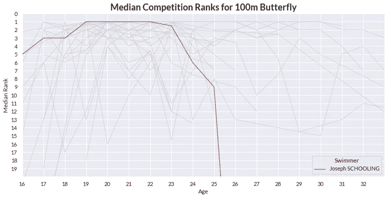

图片作者。

此外，学校教育在黄金年前后参加了相当多的比赛。一个有趣的观察是，除了破坏市场的勒克洛斯(和我的图表)之外，更大的名字只是在后来增加了他们对竞争的参与。

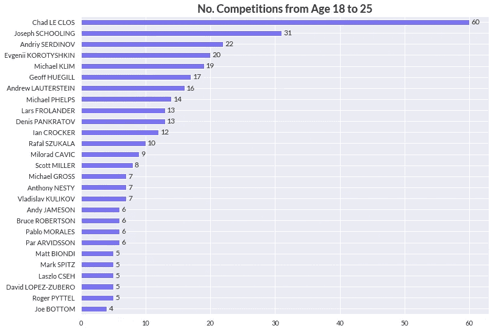

图片作者。

为了比较学校教育的相对表现，我们绘制了学校教育相对于所有 26 名入选游泳运动员排名的热图。等级的差异在每个单元格中显示。较暗的红色单元格表示对学校教育的较强表现，而较暗的蓝色单元格表示对学校教育的较弱表现。空白单元格表示该游泳运动员在该年龄不参加比赛。

我们看到，从 19 岁到 23 岁，学校教育实际上赶上了像勒克洛斯和菲尔普斯这样的伟大游泳运动员的平均水平，并且超过了很多其他人。我们再次看到，内斯特的表现是可比的。

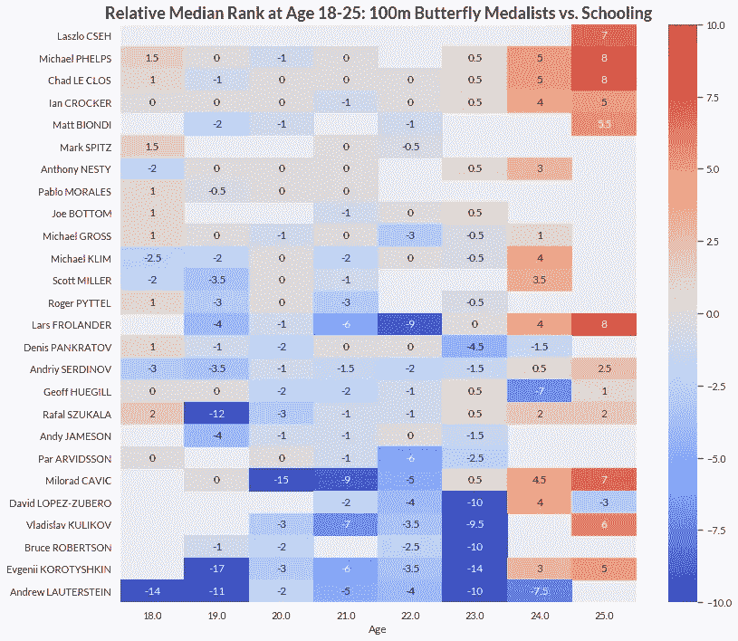

图片作者。

学校教育的表现也可以被分解为他在 100 米蝶泳比赛中表现出色和表现不佳的人数。我们再次看到，他的“轨迹”看起来与内斯特的相似。他们两人的黄金时期都是从 19 岁到 23 岁。

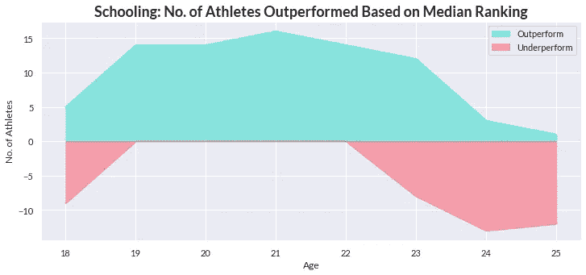

图片作者。

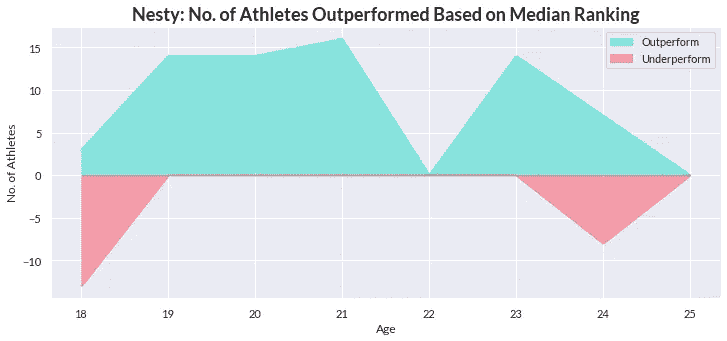

图片作者。

作为异常值的参考，这些是菲尔普斯和勒克洛斯的等效图，他们一直统治到 30 岁左右，Cseh 和 Korotyshkin 一直表现良好，直到 30 岁出头。

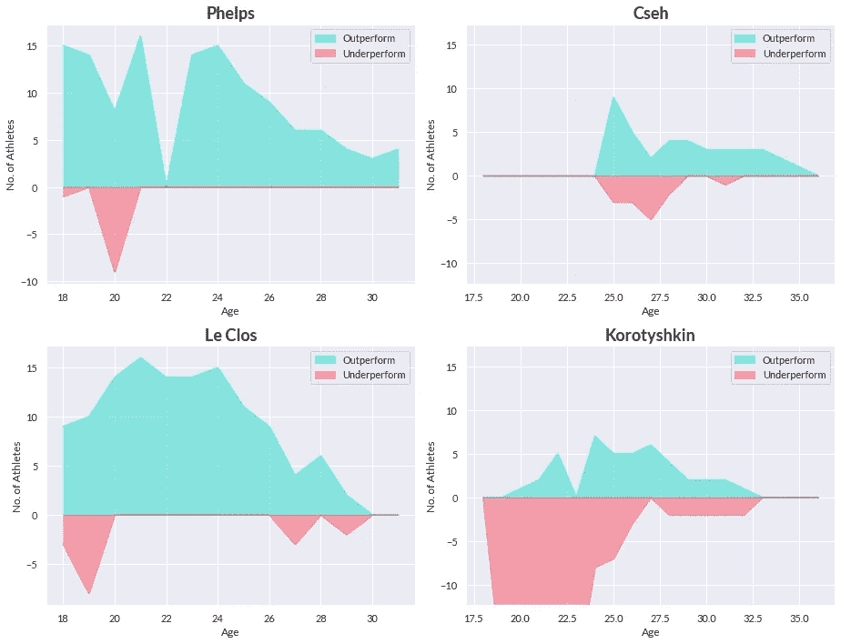

图片作者。

排名部分到此结束。这里的第一点是，仅仅因为他们都获得了 100 米蝶泳金牌，就将学校教育与内斯特进行比较是不完全公平的。如果我们将 Nesty 和 Schooling 的成绩按年龄排列，Schooling 有一个相似的轨迹，尽管通过大量的比赛进行了更严格的测试。其次，数据显示，学校教育胜过了许多其他 100 米蝶泳冠军。这是根据他排名靠前的其他游泳运动员的相对中值排名和原始计数来衡量的。

# 向前看:年龄会赶上

在我们结束之前，我想展示两个与年龄相关的图表来帮助校准期望值。今年上学 26。从历史上看，大约 86%的游泳运动员在 26 岁之前退出 100 米蝶泳*。下图显示了退休年龄的分布，退休年龄定义为 FINA 追踪的游泳运动员最后一次活动的年龄。如果继续上学(这不关我们的事)，他将成为这项运动中最坚持不懈的运动员之一，加入拉斯洛·切赫、勒克洛斯和菲尔普斯的行列。*

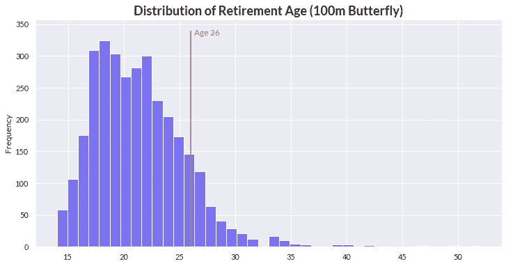

图片作者。

如果上学决定继续(同样，不关我们的事)，要知道他很难赶上他 21 岁时的时间。历史上，100 米蝶泳计时随着年龄的增长而减少。下面的图看起来像是时间在减少，直到 29 岁。事实是，游得慢的人会更早停止比赛，只留下最好的人。这反过来会逐渐降低平均值，直到速度快的最终慢下来。没有运动员能逃脱年龄的影响，我们应该适当地校准我们的期望。

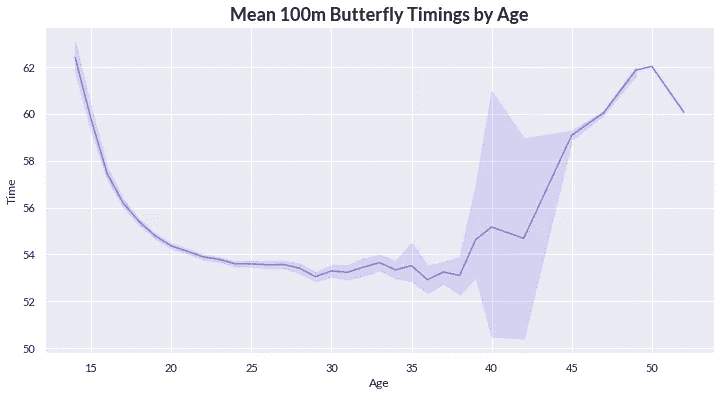

图片作者。

当然，这些只是历史平均值。每个运动员都是独一无二的，很难预料运动员未来会如何继续发展。我们只能给他们资源和我们的支持，让他们可以做他们最擅长的事情，而不会被消极情绪拖累。

# 结论

在这篇文章中，我试图提供一个比目前更全面的分析学校教育的表现，以调查对他的期望是否公平，以及他是否像其他世界级运动员一样稳定。

首先，我证明了上学在东京赢得另一枚奖牌的可能性对他不利。屡次获胜并非不可能，但它们似乎是例外而非常态。我注意到奥运会之间发生的事情很重要，因此用过去奥运会的表现来形成对现在和未来奥运会表现的预期是没有意义的。

第二，我用竞赛排名的比较来表明学校教育确实是世界一流的。数据显示，与奥运历史上所有 100 米蝶泳奖牌获得者相比，学校教育的平均排名高于平均水平。此外，他的记录可以说比内斯特更好。如果“专家”称赞 Nesty 的世界级一致性，他们最好也称赞学校教育。或许，学校教育的轨迹*就是*“一个世界级运动员所期望的轨迹”。⁷

总的来说，如果上学重复获胜的期望是不现实的，如果上学表现出世界级的一致性，如果他的轨迹比 100 米蝶泳的可比冠军更好，也许我们*根本不需要*谈论太多。重要的是，我们要尽职尽责地分析数据，形成基于事实的观点，并提出准确而符合逻辑的叙述，而不是简单地满足我们的政治议程。

我知道我可能在计算这些数字时做得过火了。我希望我分析了他的表现，把他描述成世界级的运动员，这样做是公平的。

@Schooling:你永远是我们的冠军！

## 参考

1.  CNA (2021 年)，脸书
2.  G.Wong，[解说:我们需要谈谈为什么约瑟夫·斯库林在 CNA 东京](https://www.channelnewsasia.com/news/commentary/joseph-schooling-tokyo-olympics-race-heats-15339062) (2021)坠毁
3.  R.格里芬， [120 年奥运历史:运动员和成绩](https://www.kaggle.com/heesoo37/120-years-of-olympic-history-athletes-and-results) (2018)，Kaggle 数据集
4.  今天，新加坡体育必须从学校教育的衰落中吸取教训
5.  黄，[解说](https://www.channelnewsasia.com/news/commentary/joseph-schooling-tokyo-olympics-race-heats-15339062) (2021)，CNA
6.  [国际游泳联合会](https://www.fina.org/) (FINA)
7.  黄，[解说](https://www.channelnewsasia.com/news/commentary/joseph-schooling-tokyo-olympics-race-heats-15339062) (2021)，CNA

*最初发表于*[*https://chrischow.github.io/dataandstuff/*](https://chrischow.github.io/dataandstuff/2021-08-05-schooling-by-the-numbers/)*。*