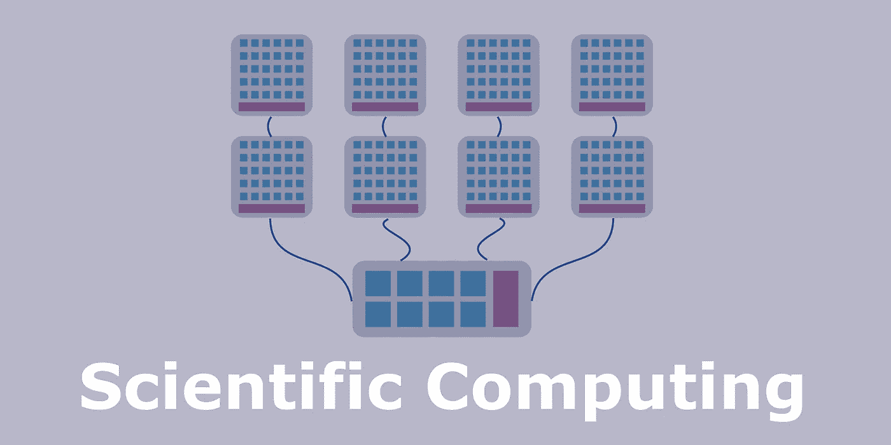
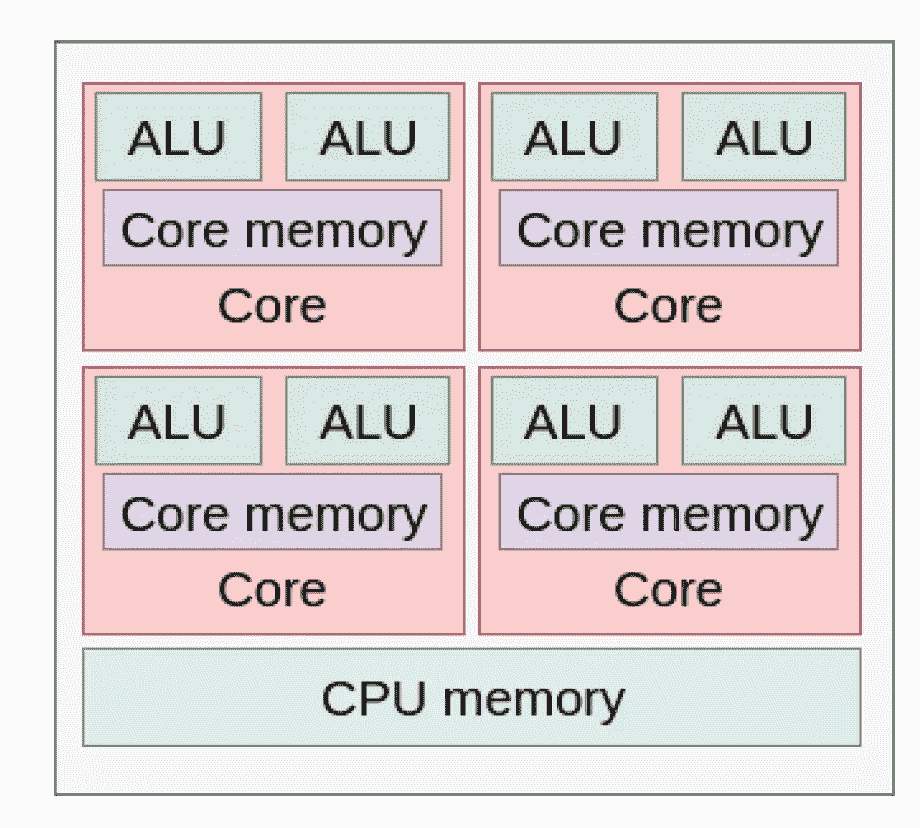
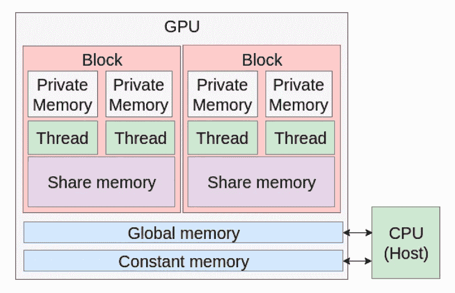
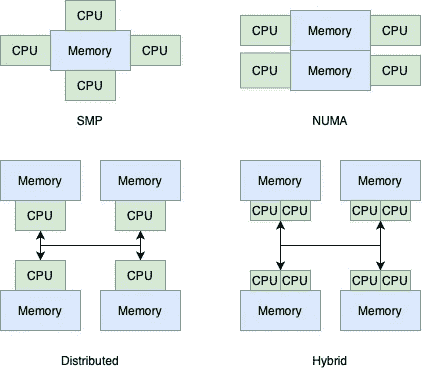
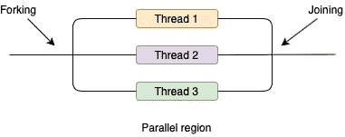
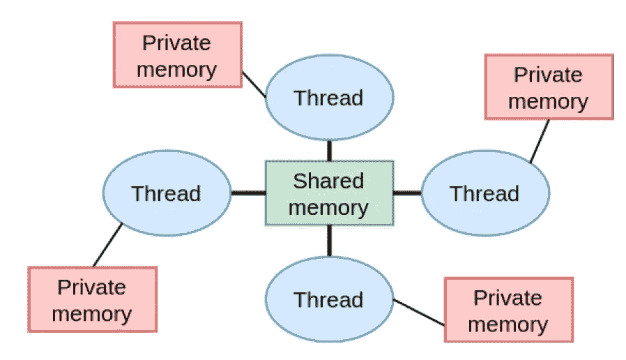
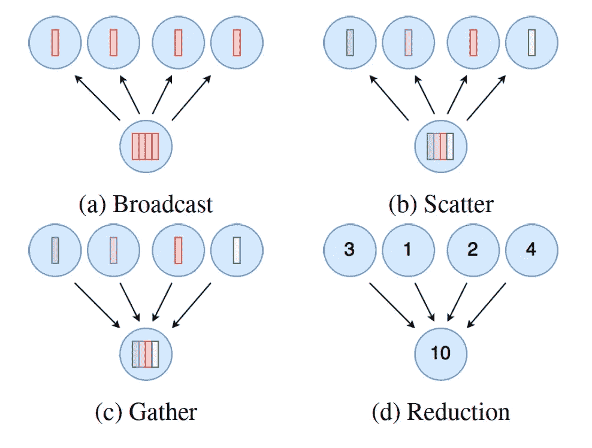

# 科学计算——惨痛的教训

> 原文：<https://towardsdatascience.com/scientific-computing-lessons-learned-the-hard-way-db651f8f643a?source=collection_archive---------9----------------------->

*深入介绍科学计算——从 CPU、GPU 和 HPC 集群到最常用的框架——OpenMP、MPI 和 CUDA。*

作者图片

我以前很喜欢汽车碰撞测试的视频。他们尤其擅长慢动作——汽车加速，就在撞上障碍物之前，慢动作开始了。到处都是玻璃，门大开着，最后是爆炸！虽然，这些测试非常壮观，对道路安全非常重要，但也非常昂贵。测试所有可能的碰撞场景并验证汽车是否可以安全驾驶是根本不可能的。

同时，碰撞模拟是廉价的，并且可以提供对可能的安全问题的早期洞察。在这种模拟中，计算出汽车各部分的运动、轨迹和变形，并与各部件施加的压力、温度变化等统计数据一起呈现给用户。模拟的好处显而易见！然而，使模拟精确和快速的方法并不明显。想象一下模拟几百万个粒子一秒钟的碰撞行为所需的计算量！

在这里，我们可以从科学计算中获得一些帮助——该领域正在开发计算技术和有效使用计算硬件来解决大问题的方法。这可能令人惊讶，但我们的许多日常活动都受到科学计算的影响。例如，考虑飞机、火箭和汽车的气流模拟，医疗应用的血流模拟，包括预测复杂手术期间的身体行为，天气预报，拆除建筑物的爆炸模拟等等！

科学计算中的大部分工作都集中于在多个独立的机器上并行和分布计算。

我很难想象编写我的第一个科学计算程序——一个简单的基于 OpenMP 的 for 循环的并行化(我将在本文后面讨论 OpenMP 的细节)。虽然我获得了显著的速度提升，但还远远没有达到我在八核机器上期望的 8 倍的速度提升。事实证明，达到表演的边缘比我最初想象的要困难得多。在从事分布式和并行代码工作两年后，我只能触摸到冰山的一角。

回顾我刚开始的时候，我现在可以确定哪些领域是快速编写并行和分布式代码的关键。首先，知道如何编写高效的串行代码。为此，了解硬件架构和内存层次非常重要。了解这些细节有助于找到更好的方法，例如存储数据，优化访问速度。其次，了解并行化框架也很重要——它们的优势、它们更适合的地方以及它们的性能瓶颈。

因此，在本文中，我将介绍科学计算入门的要点，我希望我在入门时就已经总结了这些要点——硬件架构、内存层次结构、将处理器组织成集群的方法以及并行化框架。

# 硬件架构

为了充分利用现有的机器，了解机器内部的工作原理会有所帮助！有两个关键组件——执行计算的处理单元和存储数据、中间结果和最终计算结果的存储器。可以将独立的处理单元组织成集群。

## **中央处理器**

简单的 CPU 由单核和全局内存组成。内核是一个硬件实体，根据架构的不同，它包括许多算术逻辑单元(ALU)和本地存储器。ALU 负责计算，例如加、减、乘、除和按位逻辑运算。根据不同的体系结构，ALU 执行的功能可能会越来越复杂。例如，复杂的 ALU 可以在一次迭代中执行简单的加法和除法。CPU 的速度是以时钟周期来定义的。时钟周期的持续时间由振荡器控制，振荡器发送电脉冲以确保同步运行。时钟周期越短，振荡器的频率越高，执行速度越快。复杂的 CPU 包括一个以上的核心，称为多核 CPU。

多核 CPU 简化了操作架构。图片作者。

## **图形处理单元**

GPU 最初旨在图形计算，但现在在通用计算中越来越受欢迎。用于通用(GP)应用的 GPU 通常被称为 GP-GPU。不像多核 CPU 通常有 10 个以上的核心，GPU 由数百个核心组成。与 CPU 内核相比，GPU 内核的指令集有限，频率和内存也较低。GPU 不是独立的，需要一个关联的 CPU 来运行。现代架构允许多个 CPU 共享一个 GPU，也允许一个 CPU 拥有多个相关的 GPU。

GPU 内存模型。图片作者。

CPU 及其内存被称为主机，而带有相关内存的 GPU 被称为设备。主机既可以在设备上启动称为内核的功能，也可以管理设备的内存。从主机到设备的数据传输非常昂贵，不应该经常发生。

GPU 编程通常使用来自 [Flynn 分类法](https://en.wikipedia.org/wiki/Flynn's_taxonomy)的单指令多数据(SIMD)模型，因此当其每个核心都被赋予相同的简单任务来执行时，它非常强大，而分支或更复杂的操作会大大降低处理速度。

## **记忆等级**

GPU 和 CPU 都有相同的内存层次。速度较快但较小的内存靠近内核，而速度较大但较慢的内存则远离内核。

寄存器是最快和最小的内存，其次是缓存。寄存器用于存储计算立即需要的值。高速缓存可以有三种类型，L1、L2 和 L3，L1 的速度最快且最小，L3 的速度最慢且最大。缓存用于存储最近使用过或可能很快需要的值。最慢但最大的是随机存取存储器(RAM ),大部分数据都存储在这里。

通常每个内核都有自己的高速缓存，并共享一个公共 RAM。RAM 中的数据以块为单位传输到缓存，称为缓存行。这些是相邻的 RAM 存储单元。因此，每个内核都有来自 RAM 的数据的本地副本。如果核心需要新数据，会在缓存中检查其可用性。如果不是，则发生高速缓存未命中。因此，内核从 RAM 中请求这些数据，这在计算上更加昂贵。程序员必须确保立即需要或经常使用的数据在缓存中。

## **处理器集群**

高性能系统由多个处理器的集合组成，这些处理器可以形成不同的计算机体系结构。有四种基本类型:对称多处理(SMP)，非均匀内存访问(NUMA)，分布式和混合系统。

计算机体系结构。图片作者。

在 *SMP* 中，每个 CPU 都有自己的私有高速缓存，但是所有进程共享一个大 RAM 内存。在 *NUMA* 所有的 CPU 都可以访问共享内存，然而与 SMP 不同的是，内存被分割在 CPU 之间，物理位置更靠近某些单元。因此，CPU 花费较少的时间访问关闭的存储器，然而，花费较长的时间访问邻近另一个处理单元的存储器。SMP 和 NUMA 都是共享内存系统。*另一方面，分布式*系统允许每个 CPU 都有自己的内存，只有它自己可以访问。通过消息，通信和数据共享成为可能。对于由不同单元执行的计算重叠的大型问题，通信可能会成为瓶颈。混合系统是分布式和共享内存系统的混合体。

# 并行化框架

了解了硬件的基础知识，我们现在可以开发并行化框架。下面我谈谈三个最常用的:OpenMP——用于并行计算，MPI——用于分布式计算，CUDA——用于 GPU 的一般用途。

## **OpenMP**

在共享内存架构上执行的应用可以与 [OpenMP API](https://hpc.llnl.gov/openmp-tutorial) 并行化。OpenMP 是 C、C++和 Fortran 中用于并行的库例程、编译器指令和环境变量的集合。OpenMP 是可移植的，并且具有在忽略编译器指令的情况下保持正确性的优势。也就是说，用 OpenMP 并行化的程序将按顺序正确执行。

OpenMP 执行模式基于三大支柱:共享内存、同步和工作负载分配。

**一般结构** 平行实体称为线程。线程是一个具有堆栈和相关静态内存的执行实体。OpenMP 使用并行执行的 fork-join 模型。几条线在平行区域之前分叉，在平行区域之后结合。并行区域中的工作在线程之间进行划分。

OpenMP API 中线程的分叉和连接。图片作者。

程序执行从单个“主”线程开始。主线程启动(分叉)——在并行区域之前的一组并行“工作”线程。当线程到达并行结构的末尾时，它们同步并终止(连接)，只留下主线程。

这种模型的一个缺点是大量的时间花费在分叉、连接和同步上。因此，在可能的情况下，不应该关闭并行区域，并且应该避免任何冗余的同步。

**内存模型** OpenMP 是针对共享内存的并行应用。OpenMP 区分共享内存和私有内存。前者可以被任何线程访问和修改。后者由每个线程单独维护。因此，线程可以使用共享变量进行通信。需要两个要求:*缓存一致性*和*内存一致性*。

*高速缓存一致性*意味着处理器在特定的内存地址中看到相同的数据。出现的一个主要问题是假共享，即同一高速缓存行中的各个存储单元由不同的处理器同时更新。尽管这些更新在逻辑上彼此独立，但整个高速缓存行都是无效的。

*多线程应用中的内存一致性*是不同线程对同一内存位置的有序访问和更新。内存不一致可能导致争用情况。当几个线程试图同时写入同一内存位置时。

OpenMP 内存模型。图片作者。

**工作负载分配** OpenMP 提供了几个指令来管理 for 循环的工作负载分配，其中在 for 循环中执行的工作可以在线程之间分割。指令分为“静态”、“动态”和“引导式”。使用“静态”时，循环迭代在所有线程中平均分配。“动态”时，工作负载在运行时动态分布。一旦每个线程完成了前一个循环，它就会在 for 循环中多执行一个迭代步骤。与“动态”类似，“引导式”允许每个线程被动态地分配连续迭代的块。然而，与“动态”不同，随着先前工作的每次连续执行，分配给线程的迭代次数会呈指数下降。

**同步** 线程异步执行计算，除非另有说明。为了保持一致性，OpenMP 提供了一系列同步指令。这些可以用来避免竞态条件。主要的有“主”、“关键”、“原子”、“屏障”和“不等待”。当遇到“主线程”时，指定的区域只由主线程执行。“关键”部分中的代码由每个线程轮流执行。与“关键”类似，“原子”用于指定需要由每个线程依次自动更新的语句。如果遇到“障碍”，线程会等待，直到所有线程都到达它。一旦它们全部到达“屏障”。在“nowait”的情况下，线程被迫不在隐式同步点同步，例如在 for 循环的结尾。

## **消息传递接口(MPI)**

顾名思义，MPI 是基于消息交换的。基本的并行实体是一个进程。一组能够相互交换消息的进程称为通信器。通信器中的每个进程都有一个唯一的等级，即在创建过程中分配给它的一个整数 id。进程通过它们的等级在它们之间显式地通信。通信是必要的，因为 MPI 是一个内存分布式系统。

**通信** MPI 支持多个和两个独立进程之间的同时消息交换。

*点对点通信*:在点对点通信中，一个进程执行发送操作，另一个进程执行接收操作，同步或异步。只有在确认接收进程安全接收到消息后，同步发送操作才完成。这被称为阻塞，在这种情况下，进程将暂停，直到操作成功完成。在异步通信中，进程不等待确认，只是在通知 MPI 协议需要发送数据后继续。接收进程也不等待数据，而是在数据准备好的时候期待来自系统的中断。在非阻塞通信中，进程请求 MPI 库为它们执行操作。因此，用户无法预测数据在接收过程中何时可用。

集体通信(Collective communication):MPI 为管理同一个通信器中的多个进程提供了一个框架。该框架包括同步点、数据移动和集体计算。示例包括:广播、分散、聚集和还原。

集体交流类型。图片作者。

与 MPI 相关的两个概念是带宽和延迟。由于消息是通过物理信道(即网络)交换的，所以通信速度是有限的。带宽对数据的移动速度施加了物理限制。很明显，小消息花费的时间更少，而大消息花费的时间更长。然而，即使非常小的消息也需要时间来处理和移动。延迟是任何消息转换时间的下限。近年来提出了不同的计算机网络通信标准，在高性能计算中最常用的是 infiniband (IB)。它提供高带宽和低延迟。

## **CUDA**

CUDA 是 NVIDIA 开发的一个应用编程接口(API ),用于访问 GP-GPU。CUDA 提供对 GPU 虚拟指令集和计算核心的直接访问。GPU 不是独立的设备，必须有一个相关联的 CPU。因此 CUDA 驻留在一个异构的编程模型中。CUDA 依赖于*线程*、*块*和*网格*的概念。

*线程*是内核的单个执行实例。每个线程同时执行相同的代码，但是处理不同的数据，并且以寄存器的形式拥有一个很小但是非常快速的私有内存。

线程被组织成*块*。每个块都有相关的共享内存，只能由该块中的线程访问。线程可以在同一个块中通信，但不能与其他块中的线程通信。为了相互通信，线程具有由线程和块索引组成的唯一 id。在物理上，一个块被映射到一个 GPU 的单流多处理器(SM)，这是一个 GPU 核心的集合，通常被称为流处理器(sp)。同一 SM 中的 sp 数量可能因处理器而异。如果内存足够，可以将多个块映射到一个 SM。

*网格*是方块的集合。一个网格有一个相关的，大的，但是非常慢的全局内存，每个线程都可以访问。GPU 上区分全局内存和常量内存。每个线程都可以访问它们，但后者是只读的。

# 摘要

并行化可以是一个强大的工具，但是，如果使用得当，开发和调试时间通常会超过计算收益。

并行处理代码时，记住正在解决的问题是非常重要的，例如，精度是否重要，或者代码的结构是否可以改变。通常，提高串行代码的速度更重要。

要编写好框架的并行和分布式代码知识是不够的。当代码针对特定的硬件架构进行优化时，可以获得最高的增益。

如果你喜欢这篇文章，请与朋友分享！要阅读更多关于机器学习、数据科学、计算机视觉和图像处理的内容，请点击订阅！

我错过了什么吗？不要犹豫，直接给我留言、评论或发消息吧！