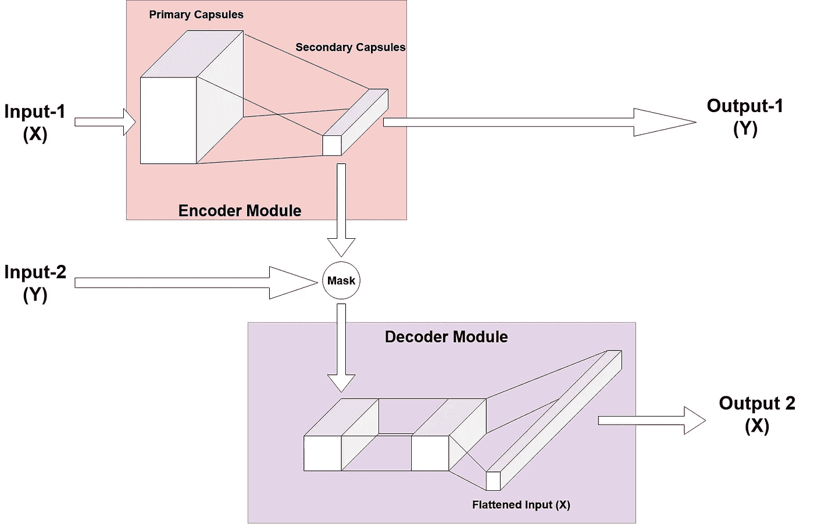

# Scikeras 教程:使用 keras 调整 CapsNet 超参数的多输入多输出(MIMO)包装器

> 原文：<https://towardsdatascience.com/scikeras-tutorial-a-multi-input-multi-output-wrapper-for-capsnet-hyperparameter-tuning-with-keras-3127690f7f28?source=collection_archive---------15----------------------->

## [实践教程](https://towardsdatascience.com/tagged/hands-on-tutorials)

## 一个教程，解释了如何使用自定义架构包装基于 Keras 功能 API 的模型，以便在带超参数调整的 sklearn 中使用。

sklearn 中定义的超参数调整实用程序的使用对于 Keras 中开发的深度学习模型来说是一个挑战；尤其是对于使用 Keras API 定义的模型。然而，西克斯来了，要改变这一切。在本文中，我们探索为具有*多输入多输出* ( ***MIMO 估计器*** )的非顺序模型(CapsNet)创建一个包装器，并用 **GridSearchCV** 装配这个分类器。


照片由[尹卡·阿德奥蒂](https://unsplash.com/@willyin?utm_source=medium&utm_medium=referral)在 [Unsplash](https://unsplash.com?utm_source=medium&utm_medium=referral) 上拍摄

# 关于超参数和调优的一点信息

如果你熟悉机器学习，你一定听说过超参数。 ***熟悉 sklearn 中 sklearn、keras 和超参数调优的读者，可以跳过这部分*。*github 回购的链接滚动到最后*** 。无论如何，给一个复习，超参数是任何机器学习或深度学习模型的一组属性，用户可以指定这些属性来改变模型的训练方式。这些是不可学习的(可学习属性的术语是参数或权重)，即它们是用户定义的。通常，超参数控制模型的训练方式，例如，学习率(α)或使用的正则化类型。

超参数调整/优化是设计机器学习或深度学习模型的关键步骤之一。这一步通常需要相当多的关于如何训练模型以及如何将模型应用于正在解决的问题的知识，尤其是当手动完成时。此外，手动调优会增加数据科学家的开销，因为他们要记录所有可能尝试过的超参数。这就是在 scikit-learn( `sklearn`)的帮助下自动超参数调整发挥作用的地方。


[斯科特·格雷厄姆](https://unsplash.com/@sctgrhm?utm_source=medium&utm_medium=referral)在 [Unsplash](https://unsplash.com?utm_source=medium&utm_medium=referral) 上的照片

Scikit-learn 在`**sklearn.model_selection**`下提供了多个 API 用于超参数调优。但是，使用 sklearn 的警告是，它主要仅用于机器学习模型 API 中没有定义深度学习模型。幸运的是，深度学习的实践者普遍使用的 Keras API 以简化的方式定义和训练深度学习模型，具有 Keras 中定义的深度学习模型的 ***sklearn 包装器*** 类。这意味着，人们可以在 Keras 中编写自己的深度学习模型，然后使用这些包装器将其转换为类似 sklearn 的模型。

目前为止听起来不错，对吧？嗯…没那么快。到目前为止，在 Keras 下定义的包装器(或`tensorflow.keras`)可以将您的模型包装成分类器(`KerasClassifier`)或回归器(`KerasRegressor`)。此外，如果您想要包装使用 Keras Functional API 定义的模型，即不是顺序模型[ *阅读 Keras* 中关于 [*顺序与功能 API 的更多信息]，那也是不可能的。因此，当人们想要使用 sklearn APIs 来调整更复杂的深度学习模型的超参数时，这是一个限制(这也是我为什么如此兴奋地写这篇文章的原因。)*](https://hanifi.medium.com/sequential-api-vs-functional-api-model-in-keras-266823d7cd5e)

## `tf.keras`糖纸入门:

对于那些不熟悉包装器的人来说，下面的代码示例演示了包装器的使用。我们定义了返回编译后的 Keras 模型的`get_model()`函数。然后使用`KerasClassifier`将模型包装到`clf`中。示例中创建的`clf`拥有`sklearn`分类器的所有属性和成员，并可以这样使用。

# 进入西喀拉斯

> SciKeras 是`tf.keras.wrappers.scikit_learn`的继任者，对 TensorFlow 版本的包装器进行了许多改进。

[***Scikeras***](https://scikeras.readthedocs.io/en/latest/#)提供了许多期待已久的 API，使开发人员能够将其 tensorflow 模型与 sklearn 进行接口，包括基于功能 API 的模型以及子类 keras 模型。有关新产品的完整列表，请参考 [*本*](https://scikeras.readthedocs.io/en/latest/migration.html#why-switch-to-scikeras) *。*这个包可以通过简单的 pip 安装和从 **scikeras.wrappers** 导入的包装器轻松安装。

```
pip install scikerasfrom scikeras.wrappers import KerasClassifier, KerasRegressor
```

这些包装器在很大程度上向后兼容`KerasClassifier`或`KerasRegressor`，如果它们已经在您的代码中使用的话，除了**将** `***build_fn***` **参数重命名为** `***model***`。

```
clf = KerasClassifier(build_fn=get_model,...) #Old
clf = KerasClassifier(model=get_model,....)   #New
```

使用这些包装器进行超参数调整需要注意的另一个变化是*在* `*get_model*` *中定义可调参数，不鼓励使用* ***默认值****。相反，用户应该将`get_model`函数的所有可调参数声明为包装器构造函数的关键字参数。*

```
*#def get_model(param_1=value_1, param_2=value_2,...): -> Discouraged
def get_model(param_1, param_2,...):
    ...
    ...
    return modelclf = KerasClassifier(build_fn=get_model, param_1=value_1, param_2=value_2, ...)
clf = KerasClassifier(build_fn=get_model, model__param_1=value_1, model__param_2=value_2, ...)*
```

*在参数前追加`model__`也保留了要传递给`get_model`函数的参数(s *ee* [*路由参数*](https://scikeras.readthedocs.io/en/latest/advanced.html#routed-parameters) )。根据是否使用`categorical_cross_entropy`和调用`fit`的方式，可能需要对代码进行少量修改(参考 [*完整列表*](https://scikeras.readthedocs.io/en/latest/migration.html#changes-to-your-code) )。我们不会深入研究这些实现的细节。*

# *多输入/多输出*

> *Scikit-Learn 本身支持多个输出，尽管它在技术上要求它们是等长的数组(参见 Scikit-Learn 的文档`[**MultiOutputClassifier**](https://scikit-learn.org/stable/modules/generated/sklearn.multioutput.MultiOutputClassifier.html#sklearn.multioutput.MultiOutputClassifier)`)。Scikit-Learn 不支持多输入。*

*许多用于研究和行业的非平凡深度学习模型要么有多个输入，要么有多个输出，或者两者都有。这种模型可以很容易地在 Keras 中描述和训练。然而，在 sklearn 中使用这样的模型是一个挑战，因为 sklearn 期望模型的`X`和`y`是一个单一的 n 维 numpy 数组(多个相同长度的数组允许用于`y`)。现在，如果所有的输入/输出都是相同的形状，那么连接成一个数组就很简单了。然而，当输入和输出具有不同的形状时，这可能会很快变得混乱，CapsNet 模型就是这种情况(稍后将详细介绍)。*

*为了使一个模型有多个输入和/或多个输出，SciKeras 允许使用 ***自定义数据转换器*** 。在官方文档中给出的例子中，为了利用具有不匹配形状的数组的输入和/或输出列表来实现这一点，采用了从形状数组`[E_dim1,E_dim2,E_dim3,...]`到`[E_dim1, E_dim2*E_dim3*...]`的输入/输出的整形，其中`E`可以是输入或输出，有效地将所有输入整形为二维 numpy 数组。*

*根据是用于转换`X`(特征)还是`y`(目标)，这些自定义转换器可以从*自定义估算器*中使用，以分别覆盖`scikeras.wrappers.BaseWrappers.feature_encoder()`或`scikeras.wrappers.BaseWrappers.target_encoder()`。此外，对于具有多个输出的模型，定义一个定制的计分器是明智的，尤其是当输出具有不同的形状或者使用不同的度量时。*

# *CapsNet*

*冒着过于简化的风险，CapsNet 是 Geoffrey Hinton 等人在 2017 年底提出的一种新架构，他们设计了一种可以在不使用池层的情况下运行的网络。这是通过使用胶囊来实现的，胶囊执行一种形式的' ***反向渲染*** '，这是通过动态协议路由来学习的。对于本教程，我们不会深入 CapsNet 的理论——对理论感兴趣的人可以阅读 [*这篇文章*](/capsule-networks-the-new-deep-learning-network-bd917e6818e8) 以获得工作理解，并参考 [*原文*](https://arxiv.org/pdf/1710.09829.pdf)*【1】了解更多细节。**

****

**高级 CapsNet 架构实施**

**我们感兴趣的是 Capsule 网络的实现，以及它的整体架构，因为这就是我们想要包装到 scikeras 中的东西。本教程中使用的实现基于由 Xifeng Guo 公开提供的 [*代码*](https://github.com/XifengGuo/CapsNet-Keras) 。该图显示了所实现的体系结构的高级版本，显示了输入和输出的大致流程。**

## **此实现中涵盖的设计方面**

*   **胶囊层数需要用户定义或[导入](https://github.com/naturomics/CapsLayer)。**
*   **通过协议路由的封装的动态路由定义了模型中的定制数据流(在用户定义的封装层中实现)**
*   **输出不属于同一类型-一个热编码(OHE)矢量和拼合图像-而不是两者都是标签(对于分类器)或连续值(对于回归器)。**

# **设计包装**

**基于我们到目前为止的讨论，包装器需要覆盖`BaseWrappers.feature_encoder()`和`BaseWrappers.target_encoder()`。根据所需的转换类型，我们可以选择编写自定义的转换器，或者使用`[sklearn.preprocessing](https://scikit-learn.org/stable/modules/classes.html#module-sklearn.preprocessing)`中已经提供的众多转换器中的一个。在本教程中，我们将演示这两种转换方式——我们将为输出编写一个自定义转换器，并为输入使用一个库转换器。**

**此外，由于 Keras 模型的训练机制不能与分类器或回归器的机制严格对应(由于重建模块)，我们将在定义我们的估计器时对`BaseWrapper`进行子类化。此外，对于模型的性能比较，我们需要考虑两个输出——因此，还需要一个自定义的计分器。**

## **输出变压器**

**对于我们的具体实现，Keras 模型所需的输出必须采用[y_true，X_true]的形式，而 sklearn 期望 numpy 数组作为 targets 数组。我们定义的转换器需要能够在两者之间无缝接口。这是通过将转换器与`**fit**`方法中的输出相匹配来实现的，然后使用`**transform**` 方法将输出整形为 Keras 所期望的数组列表，并使用`**inverse_transform**` 方法将输出整形为 sklearn 所期望的。**

**我们通过子类化或继承 sklearn 的`BaseEstimator`和`TransformerMixin`类来创建我们的自定义转换器`MultiOutputTransformer`，并定义一个`fit`方法。该方法可用于将多个库编码器(如`LabelEncoder`、`OneHotEncoder`)合并到单个变压器中，如 [*官方教程*](https://github.com/adriangb/scikeras/blob/master/notebooks/DataTransformers.ipynb) 所示，具体取决于输出类型。这些编码器可以适合输入，以便`transform`和`inverse_transform`方法可以正常工作。在该功能中，需要设置参数`self.n_outputs_expected_`来通知 scikeras 关于`fit`的输出，而 meta 中的其他参数可以随意设置。该函数必须返回`self`。**

**然而，在这里给出的代码中，我试图演示在除了可能的分离和重新排列之外，不需要对目标进行转换时的实现。应该注意的是，也可以在标识函数上定义一个`FunctionTransformer`来实现这一点(这将在下一节中演示)。**

**对于接受`meta`参数的`model_build_fn`，可选定义`get_metadata`函数。具体到这段代码，`transform`方法很简单，在`inverse_transform`方法中，我们需要定义我们的自定义逆转换，因为我们没有任何库编码器可以依赖。**

## **输入变压器**

**对于输入转换器，我们将使用在`sklearn.preprocessing`—`FunctionTransformer`中已经可用的库转换器。对于`FunctionTransformer`，可以在 transformer 构造器的`func`参数中定义一个`lambda`函数。但是，拥有一个`lambda`函数可能会导致`pickle`出现问题。因此，我们改为定义一个单独的函数传递给`FunctionTransformer`。**

## **MIMO 估计器**

**为了完成包装，我们如前所述子类化`BaseWrapper`，并覆盖`feature_encoder`、`scorer`和`target_encoder`函数。请注意，在`scorer`函数中，我们仅评估来自 Capsules 层的输出，因为这是我们希望交叉验证时期优化网络所依据的指标。**

# **使用`MIMOEstimator`进行超参数调谐**

**接下来的步骤与第一个使用`tf.keras`中的包装器的例子非常相似。我们使用`get_model`实例化`MIMOEstimator`，并将(超级)参数作为路由参数传递给`get_model`(前缀为`model__`)。这些路由的参数还包括那些我们希望使用网格搜索进行调优的超参数。**

**接下来，我们定义包含超参数列表和相应值的`params` dict，作为键-值对进行试验。我们使用`clf`作为估计器来创建`GridSearchCV`对象，然后将它与数据进行拟合。**

**在为`GridSearchCV`指定`cv`参数时必须小心，以在训练样本数量( *n* )、批次大小( *b* )和交叉验证批次数量(*cv*)——*n*之间实现适当的关系，这些数据应能被 *cv *b* 整除。**

**拟合操作后，网格搜索的结果在`gs_res`中累积。使用`gs_res`的`best_estimator_`属性可以获得最佳估计值，同样，`best_score_`给出最佳得分，`best_params_`给出超参数的最佳拟合。**

**这就是我们如何用最少的代码编写一个定制的包装器，将 Keras 模型与 sklearn API 结合使用。希望对你有帮助。如果您有任何建议或问题，请在评论部分告诉我，特别是如果有这个包装失败的用例/模型。您可以在下面的一些参考资料中找到完整的代码实现。**

## **代码和其他资源**

**>此实现的完整代码可以在 [*这里*](https://github.com/data-hound/Capsnet-with-scikeras-tutorial) 找到。
>关于自定义 Keras 图层的教程可以在这里[](https://keras.io/api/layers/core_layers/masking/)*和 [*这里*](https://gist.github.com/nairouz/5b65c35728d8fb8ec4206cbd4cbf9bea) 找到。
>实现的 CapsNet 图层可以在 [*这里找到*](https://github.com/naturomics/CapsLayer) 。***

## **学术参考文献**

**[1] Sabour S，Frosst N，Hinton GE，[胶囊间的动态路由](https://papers.nips.cc/paper/2017/hash/2cad8fa47bbef282badbb8de5374b894-Abstract.html) (2017)，神经信息处理系统进展 2017(第 3856–3866 页)**