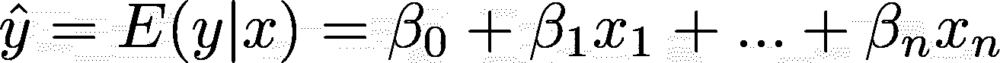
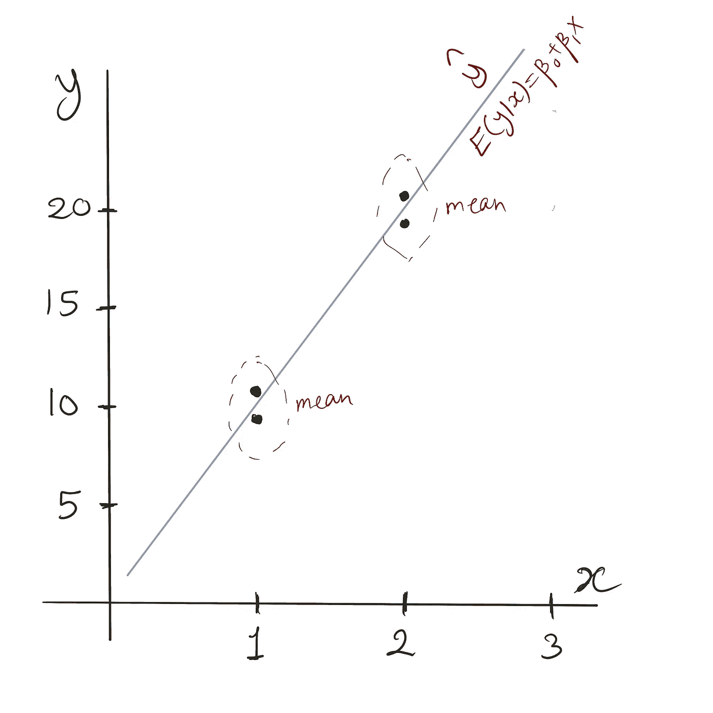
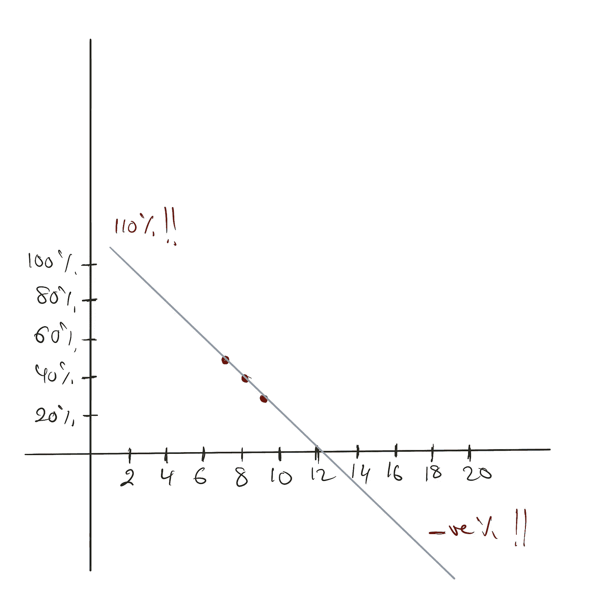
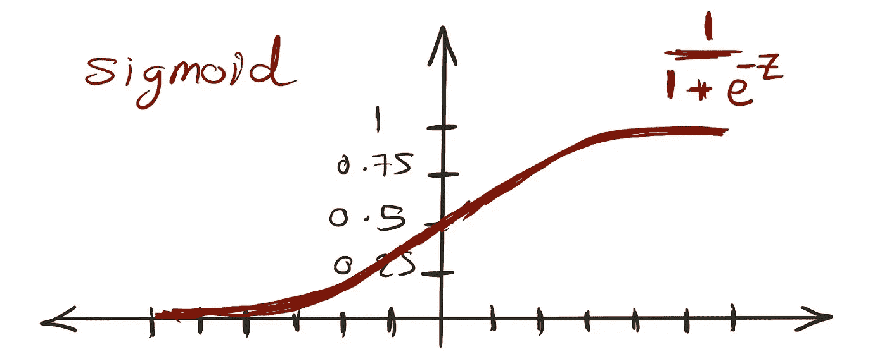
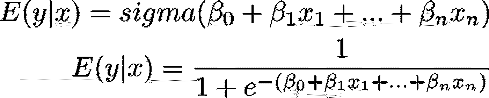
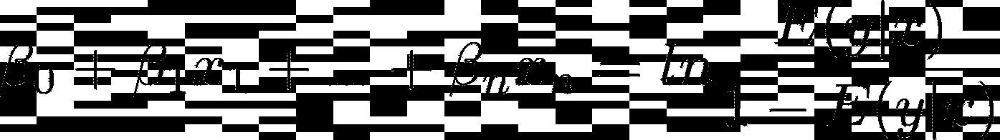
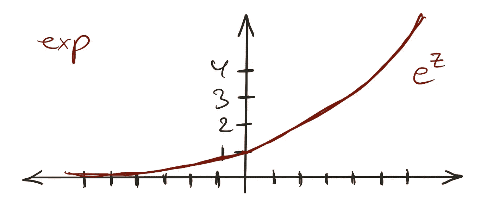
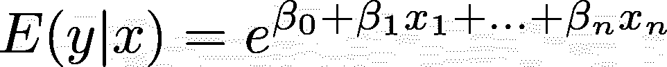
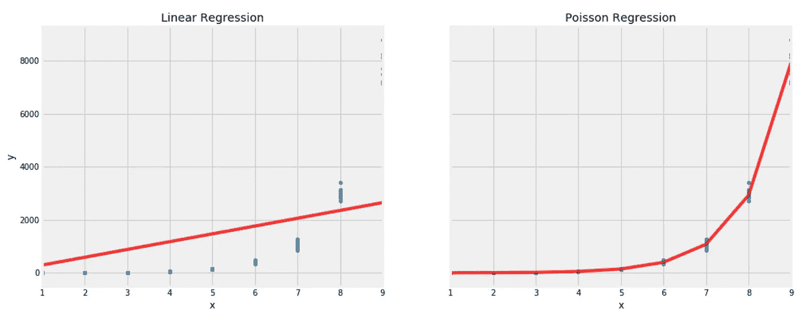

# 广义线性模型(GLM)

> 原文：<https://towardsdatascience.com/scikit-learns-generalized-linear-models-4899695445fa?source=collection_archive---------5----------------------->

## 掌握他们的理论和 Scikit-Learn 的实现

幸运的是，编写*“错误修复和稳定性改进”*的懒惰习惯还没有出现在软件库的发布说明中。如果没有检查这些笔记，我不会意识到*Scikit-Lean*0.23 版实现了广义线性模型(GLM)。

我格外关注 Scikit-Learn。不仅因为我一直在使用它，而且在出版了我的书 [*之后，我想跟踪该库新实现的算法和特性，并把它们作为我的书的伪附录写在这里。*](https://amzn.to/3lIGcRC)

顾名思义，广义线性模型是我们最喜欢的线性回归算法的扩展。我确信你们都非常了解线性回归背后的理论，所以我将在下一节讨论理解 GLMs 所需的细节。

# 线性回归实际预测什么？

像所有其他工程学科一样，机器学习是建立在抽象层之上的。我们使用为我们抽象一些细节的库。甚至我们对潜在数学的理解也可以被抽象化，所以我们忽略了大部分细节，直到我们需要它们。


线性回归—实际方程

例如，你肯定记得上面的等式，但我们很少注意最后一项，即代表正态分布噪声或误差的ε。从概念上讲，我们知道预测线很少穿过任何实际目标 y。这个术语是为了说明实际目标(y)和预测目标(y-hat)之间的差异。很公平！但是，如果我们模型的输出是 y-hat，而不是 y，无论如何，我们为什么不在这里花点时间来理解有和没有误差项的方程代表什么？



线性回归—期望值

给定 x， *E(y|x)* ，从模型中得到的值就是 y 的平均值或期望值。假设说，如果我们有大量的数据点，那么对于 x 的每个值，将有多个 y 值。然后，模型将预测每个 x 的 y 的期望值。并且该模型期望剩余的 y 是正态分布的。这就是为什么线性模型假设误差部分和实际目标是正态分布的。

> ***注:*** *对于给定的 x，E(y|x)为常数。因此，当我们说误差正态分布均值为零时，我们暗示实际目标 y 也是正态分布，其均值为 E(y|x)。这很重要，因为在后面的例子中，我们可能不需要误差项，我们需要关注 y 的分布*

我们可以使用 Scikit-Learn 来展示 E(y|x)在实践中是如何工作的。在这里，我们为每个 x 值创建多个 y。让我们看看模型拟合后会预测什么。

```
from sklearn.linear_model import LinearRegressionx = [[1], [1], [2], [2]]
y = [9, 11, 19, 21]m = LinearRegression()
m.fit(x, y)m.predict([[1]]) # Returns 10
m.predict([[2]]) # Returns 20
```

可以看到，对于 x=1，预测值是 10，9 和 11 的平均值。同样，对于 x=2，我们得到 19 和 21 的平均值，即 20。



线性回归的方程式—图片归功于作者

> **注:**这里使用的模型是通过最小化均方误差(MSE)来拟合的。当通过最小化平均绝对误差(MAE)来拟合模型时，产生的 y 帽将成为中间值而不是平均值。

到目前为止，一切顺利。但是为什么我们需要更进一步，创建一个这种线性模型的一般化形式呢？

# 为什么是广义线性模型？

线性模型的预测都是直线，咄！或超平面，当在多维设置中使用时。这使得他们擅长推断。这是更复杂的算法所不擅长的，比如梯度推进和随机森林。

请参见下文，了解线性回归是如何按照预期进行外推的:

```
from sklearn.linear_model import LinearRegressionx = [[1], [2], [3]]
y = [10, 20, 30]m = LinearRegression()
m.fit(x, y)m.predict([[10]]) # Returns 100, as expected
```

而基于树的模型无法推断:

```
from sklearn.ensemble import GradientBoostingRegressorx = [[1], [2], [3]]
y = [10, 20, 30]m = GradientBoostingRegressor()
m.fit(x, y)m.predict([[10]]) # Returns 30! 
```

然而，推断有时是愚蠢的。举个例子:一件商品被卖出的几率取决于它在网站首页的位置。比方说，我们在主页上有 20 个位置来列出项目。我们根据一件商品所处的位置来计算它的销售频率。位于第 7 位的商品，有 50%的销售机会。位置 8 的商品，40%的时间卖出，位置 9 的商品，30%的时间卖出。现在，我们使用这些信息来估计在位置 1 和 20 出售商品的机会。



线性回归的推断可能是愚蠢的——图片归功于作者

```
from sklearn.linear_model import LinearRegressionx = [[7],[8],[9]]
y = [0.50, 0.40, 0.30]m = LinearRegression()
m.fit(x, y)m.predict([[1], [20]]) # Returns 110% and -80%
```

如你所见，我们得到了不切实际的预测。一个位置导致 110%的项目被出售的机会，而另一个位置有被出售的负机会。我们都知道概率应该在 0 和 1 之间。我们该怎么办？

所有统计学家都有一把锤子:转换。如果您的模型不太符合数据，请使用某种转换来转换模型的输入或输出，比如将数据转换成对数标度，并希望您的模型能够工作。我们将在这里做一些非常类似的事情，但是不是转换模型的输入或输出，而是转换它的内部线性方程。

# 相信我，你已经知道 GLMs 了

我们知道 sigmoid 函数取 0 到 1 之间的值，就像概率一样。



Sigmoid Graph —图片署名归作者所有


Sigmoid 函数

厉害！现在，如果我们用线性方程代替 z，我们可以肯定它的结果将总是保持在 0 和 1 之间



将 Sigmoid 函数代入我们的线性方程

我很乐意将这个转换函数称为链接函数，但是统计学家的大脑通常是颠倒安装的，这就是为什么 GLMs 的创建者决定将其称为逆链接函数，因此，sigmoid 的逆， *logit* 或 *log odds* ，更像是链接函数！



Logit 作为 GLM(逻辑回归)链接函数

我肯定你知道这种型号的另一个名字。没错。是我们的老朋友，逻辑回归。

> 一个陈词滥调的工作面试问题:“逻辑回归是分类还是回归算法？”。**没有 ML 知识的人:** *【回归】*。**有点 ML 知识的人:** *【分类】*。**有更多 ML 知识的人:** *【回归】…* 这个问题就像一个哈希函数，根据人们的经验你可以知道他们的答案会是什么，但根据他们的答案你无法知道他们的经验水平。

除了使用链接函数之外，误差项预计不再是正态分布的。事实上，逻辑回归并不是唯一的 GLM，还有一堆其他的模型，我们将在下一节中访问其中的另一个。但是现在，除了我们从线性模型中借用的线性函数之外，这些是构成广义线性模型的主要组件:

*   一个**链接函数**，它将 E(y|x)链接到线性方程。
*   **目标遵循指数分布**。正态分布只是这个指数家族中的一员。

现在我们可以去一个不同的 GLM 了。其中之一是最近向 Scikit-Learn 介绍的*泊松回归*。它的朋友称之为费雪回归。

# 泊松回归

这个回归量非常适合预测计数。一平方英尺一年有多少雨滴？一个链接一天有多少点击量？一件物品在拍卖中有多少次出价？如您所见，所有这些都是在特定范围、时间、区域等内发生的事件的计数。当然，计数之外的一些其他用例也可能需要泊松回归。但关键是我们预测的是非负整数。

## 为什么对计数有好处？

当然，维基百科上的随机贡献者说泊松回归适用于计数，但要理解为什么，我们必须检查模型是如何工作的。正如我们之前看到的，链接函数和目标的分布是我们理解算法的关键。



指数图——图片署名归作者所有

先说反向链接功能。如前所述，除了书呆子统计学家，没人关心实际的链接函数，它的倒数才是重要的。泊松回归模型中的反向链接是一个指数函数。正如你在上图中看到的，不管它的输入是什么，输出总是正的。因此，它在这里是有意义的，因为我们不希望肯定是负数。通过将指数代入我们的模型方程，它将变成如下:



作为 GLM(泊松)链接函数的指数

接下来是发行。让我们先了解一下与线性模型假设的正态分布相关的问题。然后我们可以讨论泊松回归中使用的分布。

正态分布是围绕其平均值对称的。也就是说，如果 E(y|x)是 2，实际目标同样可能是`2+5=7`和`2–5=-3`。这在这里是不可接受的，因为我们不希望出现负数。相反，我们需要一个偏态分布。

另一个问题是线性模型的误差方差在所有 x 上是恒定的。这就是众所周知的同质性。想想看，如果某人的财富估计在 100 美元左右，我可以容忍它实际上是 104 美元或 92 美元，但我们几乎不能容忍它实际上是 10 万美元的错误。另一方面，如果某人的财富预计为 10，000，000，我们对几十万甚至更多范围内的较大方差有更多的容忍度。这就是为什么我们需要一个方差变化的模型，双关语。

泊松分布勾选了这里的所有方框。它是偏态的，它的方差和它的均值是一样的，也就是说方差随 E(y|x)线性增长。这就是这里使用泊松分布的原因，也是这个模型的名字。

到目前为止，我一直在讲，没有给你看任何代码。所以，让我们用一些代码来结束这篇文章，这样 skimmers 就可以复制和粘贴它，然后就可以收工了。在这里，我创建了一个合成数据，其中目标 y 随 x 呈指数增长。目标具有非常数方差，并且我确保 y 的值都不是负值。

```
exp = lambda x: np.exp(x)[0]x = np.array([[i] for i in np.random.choice(range(1,10), 100)])
y = np.array([exp(i) + np.random.normal(0,0.1*exp(i),1)[0] for i in x])
y[y<0] = 0
```

然后我们拟合泊松模型如下

```
from sklearn.linear_model import PoissonRegressorpr = PoissonRegressor(alpha=0, fit_intercept=False)
y_pred_pr = pr.fit(x, y).predict(x)
```

瞧，这个模型比老式的线性模型更符合数据。



将泊松回归与线性回归进行比较—图片来源于作者

当然，我作弊了，为我的模型量身定做了数据，在这里展示了一个美好的结局，但我们都喜欢美好的结局，不是吗？

# 结论

广义线性模型扩展了传统的普通最小二乘线性回归，增加了一个连接函数，并假设目标具有不同的分布，只要这些分布属于指数分布族。

插入链接函数允许模型将其目标限制在 0 和 1 之间(在逻辑回归的情况下)，大于 0(在泊松回归的情况下)，或任何其他取决于所用链接的限制。除了这里讨论的，还有更多 GLM 氏症。例如，伽玛和逆高斯。

我现在没有谈论正则化，但是 Scikit-Learn 的 GLMs 实现允许在你有许多预测器的情况下，x。如果你不知道什么是正规化，我可能会建议你查看一下我的书里的解释。*没有压力！*

最后，线性模型擅长外推，不像基于树的模型。然而，它们没有能力捕捉特征交互或它们的非线性。我可能会写一篇后续文章，介绍一些可以用来减轻这些限制的技巧。

**同一作者的更多故事:**

<https://medium.com/codex/a-gentle-introduction-to-confidence-intervals-b9ab64b8a663>  <https://medium.com/codex/pytests-assert-is-not-what-you-think-it-is-ea59dfcb4bfd>  

> **最后说明:**所有图表均由作者创作，所有亚马逊链接均为附属链接。而且所有的模型都是错的，但有些是有用的。