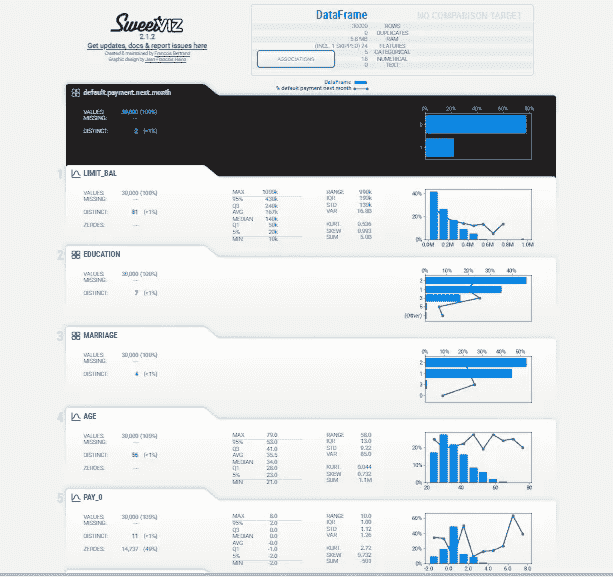
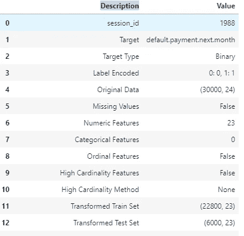
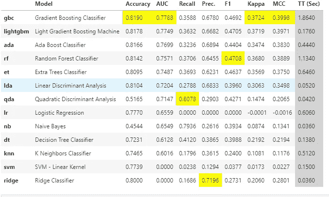
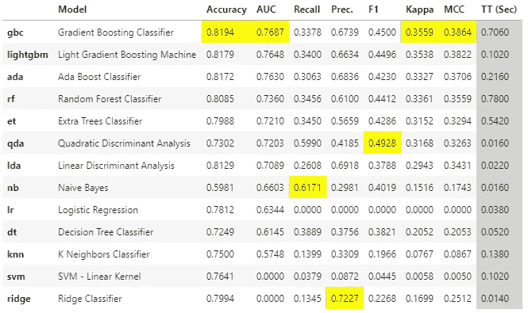
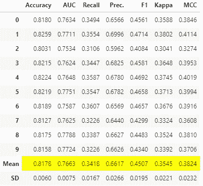
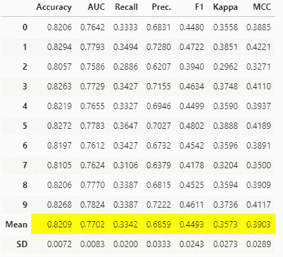
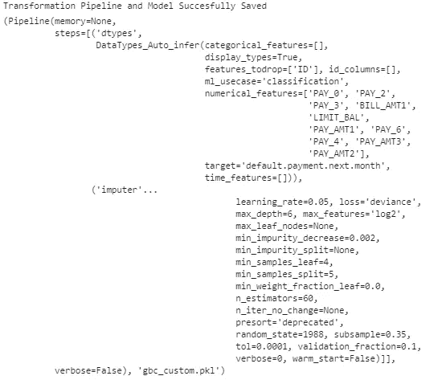

# 使用 PyCaret 为金融行业开发记分卡—第 1 部分

> 原文：<https://towardsdatascience.com/scorecard-development-for-finance-industry-using-pycaret-part-1-8277c761160a?source=collection_archive---------30----------------------->

## 关于使用轻量级编码工作流开发分类模型的详细信息


照片由 Ameen Fahmy (unsplash)拍摄

在本文中，我将尝试利用机器学习库 PyCaret 来描述银行业的端到端记分卡开发。我第一次接触记分卡开发发生在大约 12 年前，当时我开发了一个倾向记分卡，其目标是预测更有可能购买某个特定银行产品的客户。我利用 SAS 和 SAS EMINER 运行了一个逻辑回归模型，整个过程花了将近三周时间！！！

随着复杂的机器学习算法的出现，我开始使用不同的 R/Python 包，编写冗长的代码，以获得记分卡开发的最佳模型。然而，挑战在于为各种算法做不同类型的数据准备。

当涉及到开发一个具有模型可解释性的机器学习算法驱动的记分卡时——py caret 就是救世主。这个*低代码*库可以用来执行复杂的机器学习任务——最近构建了一个记分卡，只花了一个小时就完成了。0

**实际使用案例——开发记分卡，其中较低的分数意味着客户信用卡违约的可能性较高:**

为了开发解决方案，使用的数据集来自 Kaggle: [这里是](https://www.kaggle.com/uciml/default-of-credit-card-clients-dataset?select=UCI_Credit_Card.csv)(虽然数据集包含 25 列，但在实际用例中，考虑了 2000 多个特性。记住这一点，让我们看看下面的方法)

**步骤 1:安装练习所需的软件包:**

```
pip install llvmlite -U --ignore-installed
pip install -U setuptools
pip install -U pip
pip install pycaret==2.3.1
pip install pandasql
pip install matplotlib
pip install shap
pip install seaborn
pip install sweetviz**from** **sklearn.metrics** **import** roc_auc_score,balanced_accuracy_score, f1_score, accuracy_score
**from** **itertools** **import** combinations, chain
**from** **pandas._libs.lib** **import** is_integer
**from** **pycaret.classification** **import** *
**import** **matplotlib.patches** **as** **patches**
**import** **matplotlib.ticker** **as** **mtick**
**import** **matplotlib.pyplot** **as** **plt
import** **seaborn** **as** **sns**
**import** **sweetviz** **as** **sv**
**import** **pandasql** **as** **ps**
**import** **pandas** **as** **pd**
**import** **numpy** **as** **np**
*import shap*
**import** **math**
```

**第二步:导入数据(此处来自 google bucket)和 EDA**

```
path=’gs://pt-test/UCI_Credit_Card.csv'
raw = pd.read_csv(path, encoding = 'cp1252’)
print(raw.shape)##output
(30000, 25)##Let’s drop the variable gender ( Sex) as we don’t want to discriminate between male and female -dataset_raw = raw.drop(columns =['SEX'])
print(dataset_raw.shape)##output
(30000, 24)
```

使用一行代码运行 EDA，并使用 sweetviz 生成 EDA 报告:

```
feature_config = sv.FeatureConfig(skip=['ID']) # remove the feature that you dont want to include in the EDA
my_report = sv.analyze(dataset_raw, "default.payment.next.month", feature_config)
my_report.show_html()
```



EDA 输出:顶部的黑色突出显示目标变量

**第三步:PyCaret 的数据预处理和设置**

1.  识别数字和分类特征
2.  通过平均值估算数值缺失
3.  按模式估算分类缺失
4.  移除异常值—设置 5%的阈值
5.  训练数据占 80%，测试数据占 20%
6.  移除多重共线性

```
cat_feat = list(dataset_raw.select_dtypes(include=['object']).columns)
int_feat = list(dataset_raw.select_dtypes(include=['int64','float64','float32']).columns)
int_feat.remove('default.payment.next.month')
print(cat_feat)##output
[] - here we dont have categorical feature#setting up the environment:
clf = setup(dataset_raw
            ,target = 'default.payment.next.month'
            ,ignore_features = ['ID']  #ignored from model training
            ,numeric_imputation = 'mean'
            ,categorical_imputation = 'mode'
            ,categorical_features = cat_feat
            ,numeric_features = int_feat
            ,remove_outliers = True
            ,train_size = 0.80            
            ,session_id = 1988            
           )
```



CLF 输出一瞥:它有一长串不同的选项

**步骤 4:运行比较模型，选择前 n 个特征**

该步骤目前正在运行，主要确定最重要的功能。一般来说，我们有超过 2000 个特征(如客户人口统计，银行，竞争对手信息等)来开始-我们运行 compre_model 选项来获得最佳模型，并使用它来进行特征选择。特征选择也可以在 CLF 步骤中完成，但是在没有 gpu 的情况下需要花费大量时间来获得结果。

```
base_model = compare_models(fold = 5,sort = 'AUC', n_select = 1)
```



基于 AUC 排序的模型列表的输出:梯度增强给出最高的 AUC

现在，假设最佳模型是基于 AUC 的梯度提升分类器，我们将利用它来获得前 n 个特征，一般来说，从记分卡的角度来看，它的范围是 25-30 个特征(我们从 2000 个特征开始)。在这个虚拟数据集中，我们将选择前 10 个特征。

```
n=10
X_train=get_config('X_train') 
feature_names = pd.DataFrame(X_train.columns)
feature_names['var'] = feature_names
feature_imp = pd.DataFrame(base_model.feature_importances_)
feature_imp['imp'] = feature_imp
var_imp = pd.concat([feature_names,feature_imp],axis=1)
var_imp = var_imp[['var', 'imp']]
var_imp = var_imp.sort_values(['imp'],ascending=False)
var_imp_fin=var_imp['var'].head(n).values.tolist()
print(var_imp_fin)##output
['PAY_0', 'PAY_2', 'PAY_3', 'BILL_AMT1', 'LIMIT_BAL', 'PAY_AMT1', 'PAY_6', 'PAY_4', 'PAY_AMT3', 'PAY_AMT2']
```

**步骤 5:再次运行 CLF，然后微调模型**

1.  用选定的重要变量对数据进行子集划分
2.  运行比较模型
3.  调整模型，如果需要，自定义网格搜索
4.  对模型评分并评估

```
dataset_raw = raw[var_imp_fin + ['ID','default.payment.next.month']]cat_feat = list(dataset_raw.select_dtypes(include=['object']).columns)
int_feat = list(dataset_raw.select_dtypes(include=['int64','float64','float32']).columns)
int_feat.remove('default.payment.next.month')clf = setup(dataset_raw
            ,target = 'default.payment.next.month'
            ,ignore_features = ['ID']  
            ,numeric_imputation = 'mean'
            ,categorical_imputation = 'mode'
            ,categorical_features = cat_feat
            ,numeric_features = int_feat
            ,remove_outliers = True
            ,train_size = 0.80            
            ,session_id = 1988            
           )base_model2 = compare_models(fold = 5,sort = 'AUC', n_select = 1)
```



根据 AUC，gbc 再次位居榜首

梯度增强分类器在 AUC 方面再次高居榜首，然而需要注意的一点是 AUC 已经从 0.7788 下降到 0.7687，这是由于特征数量从 25 减少到 10。然而，在一个更大的方面，这也可能有助于您确定您希望最终在模型中保留多少特征，因为您不想在 AUC 上损失太多。

当 compare_model 使用预定义的超参数运行模型时，自动调整模型的超参数:

```
model_tune_gbc = tune_model(base_model2, n_iter=5, optimize='AUC')
```



模型调整后测试数据集的平均 AUC

**第六步:对训练、测试和整个数据集进行评分，并比较基尼系数**

```
def score(main_data,model_name):
    train = get_config('X_train').index
    test = get_config('X_test').index
    predict = predict_model(model_name,main_data,raw_score=True)
    predict['odds'] = predict['Score_1']/predict['Score_0']
    predict['score'] = 200 + 28.8539*np.log(predict['odds'])
    predict['score'] = predict.score.round(0).astype(int)
    predict_train = predict.loc[train]
    predict_test = predict.loc[test]
    auc_train = roc_auc_score(predict_train['default.payment.next.month'], predict_train['Score_1'])
    print('Gini_train: %.3f' % (2*auc_train-1))
    auc_test = roc_auc_score(predict_test['default.payment.next.month'], predict_test['Score_1'])
    print('Gini_test: %.3f' % (2*auc_test-1))
    return predict,predict_train,predict_test#call the function
scr_all1,scr_train,scr_test = score(dataset_raw,base_model2)#output
Gini_train: 0.636
Gini_test: 0.565
```

如果你看到上面的结果，训练和测试基尼系数之间的差异超过了 10%,因此进行自定义网格搜索以将差距缩小到 10%以下是有意义的

a)首先打印最终模型超参数-

```
print(model_tune_gbc)##output 
GradientBoostingClassifier(ccp_alpha=0.0, criterion='friedman_mse', init=None,learning_rate=0.1, loss='deviance', max_depth=6,
max_features='log2', max_leaf_nodes=None,                           min_impurity_decrease=0.002, min_impurity_split=None,                           min_samples_leaf=4, min_samples_split=5,                          min_weight_fraction_leaf=0.0, n_estimators=70,                           n_iter_no_change=None, presort='deprecated',                           random_state=1988, subsample=0.35, tol=0.0001,                           validation_fraction=0.1, verbose=0,                        warm_start=False)
```

在查看了超参数值之后，我将尝试一下 n 估计值和学习率

```
params = {'n_estimators':[30,40,50,60],
          'learning_rate':[0.05,0.2]
           }
gbc_custom = tune_model(model_tune_gbc,custom_grid=params)
```



自定义网格搜索的输出

重新计算分数，检查基尼系数的差异-

```
scr_all,scr_train,scr_test = score(dataset_raw,gbc_custom)##output
Gini_train: 0.593
Gini_test: 0.576
```

正如你所看到的，训练和测试的基尼系数相差不到 3%

**第七步:保存所有相关的数据集和模型对象**

```
#final model
scr_all1,scr_train,scr_test = score(dataset_raw,gbc_custom)
scr_all1.to_csv('scr_all_gbc_custom.csv')
scr_train.to_csv('scr_train_gbc_custom.csv')
scr_test.to_csv('scr_test_gbc_custom.csv')
save_model(gbc_custom,'gbc_custom')
```

该模型将保存为管道，输出如下所示:



已保存模型的输出

在下一部分，我将详细介绍模型评分、模型评估、作为模型文档一部分的不同指标，如稳定性、基尼系数、增益矩阵、训练和测试数据集的等级排序。