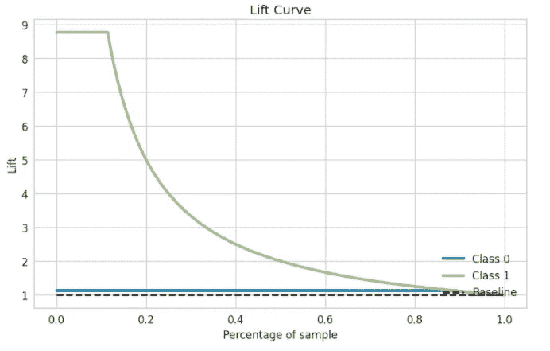

# 使用 PyCaret 为金融行业开发记分卡—第 2 部分

> 原文：<https://towardsdatascience.com/scorecard-development-for-finance-industry-using-pycaret-part-2-142a7b2b82c8?source=collection_archive---------35----------------------->

## 使用轻编码工作流评估分类模型

在[第 1 部分](/scorecard-development-for-finance-industry-using-pycaret-part-1-8277c761160a)中，我解释了如何使用 PyCaret 框架来利用模型开发/培训。在这一部分中，我们将重点介绍如何评估开发的模型，并将其与“训练/测试”和“超时验证数据集”进行比较。在 PyCaret 库中，一行代码就可以获得所有必要的模型评估指标，这将有助于最终确定模型。


照片由 Ameen Fahmy (Unsplash)拍摄

模型评估可以大致分为**稳定性**和**预测能力**。而**稳定性**和**预测力**在其下有不同的成分。模型评估的不同指标解释如下。


模型评估的关键指标

**群体稳定性指数** —群体稳定性指数衡量**开发**和**验证** / **测试数据集**之间的分布差异。它总是取正值，指数值越高，差值就越大。

(开发% —验证%) *日志(开发% /验证%)*100

*经验法则*:数值< 10 表示 PSI 为绿色(分布之间几乎没有差异)。10 到 25 之间的值被视为琥珀色(这意味着在分布中观察到一些变化，需要调查)。PSI > 25 表示开发和验证数据集之间的分布不同。

在上一部分中，我已经保存了 scr_train 和 scr_test 文件，其中包含客户列表、得分变量、事件的预测值、实际事件和模型中重要的重要特征。现在，为了获得模型，我们将使用以下代码:

```
**from** **sklearn.metrics** **import** roc_auc_score,balanced_accuracy_score, f1_score, accuracy_score
**from** **itertools** **import** combinations, chain
**from** **pandas._libs.lib** **import** is_integer
**from** **pycaret.classification** **import** *
**import** **matplotlib.patches** **as** **patches**
**import** **matplotlib.ticker** **as** **mtick**
**import** **matplotlib.pyplot** **as** **plt**
**from** **scipy** **import** stats
**import** **seaborn** **as** **sns**
**import** **sweetviz** **as** **sv**
**import** **pandasql** **as** **ps**
**import** **pandas** **as** **pd**
**import** **numpy** **as** **np**
*# import shap*
**import** **math****def** psi(X,Y):

    X['pentile'] = pd.qcut(X['score'], 5, labels=**False**) + 1

    *##Finding the boundary conditions for each pentile*
    X_tile = pd.DataFrame(X.groupby("pentile").agg({"score": [np.min, np.max]})).reset_index()
    X_tile.columns = ['pentile','min','max']

    *##Fixing lowest and highest value for min and max respectively*
    X_tile.loc[0, 'min'] = -10000
    X_tile.loc[4, 'max'] = 10000

    *##joining based on pentile conditions*
    sqlcode2 = '''
    select c.pentile, c.cnt as X_count, c.X_tot, d.cnt as Y_cnt, d.Y_tot
    from
        (select a.*, b.*
        from
            (select b.pentile, count(*) as cnt
            from X a
            left join X_tile b
            on a.score>=b.min and a.score<=b.max
            group by b.pentile) a
        cross join
            (select count(*) as X_tot from X) b ) c
    left join
        (select a.*, b.*
        from
            (select b.pentile, count(*) as cnt
            from Y a
            left join X_tile b
            on a.score>=b.min and a.score<=b.max
            group by b.pentile) a
        cross join
                (select count(*) as Y_tot from Y) b ) d
    on c.pentile=d.pentile
    '''

    psi_stg0 = ps.sqldf(sqlcode2,locals()) 
    psi_stg0['X_perc'] = psi_stg0['X_count']/psi_stg0['X_tot']
    psi_stg0['Y_perc'] = psi_stg0['Y_cnt']/psi_stg0['Y_tot']
    psi_stg1 = psi_stg0.drop(['X_count', 'X_tot', 'Y_cnt','Y_tot'], axis=1)

    *##Final PSI calculation*
    psi_stg1['psi'] = (psi_stg1['X_perc'] - psi_stg1['Y_perc'])*np.log((psi_stg1['X_perc']/psi_stg1['Y_perc']))*100
    psi_stg2 = pd.merge(psi_stg1, X_tile,  how='left', left_on=['pentile'], right_on = ['pentile'])
    psi_stg2.loc[0, 'min'] = 'low'
    psi_stg2.loc[4, 'max'] = 'high'
    psi_stg2['score_band'] = psi_stg2['min'].astype(str) + "-" + psi_stg2['max'].astype(str)
    psi = pd.DataFrame(psi_stg2[['score_band','X_perc','Y_perc','psi']])

    **return** psipsi_train_test = psi(scr_train, scr_test)
psi_train_test = psi_train_test.rename(columns={'score_band': 'score_band', 'X_perc': 'scr_train_perc', 'Y_perc': 'scr_test_perc', 'psi': 'psi'})
psi_train_test['scr_train_%']=round(psi_train_test['scr_train_perc']*100,2)
psi_train_test['scr_test_%']=round(psi_train_test['scr_test_perc']*100,2)
psi_train_test['psi']=round(psi_train_test['psi'],2)
psi_train_test1=psi_train_test[['score_band','scr_train_%','scr_test_%','psi']]
print(psi_train_test1)
print('PSI - scr_train vs scr_test: ' + str(round(sum(psi_train_test['psi']),2)))
```


scr_train 和 scr_test 之间的 PSI 分布结果相似

```
**# To plot the PSI graph-****from**  **matplotlib.ticker** **import** PercentFormatter
psi_table=psi_train_test[['score_band','scr_train_perc','scr_test_perc']]
psi_table = psi_table.melt('score_band', var_name='cols',  value_name='% population')
g = sns.factorplot(x="score_band", y="% population", hue='cols', data=psi_table)
g.set(ylim=(0, .50))
g.ax.set_title('Population Stability', size = 18 )
g.ax.yaxis.set_major_formatter(PercentFormatter(1))
g.savefig('PSI.png')
```


分数分布的图形表示

**特性稳定性指数** —这在特性/特征/变量水平上测量开发和验证/测试数据之间的差异。如果 psi 为琥珀色或红色，在特征水平上检查分布差异以理解导致这种变化的变量列表是很重要的。

一旦我们研究了模型的稳定性，下一步就是根据预测能力来评估模型的强度。使用 PyCaret，在一行代码中，我们将得到一个不同的评估矩阵。让我们看看下面提到的例子。

```
evaluate_model(gbc_custom,use_train_data= **True**) #this would give the result on the train dataevaluate_model(gbc_custom) #this would give the result on the test data# we had saved our model as gbc_custom ( refer to the previous part)
```

**曲线下面积(AUC)** —该值越高，模型在区分事件和非事件方面越好。


火车的 AUC。顶部有不同的选项卡，包含不同的评估指标。


AUC 测试


跨事件变量类别的精度/召回/F1/支持


训练和测试数据的混淆矩阵



学习曲线和提升图


特征重要性图和模型的超参数

一旦我们研究了所有这些评估指标，下一步将是创建一个**收益矩阵**来决定客户定位的分界点。

```
def weighted_qcut(values, weights, q, **kwargs):
    'Return weighted quantile cuts from a given series, values.'
    if is_integer(q):
        quantiles = np.linspace(0, 1, q + 1)
    else:
        quantiles = q
    order = weights.iloc[values.argsort()].cumsum()
    bins = pd.cut(order / order.iloc[-1], quantiles, **kwargs)
    return bins.sort_index()def gains_matrix(input_gm,target):
    if 'SamplingWeight' not in input_gm.columns:
        input_gm['SamplingWeight'] = 1
    input_gm['mevent']=input_gm[target]
    input_gm['deciles'] = weighted_qcut(input_gm['score'], input_gm['SamplingWeight'], 20, labels=False)sqlcode3 = '''
    select deciles, mevent, sum(samplingweight) as count
    from input_gm
    group by deciles, mevent
    '''
    gainsfreq = ps.sqldf(sqlcode3,locals())

    transpose = pd.DataFrame(gainsfreq.pivot_table(index=['deciles'], columns='mevent', aggfunc=sum, fill_value=0).reset_index())
    transpose.columns = ['deciles','count_0','count_1']

    transpose.sort_values(by=['deciles'], ascending=False, inplace=True)transpose['cum_0'] = transpose['count_0'].cumsum()
    transpose['cum_1'] = transpose['count_1'].cumsum()

    transpose['percent_cum_0'] = (transpose['cum_0']/np.sum(transpose.count_0))*100
    transpose['percent_cum_1'] = (transpose['cum_1']/np.sum(transpose.count_1))*100

    transpose['event_rate'] = (transpose['count_1']/(transpose['count_0']+transpose['count_1']))*100
    transpose['cum_event_rate'] = (transpose['cum_1']/(transpose['cum_0']+transpose['cum_1']))*100

    transpose['cum_separation'] = transpose['percent_cum_1']-transpose['percent_cum_0']

    sqlcode4 = '''
    select deciles, min(score) as score
    from input_gm
    group by deciles
    '''
    score = ps.sqldf(sqlcode4,locals())

    result = pd.DataFrame(pd.merge(score, transpose , on='deciles', how='outer'))
    resultn = result.sort_values('deciles', ascending=False)
    resultn['score_band'] = resultn["deciles"].tolist()[::-1]
    resultn['score_band'] = resultn["score_band"]+1
    resultn= resultn.drop(columns=['deciles']) 
    return resultntrain_gain=gains_matrix(scr_train,'default.payment.next.month')
test_gain=gains_matrix(scr_test,'default.payment.next.month')
```


训练的增益矩阵—有 20 个分数段

**等级排序** —在整个评分范围内，事件发生率应理想地单调递增或递减——评分越高，非违约率越高，评分越低，非违约率越低。

```
rank_train=train_gain[['score_band','event_rate']]
rank_test=test_gain[['score_band','event_rate']]rank_train=rank_train.rename(columns={'event_rate': 'train'})
rank_test=rank_test.rename(columns={'event_rate': 'test'})
rank_table = pd.DataFrame.merge(rank_train, rank_test,on=['score_band'],how='outer')rank_table = rank_table.melt('score_band', var_name='cols',  value_name='event_rate')
g = sns.factorplot(x="score_band", y="event_rate", hue='cols', data=rank_table,grid=False).ax.set_title("Rank Ordering Comparison")
from matplotlib.ticker import FuncFormatter
def to_percent(y, position):
    s = str(y)
    return s + '%'
formatter = FuncFormatter(to_percent)
plt.gca().yaxis.set_major_formatter(formatter)
plt.show()
g.figure.savefig('Rank Orderging.png')
```


培训和测试中分数范围内的事件率

*经验法则*:就模型实现而言，可以考虑以下阈值(但它可能因行业和用例而异):


模型实施标准—经验法则

这就把我们带到了第 2 部分的结尾。在最后一部分，我们将讨论**偏差和模型可解释性**。