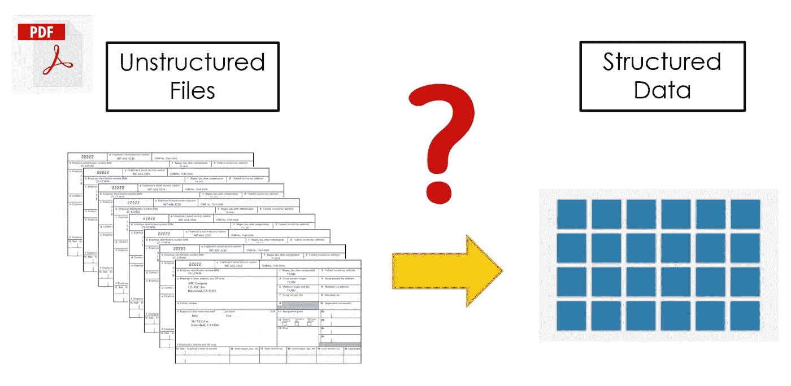
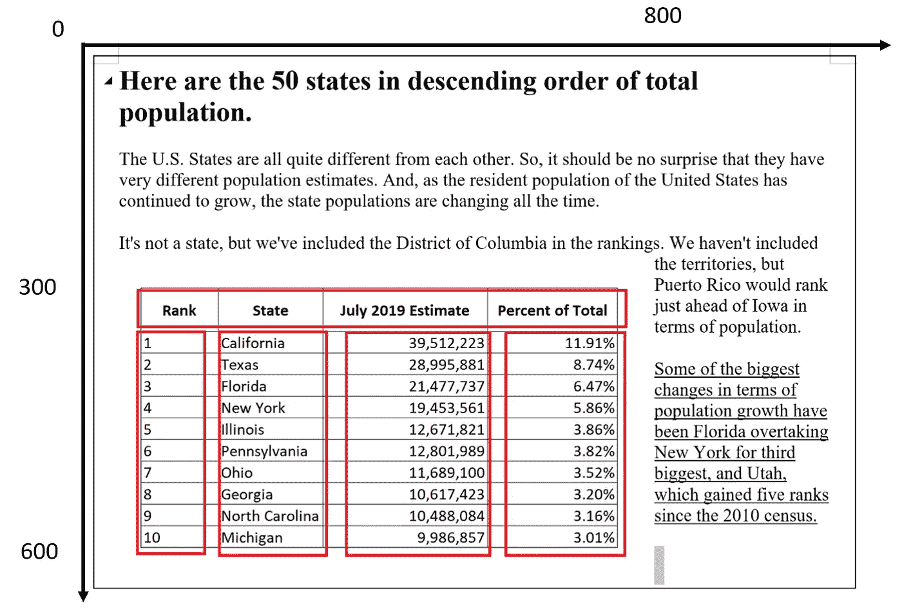
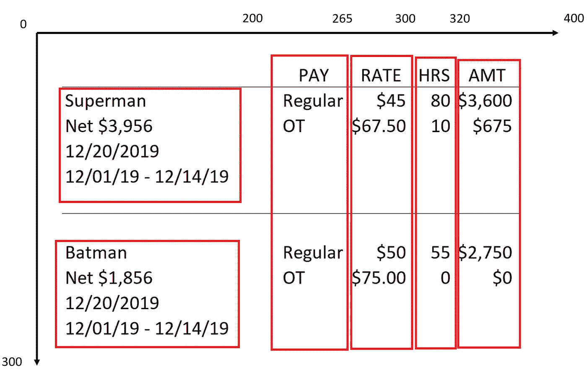
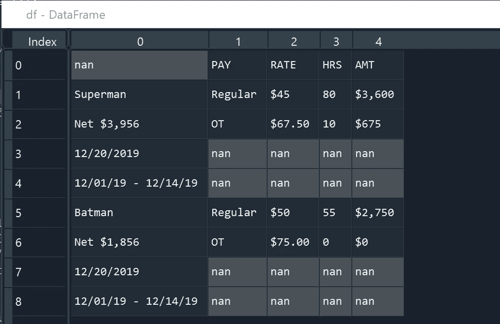
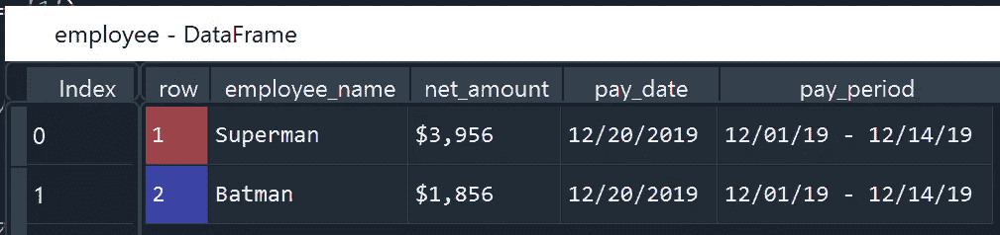
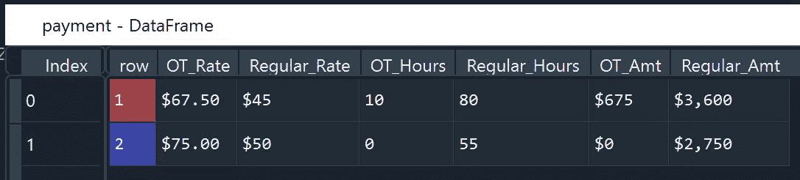
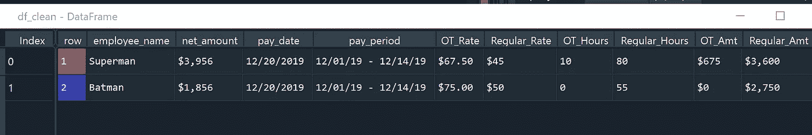

# 如何使用 Python 和 tabula-py 从 PDF 文件中抓取数据

> 原文：<https://towardsdatascience.com/scrape-data-from-pdf-files-using-python-fe2dc96b1e68?source=collection_archive---------1----------------------->

## 你想和白板和熊猫交朋友



作者图片

# 背景

数据科学专业人员正在处理各种形状和形式的数据。数据可以存储在流行的 SQL 数据库中，如 PostgreSQL、MySQL 或老式的 excel 电子表格。有时，数据也可能以非常规的格式保存，如 PDF。在这篇文章中，我将讲述如何使用 Python 库: **tabula-py 从 PDF 中抓取数据。**

## 必需的库

*   **tabula-py** :从 PDF 文件中抓取文本
*   **re** :使用正则表达式提取数据
*   **pandas:** 构建和操作我们的面板数据

## 安装库

```
pip install tabula-py
pip install pandas
```

## 导入库

```
import tabula as tb
import pandas as pd
import re
```

# 以结构化形式抓取 PDF 数据

首先，我们来谈谈以结构化格式抓取 PDF 数据。在下面的例子中，我们要刮左下角的桌子。它是结构良好的表格数据，其中的行和列定义良好。



样本结构化数据([来源](https://www.infoplease.com/us/states/state-population-by-rank))

使用`tabula-py`可以直接抓取结构化形式的 PDF 数据。我们只需要通过指定`area`的**(上、左、下、右)**坐标来输入表格数据在 PDF 页面中的位置。在实践中，你将通过反复试验来学习使用什么样的价值观。如果 PDF 页面只包含目标表格，那么我们甚至不需要指定区域。`tabula-py`应该能够自动检测行和列。

```
file = 'state_population.pdf'
data = tb.read_pdf(file, area = **(300, 0, 600, 800)**, pages = '1')
```

# 以非结构化形式抓取 PDF 数据

接下来，我们将探索更有趣的东西——非结构化格式的 PFD 数据。

为了实现统计分析、数据可视化和机器学习模型，我们需要表格形式的数据(面板数据)。然而，许多数据只能以非结构化格式获得。例如，人力资源人员可能会保留历史工资数据，这些数据可能不会以表格形式创建。在下图中，我们有一个工资数据的例子，它具有混合的数据结构。在左侧部分，它有长格式的数据，包括员工姓名、净额、支付日期和支付期间。在右边部分，它有支付类别、支付比率、时数和支付金额。



(作者创作)

我们需要采取几个步骤将数据转换成面板格式。

*   **步骤 1:将 PDF 数据作为数据框架导入**

像结构化格式的数据一样，我们也使用`tb.read_pdf`来导入非结构化数据。这一次，我们需要指定额外的选项来正确导入数据。

```
file = 'payroll_sample.pdf'
df= tb.read_pdf(file, pages = '1', area = **(0, 0, 300, 400)**, columns = **[200, 265, 300, 320]**, pandas_options={'header': None}, stream=True)[0]
```

*   *区域和列*:上面已经讲过`area`。这里我们还需要使用`columns`来标识所有相关列的位置。像 area 一样，列的值也是通过反复试验来确定的。
*   *Stream and Lattice* :如果有网格线分隔每个单元格，可以用`lattice = True`自动识别每个单元格，如果没有，可以用`stream = True`和`columns`手动指定每个单元格。流模式将寻找列之间的空白。这些选项可能会产生巨大的影响，所以我们可以用 lattice 或 stream 进行实验，看看它们是否能改善整体抓取。



(作者创作)

*   **步骤 2:创建一个行标识符**

现在我们有一些数据要处理，我们将使用 Python 库`Pandas`来操作数据帧。

首先，我们需要创建一个新列来标识唯一的行。我们注意到员工姓名(超人和蝙蝠侠)似乎有助于识别不同记录之间的边界。每个雇员的名字都包含一个独特的模式，以大写字母开始，以小写字母结束。我们可以使用正则表达式`'^[A-Z].*[a-z]$'`来标识雇员姓名，然后使用 Pandas 函数`cumsum`(累积和)来创建一个行标识符。

```
df['border'] = df.apply(lambda x: 1 if re.findall('^[A-Z].*[a-z]$', str(x[0])) else 0, axis = 1)
df['row'] = df['border'].transform('cumsum')
```


(作者创作)

*   **步骤 3:重塑数据(将数据从长格式转换为宽格式)**

接下来，我们将重塑左半部分和右半部分的数据。对于左侧部分，我们创建一个新的数据框架， *employee* ，其中包括 employee_name、net_amount、pay_date 和 pay_period。对于右侧部分，我们创建另一个数据框架，*支付*，它包括加班费率、常规费率、加班小时数、常规小时数、加班金额和常规金额。要将数据转换成宽格式，我们可以使用 Pandas 函数`pivot`。

```
# reshape left section
employee = df[[0, 'row']]
employee = employee[employee[0].notnull()]
employee['index'] = employee.groupby('row').cumcount()+1
employee = employee.pivot(index = ['row'], columns = ['index'], values = 0).reset_index()
employee = employee.rename(columns = {1: 'employee_name', 2: 'net_amount', 3: 'pay_date', 4: 'pay_period'})
employee['net_amount'] = employee.apply(lambda x: x['net_amount'].replace('Net', '').strip(), axis = 1)# reshape right section
payment = df[[1, 2, 3, 4, 'row']]
payment = payment[payment[1].notnull()]
payment = payment[payment['row']!=0]
payment = payment.pivot(index = ['row'], columns = 1, values = [2, 3, 4]).reset_index()
payment.columns = [str(col[0])+col[1] for col in payment.columns.values]
for i in ['Regular', 'OT']:
    payment = payment.rename(columns = {f'2{i}': f'{i}_Rate', f'3{i}': f'{i}_Hours', f'4{i}': f'{i}_Amt'})
```



(作者创作)



(作者创作)

*   **第四步:将左边部分的数据与右边部分的数据连接起来**

最后，我们使用函数`merge`根据行标识符连接*雇员*和*支付*数据帧。

```
df_clean = employee.merge(payment, on = ['row'], how = 'inner')
```



(作者创作)

# 最后一个音符

时至今日，公司仍然手动处理 PDF 数据。在 python 库的帮助下，我们可以通过自动化从 PDF 文件中抓取数据并将非结构化数据转换为面板数据的过程来节省时间和金钱。

请记住，当从 PDF 文件中抓取数据时，您应该始终仔细阅读作者发布的条款和条件，并确保您有权限这样做。

如果你想继续探索 PDF 抓取，请查看我的其他文章:

*   [**使用 Python 和 PDFQuery 从 PDF 文件中抓取数据**](/scrape-data-from-pdf-files-using-python-and-pdfquery-d033721c3b28)
*   [**使用 Python 和 tabula-py 从 PDF 文件中抓取数据**](/scrape-data-from-pdf-files-using-python-fe2dc96b1e68)
*   [**如何使用 Python 和 Pytesseract 将扫描文件转换为可搜索的 PDF**](https://python.plainenglish.io/convert-scanned-files-to-searchable-pdf-using-python-and-pytesseract-3ee31ee6f01f)
*   [**使用 Python 和 Pytesseract 提取 PDF 文本，同时保留空白区域**](/pdf-text-extraction-while-preserving-whitespaces-using-python-and-pytesseract-ec142743e805)

# 感谢您的阅读！！！

如果你喜欢这篇文章，并且想**请我喝杯咖啡，请**点击这里。

您可以注册一个 [**会员**](https://aaron-zhu.medium.com/membership) 来解锁我的文章的全部访问权限，并且可以无限制地访问介质上的所有内容。如果你想在我发表新文章时收到电子邮件通知，请订阅。