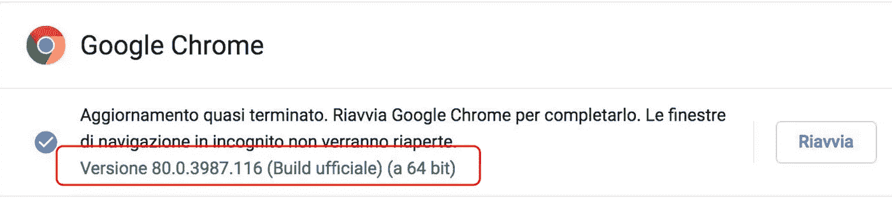

# 用 Python Selenium 从嵌套的 HTML 页面中抓取数据

> 原文：<https://towardsdatascience.com/scraping-data-from-nested-html-pages-with-python-selenium-c5f23065841f?source=collection_archive---------20----------------------->

## 数据收集

## 一个快速的教程来建立一个从网站上提取的术语列表


图片来自 [Pixabay](https://pixabay.com/?utm_source=link-attribution&utm_medium=referral&utm_campaign=image&utm_content=4605834) 的[凯文·莫里森](https://pixabay.com/users/kevinandthepup-14173621/?utm_source=link-attribution&utm_medium=referral&utm_campaign=image&utm_content=4605834)

抓取包括从网络上的 HTML 页面中提取信息。在 Python 中，可以通过 [Selenium 库](https://selenium-python.readthedocs.io/)进行抓取。

在本教程中，我演示了如何通过 Python `selenium`抓取分布在两层嵌套页面上的术语列表。作为例子，我从 [Bocardi](https://www.brocardi.it/) 中抓取术语列表。

本教程的完整代码可以从[我的 Github 库](https://github.com/alod83/data-science/tree/master/DataCollection/Web)下载。

# 装置

通过命令`pip install selenium`，可以通过`pip`轻松安装`selenium`库。除了库，我还需要为我的浏览器安装驱动程序，这取决于我的浏览器的版本。在本教程中，我开发了 Chrome 浏览器。我可以通过在浏览器地址栏输入`chrome://settings/help`来查看它的版本。



作者图片

在我的例子中，版本是 80，因此我可以从[这个链接](https://sites.google.com/a/chromium.org/chromedriver/downloads)下载 chrome 驱动。下载完成后，我可以将文件放入我的文件系统的一个普通文件夹中，我需要用 chrome 驱动程序的路径配置`$PATH`变量:

*   Windows 用户——在[这个视频](https://www.youtube.com/watch?v=mHtlBq5cP2Y&t=4s)中，我解释了如何在 Windows 10 上为 selenium 安装 Chrome 驱动。
*   Mac OS/ Linux -通过添加下面一行`export PATH = "<path to web driver>: $ PATH"`来编辑`.bash_profile`或`.profile`文件，然后重启计算机。

# 识别网站结构

为了从网站上搜集数据，首先我需要研究 URIs 结构。在我的例子中，术语列表是按字母顺序组织的，字母表中的每个字母都有一个专门的页面，可以在`<basic_url>/dizionario/<current_letter>/`(URI 的第一级)找到。例如，对于信件`a`，可在`https://www.brocardi.it/dizionario/a/`获得专用页面。此外，每个字母的术语列表在不同的页面中分页。对于每个字母，第一页在 URI 的第一层可用，而从第二页开始，URI 改变并在`<basic_url>/dizionario/<current_letter>/?page=<page_number>`可用。例如，对于字母`a`，第二页中的术语列表可通过链接`[https://www.brocardi.it/dizionario/a/?page=2](https://www.brocardi.it/dizionario/a/?page=2.)` [获得。](https://www.brocardi.it/dizionario/a/?page=2.)

# 环境设置

在我的代码中，我需要实现两个循环:一个用于信件的外部循环和一个用于页面的内部循环。我注意到有些字母不见了(`jkwxy`)。对于外部循环，我构建了一个包含所有字母的列表，但不包括丢失的字母。我利用`string.ascii_lowercase`来构建字母列表。

```
import string
letters = string.ascii_lowercase
letters = letters.replace('jk', '')
letters = letters.replace('wxy', '')
letters = list(letters)
```

然后我定义了两个变量，`basic_url`，它包含网站的基本 url，和`table`，它将包含所有提取的术语的列表。最初`table`是一个空列表。

```
table = []
basic_url = "[https://www.brocardi.it](https://www.brocardi.it)"
```

现在，我导入所有的`selenium`驱动程序和`NoSuchElementException`异常，它们将用于在执行内部循环时捕捉某种异常。我还导入了`pandas`库。

```
from selenium import webdriver
from selenium.webdriver.chrome.options import Options  
from selenium.common.exceptions import NoSuchElementException
```

# 嵌套循环

我通过从`a`到`z`的`for`来实现外部循环。在外部循环的每一步，我都构建 url。然后我通过一个`while`实现内部无限循环。在内部循环中，我构建了一个执行抓取的驱动程序。我开发了一个`Chrome()` webdriver，它接收`--headless`和`--lang=it`选项作为输入。第一个选项指定不打开浏览器，而第二个选项指定浏览器的语言。

一旦连接上，我搜索两个元素:

*   包含术语列表的元素
*   包含下一页链接的元素。

这两个元素都依赖于 HTML 页面的结构。我利用函数`find_elements_by_xpath()`来搜索特定的 XPath。

如前所述，内部循环是一个无限循环，中断条件由一个`NoSuchElementException`给出，当没有下一页时抛出。术语列表存储在`table`变量中。

```
for letter in letters:

    url = basic_url + '/dizionario/' + letter + '/'
    while True:
        try:
            print(url)
            options = Options()  
            options.add_argument("--headless") 
            options.add_argument("--lang=it");
            driver = webdriver.Chrome(options=options)driver.get(url)# get the list of terms
            xpath = '//ul[[@class](http://twitter.com/class)="terms-list"]'
            words = driver.find_element_by_xpath(xpath).text
            table.extend(words.split('\n'))

            # get the next page
            xpath = '//a[[@class](http://twitter.com/class)="next"]'
            url = driver.find_element_by_xpath(xpath).get_attribute('href')

            driver.close()

        except NoSuchElementException:
            break
```

# 保存结果

变量`table`包含所有术语的列表。我可以将它存储到 CSV 文件中。这可以通过构建一个`pandas`数据框架来实现。

```
import pandas as pddf = pd.DataFrame(table, columns=['word'])
df['word'] = df['word'].str.lower()
df.to_csv('outputs/glossary.csv')
```

# 摘要

在本教程中，我演示了如何安装和使用 Python `selenium`从嵌套的 HTML 页面中提取数据。

在库安装和配置之后，需要三个步骤:

*   识别网站的结构
*   实现两级循环，提取数据和到下一页的链接
*   将数据保存到`pandas`数据帧中。

如果你想了解我的研究和其他活动的最新情况，你可以在 [Twitter](https://twitter.com/alod83) 、 [Youtube](https://www.youtube.com/channel/UC4O8-FtQqGIsgDW_ytXIWOg?view_as=subscriber) 和 [Github](https://github.com/alod83) 上关注我。

# 相关文章

[](/how-to-extract-tables-from-pdf-using-python-pandas-and-tabula-py-c65e43bd754) [## 如何使用 Python 熊猫和 tabula-py 从 PDF 中提取表格

### 一个从 PDF 中提取重复表格的快捷脚本

towardsdatascience.com](/how-to-extract-tables-from-pdf-using-python-pandas-and-tabula-py-c65e43bd754) [](/how-to-build-a-dataset-from-twitter-using-python-tweepy-861bdbc16fa5) [## 如何使用 Python tweepy 从 Twitter 构建数据集

### 一个快速教程和一个现成的脚本来提取推文

towardsdatascience.com](/how-to-build-a-dataset-from-twitter-using-python-tweepy-861bdbc16fa5)