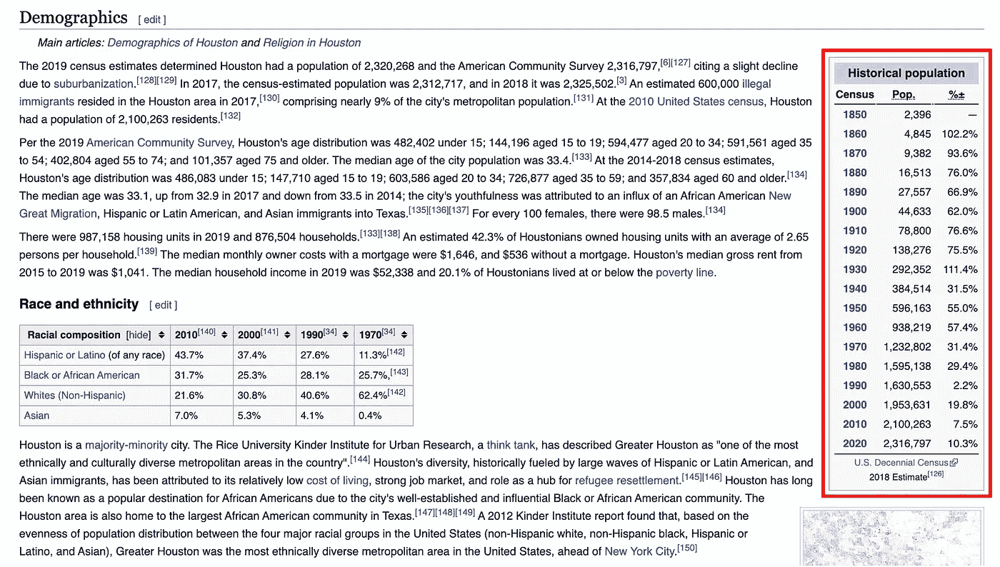
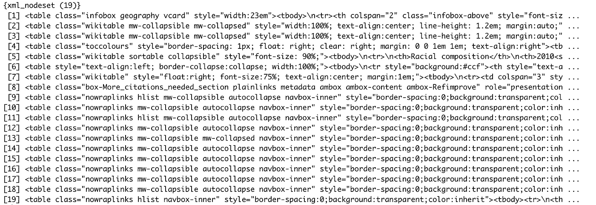
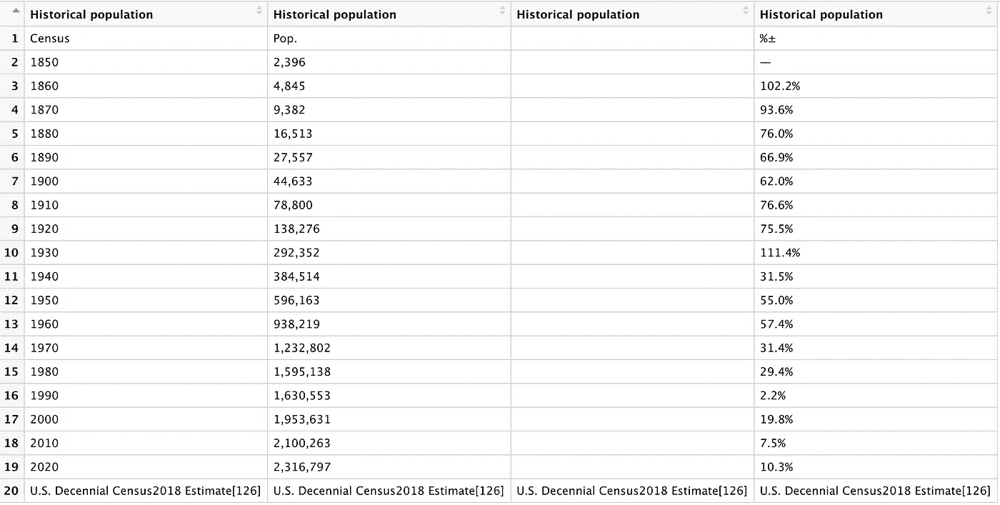
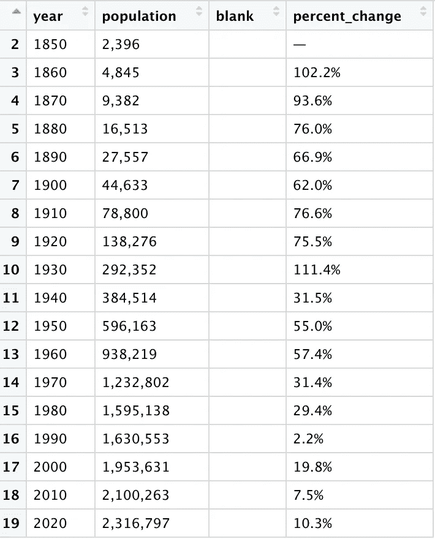
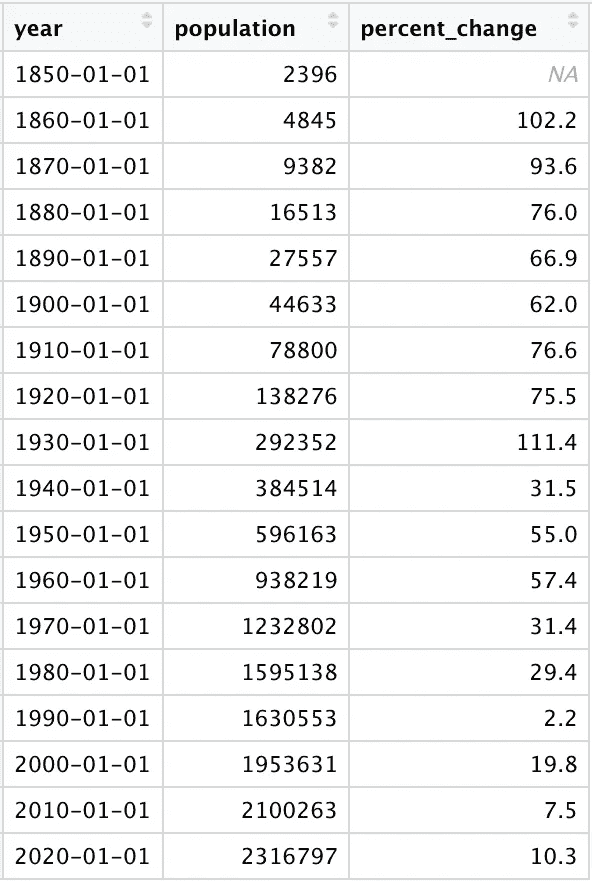

# 从维基百科表格中抓取数据

> 原文：<https://towardsdatascience.com/scraping-data-from-wikipedia-tables-3efa04c6b53f?source=collection_archive---------20----------------------->

## 只需几行代码就能打开一个有价值的数据源


GPA 照片档案:[https://www.flickr.com/photos/iip-photo-archive/27336508138](https://www.flickr.com/photos/iip-photo-archive/27336508138)

几周前，我用美国许多城市的历史人口数据写了一篇关于 T2 的文章。虽然这些数据大部分直接来自美国人口普查，但我也从维基百科的表格中搜集了人口数据，这些表格在一个地方汇集了每个城市的所有可用数据。虽然核实通过维基百科找到的原始数据来源是值得的，但这个在线百科全书包含了大量通常值得搜集的信息。

在本文中，我将分享我用来抓取[一个维基百科表格](https://en.wikipedia.org/wiki/Houston)的代码，该表格包含德克萨斯休斯顿的历史人口数据。这段代码可以很容易地从维基百科的其他页面或其他网页上抓取表格。我将介绍的方法基于我在研究生院数据科学课程中教授的材料，相关材料可以在这里找到。

首先，让我们看一下我们将要抓取的表(用红色标出):



https://en.wikipedia.org/wiki/Houston[的屏幕截图](https://en.wikipedia.org/wiki/Houston)

这是一个足够简单的表，尽管我们已经可以看到，当我们将这些数据放入 r 中时，可能需要清理一些格式。

一旦你有机会看到网页，让我们来看看代码。首先，加载“tidyverse”和“rvest”包。我们将使用 tidyverse 来操作和清理我们抓取的数据，并使用 rvest 包来进行实际的抓取:

```
library(tidyverse)
library(rvest)
```

接下来，我们需要给 R 我们感兴趣的网页的 url:

```
url = "[https://en.wikipedia.org/wiki/Houston](https://en.wikipedia.org/wiki/Houston)"
```

然后，我们使用 read_html()函数将该网页转换为 R 可以使用的信息，然后使用 html_nodes()函数专门关注网页中包含的表格对象:

```
houston_html = read_html(url)houston_html %>% 
  html_nodes(css = "table")
```

看起来休斯顿维基百科页面包含了 19 个表格，尽管其中一些类别的描述比其他的更有信息量:



接下来，我们从这些可用的表中取出感兴趣的表。函数指定我们想要上面列表中的第四个表。当网页上有多个表格时，确定要在此指定的正确表格可能需要一些反复试验。您可以通过查看网页尽最大努力猜出正确的数字，也可以查看不同的表格，直到看到您想要的内容:

```
pop_table = 
  houston_html %>% 
  html_nodes(css = "table") %>% 
  nth(4) %>% 
  html_table(fill = TRUE)
```

我们得到下面的输出，Wikipedia 表现在在 R！然而，正如 web 抓取经常发生的那样，这个表还不能真正使用。所有四列具有相同的名称，第一行和最后一行不包含数据，并且在我们的数据框中间有一个额外的列:



让我们快速清理一下这张桌子，让它更有用。在我们的列有唯一的名称之前，我们什么也做不了，我们还需要将该表限制在第 2-19 行:

```
colnames(pop_table) = c("year", "population", "blank", "percent_change")pop_table = pop_table[2:19, ]
```

我们还没有完全实现，但是输出看起来要好得多:



让我们做一些最后的清洁。首先，我们将删除空白列。所有列目前都存储为字符变量，而 year 应该是日期，population 和 percent_change 应该是数字。我们从 percent_change 和 population 列中删除不必要的字符串，然后将所有列转换为适当的格式:

```
pop_table = 
  pop_table %>% 
  select(-blank) %>% 
  mutate(
    percent_change = str_replace(percent_change, "%", ""),
    percent_change = str_replace(percent_change, "—", ""),
    population = str_replace_all(population, ",", ""),
    year = lubridate::ymd(year, truncated = 2L),
    population = as.numeric(population),
    percent_change = as.numeric(percent_change)
  )
```

就这么简单。现在，表中的所有内容都符合我们的预期:



人口数据现在完全可用，可以进行分析了。Web 抓取是一种访问各种数据源的强大工具，鉴于其可重复性和减少人为错误的可能性，它比手动复制在线表格中包含的值要好得多。本文中包含的代码还可以用来一次抓取多个表，从而实现更高的效率和访问更多的数据。

上面使用的代码也可以在 [this GitHub repo](https://github.com/emilyhalford/scraping_tables) 中找到。