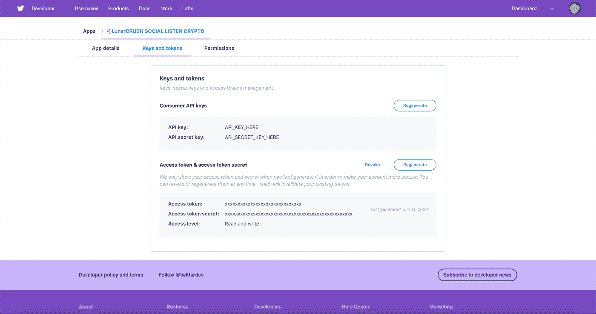

# 用 Python 抓取特定的 Tweet 回复

> 原文：<https://towardsdatascience.com/scraping-specific-tweet-replies-with-python-3143c5214341?source=collection_archive---------24----------------------->

## 使用 Tweepy 抓取 Twitters 网站的数据


在 [Unsplash](https://unsplash.com?utm_source=medium&utm_medium=referral) 上由 [Dane Deaner](https://unsplash.com/@danedeaner?utm_source=medium&utm_medium=referral) 拍摄的照片

Twitter 开始接管社交媒体领域。随着越来越多的社区转向 Twitter，我们开始看到数据对广告商、研究人员甚至消费者来说是多么有价值。

数据现在是下一个淘金热，因为我们开始了解数据需要如何提取、转换、加载，并为了充分的利益而转化为信息。理论上，和黄金一样，数据也是一种商品。

在本文中，我打算解释使用 Tweepy 的 Twitter API 从 Python3 的 Twitter 中抓取 Tweepy 是多么容易。Twitter 的 API 和 Tweepy 可以访问这些数据，这是最成功的方法。我计划专注于收集特定用户的推文回复，因为我还没有发现任何专门强调如何提取推文回复的教程。

*如果你想直接进入代码，那么你可以在我的*[*Github*](http://github.com/nirholas)*上找到完整的代码。Python 代码需要您的 Twitter API 和消费者密钥，以及您计划提取回复的 Twitter 用户名和 Tweet ID。*

# 设置 Twitter 开发帐户& Tweepy

确保您的计算机上安装了 Python。如果没有，我建议使用 [Anaconda](https://www.anaconda.com/products/individual) ，否则请阅读官方的 [Python 文档](https://www.python.org/downloads/)以找到额外的资源。

要从你的机器上执行 Twitter 操作，我建议使用 [Tweepy](https://tweepy.readthedocs.io/en/v3.5.0/) 。要安装 Tweepy，请导航到您的环境并运行:

Python3:

```
pip install tweepy
```

如果您对 Python 使用 Anaconda:

```
conda install -c conda-forge tweepy
```

# Twitter 的开发者

如果你想通过电脑或机器与推特互动，你需要申请推特开发者。申请是直截了当的，诚实地说出你在申请中的意图，如果你被 Twitter 认为是值得信任的，你就会被批准。一旦获得批准，您将能够在平台上创建一个应用程序，为您提供从 Tweepy 或您的 Python Twitter 库进行授权的凭据。

Twitter for Developers 提供对 Twitter API 的访问，以便发布和分析推文、优化广告和创建独特的客户体验。点击查看 [Twitter API 文档。](https://developer.twitter.com/en/application/use-case?ref=hackernoon.com)

在您能够使用 Twitter API 端点之前，创建一个开发人员帐户并生成您的 API 密钥。[你可以在这里直接申请开发者账号](https://developer.twitter.com/en.html?ref=hackernoon.com)。您必须回答关于您计划如何使用 API 和接受 Twitter 开发者协议的问题，然后您将被授予访问开发者仪表板的权限。

一旦你被批准访问 Twitter 开发者，登录[开发者网站](https://developer.twitter.com/?ref=hackernoon.com)并创建你的应用。这一步将自动生成您的消费者 API 密钥和访问令牌，请记住，您应该对它们保密:



开发者帐户应该链接到您想要激活 bot 的 Twitter 帐户。从 Twitter 开发平台，您可以编辑应用程序权限。在我的例子中，我已经授予我的应用程序读、写和发送直接消息的权限。

# 使用 Python 的 Twitter 认证

我们必须导入 Tweepy，然后 OAuth 接口来收集数据以及 csv 和 ssl。

```
import csv
import tweepy
import ssl
ssl._create_default_https_context = ssl._create_unverified_context
# Oauth keys
consumer_key = "YOUR_CONSUMER_KEY"
consumer_secret = "YOUR_CONSUMER_SECRET"
access_token = "YOUR_ACCESS_TOKEN"
access_token_secret = "YOUR_ACCESS_SECRET"
# Authentication with Twitter
auth = tweepy.OAuthHandler(consumer_key, consumer_secret)
auth.set_access_token(access_token, access_token_secret)
api = tweepy.API(auth)
```

为了收集特定用户和 tweet 的 tweet 回复，我们必须列出被搜集的用户的用户名，以及 Tweet ID，可以通过从 URL 复制来找到。

```
# update these for whatever tweet you want to process replies to
name = 'LunarCRUSH'
tweet_id = '1270923526690664448'
replies=[]
for tweet in tweepy.Cursor(api.search,q='to:'+name, result_type='recent', timeout=999999).items(1000):
    if hasattr(tweet, 'in_reply_to_status_id_str'):
        if (tweet.in_reply_to_status_id_str==tweet_id):
            replies.append(tweet)
```

因为我希望分析这些回复，所以我决定将所有回复导出为. csv 文件格式，这种格式可以在 Microsoft Excel 或 Google Sheets 中打开。

以下是退回的 csv 的简要介绍:

```
user,text
CryptoEntuziast,@LunarCRUSH @zilliqa  ofcourse 🚀🚀🚀😎😎😎
ecossexrp1,@LunarCRUSH $VET $XRP 👌🏻
crypto19711,@LunarCRUSH @DAPScoin the best privacy coin in this world! https://t.co/xFHs3cYFmK
lacryptohero,@LunarCRUSH @Theta_Network
Greenmi74576867,@LunarCRUSH https://t.co/vwmznwu77V
SplendidMite,@LunarCRUSH #VeChain $VET
DAPS_CLimaDelta,"@LunarCRUSH Because I am judging a project for the best technology, transparency, reliable team and dedicated commu… https://t.co/6xS9vdx1oY"
DigiBur,@LunarCRUSH #digibyte
M_SRHI,@LunarCRUSH $ICX 💎 $ELA 💎❤️ $NOIA💎
SURAJ_041,@LunarCRUSH @electroneum #ETN .
GbhoyDownUnder,@LunarCRUSH @maticnetwork
jodibreeze86,@LunarCRUSH Zilliqa and Vechain
ghurabar1,@LunarCRUSH $EWT
SamManzi,@LunarCRUSH @NoiaNetwork  @NoiaFr  $NOIA
IamDavidGC,@LunarCRUSH Proud of DigiByte community and technology. $dgb
holder2017,@LunarCRUSH @Falcon_SBS #FNT token traded on #exchanges.  #Anonymous coin #FNC is not traded anywhere.  connected b… https://t.co/0mz7bmaG1k
Lilt8888,@LunarCRUSH It would have to be $ICX
Creeptwo_guy13,@LunarCRUSH That question is way too easy. Absolutely its $ICX #ICON.
BitStreetSheep,@LunarCRUSH #VeChain without question
jms3333333,@LunarCRUSH LInk UBT KNC EWT SOLVE
einnorka,@LunarCRUSH Digibyte
HamishDonalds0n,@LunarCRUSH $icx $vet $zil $ada $eth $link
amity3013,@LunarCRUSH $zil you know it
elianhuesca,"@LunarCRUSH @decredproject by far: hybrid PoW/PoS blockchain, formal governance in place, Treasury with 10% of bloc… https://t.co/oRnMc4UD5P"
AaronMilo,@LunarCRUSH #digibyte https://t.co/000HoTfLqB
majjjubu,@LunarCRUSH Chz
Benjy25680913,@LunarCRUSH $LUNARCRUSH
ItchyTommi,@LunarCRUSH https://t.co/y8l2WwP3qK  Stakenet. The one and only
siggebaskero,@LunarCRUSH #PIVX thanks to @PIVX_Community who's doing a great job 💜 Engaging with a growing community like… https://t.co/CBlhJm7gZj
DanXrp,@LunarCRUSH $VET no doubt
crypto1618,@LunarCRUSH #icx
thelionshire,@LunarCRUSH ICON $icx
ChillMa27939777,@LunarCRUSH #Zilliqa #ZIL ✌😎
BeholdTheBeard,@LunarCRUSH Tezos $XTZ Theta $THETA
lennyshots,@LunarCRUSH #DigiByte
Shatochzi,@LunarCRUSH $CHZ #chiliz
RonDalton01,@LunarCRUSH #VET
Realmikeleonard,@LunarCRUSH #XMR no doubt about it
Incognitor00st1,@LunarCRUSH $DGB  🔥
Cryptowhale10,@LunarCRUSH $ICX https://t.co/WQTbyPkpEB
XxVegetta,@LunarCRUSH We are DAPS soliders  I have been dedicated to our project for 2 years and I think for many years to co… https://t.co/QLk7kKJkhk
CaliCryptoCo,@LunarCRUSH $ICX man
MoonShotCaller,@LunarCRUSH #VeChain 💙  $VET
Dominic_LTC_DGB,@LunarCRUSH @DigiByteCoin
GrowlerGregg,@LunarCRUSH $LINK
adflondon,@LunarCRUSH We all know its $ICX
SajawalOnTech,@LunarCRUSH To many projects but I guess $Wan $link $Zil $Icx
IconPilipinas,@LunarCRUSH $ICX
jonade,@LunarCRUSH $ZIL
twills2,@LunarCRUSH Do we really have to say it......   $zil 🚀
```

# [完整 Python 代码](https://github.com/nirholas/Get-Tweet-Replies-With-Python-Tweepy)

你可以通过访问[这个链接](https://github.com/nirholas/Get-Tweet-Replies-With-Python-Tweepy)来查看所有的代码。

```
import csv
import tweepy
import sslssl._create_default_https_context = ssl._create_unverified_context# Oauth keys
consumer_key = "XXX"
consumer_secret = "XXX"
access_token = "XXX"
access_token_secret = "XXX"# Authentication with Twitter
auth = tweepy.OAuthHandler(consumer_key, consumer_secret)
auth.set_access_token(access_token, access_token_secret)
api = tweepy.API(auth)# update these for the tweet you want to process replies to 'name' = the account username and you can find the tweet id within the tweet URL
name = 'LunarCRUSH'
tweet_id = '1270923526690664448'replies=[]
for tweet in tweepy.Cursor(api.search,q='to:'+name, result_type='recent', timeout=999999).items(1000):
    if hasattr(tweet, 'in_reply_to_status_id_str'):
        if (tweet.in_reply_to_status_id_str==tweet_id):
            replies.append(tweet)with open('replies_clean.csv', 'w') as f:
    csv_writer = csv.DictWriter(f, fieldnames=('user', 'text'))
    csv_writer.writeheader()
    for tweet in replies:
        row = {'user': tweet.user.screen_name, 'text': tweet.text.replace('\n', ' ')}
        csv_writer.writerow(row)
```

# 最后的想法

在几行代码中，您的可配置 Twitter 回复抓取器现在从 Twitter 中提取数据，并自动将 Tweet 回复保存到您的机器中。

可以做一些事情来改进代码，比如映射多个回复，或者从回复原始帖子的人那里获得回复。如果你有任何问题或建议，请在评论中告诉我。

**知识就是力量！**分享你的知识，开源你的项目，加入一个社区(任何社区！)，也许只是发表一篇关于它的博文。

**感谢您阅读**

欢迎建设性的批评和反馈。可以在 Instagram [@nirholas](http://instagram.com/nirholas?ref=hackernoon.com) 、 [LinkedIn](http://linkedin.com/in/nixholas?ref=hackernoon.com) **、**和 Twitter [@nickresendez](https://twitter.com/nickresendez) 上联系到 Nicholas Resendez，了解新文章的更新。