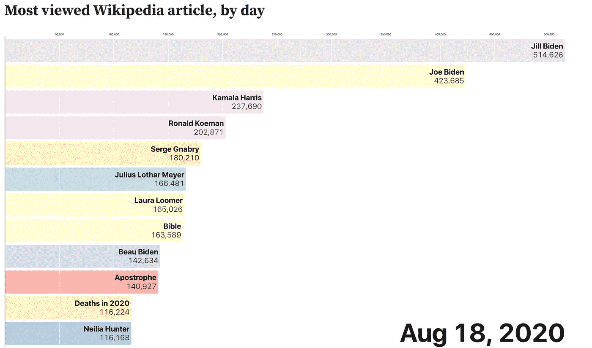

# 抓取维基百科的页面浏览量来制作 2020 年的倒带

> 原文：<https://towardsdatascience.com/scraping-wikipedia-page-views-to-make-a-2020-rewind-c9bcac97fa38?source=collection_archive---------40----------------------->

## 回顾维基百科最受欢迎的文章



图片作者。

人们经常去维基百科了解时事——也许是为了获得网飞最新版本的简介，或者阅读最近去世的名人的成就。

我想利用维基百科的页面浏览数据来创建一种“2020 倒带”——2020 年全年当前事件和趋势的动画时间轴。我是这样做的。

这个项目的代码可以在这里访问[。](https://github.com/vastava/data-science-projects/tree/master/wikipedia-rewind)

我首先定义了一个“get_traffic”函数来获取某一天的页面视图数据:

```
TOP_API_URL = 'https://wikimedia.org/api/rest_v1/metrics/pageviews/'\               'top/**{lang}**.**{project}**/all-access/**{year}**/**{month}**/**{day}**' **def** get_traffic(year, month, day):   
   TOP_API_URL.format(lang='en',project='wikipedia', year=year, month=month,day=day)resp = urllib2.urlopen(url)     
   resp_bytes = resp.read() 
   data = json.loads(resp_bytes)     
   articles = data['items'][0]['articles']     
   **return** articles
```

例如，调用 get_traffic('2020 '，' 02 '，' 21 ')将输出一个 JSON 对象，其中包含当天被查看次数最多的 1000 篇 Wikpedia 文章。该对象包含文章的标题、浏览量及其当天的浏览量排名。

我还创建了一个 is_article 函数，在将每篇文章添加到 dataframe 之前验证它确实是一篇文章。

```
**def** is_article(title, wiki_info):
    skip = ['-', '404.php', 'XHamster'] + [wiki_info['mainpage']]
    prefixes = PREFIXES + wiki_info['namespaces']
    **if** title **in** skip:
        **return** **False**
    **if** title == "Media":
        **return** **False**
    **if** title == "Wikipedia":
        **return** **False**
    **if** title == "United_States_Senate":
        **return** **False**
    **for** prefix **in** prefixes:
        **if** title.startswith(prefix + ':'):
            **return** **False**
    **return** **True**
```

为了创建倒带，我为 2020 年的每一天调用 get_traffic 函数，并将结果连接到一个 dataframe 中。我只保存了这个数据帧中被查看次数最多的 25 篇文章，而不是 get_traffic 的全部输出。

```
date1 = '2020-01-01'
date2 = '2021-01-07'
dates = pd.date_range(date1, date2).tolist()top_array = []

**for** date **in** dates:
    year=date.strftime('%Y')
    month = date.strftime('%m')
    day = date.strftime('**%d**')
    print(date) raw_traffic = get_traffic(year, month, day)
    articles = [a **for** a **in** raw_traffic **if** is_article(a['article'], wiki_info)]
    top_array.append(articles[:25])views_array = []
articles_array = []
ranks_array = []

**for** i **in** range(len(top_array)):
    date = dates[i]
    array = top_array[i]
    **for** j **in** range(25):
        row = array[j]
        dates_array.append(date)
        articles_array.append(row['article'].replace('_', ' '))
*#         print(articles_array)*
        views_array.append(row['views'])
        ranks_array.append(row['rank'])dict = {'date': dates_array, 'article': articles_array, 'views': views_array, 'rank': ranks_array}
df = pd.DataFrame(data=dict)
```

有了数据集后，我按照 Mike Bostock 的教程用 d3.js 创建了一个条形图比赛。为了避免过长的视频，我把 2020 年的倒带分成了两部分。

如果你看了这两个视频，你会注意到一些模式——人们似乎对政治、名人传记、新的娱乐节目和圣经最感兴趣。像“Qasem Soleimani”或“第 25 修正案”这样的文章将会看到一个高峰，因为人们试图消化每天的新闻周期。同样，当一个名人去世时，许多人会涌向维基百科阅读他们的传记。

享受下面的回顾吧！