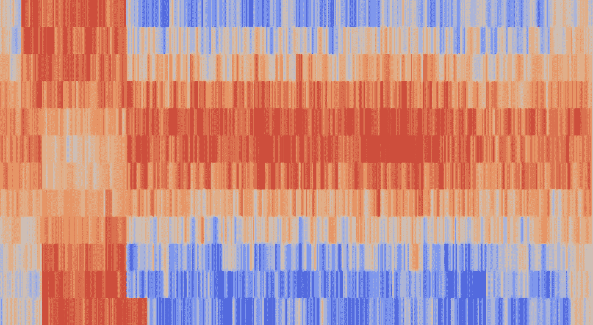
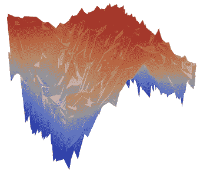

# 雕刻数据

> 原文：<https://towardsdatascience.com/sculpting-data-eb8b2b3d8f87?source=collection_archive---------38----------------------->

## [实践教程](https://towardsdatascience.com/tagged/hands-on-tutorials)

## 为什么它很重要，以及如何开始制作你自己的

一个生活在寒冷中的人——由[作者](https://adventuresindata.medium.com/)拍摄

我从未真正欣赏过艺术。我有机会也有特权参观了许多不同的画廊。有些画廊比其他的好，有些画也很美，但总的来说，我总觉得我缺少了什么。直到我发现了雷菲克·阿纳多尔的作品。

在伊斯坦堡的皮莱弗奈利画廊，我偶然看到一件名为 [*博斯普鲁斯*](https://vimeo.com/325634926) 的作品。在这个装置中，由土耳其气象局收集的当前速度和方向数据被转换成身临其境的体验。

我在 2018 年 12 月看到了这件作品，两年多后，我仍然发现自己在沉思它。这让我想知道，为什么这首曲子能引起我如此强烈的共鸣？部分原因是因为我个人对如何利用数据来了解我周围的世界感兴趣。但这是不同的东西。我没有带着任何关于博斯普鲁斯海峡的水流是如何运作的见解或者任何关于河流的新知识离开那个展览。这是一种更深层的东西，一种联系，以及对持续的、无形的水的搅动的崇敬。

## 在数据中浮现情感

我们经常谈论当今世界有多少数据，以及毫无疑问这些数据是如何被用来解决科学和商业领域的重要问题的。例如，艾伦图灵研究所和英国南极调查局(BAS)人工智能实验室的团队正在使用[机器学习来更好地理解气候现象的相互联系](https://www.turing.ac.uk/research/research-projects/understanding-arctic-sea-ice-loss)以及它如何影响海冰的可变性，目标是减少气候预测的不确定性。

> “科学理性和人类经验的情感本质之间的深刻脱节引发了我们在哪里找到意义的问题…”。

但我认为数据可以用来产生更深层次的共鸣。对我们周围世界的数据驱动的表示产生了一种更容易理解的方式来与正在起作用的力量进行交互并理解它们。Adriene Segal (她也有一些漂亮的作品)在她的陈述中抓住了这一点“科学理性和人类经验的情感本质之间的深刻脱节引发了我们在哪里找到意义的问题…”。

## **制作艺术**

作为我硕士项目的一部分，我一直在培养自己辩论和可视化数据的能力。受到我的新技能的鼓舞，我决定尝试创造我自己的数据驱动的艺术作品。我生活中每一天的平均气温的可视化。根据我对数据科学的 [R 的部分阅读，我决定将这个项目分成以下几个部分:](https://r4ds.had.co.nz/index.html)

1.  导入
2.  整洁的
3.  设想

## **1。导入**

首先，我需要获取数据。经过一些搜索(和一个附带的，但最终不成功的网络搜索)我发现了 [NASA 兰利研究中心(LaRC)的电力项目](https://power.larc.nasa.gov/)。对该数据集的访问使收集一致、有效的数据变得轻而易举。R 中的 [nasapower](https://docs.ropensci.org/nasapower/) 包在完成这一步的过程中发挥了不可估量的作用。或者，单独下载每个 CSV 文件并不是一个可怕的选择，但是通过 R 自动化这个过程意味着我可以用最少的努力持续更新这个文件。我需要数据的每个位置都需要一个新的数据帧，所以我重复这些步骤，直到我的所有数据都在 r 中。

*使用 nasapower 包从 Nasa POWER 获取温度数据的语法示例*

**2。整洁**

在这一点上，我有六个电子表格，代表我一生中生活过的不同地方的数据。所以我需要汇总所有的数据。此外，我知道我将使用 Plotly 来可视化数据，并需要用代表一个月的每一列来组织它，这实质上意味着旋转数据。

所以两个步骤:

1.  **将单个数据帧组合成一个组合帧**

**2。透视数据**

## **3。可视化**

Plotly 有一些漂亮的可视化预设选项。这些是我开始探索 r 中的可能性的一个很好的方式。我知道我从一开始就想要一些表面图的版本，并在步骤 2 中使用它来通知整理过程。

**学习**

通过这个用数据创作一件艺术品的过程，我学到了一些东西。首先，仅仅因为你有一个工具，并不意味着你必须使用它。我选择在 R 中导入、操作和格式化数据，因为这是我的一个实践案例。实际上，在 Microsoft Excel 中透视数据可能会更快。也就是说，如果任何读者感到好奇，他们现在可以通过简单地更改经度和纬度值并对整理过程进行一些其他调整来重复这个练习。

为了检查我的数据争论的准确性，我在每一步之后进行人工抽查。我确信有更一致的方法来处理这个问题，并希望在未来更多地探索这个问题。

最初，我希望这种表现是一个可以 3D 打印成雕塑的表面图。然而，在尝试一些不同的选项时，我将所有的数据绘制成平面 2D 图像。我突然发现视觉效果更吸引人了。从本质上说，拥有更多信息(第三维度)实际上会降低它的影响力。这里有一个重要的教训，可以推广到任何可视化。信息越多并不总是越好。

3D 版，我还是希望能 3D 打印出来

最后，我希望能够在这一点上增加动作，并希望我可以在即将到来的机器学习中应用一些我将学到的东西来促进这一点。

当然还有最后的结果。

一个在摄氏零度的生活——图片由[作者](https://adventuresindata.medium.com/)提供

这里使用的所有代码都可以在 [GitHub](https://github.com/Adithya92/avrepo/blob/main/fin_data_art_daily_temp.Rmd) 上查看。