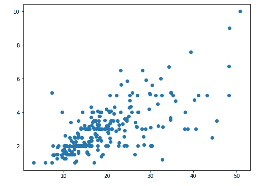
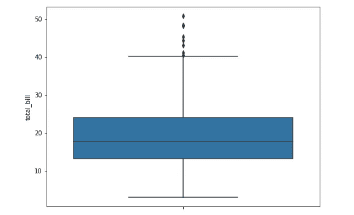

# Seaborn 可以完成这项工作，那么为什么要使用 Matplotlib 呢？

> 原文：<https://towardsdatascience.com/seaborn-can-do-the-job-then-why-matplotlib-dac8d2d24a5f?source=collection_archive---------10----------------------->


安娜·科洛舒克在 [Unsplash](https://unsplash.com?utm_source=medium&utm_medium=referral) 上的照片

## **应该绕过 Matplotlib 吗？**

不久前我有过这样的想法——学习 Matplotlib 对初学者来说是必要的吗？或者他们能逃脱 Seaborn 吗？这种想法最近在指导一群数据科学学生时又回来了。

我知道 Matplotlib 是一个很棒的库，它为定制数据可视化提供了很大的灵活性。

但是我也知道这是一个复杂的库，尤其是对于那些刚接触数据科学和数据可视化的人来说。对某些人来说，这也是一种威胁！

在大多数数据科学课程中，Matplotlib 和 Seaborn 是同时教授的，在我看来，这在人们中间造成了相当大的混乱。他们不明白为什么他们需要两个库，如果只有一个可用的话。为了减轻这种困惑，我通常建议学生先学习 Seaborn 一旦他们适应了它，并理解了它的局限性，他们自然会意识到 Matplotlib 的价值。

如果数据可视化的目的是可视化变量的分布、趋势和关系，Seaborn 拥有所有这些能力。所有主要的统计图——分布图、箱线图、小提琴图、散点图、条形图——都可以用 Seaborn 创建。对于初学者来说，这就是他们所需要的。

但是为什么是 Matplotlib 呢？

因为 Seaborn 会带你走那么远。由于其语法的简单性和美观性，Seaborn 在一开始是一个明显的赢家。但是随着复杂性的增加，Matplotlib 开始变得活跃起来。


Seaborn 和 Matplotlib 之间的权衡(Alam)

本文的目的是用一些基本的数字和最少的代码来比较 Seaborn 和 Matplotlib。我还将展示 Matplotlib 的亮点，以及它在数据可视化方面的强大之处。

我在 Seaborn 附带的演示中使用了以下数据集:

```
import seaborn as sns
df = sns.load_dataset('tips')
df.head()
```


# 其中 Seaborn 和 Matplotlib 相等

只要是基本的统计图，没有太大区别。

我们可以使用 Seaborn 为两个变量`total_bill`和`tips`创建一个简单的散点图:

```
sns.scatterplot(x='total_bill', y = 'tip', data = df)
```


由 Seaborn 可视化的简单散点图

我们可以使用 Matplotlib 做同样的事情:

```
plt.scatter(x='total_bill', y = 'tip', data = df)
```



用 Matplotlib 可视化简单散点图

如果你仔细观察，你可能会发现一些细微的差别，但是让我们暂时忽略它。

让我们试试另一个图，这次是箱型图。

```
sns.boxplot(y='total_bill', data = df)
```



Seaborn 可视化的箱线图

这是它在 Matplotlib 中的显示方式:

```
plt.boxplot(x='total_bill', data = df)
```


Matplotlib 可视化箱线图

例如，在这两种情况下，Seaborn 和 Matplotlib 提供了相似的统计信息。但你大概意识到了剧情质量和外观上的差异。

# Seaborn 闪耀的地方

Seaborn 在两个方面大放异彩:1)简单和 2)美学。

所谓简单，我指的是它创建情节的简短、直观的语法。让我们看看这个例子——上面的散点图，但增加了一些功能。

首先是 Matplotlib:

```
color = {'Lunch': 'blue', 'Dinner': 'darkorange'}plt.scatter(x='total_bill', y='tip', data=df, c = df['time'].map(color))
```


现在有了 Seaborn:

```
sns.scatterplot(x='total_bill', y='tip', data=df, hue='time')
```


如果你看一下代码，你会承认 Seaborn 非常优雅和直观，而 Matplotlib 的代码却很混乱。

现在让我们转向美学。诚然，审美是一个主观的问题，但即使如此，你也会欣赏看起来更好的情节，并在审美上令你满意。

```
plt.violinplot(df['total_bill'])
```


```
sns.violinplot(y=df['total_bill']
```


如果您比较两个库创建的两个小提琴情节，有两点非常突出:

*   Seaborn 的情节很有美感
*   Seaborn 生成了更多的信息(你在 violin 情节中看到一个盒子情节了吗？)

# Matplotlib 的力量

Matplotlib 是一个海量库，我听说有 7 万多行代码。人们说它是一个“低级”库，也就是说，与“高级”单行 Seaborn 代码相比，它给了数据科学家很大的灵活性。下面是 Matplotlib 增强数据可视化的几个例子。

## 陪衬情节

Matplotlib 最擅长支线剧情。你可以用`plt.subplot(nrows, ncols)`创造尽可能多的支线剧情，并在每个支线剧情中放入任何你想要的东西。下面是一个用 4 个空支线剧情(`nrows=2, ncols=2`)创建的图。

```
fig, ax = plt.subplots(2,2, figsize=(10,6))
```


Matplotlib 功能创建的子情节的结构

我们现在可以添加 Seaborn 图，并将它们放置在图中我们想要的任何位置。让我们利用第二和第四支线剧情顺时针放置一个箱线图和散点图。

```
fig, ax = plt.subplots(2,2, figsize=(10,6))# boxplot
sns.boxplot(y='tip', data=df, ax=ax[0,1])
ax[0,1].set_title('This is Seaborn boxplot')# scatterplot
sns.scatterplot(x='total_bill', y='tip', data=df, ax=ax[1,0])
ax[1,0].set_title("This is Seaborn scatterplot")fig.tight_layout()
```


用 Matplotlib 子图可视化的 Seaborn 图

## 注释

您可以通过添加文本、符号、点、框、圆等多种方式为您的地块添加注释。下面是一个例子——在下面的散点图中，我们希望将两个数据点表示为异常值。

```
plt.figure(figsize=(8,6))fig, ax = plt.subplots()
sns.scatterplot(ax = ax, x=df['total_bill'], y = df['tip'])ax.annotate('Outlier', xy=(50, 10), xytext=(40, 9),
            arrowprops=dict(facecolor='red'))ax.annotate('Outlier', xy=(7.5, 5.3), xytext=(10, 7),
            arrowprops=dict(facecolor='red'))
```


由 Matplotlib 功能标注的绘图

您可以将这一想法扩展到许多方面，并以许多不同的方式对其进行定制(例如，注释时间序列图以解释高点和低点)。

## 三维绘图

数据科学家通常将数据可视化为二维图形。但是 Matplotlib 也提供了用它的`mplot3d`工具包创建三维绘图的功能。你所需要做的就是将关键字`projection='3d'`传递给一个轴创建例程(例如`add_subplot(projection=’3d’)`)。这里有一个例子:

```
import matplotlib.pyplot as plt
import numpy as npn_radii = 8
n_angles = 36radii = np.linspace(0.125, 1.0, n_radii)
angles = np.linspace(0, 2*np.pi, n_angles, endpoint=False)[..., np.newaxis]x = np.append(0, (radii*np.cos(angles)).flatten())
y = np.append(0, (radii*np.sin(angles)).flatten())z = np.sin(-x*y)ax = plt.figure(figsize=(14,8)).add_subplot(projection='3d')ax.plot_trisurf(x, y, z, linewidth=0.2, antialiased=True)
```


用 Matplotlib 可视化 3D 绘图

## 还有更多…

总而言之，Matplotlib 有助于创建各种生产质量的自定义地块。您可以完全按照您想要的方式布置您的图形，设置适当的分辨率，并根据需要为图形添加注释。为了扩展功能，有几个可用的工具包，如底图、制图、matplotlib2tikz、Qt、GTK 等。如果您对可视化的特定专业感兴趣，网上有大量的资源和丰富的文档。

# 总结和结论

Seaborn 是一个高级库。它提供了简单的代码来可视化复杂的统计图，这也恰好是美观的。但是 Seaborn 是建立在 Matplotlib 之上的，这意味着它可以进一步增强 Matplotlib 的功能。

本文的初衷是调查作为初学者是否需要学习 Matplotlib 和 Seaborn 库。你不必选择一个或另一个，你需要两个，但问题是你需要同时学习它们吗？

重申我已经说过的:首先学习 Seaborn，花一些时间用它来可视化，理解它的局限性。Seaborn 的局限性自然会让你进入 Matplotlib。

希望这是一次有益的讨论，如果你有意见，请随时写在下面，或者通过[媒体](https://mab-datasc.medium.com/)、[推特](https://twitter.com/DataEnthus)或 [LinkedIn](https://www.linkedin.com/in/mab-alam/) 与我联系。