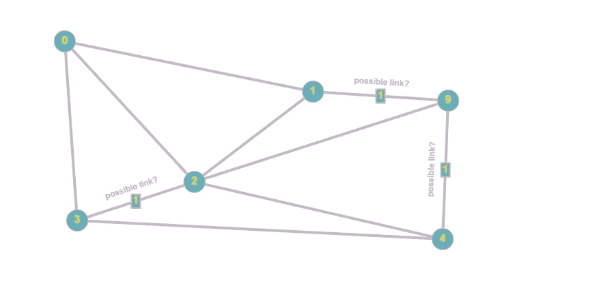
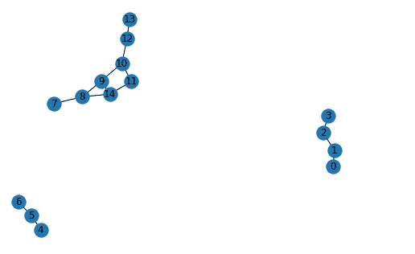
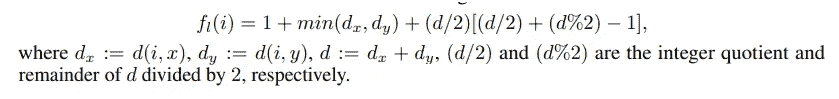
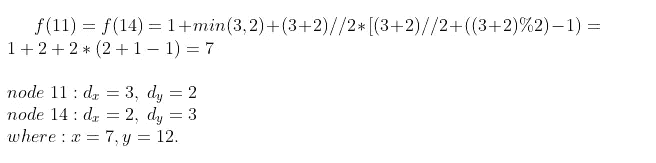

# 海豹突击队联系预测，解释道

> 原文：<https://towardsdatascience.com/seal-link-prediction-explained-6237919fe575?source=collection_archive---------12----------------------->

## 深入探究玩具数据的海豹突击队算法

近年来，图形神经网络变得非常流行。你可以用它们做很多事情，像节点标签预测、图形预测、节点嵌入、链接预测等等。本文旨在通过分析原论文作者之一的实现示例代码来解释海豹突击队(用于链接预测的子图、嵌入和属性)是如何工作的，可以在这里找到:[github . com/rusty 1s/py torch _ geometric/blob/master/examples/seal _ Link _ pred . py](https://github.com/rusty1s/pytorch_geometric/blob/master/examples/seal_link_pred.py)

## 介绍

链接预测是图论领域的一个热门研究课题。例如，给定下面的社交网络，其中不同的节点相互连接，我们希望预测当前未连接的节点是否会在未来连接。对于图形神经网络，我们不仅可以使用关于网络结构的信息，即两个给定节点共有的连接，还可以使用每个节点的特征，如他们的爱好、他们上过的学校等。

作者图片(图表示例)

## 简单图形

首先，我们将创建一些玩具数据来玩:

*   *edge_index* :定义节点之间的边。
*   *x* :节点特征(玩具数据中的 15 个唯一节点)。每个节点都将拥有由用户定义的自己的特征(例如，年龄、性别、单词包等)，这些特征与定义每个子图中节点的结构角色的特征连接在一起(这将在下一节中变得更加清楚)。
*   *训练、测试、验证掩码*:布尔掩码数组。

作者图片(图表)

## 封闭子图和节点标记

对于 *edge_index* 中的每个链接，我们需要提取由跳数、源节点和目标节点定义的封闭子图，并根据*双半径节点标记(DRNL)* 算法标记每个子图中的每个节点。这意味着使用以下公式为每个节点分配一个标签:

[https://arxiv.org/pdf/1802.09691.pdf](https://arxiv.org/pdf/1802.09691.pdf)

这取决于*节点(i)* 与*源(x)* 和*目标(y)* 节点之间的*距离*(跳数)。

这种标记方法捕获了节点相对于源节点和目标节点的**结构角色**，为模型提供了更多信息以正确预测链接的存在。

在上面的例子中，我们说明了节点 7 和 12 的标记将跳数设置为 2。将整个图的两个节点和*边索引*插入 *k_hop_subgraph* 函数，我们得到新的*子节点*(正如我们可以看到的，它包括距离源节点和目标节点 2 跳以内的所有子节点)*子边索引*(对于子图为*边索引*)和子图中每个节点的 z 分数作为输出。

对于源节点和目标节点，z 得分等于 1。节点 11 和 14 具有相同的 z 分数，等于 7:

按作者分类的图像(Z 得分计算)

因为它们与源节点和目标节点的距离相同，所以它们具有相同的 z 分数。

现在，我们需要将我们的数据分为训练、测试和验证，创建负样本并将它们全部插入到一个*数据加载器* [1]。第一部分很简单——我们从图中移除一些边，并使用它们进行测试/验证。我们需要注意的一件事是不要将连接的组件分成多个组件。该检查似乎在 *train_test_split_edges* 函数的当前实现中缺失。我们还添加了“*无向图*”参数，以消除到无向图的转换，并避免重复的子图(用于[ *src* =1， *dst* =2]的子图与[ *src* =2， *dst* =1]的子图相同)。这允许减少数据集所需的 ram 数量。但是我们仍然希望节点之间的无向链接能够双向传递消息——我们稍后将回到这一点。为了创建反例，我们随机选取一些图中不存在的边。在当前的实现中，所采用的策略是琐碎的，并且没有考虑像节点之间的距离、节点的度数、节点的相关性等信息。在训练稳健模型的优化过程中，反例非常重要，因此不应该低估这一点[2]。

## DGCNN 模型

在这一部分中，我们将试图理解 DGCNN 模型在做什么。我们将仔细分析每一步发生的事情。为简单起见，我们假设:

*   *批量大小* = 1
*   *归一化*和*偏差* =假(在 GCNConv 层)
*   *GCNConv 层数* = 1

首先，我们计算参数 *k* ，它类似于句子的 NLP 最大长度，如果序列长度大于 *k* ，我们要么截断序列，要么填充。类似地，每个封闭的子图将有不同数量的节点，因此我们将需要截断或填充。之后，我们对*数据加载器*中的元素进行一些调整，并应用 *GCNConv* 层:

1.由于我们从 *train_test_split_edges* 函数中移除了到无向子图的转换以节省空间，我们需要在此阶段重新引入它(DGCNN.py 文件中的第 90 行)。通过这种方式，我们可以双向传递信息。在聚合过程中，我们还希望包含节点自己的特性，因此我们添加了一个 self 循环(DGCNN.py 文件中的第 91 行)。

2.使用权重矩阵变换原始要素。

3.通过聚合每个节点的邻居特征来计算新节点的特征(这里聚合函数是简单的和)。

4.连接卷积层。

5.应用全局排序池操作:
卷积操作变得非常流行，用于从图像中提取特征，它与从图中提取特征的卷积操作有一个主要区别:节点的顺序。图像像素可以被视为一个图形的节点，但它们是自然有序的，这是我们在图形结构中所缺乏的。由此产生了对子图中的节点进行一致排序的需求。该论文的作者证明了图卷积运算近似于 Weisfeiler-Lehman 节点着色(一种通过颜色/节点标签模式来比较不同图的算法),因此我们可以使用卷积运算的最后一层特征来根据节点在子图中的结构角色一致地对节点进行排序。

[https://muhanzhang.github.io/papers/AAAI_2018_DGCNN.pdf](https://muhanzhang.github.io/papers/AAAI_2018_DGCNN.pdf)

排序后，我们标准化每个子图的节点数，如果 *k* 小于节点数，则截断排序后的节点序列，否则填充[3]。

6.在我们根据 WL 颜色进行了分类之后，我们得到了图像中的结构化数据，因此我们可以应用 1D 卷积、最大池和线性层来最终预测 2 个节点之间的链接的存在。

## 结论

在本文中，我们描述了海豹突击队算法的所有步骤——从节点标记到在一些玩具数据上用图卷积运算传递消息。我们还看到了图像和图形结构化数据之间的相似性，这使我们能够对图形应用卷积运算。作为下一步，我们将使算法适合一些真实数据，以评估不同的挑选负样本的策略如何影响算法的性能。

## 参考

[1][Stanford . edu/~ sher vine/blog/py torch-how-to-generate-data-parallel](https://stanford.edu/~shervine/blog/pytorch-how-to-generate-data-parallel)

[arxiv.org/pdf/2005.09863.pdf](https://arxiv.org/pdf/2005.09863.pdf)

[3][muhanzhang.github.io/papers/AAAI_2018_DGCNN.pdf](https://muhanzhang.github.io/papers/AAAI_2018_DGCNN.pdf)