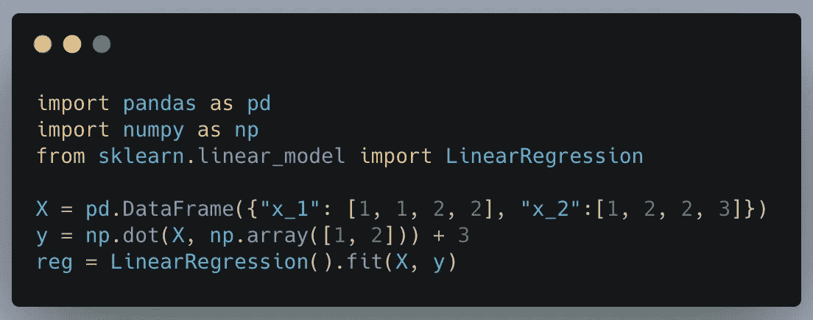
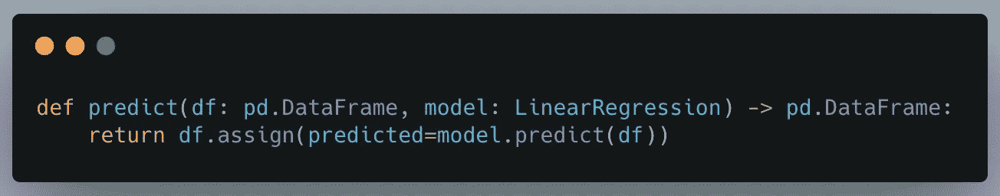
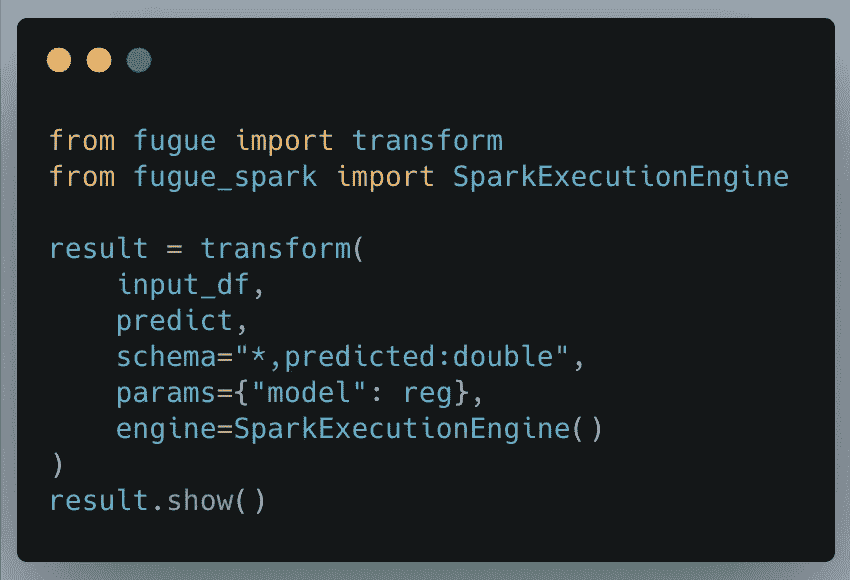
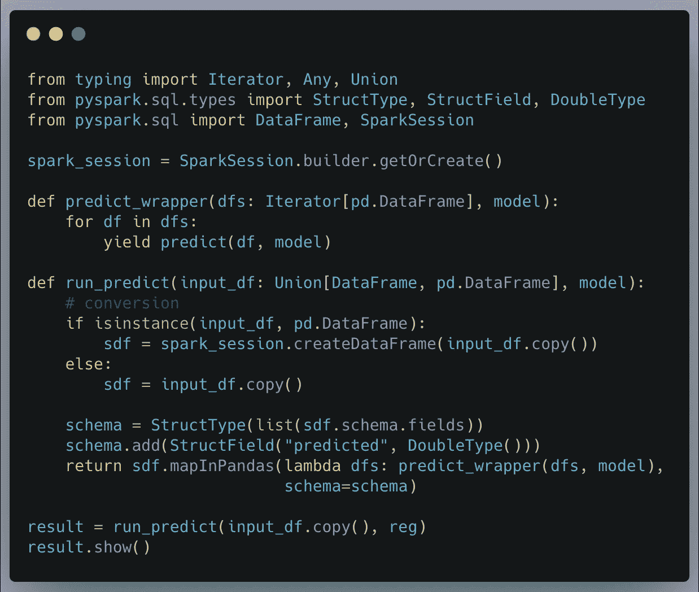

# 将 Python 和 Pandas 功能无缝移植到 Spark

> 原文：<https://towardsdatascience.com/seamlessly-porting-python-and-pandas-functions-to-spark-46718361b93f?source=collection_archive---------38----------------------->

## 我们可以用简单的方法，或者困难的方法

巴勃罗·阿罗约在 [Unsplash](https://unsplash.com?utm_source=medium&utm_medium=referral) 上的照片

注意:这里展示的代码是用于格式化的图片，但是你可以在[这里](https://fugue-tutorials.readthedocs.io/en/latest/tutorials/beginner/introduction.html)找到它们。

## 动机

虽然 Pandas 是数据科学和数据分析师工作流中最常见的 Python 工具，但它不能很好地处理大数据集，因为它一次只使用一个内核。它还使用了惊人的内存量。在 [Wes McKinney 的博客文章](https://wesmckinney.com/blog/apache-arrow-pandas-internals/)中，他提到经验法则是拥有 5 倍或 10 倍于数据集大小的 RAM。

当熊猫的数据处理效率低下时，数据科学家开始寻求 Spark 等分布式计算框架。这些框架通过使用单台机器甚至整个集群上的可用内核来加快计算速度。不利的一面是，为了利用 Spark，Pandas 和 Python 代码通常不得不与 Spark 兼容。

在本文中，我们将回顾一个使用 [Fugue](https://github.com/fugue-project/fugue) 将 Pandas 和 Python 代码无缝移植到 Spark 的例子，这是一个用于分布式计算的开源抽象层。在经历了赋格方法之后，我们将使用 Spark 3.0 中可用的 Spark 的 mapInPandas 方法将其与传统方法进行比较。

## 示例问题

在这个示例问题中，我们有一个已经使用 Pandas 和 scikit-learn 训练过的机器学习模型。我们希望在一个太大的数据集上运行预测，熊猫无法使用 Spark 有效地处理这个数据集。本教程也将适用于转换数据的操作。我们不局限于机器学习应用。

首先，我们从制作一个简单的线性回归模型开始。

简单线性回归

然后，我们创建一个简单的**预测**函数，该函数将接收一个数据帧并创建一个名为“**预测”**的新列，其中包含预测。这部分对于熊猫用户来说并不新鲜。

## 用赋格在火花中执行

这就是奇迹发生的地方。 [Fugue](https://github.com/fugue-project/fugue) 是一个抽象层，旨在使用户能够将 Pandas 和 Python 代码移植到 Spark。稍后，我们将展示如何在没有赋格的情况下手动完成，但首先，我们将看看赋格是如何完成这一点的。

神游有一个**转换**函数，它接受熊猫或火花数据帧和一个函数。当我们指定一个**执行引擎**时，Fugue 将应用必要的转换来运行该引擎上的代码(在本例中是 Spark)。如果没有指定引擎，它将在熊猫上运行。请参见下面的代码片段。

这就是字面意思。这将在 Spark 上运行。代码块中的大多数内容都很容易理解。 **input_df** 可以是 Pandas 或 Spark 数据帧。 **predict** 函数是我们之前定义的函数，而 **params** 参数包含传递给该函数的内容。在这种情况下，我们通过了之前训练的回归模型。因为我们选择了 **SparkExecutionEngine** ，所以所有代码将以并行方式在 Spark 上运行。

最后要理解的是**模式**参数。这是因为**模式**在 Spark 中被严格执行，需要显式。使用 **"*，predicted:double"** ，我们指定保留所有列，并添加一个名为**的 double 类型的预测**的新列。这是 Spark 方法的一个大规模简化的语法，我们将在后面看到。

使用 Fugue 中的 **transform** 函数，我们能够在 Spark 上使用 Pandas 函数，而无需对原始函数定义进行任何修改。让我们看看如何在不赋格的情况下做等效的动作。没有必要完全理解下一节的所有内容，重点只是展示 Fugue 的界面简单了多少。

## Spark 实施

这一部分是为那些想比较这些方法的人准备的。下面的代码片段是如何使用 Spark 的 **mapInPandas** 实现的:

这些步骤依次为:

1.  创建 SparkSession (Fugue 的 SparkExecutionEngine 在幕后完成这项工作)
2.  包装**预测**函数以处理数据帧的迭代器。这是因为该函数将接收多个数据帧(分区),并且**预测每个集合。**
3.  创建一个接受 Spark 或 Pandas 数据帧的 **run_predict** 函数。将数据帧转换为 Spark 数据帧(如果尚未转换)。
4.  拉出**模式**并添加 double 类型的新**“预测”**列。
5.  使用 **mapInPandas** 方法将操作映射到分区。

神游的**转换**为用户处理所有这些。

## 结论

在本文中，我们比较了将 Pandas 和 Python 函数引入 Spark 的两种方式。第一个是 Fugue，我们简单地调用了 **SparkExecutionEngine** 上的转换函数，所有的转换都为我们处理了。第二个是使用 vanilla Spark，我们必须创建辅助函数。

对于一个函数，我们已经在 Spark 实现中编写了许多样板代码。对于一个有几十个函数的代码库，实践者最终会编写大量的样板代码，使代码库变得混乱。虽然使用 Fugue 最简单的方法是使用 **transform** 函数，但是这种编写与 Pandas 和 Spark 都兼容的代码的概念可以扩展到完整的工作流。如需了解更多详情，请随时联系(信息如下)。

## 联系我们

如果您有兴趣了解更多关于神游、分布式计算或如何以更简单的方式使用 Spark 的知识，请随时联系我们！这里涵盖的内容只是起点。赋格团队正在给数据团队提供完整的研讨会和演示，并希望与您交谈。

[Github 回购](https://github.com/fugue-project/fugue)

[松弛](https://join.slack.com/t/fugue-project/shared_invite/zt-jl0pcahu-KdlSOgi~fP50TZWmNxdWYQ)

[赋格教程](https://fugue-tutorials.readthedocs.io/en/latest/tutorials/beginner/index.html)

邮箱:hello@fugue.ai