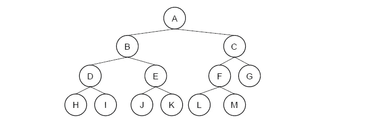
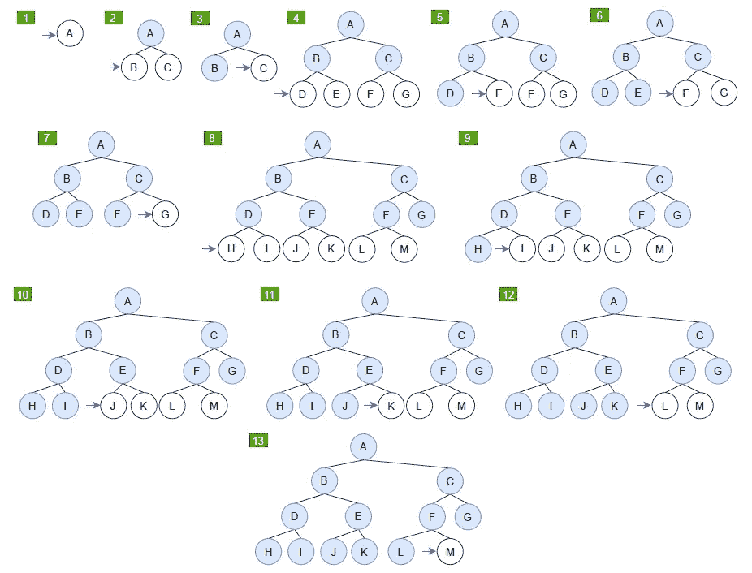
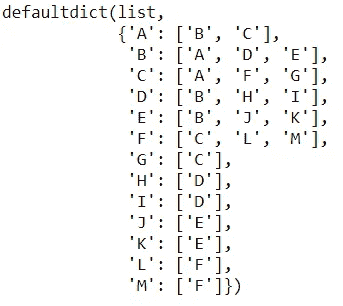
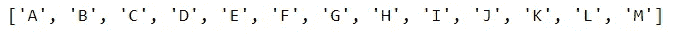

# 搜索算法-广度优先搜索，使用 Python

> 原文：<https://towardsdatascience.com/search-algorithm-breadth-first-search-with-python-50571a9bb85e?source=collection_archive---------10----------------------->

## 从头开始 Python 实现

在本文中，我将介绍一种叫做广度优先搜索(BFS)的基础搜索算法。

Geran de Klerk 在 [Unsplash](https://unsplash.com/?utm_source=medium&utm_medium=referral) 上拍摄的照片

# 定义

搜索算法是一种检索存储在某些数据结构中的信息的算法，或者是在问题域的搜索空间中计算的信息[1]。广度优先搜索是一种遍历或搜索树或图数据结构的算法。它从根节点开始，在移动到下一个深度级别的节点之前探索当前深度的所有节点[2]。换句话说，它扩展了最浅的未扩展节点，这可以通过先进先出(FIFO)队列来实现。让我们通过下图来看一个例子:

穿过 BFS 的示例图。图片作者。

BFS 算法，逐步扩展。图片作者。

从上面的逐步展开图中，我们可以看到 BFS 算法优先选择最接近起始顶点的边来执行搜索。

现在，让我们来评估这个算法:
将 **d** 表示为最小成本解的深度，将 **b** 表示为搜索树或图的最大分支因子。假设一个假设的状态空间，其中每个节点可以扩展成 **b** 个新节点，路径长度 **d:** 的解

1.  时间复杂性:找到解决方案需要多长时间？
    1 + b + b + b + …。+ bᵈ = O(bᵈ)
2.  空间复杂度:内存中的最大节点数
    保持内存中的每个节点= O(bᵈ)
3.  完整性:如果存在的话，它是否总能找到解决方案？是的
4.  最优性:它总能找到最佳(最低成本)的解决方案吗？
    是的，当**所有步骤**花费相等时。

# 代码实现

让我们用上面的例子用 Python 来实现 BFS 算法。

该图是具有顶点 V={A，B，C，D，E，F，G，H，I，J，K，L，M}，E={{A，B}，{A，C}，{B，D}，{B，E}，{C，F}，{C，G}，{D，H}，{D，I}，{E，J}，{E，K}，{F，L}，{F，M}}的图形的示意图

1.  创建接收图的边的函数，输出无向图的邻接表

代码的输出。图片作者。

2.创建接收邻接表和起始顶点的函数，输出 BFS 搜索序列

代码的输出。图片作者。

# 推荐阅读

</search-algorithm-depth-first-search-with-python-1f10da161980>  

# 参考

[1] [搜索算法—维基百科](https://en.wikipedia.org/wiki/Search_algorithm)

[2] [广度优先搜索—维基百科](https://en.wikipedia.org/wiki/Breadth-first_search)