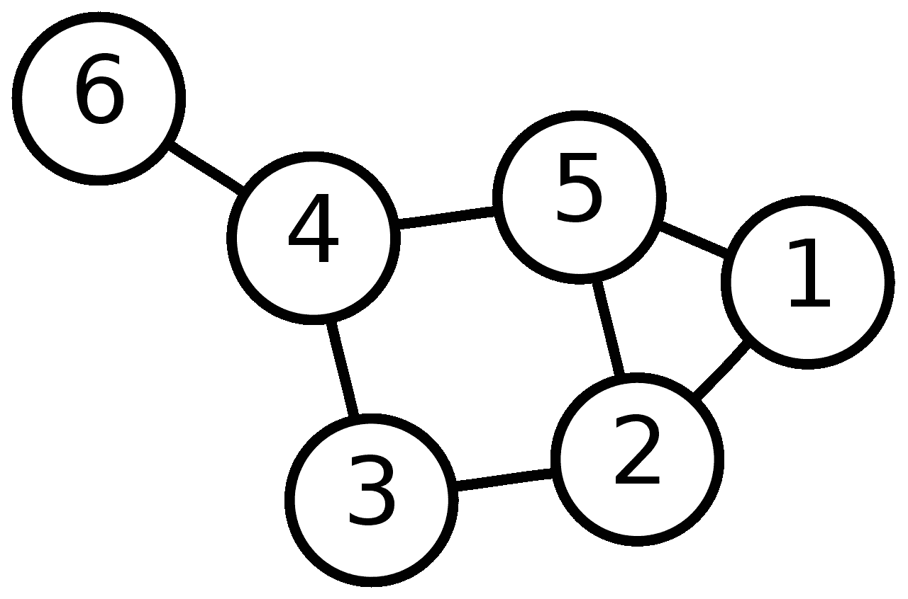
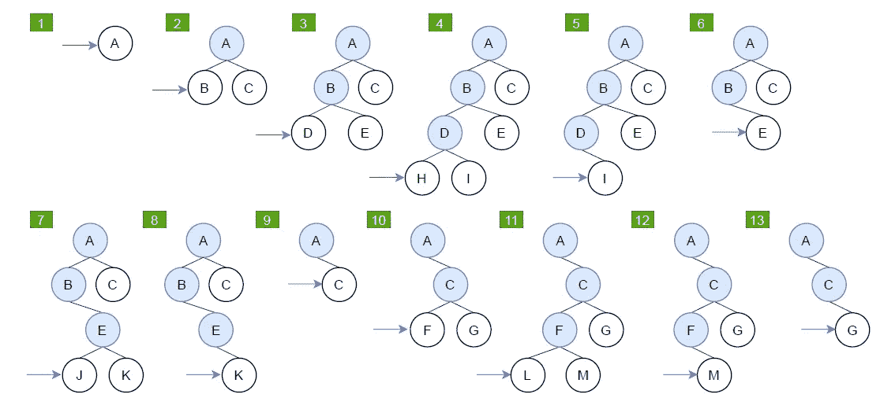
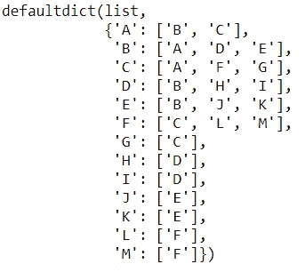
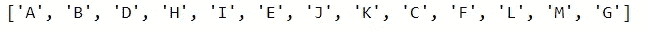

# 搜索算法-深度优先搜索，使用 Python

> 原文：<https://towardsdatascience.com/search-algorithm-depth-first-search-with-python-1f10da161980?source=collection_archive---------18----------------------->

## 从头开始 Python 实现

在本文中，我将介绍一种叫做深度优先搜索(DFS)的基础搜索算法。

丹尼尔·勒曼在 [Unsplash](https://unsplash.com/?utm_source=medium&utm_medium=referral) 上的照片

搜索算法是一种检索存储在某些数据结构中的信息的算法，或者是在问题域的搜索空间中计算的信息[1]。通过选择节点扩展的顺序来定义搜索策略。可以从以下几个方面评估战略:

1.  完整性:如果存在的话，它是否总能找到解决方案？
2.  时间复杂性:找到解决方案需要多长时间？
3.  空间复杂度:内存中的最大节点数
4.  最优性:它总能找到最佳(最低成本)的解决方案吗？

# 定义

深度优先搜索是一种遍历或搜索树或图数据结构的算法[2]。在解释 DFS 算法之前，我们先介绍一下图形数据结构。一个**图** G 是一个对(V，E)，其中 V 是一个有限集，E 是 V 上的一组二元关系

❖ V 被称为*顶点集*，它的元素是*顶点*。

❖ E 被称为*边集*，它的元素被称为*边*。一条边由一对顶点表示。

图形数据结构的例子[3]

该图是顶点为 V={1，2，3，4，5，6}，E={{1，2}，{1，5}，{2，3}，{2，5}，{3，4}，{4，5}，{4，6}}的图形的示意图

# 深度优先搜索

现在，让我们开始详细解释 DFS。它从根节点开始，扩展最深的未扩展节点，仅在不再扩展时回溯。让我们通过下图来看一个例子:

通过 DFS 的示例图。图片作者。

DFS 算法，逐步扩展。图片作者。

从上面的逐步展开图中，我们可以看到，DFS 算法沿路径优先选择边来执行搜索。

现在，让我们评估这个算法:
将 **m** 表示为状态空间的最大深度，将 **b** 表示为搜索树或图的最大分支因子

1.  完备性:
    无限深度空间:否
    有循环的有限深度空间:否
    有重复状态检查的有限深度空间:是
    无循环的有限深度空间:是
2.  时间复杂度:O( **bᵐ**
3.  空间复杂度:O( **bm**
4.  最优性:否

# 代码实现

让我们用上面的例子用 Python 实现 DFS 算法。

该图是具有顶点 V={A，B，C，D，E，F，G，H，I，J，K，L，M}，E={{A，B}，{A，C}，{B，D}，{B，E}，{C，F}，{C，G}，{D，H}，{D，I}，{E，J}，{E，K}，{F，L}，{F，M}}的图形的示意图

1.  创建接收图的边的函数，输出无向图的邻接表

代码的输出。图片作者。

2.创建接收邻接表的函数和输出 DFS 搜索序列的起始顶点

代码的输出。图片作者。

# 参考

[1] [搜索算法—维基百科](https://en.wikipedia.org/wiki/Search_algorithm)

[2] [深度优先搜索——维基百科](https://en.wikipedia.org/wiki/Depth-first_search)

[3] [图(离散数学)—维基百科](https://en.wikipedia.org/wiki/Graph_(discrete_mathematics))