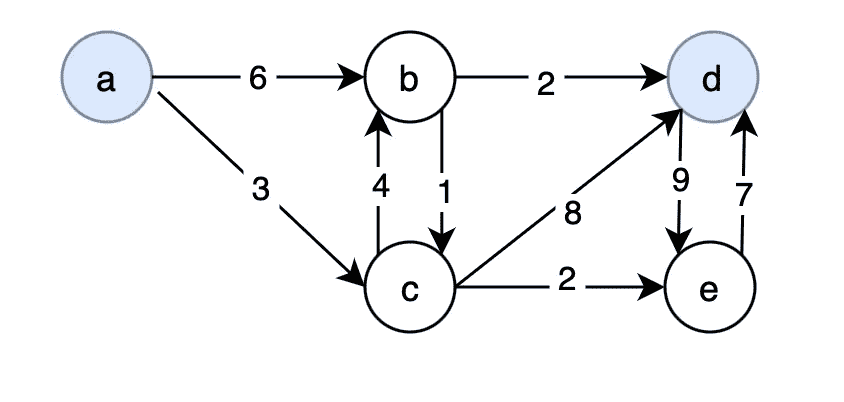
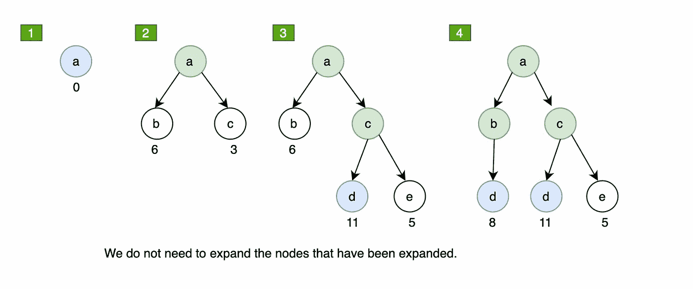
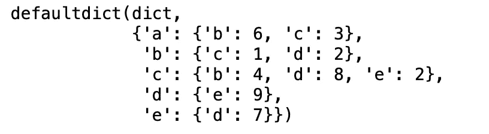

# 搜索算法:Dijkstra 算法和统一成本搜索，使用 Python

> 原文：<https://towardsdatascience.com/search-algorithm-dijkstras-algorithm-uniform-cost-search-with-python-ccbee250ba9?source=collection_archive---------6----------------------->

## 介绍一种称为 Dijkstra 算法的基本搜索算法及其变体，即统一成本搜索(UCS)

弗兰克·麦肯纳在 [Unsplash](https://unsplash.com/) 上拍摄的照片

# **定义**

搜索算法是一种检索存储在某种数据结构中的信息的算法，或者是在问题域的搜索空间中计算的信息[1]。与深度优先搜索(DFS)和宽度优先搜索(BFS)不同，Dijkstra 的算法和统一成本搜索(UCS)考虑了到目标的路径成本。例如，在道路网络中，路径成本可以是行驶的总距离或花费的总时间。 **Dijkstra 算法**是一种寻找图中从一个节点到每隔一个节点的**最短路径的算法，而 **UCS** 寻找两个节点**之间的**最短路径。[2]现在，让我们更详细地解释 UCS 算法，它是 Dijkstra 算法的变体。**

## 统一成本搜索

UCS **扩展到目前为止路径代价 g 最小的节点**。UCS 是 BFS 的改型。它不使用先进先出队列，而是使用一个具有路径成本 g(n) 的**优先级队列** **对节点进行排序。[3]让我们通过下面的有向图来看一个示例，开始节点 a 和结束节点 d 用蓝色突出显示:**

通过 UCS 的示例图形。图片作者。

UCS 或者 Dijkstra 的算法，逐步展开。图片作者。

从这一步一步的扩展中，我们可以看到**路径代价被考虑到**，它**扩展路径代价最小的节点**。例如，从步骤 2 到步骤 3，它扩展了到目前为止路径开销最小的节点 c。此外，在步骤 3 中，即使它在扩展后到达目的节点 d 的总开销为 11，由于节点 b 的当前开销为 6 < 11，所以它将继续扩展节点 b。在步骤 4 中扩展节点 b 后，它也到达目的节点 d 的总开销为 8，并且现在没有更多节点要扩展。所以，从 a 到 d 的最短路径= [a → b → d]，总成本= 8。

在了解了 UCS 的工作原理后，Dijkstra 的算法只是一种寻找到每一点的最短路径而不是单点的算法。

现在，让我们来评估这个算法:

1.  时间复杂性:找到解决方案需要多长时间？
    路径成本 g =最优解成本的节点数
    -相当于从优先级队列中跳出的节点数
2.  空间复杂度:内存中最大节点数
    路径代价为 g 的节点数=最优解的代价
3.  完整性:如果存在的话，它是否总能找到解决方案？
    是的
4.  最优性:它总能找到最佳(最低成本)的解决方案吗？
    是的

# 代码实现

让我们用上面的例子用 Python 实现 Dijkstra 和 UCS 算法。

该图是具有顶点 V={a，b，c，d，e}，E={{a，b，6}，{a，c，3}，{b，c，1}，{c，b，4}，{b，d，2}，{c，d，8}，{c，E，2}，{d，E，9}，{e，d，7}}的图形的示意图

1.  创建接受图的加权边的函数，该函数输出有向加权图

代码的输出。图片作者。

2.创建接受有向加权图和起始顶点的函数，该函数输出从起始顶点到图中所有其他节点的最短路径及其前身字典(Dijkstra 算法)

代码的输出。图片作者。

我们举一个例子，解释一下的前身词典是什么意思。例如，目前从**的 shortest_path_cost** 的输出中，我们知道从节点 a 到节点 d 的 shortest_path_cost = 8，如何准确地到达成本为 8 的节点 d 可以从它的**前体字典**中得知。我们可以从目的节点 d 开始查找前任字典，其前任是节点 c .按照相同的逻辑:节点 c 的前任→节点 a .因此，从节点 a 到节点 d 的最短路径是从节点 a →节点 c →节点 d。

3.实际上，我们可以使用 Dijkstra 算法的输出来获得 UCS 从**节点 a** **到** **节点 d** 的输出，如下所示:

代码的输出。图片作者。

# 结论

本文介绍了 Dijkstra 算法和均匀代价搜索算法。两种算法都在寻找成本最低的最短路径，即 Dijkstra 算法:寻找从图中一个节点到所有其他节点的最短路径，UCS:寻找两个节点之间的最短路径。它们是基本的搜索算法，对于解决更复杂的路由问题非常有用，如物流规划、运输和网络通信等。

# 推荐阅读

</search-algorithm-depth-first-search-with-python-1f10da161980>  </search-algorithm-breadth-first-search-with-python-50571a9bb85e>  

# 参考

[1] [搜索算法—维基百科](https://en.wikipedia.org/wiki/Search_algorithm)

[2] [迪杰斯特拉算法—维基百科](https://en.wikipedia.org/wiki/Dijkstra%27s_algorithm#Practical_optimizations_and_infinite_graphs)

[3] [统一成本搜索—维基百科](https://en.wikipedia.org/?title=Uniform-cost_search&redirect=no)