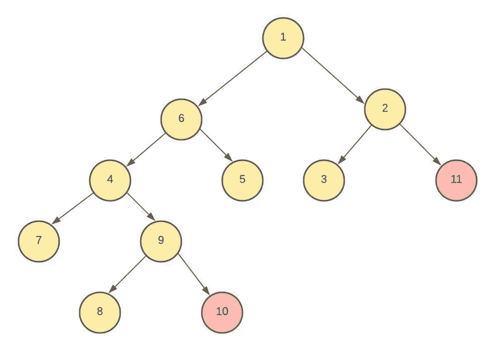
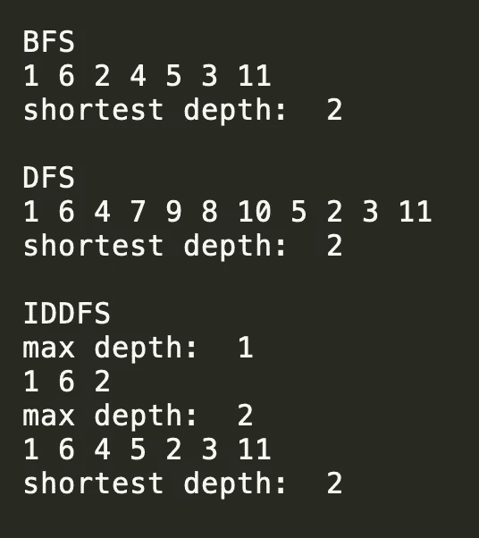
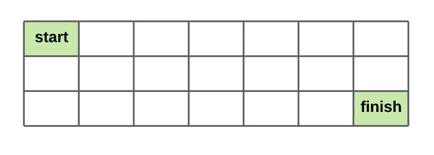
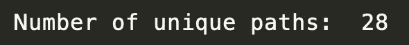
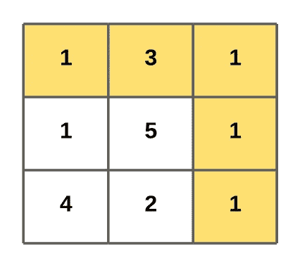
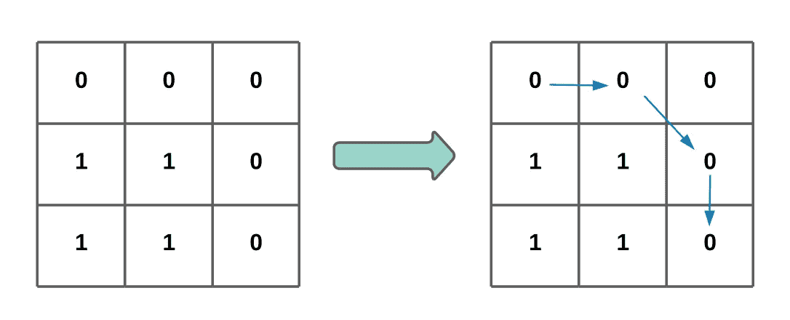
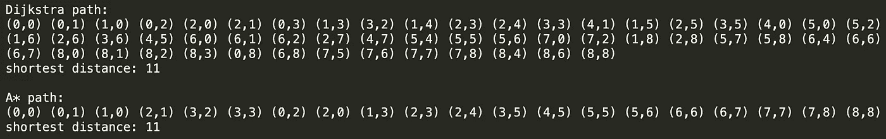

# 搜索算法——概念和实现

> 原文：<https://towardsdatascience.com/search-algorithms-concepts-and-implementation-1073594aeda6?source=collection_archive---------17----------------------->

## A*、Dijkstra、动态规划、BFS、DFS 和 IDDFS

作者照片

在机器学习中，搜索问题是一种基于状态的模型，有许多应用。比如寻路，机器人运动规划，机器翻译。在本文中，我们将深入研究几种常见的搜索算法，并了解它们如何用于解决不同的任务。

本文的其余部分将涵盖 BFS、DFS、IDDFS、动态编程、Dijkstra 算法和 A*。我会简单说明每个算法的主要思想，提供一个问题，用 Python 编写算法来解决问题。

完整的代码可以在这里找到[。](https://github.com/VXU1230/Medium-Tutorials/tree/master/search)

# **BFS、DFS、IDDFS**

BFS、DFS 和 IDDFS 是流行的搜索算法，可用于树和图数据结构。在本文中，我使用术语“节点”来表示树节点或图形组件。

## 概念

**BFS** 代表**广度优先搜索**，其工作方式如下:从根节点开始，探索当前深度的所有节点，然后移动到下一深度级别的节点。它重复这个过程，直到到达最后一个深度或找到目标。通常使用队列来跟踪已经遇到但还没有探索的节点。

**DFS** 代表**深度优先搜索**。与 BFS 相同，它从根节点开始。然而，DFS 不是遍历不同的深度，而是在回溯并移动到新的分支之前，尽可能地沿着每个分支探索。这意味着 DFS 通常是递归实现。

**IDDFS** 代表**迭代深化深度优先搜索**，实际上是 DFS 和 BFS 的混合。换句话说，它是深度受限的 DFS 版本。具体来说，它重复运行深度限制不断增加的 DFS 搜索，直到找到目标。尽管在每次迭代中它都运行一次 DFS 搜索，但它像 BFS 一样是最优的，并且通常可以在不探索所有节点的情况下找到目标，然而它不需要队列，并且使用的内存比 BFS 少得多。

让我们看看在搜索最短路径时，它们在时间和空间复杂性方面的不同表现。设`D`为树的最大深度，`d`为目标所在的最小深度。我们有`d <= D`。在二叉树`b==2`的情况下，设`b`为分支因子(每个节点的分裂数)。

**时间复杂度**

我们需要探索所有的节点。

BFS: `O(b^d)`我们只探索目标深度的节点。

IDDFS: `O(b^d)`我们只探索节点直到目标所在的深度。

**空间复杂度**

DFS: `O(D)`递归中最大的栈是`D`

BFS: `O(b^d)`队列中的节点数

IDDFS: `O(d)`递归中最大的栈是`d`

注意，如果我们需要访问每一个节点以便找到目标(`d==D`)，所有三个算法将具有相同的时间复杂度。

在下一节中，我将向您展示如何实现这些算法来解决树搜索问题。

## 问题陈述

从根节点到值大于或等于 10 的节点的最短路径(深度)的长度是多少？

## **分析**

最短路径是 1 → 2 →11，长度为 2。请注意，1 → 6 → 4 → 9 → 10 也是有效路径，但不是最短路径。

## 密码

为了解决这个问题，我们将每个树节点表示为一个`Node`对象，并将它们链接在一起以表示上面的树。

使用上面提到的复杂性注释，我们在这个问题上有了`D=4, d=2, b=2`。

首先让我们看看如何使用 **BFS 来解决它。从根节点开始，我们将当前深度的所有节点添加到队列中，并逐个处理它们。所谓“处理”，是指我们从队列中弹出节点，检查它是否是值，如果它不是目标，就将它的子节点添加到队列中。由于队列的先进先出属性，只有在我们处理完当前深度的节点之后，才会处理下一深度级别的节点。一旦我们找到目标(深度为 2 的节点 11)，我们马上返回它。**

另一方面， **DFS** 沿着每个分支递归搜索。在这种情况下，它按照根→左子树→右子树的顺序访问所有节点。这被称为前序遍历。还有另外两种类型的树遍历方法:Inorder 和 Postorder。查看[这里](https://www.geeksforgeeks.org/tree-traversals-inorder-preorder-and-postorder/)了解更多详情。

IDDFS 的实现与 DFS 的实现非常相似。唯一的区别是它在每个深度限制停止 DFS 搜索。假设我们知道树的最大深度是 4，我们可以从深度限制 1 开始运行 DFS，并将其增加到 4 或直到找到目标。在这种情况下，它只需要运行 2 个 DFS(深度限制为 1 和 2)。

让我们运行这三个函数并比较输出。在输出中，我们看到所有三个算法都找到了最短的深度 2，但是访问的节点不同。

**BFS** 首先访问根节点 1，然后移动到第一深度级别的节点:6，2，然后是第二深度的节点:4，5，3，11。由于我们的目标 11 是在这里发现的，它不会继续访问其他深度。

**DFS** 以不同的顺序访问节点。从根节点 1 开始，它移动到根节点为 6 的左子树，并继续移动到根节点为 4 的左子树。一旦到达没有任何子节点的节点 7，它就返回上一级(回溯)并以节点 9 为根搜索第一个右边的子树。注意，所有子树的遍历都遵循根→左子树→右子树的顺序，所以我们访问(9，8，10)而不是(8，9，10)或(10，8，9)。为了找到最短路径的长度，我们必须访问所有的节点。即使节点 10 已经满足标准，我们也不能就此止步，因为我们不知道它是否是最短路径。

**IDDFS** 当深度阈值为 1 时，首先访问节点 1、6、2，然后它再次从根开始访问深度为 2 (1、6、4、5、2、3、11)的所有内容，并在此处停止，因为找到了目标。它访问与 BFS 相同的节点，但是顺序不同，因为每个内部 DFS 运行仍然遵循根→左子树→右子树的顺序。

# **DP(动态编程)**

## 概念

当递归解决问题时，有时我们可能会多次访问相同的值，这增加了不必要的时间复杂度。解决这个问题的一种方法是缓存访问过的值以备将来使用。更好的是，如果我们将递归方法转换为重复使用之前的中间结果的迭代方法会怎么样？使用迭代法的优点是:1。将时间复杂度从指数降低到多项式；2.避免递归处理不当时经常发生的堆栈溢出。

动态规划的主要思想是存储子问题的中间结果，这样我们以后就不用重新计算了。让我们看一个例子来更好地理解 DP。

## 问题陈述

给定一个`m x n`网格，找出从左上角到右下角的唯一路径的数量。假设我们在任一时刻只能向下或向右移动。

## 分析

实现 DP 通常比提出解决方案容易得多，后者需要相当多的逆向思维。通常我们会通过从头开始迭代计算唯一路径的数量来解决这个问题。但是，请注意，网格中间的许多单元格被多次访问。这通常是某种缓存或 DP 的迹象。假设我们在单元格(1，6)，它位于完成单元格的正上方。从当前单元格开始，只有一条路径可以到达终点单元格:向下。这同样适用于单元格(2，5)。现在，如果我们在单元格(1，5)，有 2 条路径到达结束单元格:向右和向下；向右下走。这实际上是(1，6)和(2，5)处的值之和。从逻辑上讲，这是有意义的，因为在每个单元格中，我们可以向右或向下移动:如果我们向右移动，值(从这个单元格到结束单元格的唯一路径的数量)与其右边单元格的值相同，如果我们向下移动，同样的逻辑也适用。因此，我们可以得出，每个单元的值是其两个相邻单元(右和下)的值之和，这是 DP 中要解决的子问题。

DP 通常具有更好的时间复杂度，因为它避免了重新计算，但是这是以空间复杂度为代价的。根据问题的不同，有时我们可能需要存储所有子问题(所有单元/节点)的中间结果。

## 密码

一旦我们有了解决方案，实现就非常简单了。我们从右下角的结束单元格开始，它的基线值为 1，并迭代地向左上角的开始单元格移动。我们需要特别注意边界单元，因为它们只有一个相邻单元。一旦我们到达起始单元格，只需返回它的值。

空间和时间复杂度都是`(m*n)`。

顺便说一下，我们在这里描述的 DP 方法使用了自底向上(制表)的方法。还有另一种自上而下的方法。更多详情，请参考[本帖](https://www.geeksforgeeks.org/tabulation-vs-memoization/)。

# **迪杰斯特拉算法**

## 概念

Dijkstra 算法用于查找图中节点之间的最短路径。与 BFS 算法和 DFS 算法只在无权重图中寻找最短路径不同，Dijkstra 算法可以用于有权重图和无权重图。在下一节中，我将解释如何实现算法来解决最短路径问题。

## 问题陈述

在一个充满非负数的`m x n`网格上，我们可以在任何时间点向下或向右移动。目标是找到一条从左上到右下的路径，使路径上所有数字的总和最小。

## 分析

这个问题本质上是一个加权无环图问题。如果你不熟悉 graph，[这里是定义](https://en.wikipedia.org/wiki/Graph_(abstract_data_type))。Dijkstra 的算法非常适合在这样的加权图中寻找最短路径。

下面我描述 Dijkstra 的算法是如何实现来解决这个具体问题的。关于更一般和更高层次的描述，请参考[这个维基页面](https://en.wikipedia.org/wiki/Dijkstra%27s_algorithm#Algorithm)。

1.  创建一个优先级队列(min heap) `heap`来跟踪被访问的节点(本例中是单元)。每个节点到起始单元的距离是动态计算的，并用作优先级。`heap`最初只包含起始节点，其单元值为优先级。
2.  创建一个集合`seen`来跟踪被访问并被识别为最短路径轨迹一部分的节点。`seen`最初是空的。
3.  当`heap`不为空时:
    1 **)** 得到一个到起始节点距离最短的节点(优先级最高)，将其添加到`seen` 中作为最短路径树的一部分。如果这是终点，我们返回距离。否则，我们进行下一步。
    2 **)** 如果这个节点有邻居节点(右下)，将每个邻居及其距离(邻居的单元格值+当前节点的距离)加到`heap`。

本质上，`heap`存储所有节点到起始单元的距离(我将简称为距离)。如果被几个不同的路径访问，一个节点可以在`heap`中出现多次。相反，`seen`只跟踪距离最短的节点。例如，如果经由路径(0，0) → (1，0) → (1，1)访问，则中心节点(1，1)的距离可以是 7，或者如果经由(0，0) → (0，1) → (1，1)访问，则可以是 9。`heap`将存储(7，1，1)和(9，1，1)，但是当我们从`heap`弹出(9，1，1)时，因为(1，1)已经在`seen`中了，我们只是传递这个值。这就是我们如何确保我们返回的最终距离位于从起始像元开始的最短路径轨迹上。

## 密码

# **一颗*(一颗星星)**

## 概念

A*类似于 Dijkstra 算法，因为它也用于查找最短路径，但它比 Dijkstra 算法执行得更好，因为它减少了非最佳访问并更快地找到最佳路径。

回想一下，在 Dijkstra 的算法中，我们试图找到从起点到当前点的最小距离，这意味着我们倾向于接近起点的顶点。但是，我们还需要考虑从目标到当前点的距离。因为靠近起点的顶点不一定具有到目标的最短距离，所以我们最终在找到最优顶点之前访问了许多次优顶点。最佳路径上的顶点到两端的距离应该最短。然而，我们不知道从当前点到目标的距离，除非我们进行彻底的搜索，这违背了我们的目的。如果我们用某种试探法来近似它呢？这是 A*的主要思想。

假设我们有一个启发式的从当前点`s`到目标的距离`h(s)`，我们知道从起点到当前点`g(s)`的准确距离。为了确保试探法是正确的，它必须是满足以下条件的真实距离的最优低估([一致](https://en.wikipedia.org/wiki/Consistent_heuristic)和[容许](https://en.wikipedia.org/wiki/Admissible_heuristic)):

1.  `g(s') + h(s') — h(s) >= 0`
2.  `h(s_target) == 0`

(`s'`是下一个潜在点，`s_target`是目标点)

找到一个好的启发更多的是一个建模问题，但通常我们可以通过放松约束(消除障碍等)来获得一个好的启发。)并使用距离度量作为近似值。让我们看看如何做到这一点。

## 问题陈述

假设我们有一个`n x n`网格(用二进制矩阵表示)。我们可以在网格内的 8 个方向移动(上、下、左、右和 4 条对角线)。我们希望找到从左上角单元格到右下角单元格的所有值都为 0 的最短路径的长度。

例如:

## 分析

又一个最短路径问题，耶！现在我们知道如何用 Dijkstra 的算法解决它，我们需要做的就是找到一个好的启发式算法并插入。由于在所有 8 个方向上的移动都是允许的，对角距离将是这个问题的一个好的距离度量。注意，通过使用对角线距离，我们自动忽略了单元格的值约束(1 或 0 ),从而放松了约束。

## 密码

首先，一个助手函数返回所有 8 个邻居。

在函数`a_star`中，我们有一个实现对角线距离的内部函数`get_heuristic`。其逻辑与我们在上一节中讨论的 Dijkstra 算法非常相似，唯一的区别是优先级是启发式值和距离的总和。我们还做了一个小的性能改进:缓存被访问单元的最高优先级(启发式值和距离的最小和)。这样，已经被访问过的并且先前具有较高优先级的单元将不会被再次添加到优先级队列中。

为了比较，我们也实现了 Dijkstra 的算法来解决这个问题。我在这里就不赘述了，因为我们在上一节已经谈过了。

让我们打印出结果和两个函数的轨迹。

两种算法都能够找到最短距离 11。然而，A*比 Dijkstra 算法更快地找到目标，因为它访问的次优单元更少，如打印输出所示。

# 结论

在本文中，我们学习了几种有用的搜索算法，并从头开始实现了它们。我在开始时提到了一些搜索问题的用例，但事实上在今天的现实世界中，大多数这些问题都是通过强化学习(RL)来解决的。如果我们有一个人工智能的智能测量，我们会说搜索问题与 RL 相比处于较低的智能水平，因为:

1)仅当我们有已知的世界模型时才应用搜索，这意味着我们必须找出通常非常困难的模型。另一方面，RL 对已知(基于模型)和未知模型(无模型)都有效；

2)搜索只能在小的问题空间上工作，而 RL 可以解决具有大的状态和动作空间的问题。

如果你有兴趣了解更多关于强化学习的基础知识，请查看我的文章[强化学习算法的结构概述](/an-overview-of-classic-reinforcement-learning-algorithms-part-1-f79c8b87e5af)。我也有关于实现两个流行的 RL 算法的教程:和[策略梯度](/policy-gradient-reinforce-algorithm-with-baseline-e95ace11c1c4)。

我希望你喜欢这篇文章。:)

# 参考

<https://leetcode.com/problems/shortest-path-in-binary-matrix/>  <https://leetcode.com/problems/minimum-path-sum/>  <https://leetcode.com/problems/unique-paths/> 