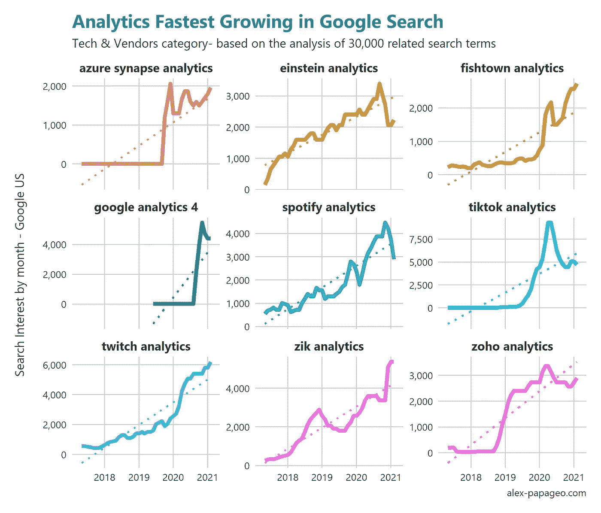
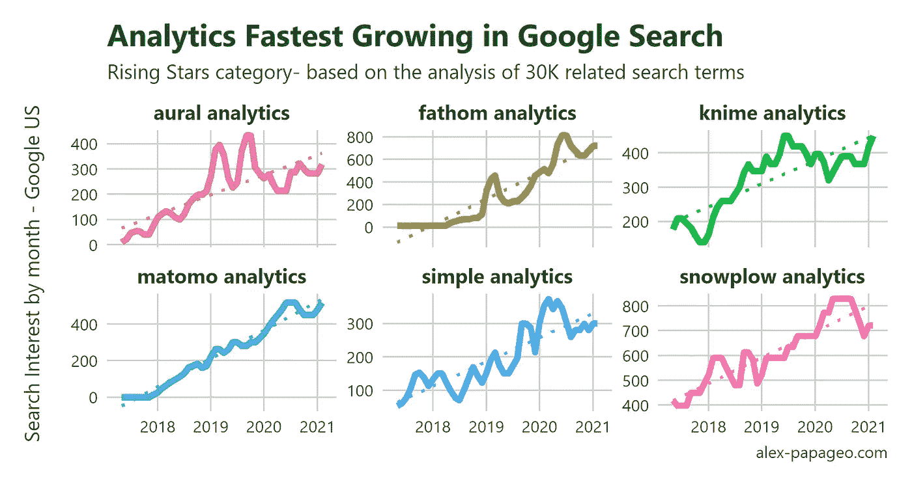
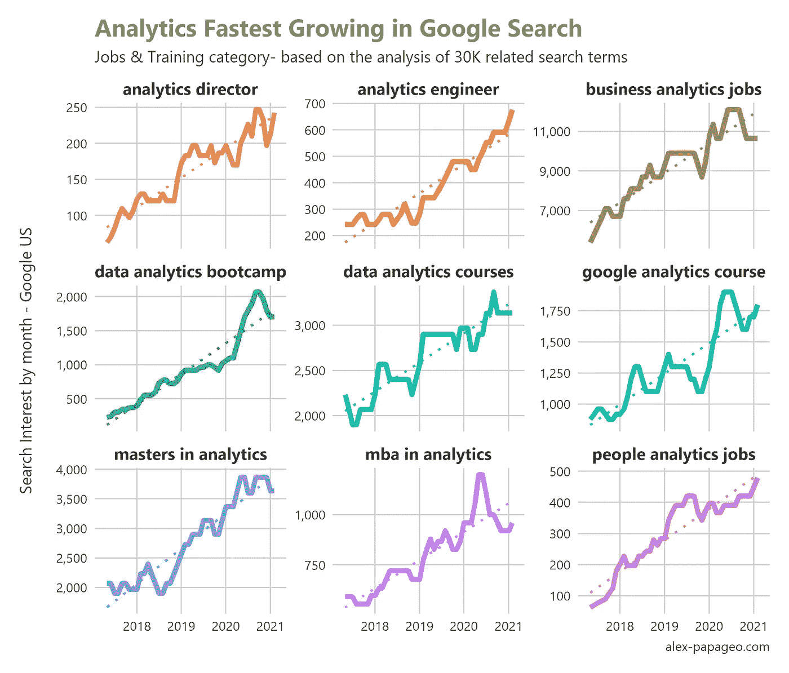

# 搜索数据、趋势和分析:抓住市场和消费者的脉搏(不需要 cookies)

> 原文：<https://towardsdatascience.com/search-data-trends-analytics-catching-the-pulse-of-a-market-and-its-consumers-no-cookies-747d6d458530?source=collection_archive---------18----------------------->

## [行业笔记](https://towardsdatascience.com/tagged/notes-from-industry)

照片由[安娜·涅克拉舍维奇](https://www.pexels.com/@anna-nekrashevich?utm_content=attributionCopyText&utm_medium=referral&utm_source=pexels)从[派克斯](https://www.pexels.com/photo/pen-business-eyewear-research-6801648/?utm_content=attributionCopyText&utm_medium=referral&utm_source=pexels)拍摄

搜索数据的好处不仅限于以 SEO 为中心的关键词研究。这也是市场和产品研究的宝贵资源。事实上，它甚至可以集成到所有的研究类型和情报分析中，在这些研究类型和情报分析中，倾听和解码消费者的声音起着重要的作用。

我将通过一个专注于分析行业的例子来解释这是如何实现的。

我还将讨论为什么搜索数据可以作为战略层面的关键洞察力来源的 6 个原因。

# 一些背景

这项研究的灵感来自 Krista Seiden 在 Xoogler.co 举行的 [2020 演讲，该演讲探讨了分析行业的主要趋势，特别关注各种技术堆栈。Krista 没有使用搜索数据，相反，她的讲话是基于她通过自己的研究收集的数据。她调查了在分析行业工作的大量个人样本。](https://medium.com/xoogler-co/5-insights-from-krista-seidens-xoogler-co-talk-about-digital-analytics-trends-f93e911afde9)

理解这些趋势是我作为顾问工作的一部分，所以我对它们有天然的兴趣。鉴于我在分析行业的工作以及我对探索该领域未来发展的兴趣，我倾向于通过遵循类似的数据驱动方法来为这一工作领域做出贡献。

# 为什么要搜索数据

对我来说，要达到 Krista 研究中的分析专家的数量几乎是不可能的，所以我决定使用公开的搜索数据，看看是否会出现任何值得注意的趋势。

在那个时候，我实际上已经在考虑这种类型的分析的潜在好处——但出于不同的原因。新冠肺炎正处于巅峰时期，疫情正强烈影响着消费者行为，这一点变得越来越明显。想办法更深入地了解消费者如何在网上搜索产品，以及正在出现哪些新的搜索模式，可能会提供有用的见解。

此外，随着跟踪用户行为的障碍越来越多，任何反映消费者声音的额外数据源都变得非常有用。我假设搜索数据也可以为原始分析趋势研究提供另一个补充角度。

因此，我开始收集搜索查询列表，并分析关键词搜索量。

# **分析趋势研究**

# 方法

我创建了一个用于分析的关键词世界并对其进行数据挖掘，寻找增长最快的趋势。

部署的方法如下。

创建一个包含 30，000 个包含术语“分析”的关键词的关键词世界，使用多个数据源作为关键词建议。

从谷歌检索四年期间的搜索量。

应用统计分析来发现关键趋势。

要了解关于数据集的更多信息并下载它，您可以访问本文附带的 analytics trends web 应用程序的“关于”部分(以下部分提供了链接)

# 基于搜索数据的分析行业的 3 个趋势

从这一分析中自然出现了许多值得注意的发现，这很好地表明了搜索分析可以产生的洞察力。

下面我就简单讨论其中的三个。

**如果你有兴趣自己探索这些趋势，可以看看网络应用**

[https://analytic strends . app](https://analyticstrends.app)

1.  **发展最快的分析技术和供应商**

这些是主流分析技术中增长最快的分析工具、技术和供应商。一些工具，如爱因斯坦和 Spotify analytics，在过去四年中以非常一致的方式发展。

其他的，像谷歌分析 4，遵循曲棍球棒曲线。通常值得关注的是各种主题的特定搜索行为的原因——例如，在 Google Analytics 4 中，搜索兴趣的激增是新产品发布的结果。另一方面，Fishtown Analytics(另一个接近迅速崛起的术语)发布了一个受欢迎的开源工具，这有助于它的快速增长。

**2。分析领域的后起之秀**

只关注流量最大的术语和主题是很容易的。然而，有价值的见解可以在关键词世界的任何地方找到。一些分析软件供应商——在某些情况下，我们可以认为他们是利基参与者——已经非常稳定地增长，尽管有些确实是从零开始的。

有趣的是，图中六个供应商中有三个属于“隐私优先”分析类别，这似乎是对过去几年中所有隐私立法和讨论的反应。这是一个强烈的信号，表明新的隐私格局可以为分析领域的新参与者创造重大机遇。

Matomo、Fathom 和 Simple Analytics 表现出快速和持续的增长，同时对隐私保护及其承诺直言不讳。

**3。分析工作和培训领域增长最快的术语**

最后一个趋势说明了对分析相关角色的需求不断增长，如分析工程师和分析主管。对专业角色的需求之后是对培训和课程的强烈需求，这些培训和课程使专业人士能够胜任这些角色。对分析工作和教育的高需求本身并不令人惊讶，但增长速度令人印象深刻——看看对分析工程师和分析训练营的搜索兴趣的增加。

# 搜索数据:从战术到战略

我使用搜索和关键词数据已经有很长一段时间了，主要是从战术的角度进行关键词竞价、ROAS 计算、关键词排名跟踪和搜索引擎优化的关键词研究。

在进行这一分析的过程中，我发现在做出涉及产品、市场和消费者的商业决策时，[搜索数据可以发挥战略性的](https://seomba.substack.com/p/mindset-shifts-for-strategic-seo)作用。上面的分析只是触及了表面，当一个“关键词世界”中的术语开始基于它们的语义、词典或其他特定于案例的属性进行分组或聚类时，还有更多要探索的。自从分析趋势研究开始，我就在工作中优先考虑搜索数据的使用和分析。下面，你会发现一些关于如何在你的组织中战略性地使用搜索数据的想法。

# 在组织中战略性地使用搜索数据的 6 种方法

由[艾萨克·史密斯](https://unsplash.com/@isaacmsmith?utm_source=unsplash&utm_medium=referral&utm_content=creditCopyText)在 [Unsplash](https://unsplash.com/s/photos/strategic-data?utm_source=unsplash&utm_medium=referral&utm_content=creditCopyText) 上拍摄的照片

**1。用它来观察一个行业中正在发生变化的更大图景。**本文中的例子来自分析行业，但也可能是任何其他行业或市场。搜索数据分析有助于确定对产品、市场或主题的搜索兴趣是上升还是下降，同时也有助于企业了解变化的具体模式。例如，与其他缓慢但肯定会随着时间的推移而增长的术语相比，一些术语可能会迅速上升或下降。在决定是长期投资新产品或市场还是利用短期机会时，理解这些模式是至关重要的，例如，营销活动暂时专注于搜索兴趣仅在短时间内激增的主题。

**2。分析搜索数据以发现新的商业机会。**例如，检测特定地区的高需求可能是考察进入新市场潜力的好理由。如果你已经在考虑扩张，一旦你知道有一个有保证的需求水平，它可以帮助你减轻风险。根据搜索需求计算相关市场的[潜在规模时，搜索数据也很有价值，并提供关于竞争水平和搜索市场份额的估计。通过研究和结合这些趋势，您可以在竞争对手之前捕捉高潜力的业务机会，提出新产品想法或尽早发现机会，使您的组织获得先发优势。](https://ftf.agency/total-addressable-online-market/)

**3。** **搜索数据分析也可以关注现有市场和产品。它能使公司理解消费者用来寻找或描述他们特定产品和服务的语言。这对创业公司尤其有利，因为它比其他初级市场研究形式需要的投资少得多，例如，包括焦点小组、人口样本调查等。此外，它可以在更短的时间内执行和交付。**

> 如果你试图说服人们做某事或购买某物，在我看来，你应该使用他们的语言，他们每天使用的语言，他们思考的语言。

—大卫·奥格威

**4。了解需求构成，预测未来需求。**这对电子商务企业尤其有用。了解某些产品的季节性以及总体需求水平和需求来源可以在许多方面提供帮助:从更好地规划物流和管理库存，到更好地控制营销活动的时间和强度，以及在这些活动中优先考虑产品促销。

这六个列表中的其余两个说明了搜索数据在 2021 年及以后的重要性。

**5。了解新冠肺炎对消费者行为的影响**。疫情极大地影响了我们的生活，这无疑改变了我们研究和购买产品和服务的方式。

许多这些变化预计将继续下去。搜索数据分析的另一个用例是在这些变化发生时检测它们，并更深入地理解这些新趋势背后的东西。事实上，在许多情况下，这些变化激励企业和企业家创造新的产品和服务，或寻找新的方式向消费者提供现有的产品和服务。

**6。平衡隐私相关限制对消费者旅程跟踪的影响。**隐私立法和浏览器限制使得追踪消费者行为变得越来越困难。这促使人们充分利用搜索数据等聚合和匿名数据，以洞察消费者在顾客旅程的各个阶段最关心的问题。这是了解消费者的关键信息，有助于你的企业根据这些信息做出明智的选择——甚至在消费者第一次登陆你的网站之前。

# 结束语

来自[佩克斯](https://www.pexels.com/photo/person-writing-on-notebook-669615/?utm_content=attributionCopyText&utm_medium=referral&utm_source=pexels)的[卢卡斯](https://www.pexels.com/@goumbik?utm_content=attributionCopyText&utm_medium=referral&utm_source=pexels)的照片

我们已经看到了搜索数据的分析如何成为一个组织的战略洞察力的来源。

简而言之，这是企业感受消费者脉搏的直接方式。该分析适用于行业、市场或产品层面，其结果支持组织内许多层面的决策，包括最重要的战略层面。

与其他形式的市场和产品研究相比，处理搜索数据不需要大量的预算投入，因此无论规模大小，公司都很容易获得。

这些数据经过汇总和匿名处理，可以从 Google (Google Trends 或 Google Ads platform)或其他提供商(例如提供这类数据的 SEO 平台)获得一些来源。

最后，现在可能是开始更系统地分析搜索数据的正确时机，以便更好地理解消费者行为最近的所有彻底转变，并重新理解消费者及其旅程，不管当前或即将出台的隐私法规如何。

你遇到过其他有趣的搜索数据分析用例吗？请在下面的评论中告诉我！

亚历克斯·帕帕乔治

我是营销分析和数据科学领域的独立顾问，帮助以转化为导向的数字企业做出明智的营销决策。我通过 Twitter *和*[*LinkedIn*](https://www.linkedin.com/in/alexandrospapageorgiou/)*在我的* [*博客*](http://alex-papageo.com/blog) *和* [*上分享我关于数字、营销和数据分析的故事。*](https://twitter.com/alex_papageo)

 [## Alex Papageorgiou -营销分析顾问|前谷歌| LinkedIn

www.linkedin.com](https://www.linkedin.com/in/alexandrospapageorgiou/) 

我在 Medium 上发表的故事，你可能也会喜欢:

 [## 内核、点击和提升的树:第一届 Google Analytics Kaggle 竞赛集锦

### 我参加了上周结束的广受欢迎的谷歌分析竞赛。

medium.com](https://medium.com/innovation-machine/google-analytics-kaggle-competition-highlights-eaa046737ac4)  [## 在 R 和 Python 之间选择:数字分析师指南

### “R 还是 Python？一个数字分析师应该选择什么？

medium.com](https://medium.com/innovation-machine/choosing-between-r-and-python-a-digital-analysts-guide-b7103f80aa4e)  [## GCP 专业化的数据工程:数据专业人员综合指南

### 如果你是一名正在考虑提升技能的数据专业人士，学习的选择是很多的，但是如果你正在寻找…

towardsdatascience.com](/data-engineering-on-gcp-specialisation-a-comprehensive-guide-for-data-professionals-4bb8bae8a1c7)