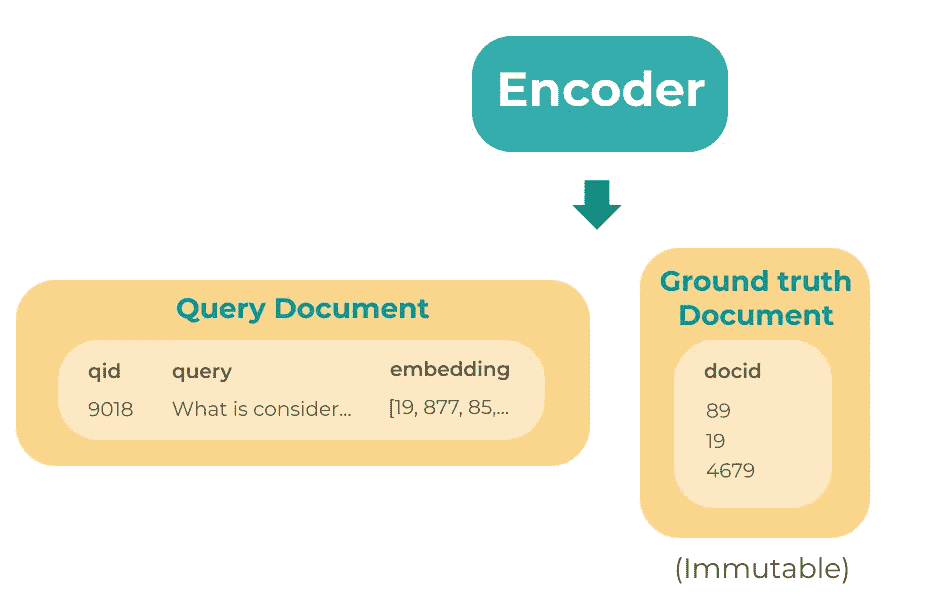

# 纪娜和伯特的金融问答——第二部分

> 原文：<https://towardsdatascience.com/search-engine-evaluation-in-jina-856616eb7f6f?source=collection_archive---------32----------------------->

## 金融中的 NLP

## 关于如何使用纪娜评估和改进您的财务问答搜索结果的教程


(图片由作者提供)

[*第一部分*](/how-to-build-a-production-ready-financial-question-answering-system-with-jina-and-bert-48335103043f) *—学习如何使用神经搜索框架，*<https://github.com/jina-ai/jina>**，构建一个* ***金融问答(QA)搜索应用*** *与*[*FiQA*](https://sites.google.com/view/fiqa/home)*数据集，*[*py torch*](https://pytorch.org/)*

***第 2 部分——通过纪娜了解如何评估和改进您的财务 QA 搜索结果***

**在[之前的教程](/how-to-build-a-production-ready-financial-question-answering-system-with-jina-and-bert-48335103043f)中，我们学习了如何与纪娜和伯特一起构建一个生产就绪的金融问答搜索应用程序。为了改进我们的应用程序并检索有意义的答案，评估搜索结果对于调整系统参数至关重要。例如，它可以帮助我们决定为编码器选择哪个预训练模型、最大序列长度以及我们想要使用的排序器类型。**

****

**插图来自 [unDraw](https://undraw.co/)**

**回想一下，纪娜为我们提供了创建搜索应用程序的基础。因此，我们可以使用纪娜的**评估器**，一种执行器，而不是自己实现评估度量。**

****

**(图片来自[纪娜艾](https://github.com/jina-ai/jina))**

**到目前为止，我们已经看到了一些**执行器:**编码器、索引器和排序器。这些执行器中的每一个都负责其相应功能的逻辑。顾名思义，评估器将包含我们评估指标的逻辑。我们还学习了如何设计索引和查询流，它们是索引和搜索答案段落的管道。**

**为了评估搜索结果，我们需要创建一个评估管道，即**评估流**，供我们在财务 QA 搜索应用程序中使用。**

# **辅导的**

**在本教程中，我们将学习如何在我们的财务 QA 系统中添加评估管道，方法是设计一个流程来评估具有[精确度](https://en.wikipedia.org/wiki/Evaluation_measures_(information_retrieval))和[平均倒数排名](https://en.wikipedia.org/wiki/Mean_reciprocal_rank) (MRR)的搜索结果。**

**我们将使用 [FinBERT-QA](https://github.com/yuanbit/FinBERT-QA) 评估重新排序前后的搜索结果。以下是评估流程的概述:**

****

**图 1:评估流程概述(图片由作者提供)**

## **设置**

**如果你来自[之前的教程](/how-to-build-a-production-ready-financial-question-answering-system-with-jina-and-bert-48335103043f)，你需要对`app.py`、`FinBertQARanker/__init__.py`和`FinBertQARanker/tests/test_finbertqaranker.py`做一些小的改动。[琼·丰塔纳拉斯·马丁内兹](https://www.linkedin.com/in/joanfontanalsmartinez/?locale=en_US)和我在排名器中增加了一些辅助函数和批处理来帮助加快进程。**

**我没有指出这些变化，而是制作了一个[新模板](https://github.com/yuanbit/jina-financial-qa-evaluator-template)来简化工作流程，并向已经熟悉纪娜的人展示如何实施评估模式。**

****克隆项目模板:****

```
**git clone [https://github.com/yuanbit/jina-financial-qa-evaluator-template.git](https://github.com/yuanbit/jina-financial-qa-evaluator-template.git)**
```

**确保已经安装了需求，并且已经下载了数据和模型。**

****你可以在这里** **找到本教程的最终代码** [**。**](https://github.com/yuanbit/jina-financial-qa-evaluator)**

**让我们一步一步地完成评估流程。**

## **第一步。定义我们的测试集数据**

**我们的工作目录将是`jina-financial-qa-evaluator-template/`。在`dataset/`文件夹中你应该有以下文件:**

****

**图 2:数据集结构(图片由作者提供)**

**对于本教程，我们需要:**

**`sample_test_set.pickle`:包含 50 个问题和基本事实答案的样本测试集**

**`qid_to_text.pickle`:将问题 id 映射到问题文本的字典**

**如果你想使用来自 [FinBERT-QA](https://github.com/yuanbit/FinBERT-QA) 、`test_set.pickle`的完整测试集，其中有 333 个问题和地面真相答案，你可以简单地改变路径。**

**我们将在本教程中使用的测试集是一个 pickle 文件，`sample_test_set.pickle`。这是一个形式为`[[question id, [ground truth answer ids]]]`的列表列表，其中每个元素包含问题 id 和一个基本事实答案 id 列表。这是测试集的一部分:**

```
**[[14, [398960]],
 [458, [263485, 218858]],
 [502, [498631, 549435, 181678]],
 [712, [212810, 580479, 527433, 28356, 97582, 129965, 273307]],...]**
```

**接下来，类似于定义用于索引答案段落的文档，我们将创建两个包含问题数据和基本事实答案的文档。**

****

**图 3:评估流程——步骤 1 定义查询和基本事实文档(图片由作者提供)**

**回想一下在我们的索引流中，当我们在`index_generator`函数中定义数据时，我们在文档中包含了答案段落 id(docid)。因此，在建立索引后，这些答案 id 存储在索引中，它们非常重要，因为它们是查询时搜索结果的一部分。因此，我们只需要为每个查询定义带有基本事实答案 id 的基本事实文档，并将这些答案 id 与匹配的答案 id 进行比较。**

**让我们在`load_pickle`函数下添加一个 Python 生成器来定义我们的评估测试集。对于每个文档，我们将把相应的问题从测试集映射到实际的文本。**

# **第二步。将问题编码**

**类似于查询流，我们将把两个文档从`pods/encode.yml`传递到 Encoder Pod。驱动程序会将问题文本传递给编码器，将其转换为嵌入内容，同一驱动程序会将该嵌入内容添加到查询文档中。这次唯一的不同是，我们将两个文档传递到编码器盒中，而**基本事实文档是不可变的**，并且在整个流程中保持不变。**

**在`flows/`中，我们创建一个名为`evaluate.yml`的文件来配置我们的评估流程，并添加编码器盒，如下所示:**

**编码器的输出将包含嵌入了问题的查询文档，而基本事实文档保持不变，如图 4 所示。**

****

**图 4:评估流程——步骤 2 的输出:问题嵌入被添加到查询文档中，而基本事实文档保持不变。(图片由作者提供)**

# **第三步。搜索索引**

**接下来，来自`pods/doc.yml`的索引器 Pod 将搜索具有最相似嵌入的答案，索引器的驱动程序将向查询文档添加前 k 个答案匹配的列表。地面真相文件保持不变。**

**让我们将`doc_indexer`添加到`flows/evaluate.yml`中，如下所示:**

**索引器的输出将包含带有答案匹配及其相应信息的查询文档和基本事实文档。**

****

**图 5:评估流程——步骤 3 的输出:答案匹配被添加到查询文档中，而基本事实文档保持不变。(图片由作者提供)**

# **第四步。估价**

**由于我在开始时提到我们将在重新排序之前和之后评估搜索结果，您可能认为现在我们将添加以下序列:**

1.  **匹配结果的评估者**
2.  **出身行伍的军官**
3.  **重新排序结果的评估者**

**然而，由于评估服务于**改进我们搜索系统的结果**，它不是最终应用的*实际组成部分*。你可以把它看作是一个工具，为我们提供关于系统的哪个部分需要改进的信息。**

****

**(插图来自[未绘制的](https://undraw.co/illustrations)**

**我们的目标是允许**检查管道**的任何部分，并使我们能够在流程中的任意位置进行评估，我们可以使用纪娜流程 API 的`inspect`功能来*将*评估箱连接到主管道，以便**评估不会阻止消息发送到管道的其他组件**。**

**例如，如果没有`inspect`模式，我们就会有上面提到的顺序设计。在`inspect`模式下，从索引器中检索到答案匹配后，文档将被并行发送给评估者和分级者。因此，分级器不必在输出重新分级的答案匹配之前等待初始答案匹配被评估！**

**在我们的 QA 系统中，这种设计的好处是评估者可以在不阻碍流程进度的情况下执行评估，因为它独立于管道的其他组件。您可以将**评估器视为与流程**并行运行的辅助任务。因此，我们可以在对流的性能影响最小的情况下进行评估。**

**你可以参考[这篇文章](https://hanxiao.io/2020/10/25/Evaluation-Flow-Explained-in-Jina-v0-7/)来了解更多关于评估模式的设计和`inspect`特性。**

**让我们仔细看看流程的评估部分:**

****

**图 6:更仔细地观察流程的评估部分(图片由作者提供)**

**在图 6 中，我们可以看到负责评估答案匹配的评估者`evaluate_matching` Pod 与排名者和负责评估重新排名的答案匹配的评估者`evaluate_ranking` Pod 并行工作。**

**`gather_inspect`用于**累加每个查询**的评估结果。此外，在排序器之前和之后示出的辅助容器是允许评估流以相同的方式具有容器的连接的构造，就好像查询流没有评估器一样，因此检索和重新排序答案匹配的**性能将仅受到最小程度的影响**。**

**以前，我们使用来自[纪娜中心](https://github.com/jina-ai/jina-hub)的编码器和索引器，这是一个通过容器映像托管执行器的开放注册中心。我们可以再次利用纪娜枢纽，只需使用已经可用的**精度和倒数等级吊舱**！**

**现在我们来看看匹配和排名评估者:**

## **匹配评估器**

**在索引器窗格输出带有匹配项的查询文档后，一个工作流将涉及匹配评估器，该评估器负责计算答案匹配项的精度和倒数排名(无需重新排名)。**

**匹配评估器 Pod 的驱动程序解释查询和基本事实文档，并将答案匹配 id 和每个查询所需的基本事实答案 id 传递给匹配评估器，匹配评估器计算精度和倒数等级值，如图 7 所示。**

****

**图 7:匹配评估器 Pod 的驱动程序将答案匹配 id 和所需答案 id 传递给匹配评估器。(图片由作者提供)**

**现在，让我们创建匹配的评估器。在`pods/`文件夹中，创建一个名为`evaluate_matching.yml`的文件。我们将在文件中添加以下内容:**

**`PrecisionEvaluator`和`ReciprocalRankEvaluator`是来自纪娜中心的精度和倒数排名的评估者。我们指定`eval_at: 10`来评估前 10 个答案匹配。我们还指出了每个组件的`name`，我们将在后面的评估流程中使用它。**

**从上一个教程中你可能会想为什么我们不需要在`pods/encode.yml`和`pods/doc.yml`中指定驱动程序，因为 pod 中的 pea 需要这两个组件。这是因为这两个 pod 的驱动程序是常用的，并且已经默认包含在内。但是，由于我们想要使用我们从纪娜中心选择的两个评估器(精度和倒数排名)，我们需要为每个评估器指定驱动程序，即`RankEvaluateDriver`。**

**接下来，让我们将此 Pod 添加到评估流程中。在`flows/evaluate.yml`中添加如下`evaluate_matching`:**

**这里我们指出`method: inspect`,因为我们使用来自 Flow API 的`inspect`特性来检查我们的应用程序在流程中间的性能。**

**匹配评估器的驱动程序会将答案匹配的评估结果添加到每个查询的查询文档中，如图 8 所示。**

****

**图 8:答案匹配的评估结果被添加到查询文档中(图片由作者提供)**

**干得好！我们已经成功实现了第一个评估器。接下来让我们看看如何评估重新排序的搜索结果。**

## **排名评估**

**索引器 Pod 之后的另一个工作流涉及排名评估器，它负责使用 FinBERT-QA 计算重新排名的答案匹配的精确度和倒数排名。等级评估器 Pod 的构造类似于匹配评估器 Pod，唯一的区别是我们将重新排序的匹配 id 传递给等级评估器，如图 9 所示。**

****

**图 9:等级评估器 Pod 的驱动程序将重新排序的答案匹配 id 和所需的答案 id 传递给等级评估器。(图片由作者提供)**

**让我们创建我们的排名评估。在文件夹`pods/`中，创建一个名为`evaluate_ranking.yml`的文件。我们将在文件中添加以下内容:**

**请注意，除了命名约定之外，这几乎与`evaluate_matching.yml`相同。**

**在[之前的教程](/how-to-build-a-production-ready-financial-question-answering-system-with-jina-and-bert-48335103043f)中，我们学习了如何**构建一个自定义排名器**。我们需要为这个 Ranker 构建 docker 映像，以便在我们的流程中使用它作为 Pod。**

***注意:因为添加了批处理，所以即使您在之前的教程中已经构建了这个映像，您也需要重新构建它。***

**确保您安装了纪娜中心扩展:**

```
**pip install “jina[hub]”**
```

**在工作目录中键入:**

```
**jina hub build FinBertQARanker/ — pull — test-uses — timeout-ready 60000**
```

**您应该会收到一条消息，表明您已经成功构建了带有标记名的图像。取决于当前的纪娜版本**。**将标签用作 Pod 时，确保相应地更改标签名称。**

**接下来，让我们将 Ranker 和 Evaluate Ranking Pod 添加到`flows/evaluate.yml`中的评估流程中:**

**索引器 Pod 将把带有答案匹配和基本事实 id 的查询文档传递给包含 FinBERT-QA 的排序器。然后，Ranker Pod 将输出带有重新排序的答案匹配 id 的查询文档和基本事实文档，这两个文档都将被传递给排名评估器。图 10 所示的输出将与匹配评估器相同，评估值的差异是根据重新排序的答案匹配计算的。**

****

**图 10:在排序器和等级评估器之后，从重新排序的答案匹配中计算出的评估值将被添加到查询文档中。(图片由作者提供)**

**干得好！我们刚刚完成了评估流程的设计。接下来让我们看看如何在我们的搜索应用程序中使用它。**

## **第四步。获取评估结果**

**类似于`index`函数，在`app.py`中，让我们在`evaluate_generator`后添加一个`evaluate`函数，它将从`flows/evaluate.yml`加载评估流程，并从`evaluate_generator`向流程传递输入查询和基础事实文档。我们设置我们的`top-k=10`来评估精度@10 和倒数排名@10。**

**因为我们想要计算测试集中所有查询的平均精度@10 和均值-倒数-等级@10，所以我们将编写一个函数`print_average_evaluations`来计算评估值的平均值**

**最终的评估值将存储在查询文档中，像`print_resp`函数一样，我们可以编写一个函数来打印评估响应，方法是循环遍历我们的查询文档`d.evaluations`中的评估，并打印出每个评估者的值:**

**万岁！🎉🎉🎉我们刚刚在我们的金融 QA 搜索引擎中实现了一个评估模式！我们现在可以运行:**

```
**python app.py evaluate**
```

**由于本教程是出于教育目的，我们只索引了部分答案段落，并使用了一个小样本测试集。因此，结果不能与来自[芬伯特-QA](https://github.com/yuanbit/FinBERT-QA) 的结果相比较。请随意索引整个答案集，并在完整的测试集上进行评估，并分享您的结果！**

**您将看到正在评估和打印的单个问题。以下是问题 id 为 1281 的示例。**

```
 **Evaluations for QID:1282 
    Matching-Precision@10: 0.10000000149011612 
    Matching-ReciprocalRank@10: 1.0 
    Ranking-Precision@10: 0.10000000149011612 
    Ranking-ReciprocalRank@10: 0.125**
```

**最后，您将看到平均评估结果:**

```
**Average Evaluation Results
     Matching-Precision@10: 0.056000000834465026
     Matching-ReciprocalRank@10: 0.225
     Ranking-Precision@10: 0.056000000834465026
     Ranking-ReciprocalRank@10: 0.118555556088686**
```

# **摘要**

**在本教程中，我介绍了纪娜的评估功能，并演示了如何为我们的金融 QA 搜索应用程序设计评估流程。我们学习了如何使用`inspect`模式来创建我们的评估单元，并通过最小化评估对流水线性能的影响来使我们的应用受益。**

**请务必查看纪娜的 [Github](https://github.com/jina-ai/jina) 页面，了解更多信息，并开始构建自己的深度学习搜索应用程序！**

# **社区**

*   **[Slack channel](http://slack.jina.ai/) —开发者讨论纪娜的交流平台**
*   **[社区简讯](https://jina.ai/cdn-cgi/l/email-protection#dfb1baa8acb3baababbaadf4acaabdacbcadb6bdba9fb5b6b1bef1beb6) —订阅纪娜的最新更新、发布和活动新闻**
*   **[LinkedIn](https://www.linkedin.com/company/jinaai/) —了解纪娜爱作为一家公司，寻找工作机会**
*   **[Twitter](https://twitter.com/JinaAI_) —使用标签`#JinaSearch`关注纪娜·艾并与之互动**
*   **[公司](https://jina.ai/)——了解更多关于纪娜 AI 和他们对开源的承诺！**

*****来自《走向数据科学》编辑的提示:*** *虽然我们允许独立作者根据我们的* [*规则和指导方针*](/questions-96667b06af5) *发表文章，但我们并不认可每个作者的贡献。你不应该在没有寻求专业建议的情况下依赖一个作者的作品。详见我们的* [*读者术语*](/readers-terms-b5d780a700a4) *。***